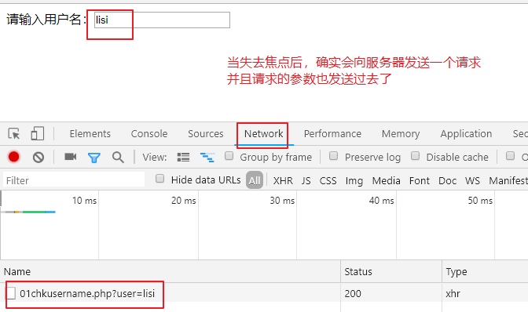
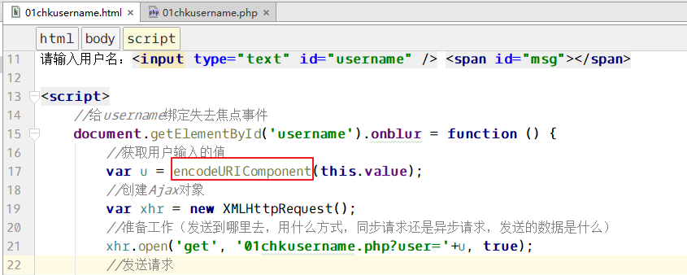
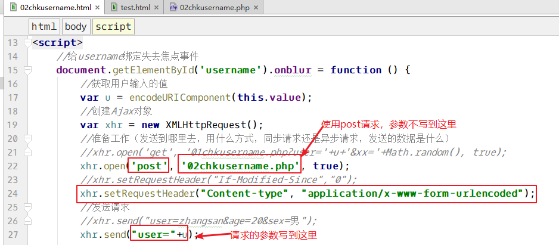
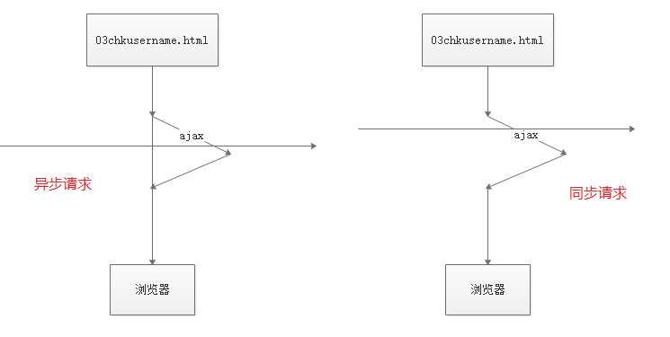
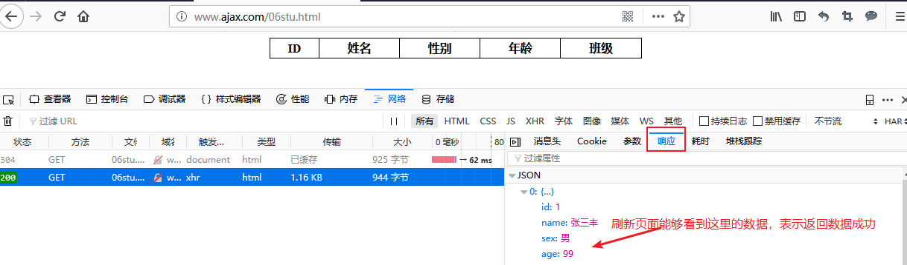
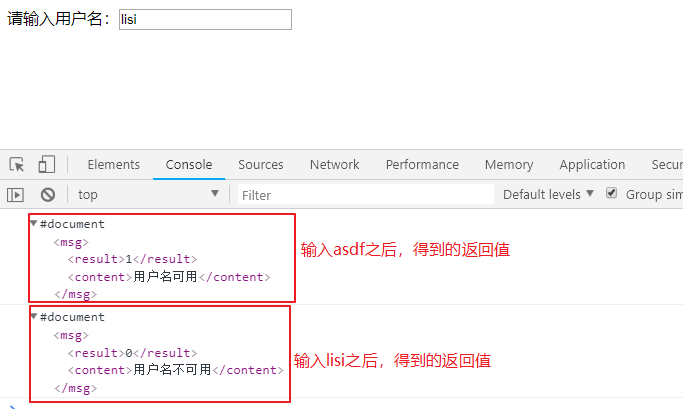

# 三、概述

手册位置：W3C手册 --  上面的JavaScript  -- 左侧的Ajax

## 1、Ajax历史

1999年，微软在IE5上使用，但是没有被认知。

2005年，谷歌的使用（地图、gmail），使得ajax被全世界所认识，并广泛使用。

## 2、Ajax是什么

Ajax中的第一个A是Asynchronous [eɪˈsɪŋkrənəs]

（异步）JavaScript and XML的缩写。可以看出它不是一种技术，而是多种技术的综合体。

其中有JavaScript、有xml、有json、有html、有css、有dom、有**==XMLHttpRequest==**对象等等，而且还必须有一种编程语言与ajax配合才行。

**XMLHttpRequest对象，也叫做Ajax对象**。

Ajax的工作也是基于http协议的。

## 3、Ajax能做什么

①、提高用户体验

②、表单实时验证


③、百度地图、谷歌地图

④、网页版的聊天室


⑤、无刷新的分页

# 四、Ajax工作原理

通过ajax向服务器发送请求的时候，实际上是通过浏览器内置的XMLHttpRequest对象来发送的请求，服务器返回数据的时候，也是返回到XMLHttpRequest对象，经过XMLHttpRequest的处理，最后将用户想要的结果输出到浏览器。


# 五、XMLHttpRequest对象介绍

## 1、创建ajax对象（ajax对象）

所有现代浏览器均支持 **XMLHttpRequest** 对象（==IE5 和 IE6 使用 ActiveXObject==）。

```javascript
//var xhr = new XMLHttpRequest(); //IE6+
//var xhr = new ActiveXObject('Microsoft.XMLHTTP'); // IE5 和 IE6

//创建一个兼容各个浏览器的ajax对象
var xhr;
if (window.XMLHttpRequest) {
    xhr = new XMLHttpRequest(); //IE6+
} else {
    xhr = new ActiveXObject('Microsoft.XMLHTTP'); // IE5 和 IE6
}
```


## 2、主要的成员属性：

- **readyState**：表示ajax工作进行到何种状态
- **onreadystatechange**：事件，表示readyState改变的时候触发的事件
- **status**：http状态码
- **responseText**：用来接收返回的文本类型的数据
- **responseXML**：用来接收返回的是XML格式的数据

## 3、主要的方法

- **open()**：设置（定义）一个请求
- **send()**：发送设置好的请求
- **setRequestHeader()**：设置ajax请求头信息

# 六、==使用Ajax的步骤==(重点)

完成验证用户名案例，要求用户名唯一，就是不能有重复。


## 1、创建两个文件

创建文件，`01chkusername.html` 和 `01chkusername.php` 。


``01chkusername.html ``：浏览器预览文件。

```html
<!doctype html>
<html lang="en">
<head>
    <meta charset="UTF-8">
    <meta name="viewport"
          content="width=device-width, user-scalable=no, initial-scale=1.0, maximum-scale=1.0, minimum-scale=1.0">
    <meta http-equiv="X-UA-Compatible" content="ie=edge">
    <title>Document</title>
</head>
<body>
请输入用户名：<input type="text" id="username" />

</body>
</html>
```


``01chkusername.php`` ：检查用户名是否存在的脚本文件。

```php
//连接数据库，判断用户名是否存在。案例中，就不连接数据库了，假设zhangsan和lisi是存在的
$arr = ['zhangsan', 'lisi']; //假设这是从数据库查询出来的已经存在的用户
```


## 2、绑定事件

给username绑定失去焦点事件，通过事件来操作数据

```html
<script>
    //给username绑定失去焦点事件
    document.getElementById('username').onblur = function () {
        //获取用户输入的值
        var u = this.value;
        
    };
</script>
```


## 3、设置请求

```html
<script>
    //给username绑定失去焦点事件
    document.getElementById('username').onblur = function () {
        //获取用户输入的值
        var u = this.value;
        //创建Ajax对象
        var xhr = new XMLHttpRequest();
        //准备工作（用什么方式，发送到哪里去发送的数据是什么，同步请求还是异步请求）
        xhr.open('get', '01chkusername.php?user='+u, true);//true 异步 | false 同步
    };
</script>
```


## 4、发送请求到服务器

```html
<script>
    //给username绑定失去焦点事件
    document.getElementById('username').onblur = function () {
        //获取用户输入的值
        var u = this.value;
        //创建Ajax对象
        var xhr = new XMLHttpRequest();
        //准备工作（用什么方式，发送到哪里去发送的数据是什么，同步请求还是异步请求）
        xhr.open('get', '01chkusername.php?user='+u, true);  //true 异步 | false 同步
        //发送请求
        xhr.send();
    };
</script>
```

到这步，可以用浏览器进行检测，看数据是否发送到了服务器：



## 5、服务器接收请求的参数并判断

php文件：01chkusername.php

```php
//连接数据库，判断用户名是否存在。案例中，就不连接数据库了，假设zhangsan和lisi是存在的
$arr = ['zhangsan', 'lisi']; //假设这是从数据库查询出来的已经存在的用户

//get请求，使用$_GET来获取参数
$user = $_GET['user'];
//判断用户是否存在
if (in_array($user, $arr)) {
    //说明用户名存在，向浏览器返回
    echo 1;
} else {
    echo 0;
}
```

通过浏览器工具，发现服务器确实能够返回对应的值：


## 6、判断Ajax执行的状态，然后接收服务器返回的数据

readyState是Ajax对象中的一个属性，它表示ajax执行的状态，它的值有5个，分别表示：

readyState的四个状态如下：

| 0 (未初始化)   | 对象已建立，但是尚未初始化（尚未调用open方法）               |
| -------------- | ------------------------------------------------------------ |
| 1 (初始化)     | 对象已建立，尚未调用send方法，言外之意，open已经调用了       |
| 2 (发送数据)   | send方法已调用，但是当前的状态及http头未知                   |
| 3 (数据传送中) | 已接收部分数据，因为响应及http头不全，这时通过responseBody和responseText获取部分数据会出现错误， |
| ==4 (完成)==   | ==数据接收完毕==,此时可以通过==responseBody==和==responseText==获取完整的回应数据 |

 readyState应该配合另一个属性  onreadystatechange 来使用。onreadystatechange也是一个事件。

**下面代码，15行之后是新加的代码，另外html中添加一个span标签**。

```html
请输入用户名：<input type="text" id="username" /> <span id="msg"></span>

<script>
    //给username绑定失去焦点事件
    document.getElementById('username').onblur = function () {
        //获取用户输入的值
        var u = this.value;
        //创建Ajax对象
        var xhr = new XMLHttpRequest();
        //准备工作（用什么方式，发送到哪里去发送的数据是什么，同步请求还是异步请求）
        xhr.open('get', '01chkusername.php?user='+u, true);//true 异步 | false 同步
        //发送请求
        xhr.send();

        /*********判断，当readyState等于4的时候，接收服务器返回的数据 ********************/
        //当readyState属性发生改变的时候，就执行下面的函数，
        //比如readyState的值从2变化到3的时候，就执行下面的函数，同理，从3变化到4的时候，也会执行
        xhr.onreadystatechange = function () {
            //alert(123);
            if(xhr.readyState == 4) {
                //接收服务器返回的数据
                var result = xhr.responseText;
                //alert(result);
                if(result == 1){
                    document.getElementById('msg').innerHTML = '<font color="red">用户名已存在</font>';
                } else {
                    document.getElementById('msg').innerHTML = '<font color="green">恭喜，用户名可用</font>';
                }
            }
        };

    };
</script>
```

## 7、总结

使用Ajax的步骤：

1. 创建ajax对象
2. 调用open方法：open(请求方式,  url,  同步或异步);
3. 调用send方法
4. 设置onreadystatechange事件，判断readyState


设置onreadystatechange事件，判断readyState这一步可以放到open之前。


# 七、其他问题

## 1、编码字符

encodeURI() --- 不能对“:/=&”进行编码

**encodeURIComponent**()  ---  能对“:/===&==”进行编码


html页面对输入的内容进行编码：



PHP页面对获取的参数进行解码：


## 2、缓存处理

什么是Ajax缓存原理？

Ajax在发送的数据成功后，会把请求的URL和返回的响应结果保存在浏览器缓存内，当下一次调用Ajax发送相同的请求时，它会直接从缓存中把数据取出来，这是为了提高页面的响应速度和用户体验。==当前这两次请求URL完全相同，包括参数。这个时候，浏览器就不会与服务器交互，指的是IE浏览器==。

两次请求的地址完全一致（包括参数），那么**IE就会从缓存中取服务器上一次返回的结果**。而不会从新向服务器发送请求。


如何解决IE缓存的问题： 

1、在ajax发送请求前加上` xhr.setRequestHeader("If-Modified-Since","0"); `//实测可用


2、在服务器端加

```php
header("Cache-Control:no-cache");
header("Pragma:no-cache");
header("Expires:-1");
```


加入三个header，表示适用于各个浏览器。


3、在 Ajax 的 URL 参数后加上 `"?fresh=" + Math.random(); `，当然这里参数 `fresh` 可以任意取了


4、第种方法和第3种类似，在 URL 参数后加上 `"?timestamp=" + new Date().getTime();`


5、用POST替代GET：不推荐

==以上几种方式，比较推荐第3和第4中方法==。


## 3、get和post请求

使用POST请求，一定要设置下面的header：

`xhr.setRequestHeader("Content-type", "application/x-www-form-urlencoded");`



==使用post请求，PHP页面也使用对应的$_POST接收参数==。

ajax中的get和post的一些说明：

①、用post请求，不会产生缓存。

②、用post请求的时候，能不能也用get，即post和get请求同时使用。

​      答：能，只不过get请求的参数用$_GET获取，post请求的参数用$_POST获取。

③、用$_REQUEST获取get和post方式提交的参数，如果参数名相同，获取的是谁？

​       答：默认获取的是post的内容，根据`php.ini`配置文件中的配置。


## 4、同步、异步

==异步请求==，在同一个时间点可以执行多个进程；

==同步请求==，在同一个时间点，只能进行一个操作，其他操作只能等待。

在使用Ajax的时候，大多数都是异步请求，ajax请求什么时候结束，就立即处理ajax，如果ajax请求比较慢，那么继续加载当前页面的其他内容。




## 5、请求的url如果出错怎么办

如果请求的url出错，则http状态码就不是200了。所以在获取服务器返回数据的时候，在加入一个条件，只有http状态码等于200的时候，才接收服务器返回的数据。


# 八、JSON

## 1、什么是json

w3c手册位置：上面的javascript – 左侧的JSON

json==**本质就是字符串**==，只不过这个字符串的格式比较特殊，格式和JavaScript中的数组和对象的格式一样。

下面定义几个JSON格式的字符串：

①、 =="==['apple', 'orange', 'banana']=="==

②、 =="=={name:'zhangsan', age:20}=="==

```javascript
//声明两个符合json格式的字符串
//先写js数组或对象，然后在外面加上引号形成一个字符串，这就是json格式的字符串。
var str = "['apple', 'pear', 'banana']";
var str = "{name:'zhangsan', age:20}";
var str = "[{id:1, name:'zhaowei'}, {id:2, name:'荔枝味'}, {id:3, name:'赖志丽'}]";
```


##  2、json有什么用

json在web开发中，它起到的作用和xml和的作用一样。具体来说，json可以当做配置文件，json文件可以存储数据，json可以当做两种编程语言交换数据的媒介。


## 3、json和PHP进行转换（重要）

**1、把PHP数据转化成json格式**

使用函数 ``json_encode()``


PHP的索引数组转换成json之后，和JavaScript中的数组一样的格式。

PHP的关联数组和对象转换成json之后，和JavaScript中的对象是一样的格式。


**2、json数据转化成PHP数据**

使用函数  ``json_decode()``

```php
$arr1 = ['apple', 'banana'];
$arr2 = ['one'=>'刘备', 'two'=>'关羽', 'three'=>'张飞'];
$arr3 = [
    ['one'=>'刘备', 'two'=>'关羽', 'three'=>'张飞'],
    ['one'=>'刘邦', 'two'=>'项羽', 'three'=>'虞姬'],
    ['one'=>'曹操', 'two'=>'孟获', 'three'=>'祝融夫人'],
];
$obj = new stdClass(); //空对象
$obj->name = '赵云';
$obj->age = 20;

$j1 = json_encode($arr1);
$j2 = json_encode($arr2);
$j3 = json_encode($arr3);
$j4 = json_encode($obj);

echo $j1 . '<br>';
echo $j2 . '<br>';
echo $j3 . '<br>';
echo $j4 . '<br>';
echo '<hr /><pre>';
$a1 = json_decode($j1);
$a2 = json_decode($j2, true); //加入第2个参数true，表示还转换成原来的数组。不加true，会把关联数组换成对象
$a3 = json_decode($j3, true);
$o = json_decode($j4);
print_r($a1);
print_r($a2);
print_r($a3);
print_r($o);
```


## 4、json和JavaScript进行转换（重要）

把js数组或对象转换成json，使用 `JSON.stringify();`

把json字符串转换成js数组或对象，可以使用`JSON.parse()`，也可以使用`eval()`

```javascript
var arr1 = ['apple', 'banana'];
var arr2 = [{id:1, name:'张三'}, {id:2, name:'李四'}];
var obj = {name:'张三疯', age:20};
//下面把js数组或对象转换成json
var j1 = JSON.stringify(arr1);
var j2 = JSON.stringify(arr2);
var o3 = JSON.stringify(obj);
console.log(j1);
console.log(j2);
console.log(o3);
//把json字符串，转换成js数组或对象
//eval("var a1="+j1);
var a1 = JSON.parse(j1);
var a2 = JSON.parse(j2);
var o = JSON.parse(o3);
console.log(a1);
console.log(a2);
console.log(o);
```


# 九、==处理服务器返回json格式的数据==(重点)

Ajax请求的时候，如果服务器返回json格式的数据，如何处理。


案例--页面加载完毕，异步请求学生表的数据。

## 1、创建06stu.html

```html
<body>
<table border="1" cellspacing="0" cellpadding="2" rules="all" width="500" align="center">
    <thead>
    <tr>
        <th>ID</th>
        <th>姓名</th>
        <th>性别</th>
        <th>年龄</th>
        <th>班级</th>
    </tr>
    </thead>
    <tbody id="content">

    </tbody>
</table>
</body>
```

## 2、发送Ajax请求到06stu.php

```html
<script>
    var xhr = new XMLHttpRequest();
    xhr.onreadystatechange = function () {
        if(xhr.readyState==4 && xhr.status==200){
            //接收服务器返回的数据
        }
    };
    xhr.open('get', '06stu.php');
    xhr.send(null);
</script>
```

## 3、06stu.php连接数据库查询并返回数据

```php
$pdo = new PDO('mysql:host=localhost; dbname=test; charset=utf8', 'root', '123');
//$sql = "select * from stu where id>?";
$sql = "select * from stu";

$stmt = $pdo->prepare($sql); //预处理SQL，得到返回值PDOStatement对象
//$stmt->bindValue(1, 5); //绑定第一个问号的值为5
$stmt->execute();
//$data = $stmt->fetchAll(2);
$data = $stmt->fetchAll(PDO::FETCH_ASSOC);

//echo '<pre>';
//print_r($data);  //检测是否能够查询到数据

//将数据返回给浏览器
echo json_encode($data);
```



## 4、js接收json数据并处理


```javascript
	
	xhr.onreadystatechange = function () {
        if(xhr.readyState==4 && xhr.status==200){
            //接收服务器返回的数据
            var str = xhr.responseText; //因为json是字符串，所有还用responseText来接收
            //将JSON格式的字符串转换成js数组
            var arr = JSON.parse(str);
            //console.log(arr);
            var res = '';
            for(var i=0; i<arr.length; i++){
                res += '<tr>';
                for(var x in arr[i]){  // x 代表数组下标，如，id，name
                    res += '<td>' + arr[i][x] + '</td>';  
                }
                res += '</tr>';
            }
            //把连接好的数据，放到tbody中
            document.getElementById('content').innerHTML = res;
        }
    };
```

----


# 十、==处理服务器返回XML格式数据==(重点)

服务器返回XML格式的数据，需要注意下面三点：

**1、服务器端要指定header('content-type:text/==xml==; charset=utf-8);**

**2、浏览器端接收xml类型的数据用==responseXML==**

**3、浏览器端接收到的数据可以看做是document来使用。**


创建``02xml.html``，验证用户名：

```html
<body>

请输入用户名：<input type="text" id="username" />

<script>
    //输入框失去焦点的时候，发送ajax请求
    document.getElementById('username').onblur = function () {
        var xhr = new XMLHttpRequest();
        xhr.onreadystatechange = function () {
            if(xhr.readyState==4 && xhr.status==200){
                //接收服务器返回的XML格式的数据
                var res = xhr.responseXML; //注意
                console.log(res);
            }
        };
        xhr.open('get', '02xml.php?username='+this.value);
        xhr.send();
    };
</script>

</body>
```

创建``02xml.php``，返回xml格式的数据：

```php
//指定返回的内容是xml
header('content-type:text/xml; charset=utf-8');

//制定一个xml字符串，如果有xml文件，也可以用file_get_contents读取xml文件
$success = '<msg><result>1</result><content>用户名可用</content></msg>';
$error = '<msg><result>0</result><content>用户名不可用</content></msg>';

//假设用户名lisi已经存在
if($_GET['username'] == 'lisi'){
    echo $error;
}else{
    echo $success;
}
```

浏览器测试：失去焦点后，看console的输出：



==得到的返回值res，可以当做document对象来使用==，可以使用类似`document.getElementsByTagName()`来获取标签中的内容：

```javascript
	//输入框失去焦点的时候，发送ajax请求
    document.getElementById('username').onblur = function () {
        var xhr = new XMLHttpRequest();
        xhr.onreadystatechange = function () {
            if(xhr.readyState==4 && xhr.status==200){
                //接收服务器返回的XML格式的数据
                var res = xhr.responseXML; //注意,res用法和document用法一样
                //console.log(res);
                /*
                //从返回值中获取msg标签
                var msg = res.getElementsByTagName('msg')[0];
                //从msg标签中，获取content标签
                var content = msg.getElementsByTagName('content')[0];
                //根据content查找它的子节点
                var text = content.childNodes[0];
                console.log(text.nodeValue);
                */
                var content = res.getElementsByTagName('content')[0];
                console.log(content.innerHTML);
            }
        };
        xhr.open('get', '02xml.php?username='+this.value);
        xhr.send();
    };
```


# 十一、Ajax代码模版参考

```javascript
//[可选]绑定事件
document.getElementById('p').onchange = function () {
    
    //实例化Ajax对象
    var xhr = new XMLHttpRequest();
    //设置Ajax对象的状态改变事件
    xhr.onreadystatechange = function () {  //书写在此位置，可获取readyState的所有状态码
        //判断Ajax对象的状态码和请求的状态码
        if(xhr.readyState==4 && xhr.status==200){
            //接收返回的完整数据并处理
        }
    };
    xhr.open('get', '07city.php?type=c&Pcode=1001'); //设置请求信息
    xhr.send();  //发送请求
    
};
```


