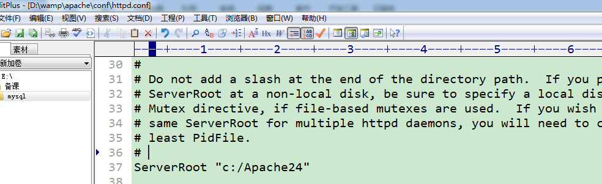
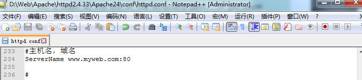

# Apache

----


## Apache概要

**apache它是用于提供http服务的 **。   
apache web 服务器软件，通常指的是 ``apache httpd``   


**什么是集成环境：**   
有一些人将apache、mysql、php这三个软件组成到一起 然后开发出一个新的软件！   
工作一般都是使用集成环境！wamp……..   


**为什么我们不使用集成环境？**   
1、我们不知道集成环境有没有后门 安全性的问题   
2、我们得知道这三个软件是如何进行组合到一起！   

----


## 安装Apache

Apache本身不用安装，我们只需将其安装为系统服务即可，在Windows中。 

我们需要在自己的电脑上面新建一个文件夹，这个文件夹不建议放置在系统盘，千万注意文件夹的名称不要使用中文特殊符号。  


安装Apache http服务，在命令行界面输入：

```bash
httpd.exe  -k  install
```


因为上图所示有报错：找到httpd.conf 这个文件上的37行


 

我们需要将httpd.conf这个文件中的   ``c:/Apache24``



 

替换为apache的实际安装目录


添加一个**ServerName** 




配置默认显示页面


检测是否有语法错误 ：使用``httpd.exe  -t ``  

重启Apache ， 在命令行输入(可省略 .exe)： ``httpd -k restart``

 


在浏览器访问配置的域名，测试是否成功

 

----


## 管理Apache

### 1.   直接以windows服务的方式管理

Apache默认的是被安装成了windows系统服务器，所以管理Apache也可以以windows的服务的形式管理：  

**我的电脑---->右键---->管理----->服务与应用程序---->服务**   


或在开始----->运行里面输入：**services.msc**  

 

### 2.  可以在cmd下操作Apache

如果说要使用黑窗口来管理Apache的话那么一定要进入到apache的安装目录下面执行httpd.exe这个文件才可以对其进行管理。 

**命令：**    
``httpd.exe  –k  stop``        **停止服务**   
``httpd.exe  –k  start``     **开启服务**  
``httpd.exe  –k  restart``     **重启服务**        


**注意：**   

凡是修改了Apache配置文件一定要记得重启apache服务！   
``httpd.exe  –k  restart``    **重启服务**    

检测Apache配置文件的语法错误：   
``httpd.exe  –t``   


**配置环境变量！**  

环境变量（environment variables）一般是指在操作系统中用来指定操作系统运行环境的一些参数，如：临时文件夹位置和系统文件夹位置等。

环境变量是在操作系统中一个具有特定名字的对象，它包含了一个或者多个应用程序所将使用到的信息。例如Windows和DOS操作系统中的path环境变量，当要求系统运行一个程序而没有告诉它程序所在的完整路径时，系统除了在当前目录下面寻找此程序外，还应到path中指定的路径去找。用户通过设置环境变量，来更好的运行进程。

 

因为我们经常要操作httpd.exe这个程序  我们就将它配置到环境变量中 。   
环境变量配置的地方：   
**我的电脑--->右键-->属性-->高级系统设置-->高级的选项卡->环境变量-->path**   

然后将apache的bin文件夹目录赋值一份，添加到path的最后面。 

----


## 目录结构


----


## 配置虚拟主机

### 什么是虚拟主机

**概念**：虚拟主机是指在网络服务器上分出一定的磁盘空间，用户可以租用此部分空间，以供用户放置站点及应用组件，提供必要的数据存放和传输功能。


### 基于域名的虚拟主机

第一步：我们需要在Apache的配置文件中开启虚拟主机的配置 
Httpd.conf 在这个文件中 开启虚拟主机的配置文件


第二步：使用``<VirtualHost  *:80>  </ VirtualHost> `` ，配置一个虚拟主机就是写一对``<VirtualHost>``这对标签 


第三步[可选]：hosts 文件重定向，如果域名是没有配置在DNS服务器的，可用此方法   

hosts文件路径： 
Windows  ``C:\Windows\System32\drivers\etc\hosts``   


### 配置域名(hosts重定向)

``ServerName   域名 ``


### 配置域名对应的目录

``DocumentRoot  "域名所对应的目录"``


## 权限配置


### 目录访问权限

需要使用一对``<Directory  "给哪一个目录设置权限"> </Directory>``来配置

**允许用户访问**  ``Require   all   granted``    
**拒绝用户访问**  ``Require   all   denied``  


### 指定默认显示页面 

``DirectoryIndex  默认显示的页面``


如果在我们当前的网站的根目录中没有默认显示的页面 那么需要如何显示？   
1） `` Options indexes ``   
将当前的网站根目录中所有的文件与文件夹以列表的形式展示出来  

2）  ``Options none``  
拒绝访问  

**注意：**  
 如果网站已经上线，我们就使用拒绝访问的方式；如果我们在开发中，可以使用以列表的形式显示。


### 目录访问权限中的“分布式权限”配置

对于某个目录的访问权限，我们在apache中使用Directory来设定，但可能不够方便： 
1，apache配置修改，必须重启apache  
2，某个站点中的“下级目录”访问权限，不方便单独设置  

这种，可以称为 **集中式权限**；  

**分布式权限**，就是：针对某个网站的任何一个下级目录，都可以单独去设置其访问权限，并且可以不重启apache就生效。  


**第1步：**   
在该网站对应目录权限的Directorty配置中添加一条，表示允许覆写：  
``AllowOverride  all``   

**第2步：**  
在该目录下的任何子目录中，创建一个特殊的文件（`` .htaccess ``），在该文件中写所需要的“权限内容”（几乎跟Directory中的写法一样）：  


## 简单的配置示例

```ini
# 你可以用一个固定的IP地址来代替 * 号，比如说，你可能会希望在一个IP地址上运行一个基于域名的虚拟主机，而在另外一个IP地址上运行一个基于IP的或是另外一套基于域名的虚拟主机。
# 如果端口不是80 ，还需要在主配置文件配置监听端口(Listen 端口号） 
<VirtualHost *:80>
	 #文档根目录
     DocumentRoot "F:\Data\itcast\WorkSpace"
	 #主机名(域名)
	 ServerName a.myweb.com
	 #目录权限控制
	 <Directory "F:\Data\itcast\WorkSpace">
		#是否允许访问 <granted 允许 | denied 拒绝>
		Require all granted
		#默认访问的文件
		DirectoryIndex index.html index.php
		#是否允许访问目录结构 <Indexes 索引 | None 无 | All 所有>
		Options Indexes		
		#是否允许覆写 < None 无 | All 所有>
		AllowOverride all
	 </Directory>
</VirtualHost>
```


