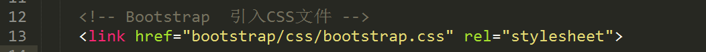
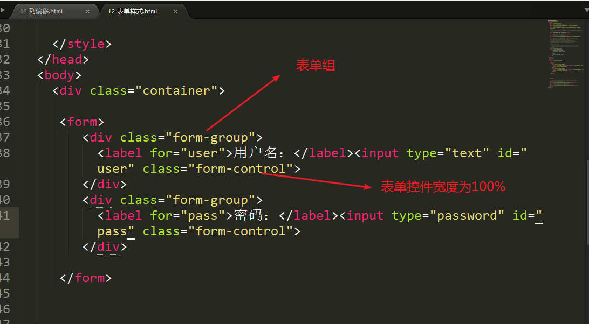
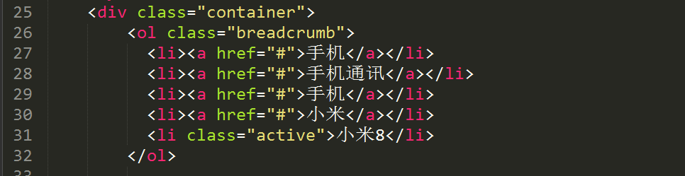

# 一、Bootstrap简介

## 什么是Bootstrap

-   Bootstrap 是由 Twitter 的 Mark Otto 和 Jacob Thornton 两位设计师开发的。

-   Bootstrap 是 2011 年8月在 GitHub 上发布的开源产品。

-   Bootstrap 是一个用于快速开发 Web 应用程序和网站的前端框架。

-   Bootstrap 是基于 HTML、CSS、JavaScript 的。

-   Bootstrap简洁灵活，使得 Web 开发更加快捷。

-   Bootstrap可以构建出非常优雅的前端界面，而且占用资源非常小。

## 为什么要学习Bootstrap

-   移动设备优先。框架包含了贯穿于整个库的移动设备优先的样式。

-   浏览器支持。所有的主流浏览器都支持。

-   容易上手。只要你具备HTML、CSS、JS基础知识，就可以开始学习。

-   响应式设计。Bootstrap 的响应式 CSS 能够自适应于台式机、平板电脑和手机

-   因为现在Bootstrap很流行， 大多数公司都有在使用！

## 将bootstrap部署到项目中

(1)先下载bootstrap

中文网：[[www.bootcss.com]](http://www.bootcss.com)


(2)解压压缩包


CSS文件夹：


Fonts文件夹


JavaScript文件夹


(3)**将bootstrap文件部署到项目中**

bootstrap要求使用的是HTML5的文档！

1.  要设置移动设备优先


2.  将bootstrap中的css文件引入到我们当前的项目中 ，通过link标签来引入



3.  需要引入bootstrap中的js文件， 通过script标签的src属性来引入

```html
<!DOCTYPE html>
<html lang="zh-CN">
  <head>
    <meta charset="utf-8">
    <!-- 为了兼容edge浏览器  -->
    <meta http-equiv="X-UA-Compatible" content="IE=edge">
    <!-- 设置移动设备优先  -->
    <meta name="viewport" content="width=device-width, initial-scale=1">
    <!-- 上述3个meta标签*必须*放在最前面，任何其他内容都*必须*跟随其后！ -->
    <title>Bootstrap 101 Template</title>

    <!-- Bootstrap  引入CSS文件 -->
    <link href="bootstrap/css/bootstrap.css" rel="stylesheet">

    <!-- HTML5 shim 和 Respond.js 是为了让 IE8 支持 HTML5 元素和媒体查询（media queries）功能 -->
    <!-- 警告：通过 file:// 协议（就是直接将 html 页面拖拽到浏览器中）访问页面时 Respond.js 不起作用 
    判断ie浏览器如果小于9 就引入下面的两个JS文件  
    -->
    <!--[if lt IE 9]>
      <script src="bootstrap/js/html5shiv.min.js"></script>
      <script src="bootstrap/js/respond.min.js"></script>
    <![endif]-->
  </head>
  <body>
    <h1>你好，世界！</h1>

    <!-- jQuery (Bootstrap 的所有 JavaScript 插件都依赖 jQuery，所以必须放在前边) -->
    <script src="bootstrap/js/jquery.min.js"></script>
    <!-- 加载 Bootstrap 的所有 JavaScript 插件。你也可以根据需要只加载单个插件。 -->
    <script src="bootstrap/js/bootstrap.min.js"></script>
  </body>
</html>
```


# 二、全局CSS样式

bootstrap官网给程序猿写好了很多CSS效果！它封装了很多类名 ， 我们只需要使用其封装好的类名

```
<div class="类名"></div>
```

## 布局容器

-   .container 类， 用于固定宽度并支持响应式布局的容器。

默认的宽度是1170px

-   .container-fluid 类，用于 100% 宽度，占据全部视口（viewport）的容器。


## 排版样式

-   `<p></p>`


-   `<h1>~<h6>`或者`.h1~.h6`


-   `.text-center` 让文本居中

-   `.text-right` 让文本居右

-   `.text-left` 让文本居左

-   `.text-lowercase` 大转小

-   `.text-uppercase` 小转大

-   `.text-capitalize` 首字母大写


-   `.list-unstyled ` 去掉了列表前面的项目符号 清除了ul的padding

-   `.list-inline` 将所有的Li标签的内容排成同一行， 增加了少量的padding ，使用了`display:inline-block `


-   `.dl-horizontal` 将dt与dd中的内容排列成一行


## 按钮样式

-   .btn 按钮的基类 父类的意思

-   .btn-default 默认的按钮

-   .btn-success 成功的按钮

-   .btn-danger 危险的按钮

-   .btn-warning 警告的按钮

-   .btn-info 一般信息的按钮

-   .btn-link 链接效果的按钮

-   .btn-primary 首选项的按钮

-   .btn-lg 超大按钮

-   .btn-sm 小按钮

-   .btn-xs 超小按钮


## 表格样式

-   .table  少量的内填充（padding）和水平方向的分隔线

-   .table-bordered 带边框的表格

-   . table-striped 隔行变色的表格

-   .table-hover 鼠标放上高亮的效果

-   .table-condensed 紧凑型的表格， 将padding减半

**下图状态类：**只能行标签与单元格标签设置，也就是说只能给tr或者td 和th


## 栅格系统

**什么是栅格系统？**

Bootstrap 提供了一套响应式、移动设备优先的流式栅格系统，随着屏幕或视口（viewport）尺寸的增加，系统会自动分为最多12列。

栅格系统用于通过一系列的行（row）与列（column）的组合来创建页面布局，把内容放置在列中。

一行最多只能放12个列，表格布局！

### 栅格参数


**需求：**

-   如果设备的分辨率在1200像素以上， 我们就1行12列

-   如果设备的分辨率在992到1200像素之间，我们就1行6列

-   如果设备的分辨率在768到992像素之间，我们就1行4列

-   如果设置的分辨率小于768像素， 我们就1行2列


### 格式：列偏移 

```
col-m-offset-n
```

说明：

m表示是栅格参数

n表示的是偏移量

### 列嵌套

在一个列里面 嵌套一个栅格系统

## 表单样式

-   .form-control \<input\>、\<textarea\> 和 \<select\> 元素都将被默认设置宽度属性为 width: 100%;。 建议只给单行文本框与单行密码框使用



-   form-horizontal  水平排列的表单

-   form-inline 内联表单

> 将这个表单中的所有的表单控制显示在一行内
>
> 注意这个form-inline要给form标签设置


-   form-group 表单组

```html
<!DOCTYPE html>
<html lang="zh-CN">
  <head>
    <meta charset="utf-8">
    <!-- 为了兼容edge浏览器  -->
    <meta http-equiv="X-UA-Compatible" content="IE=edge">
    <!-- 设置移动设备优先  -->
    <meta name="viewport" content="width=device-width, initial-scale=1">
    <!-- 上述3个meta标签*必须*放在最前面，任何其他内容都*必须*跟随其后！ -->
    <title>Bootstrap 101 Template</title>

    <!-- Bootstrap  引入CSS文件 -->
    <link href="bootstrap/css/bootstrap.css" rel="stylesheet">

    <!-- HTML5 shim 和 Respond.js 是为了让 IE8 支持 HTML5 元素和媒体查询（media queries）功能 -->
    <!-- 警告：通过 file:// 协议（就是直接将 html 页面拖拽到浏览器中）访问页面时 Respond.js 不起作用 
    判断ie浏览器如果小于9 就引入下面的两个JS文件  
    -->
    <!--[if lt IE 9]>
      <script src="bootstrap/js/html5shiv.min.js"></script>
      <script src="bootstrap/js/respond.min.js"></script>
    <![endif]-->
    <style type="text/css"></style>
  </head>
  <body>
    <div class="container">
      
     <form class="form-horizontal">
      <!-- 表现为栅格系统的row -->
        <div class="form-group">
          <label for="user" class="col-md-2 control-label">用户名：</label>
          <div class="col-md-4"><input type="text" id="user" class="form-control"></div>
        </div>
         <div class="form-group">
          <label for="pass" class="col-md-2 control-label">密码：</label>
          <div class="col-md-4"><input type="password" id="pass" class="form-control"></div>
        </div>
        <div class="form-group">
          <div class="col-md-4 col-md-offset-2">
            <div class="checkbox">
              <label>
                <input type="checkbox">记住我
              </label>
            </div>
          </div>
        </div>
        <div class="form-group">
          <div class="col-md-4 col-md-offset-2">
            <button class="btn btn-success">提交</button>
          </div>
        </div>       
     </form> 
    </div>

    <!-- jQuery (Bootstrap 的所有 JavaScript 插件都依赖 jQuery，所以必须放在前边) -->
    <script src="bootstrap/js/jquery.min.js"></script>
    <!-- 加载 Bootstrap 的所有 JavaScript 插件。你也可以根据需要只加载单个插件。 -->
    <script src="bootstrap/js/bootstrap.min.js"></script>
  </body>
</html>
```


## 响应式图片

-   img-rounded 有圆角的图片

-   img-circle 圆形图片

-   img-thumbnail 有边框的图片 支持响应式

-   img-responsive 响应式的图片


# 三、组件

## 字体图标

[[http://fontawesome.dashgame.com/]](http://fontawesome.dashgame.com/) 一套绝佳的图标字体库和CSS框架


## 下拉菜单

-   .dropdown 表示下拉菜单

-   .dropup 上拉菜单

-   .dropdown-menu 它是给ul设置

-   data-toggle:dropdown 是用来控制下拉菜单的显示与隐藏


## 按钮组

.btn-group


## 分页

.pagination


## 路径导航

面包屑导航



## 徽章

.badge

## 导航条

```html
<!DOCTYPE html>
<html lang="zh-CN">
  <head>
    <meta charset="utf-8">
    <!-- 为了兼容edge浏览器  -->
    <meta http-equiv="X-UA-Compatible" content="IE=edge">
    <!-- 设置移动设备优先  -->
    <meta name="viewport" content="width=device-width, initial-scale=1">
    <!-- 上述3个meta标签*必须*放在最前面，任何其他内容都*必须*跟随其后！ -->
    <title>Bootstrap 101 Template</title>
    <!-- Bootstrap  引入CSS文件 -->
    <link href="bootstrap/css/bootstrap.css" rel="stylesheet">

    <!-- HTML5 shim 和 Respond.js 是为了让 IE8 支持 HTML5 元素和媒体查询（media queries）功能 -->
    <!-- 警告：通过 file:// 协议（就是直接将 html 页面拖拽到浏览器中）访问页面时 Respond.js 不起作用 
    判断ie浏览器如果小于9 就引入下面的两个JS文件  
    -->
    <!--[if lt IE 9]>
      <script src="bootstrap/js/html5shiv.min.js"></script>
      <script src="bootstrap/js/respond.min.js"></script>
    <![endif]-->
    <style type="text/css">
    </style>
  </head>
  <body style="height: 2000px;">
  <!-- 表示导航条 -->
   <nav class="navbar navbar-inverse navbar-fixed-top">
    <!-- 表示布局容器 1170 -->
    <div class="container">
    <!-- Brand and toggle get grouped for better mobile display -->
    <div class="navbar-header">
      <button type="button" class="navbar-toggle collapsed" data-toggle="collapse" data-target="#bs-example-navbar-collapse-1" aria-expanded="false">
        <span class="icon-bar"></span>
        <span class="icon-bar"></span>
        <span class="icon-bar"></span>
      </button>
      <a class="navbar-brand" href="#">黑马程序员</a>
    </div>
    <!-- Collect the nav links, forms, and other content for toggling -->
    <div class="collapse navbar-collapse" id="bs-example-navbar-collapse-1">
      <ul class="nav navbar-nav">
        <li class="active"><a href="#">首页<span class="sr-only">(current)</span></a></li>
        <li><a href="#">公开课</a></li>
        <li><a href="#">免费视频教程</a></li>
        <li><a href="#">学习路线图</a></li>
        <li><a href="#">技术社区</a></li>
      </ul>
      <ul class="nav navbar-nav navbar-right">
        <li><a href="#">登录</a></li>
        <li><a href="#">注册</a></li>
      </ul>
      <form class="navbar-form navbar-right">
        <div class="form-group">
          <input type="text" class="form-control" placeholder="Search">
        </div>
        <button type="submit" class="btn btn-default">搜索</button>
      </form>
    </div><!-- /.navbar-collapse -->
  </div><!-- /.container-fluid -->
</nav> 
    <!-- jQuery (Bootstrap 的所有 JavaScript 插件都依赖 jQuery，所以必须放在前边) -->
    <script src="bootstrap/js/jquery.min.js"></script>
    <!-- 加载 Bootstrap 的所有 JavaScript 插件。你也可以根据需要只加载单个插件。 -->
    <script src="bootstrap/js/bootstrap.min.js"></script>
  </body>
</html>
```

