# 一、CSS简介

## 什么是CSS

Cascading Style Sheets  **层叠样式表** 或者叫 **级联样式表**

## CSS的作用

从审美的角度 ，对HTML页面进行美化

## CSS的语法规则 


-   CSS是由选择器和一对大括号来组成

-   大括号里面是由一条一条的声明语句组成

-   每一条语句的末尾需要有一个英文状态下面的分号

-   语句是由 `属性:值` 组成

-   属性值一般不需要加引号

-   属性值如果是数字 ，一般情况下是有单位的 单位是px

## CSS快速入门


# 二、CSS的书写方式

书写方式，即CSS代码写在哪里

**嵌入式**   **外链式**    **行内式**

## 嵌入式

指的是将CSS代码写在HTML文件中的style标签中


## 外链式

我们可以将CSS代码写在一个文本文件中 ，然后将这个文本文件的扩展名修改为css

要通过HTML中的一个link标签， 然后将css文件链接到html文件中。


## 行内式

将CSS代码书写在HTML标签中， 写在HTML标签的style属性值中。

**格式:**

```html
<标签名 style="属性:值;属性:值;" ></标签名>
```


# 三、注释

**格式：**

```css
/* 注释的内容 */
```

**注意：**

千万不要在CSS代码中使用HTML的注释


# 四、选择器

## 什么是选择器

选择器是指通过一定的语法规则选取到对应的HTML标记，然后给这个对应的HTML标记设置样式

**选择器分为四大类**：

* 基本选择器
* 复合选择器
* 伪类选择器
* 属性选择器

## 基本选择器


**通用选择器：**

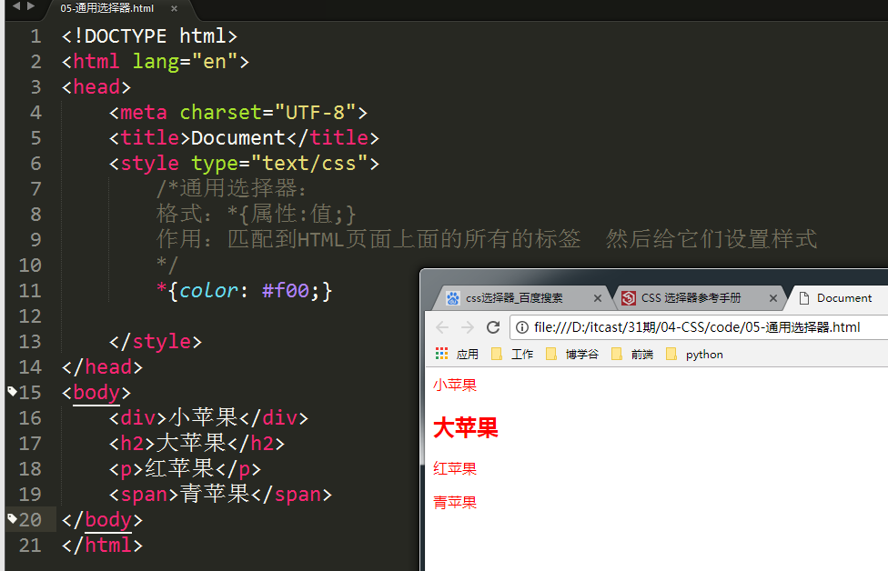

**标签选择器：**


**类选择器：**


**交集选择器：**

**格式：**

```CSS
标签名.class属性值{属性:值;}
```


**ID选择器 **

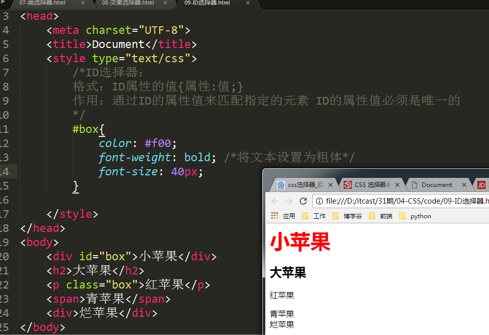

## 复合选择器


多元素选择器：


后代元素选择器：

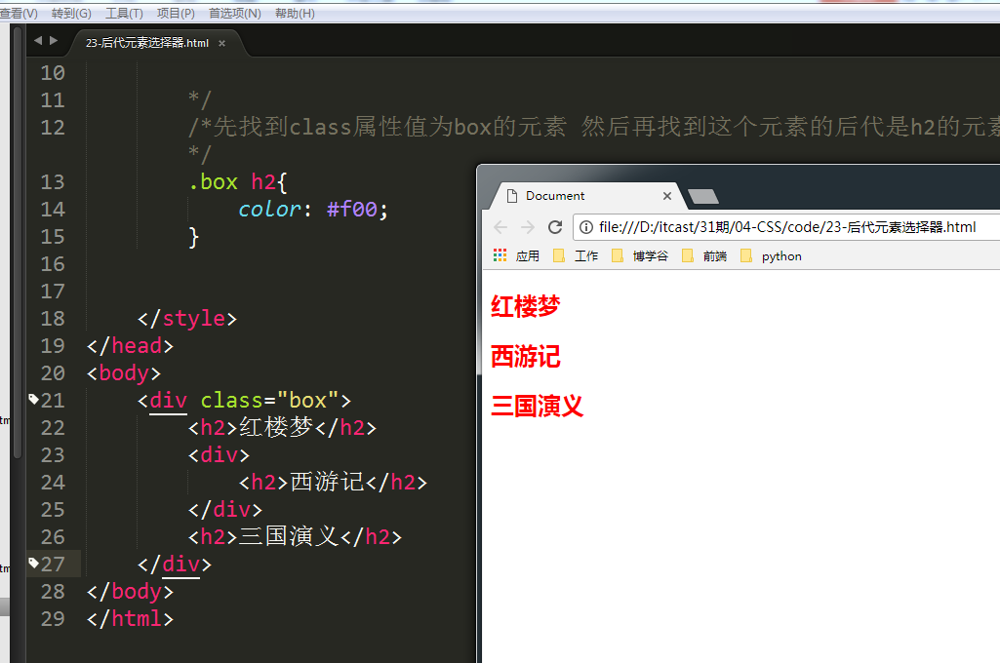

子元素选择器：


相邻元素选择器：


## 伪类选择器

> **什么是伪类选择器？**
>
> 类选择器：给页面上的指定的类名的元素设置样式
>
> 伪类选择器：给页面上的元素设置样式，必须满足一定的条件，我们的伪类选择器设置的样式才会显示。
>
> 总结：与类选择器相似，但是又有所不同。

### 锚伪类

**超级链接的不同状态**

-   未访问的状态：超级链接没有被访问 **:link**

-   访问过后状态： 超级链接已经被访问 **:visited**

-   鼠标放上状态： 鼠标放在超级链接上面，但是并没有将鼠标的左键按下去 **:hover**

-   激活状态： 鼠标左键已经按下去了，但是并没有将鼠标的左键弹出 **:active**

**伪类选择器都是带有冒号":"**

> 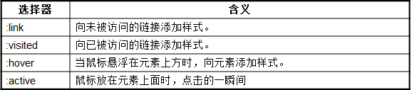
>
> 第一步：我们先创建了一个叫"27-锚伪类选择器.html文件"
>
> 第二步：我们观察其效果
>
> 未访问的状态如下图：
>
> 
>
> 访问过后的状态效果如下：
>
> 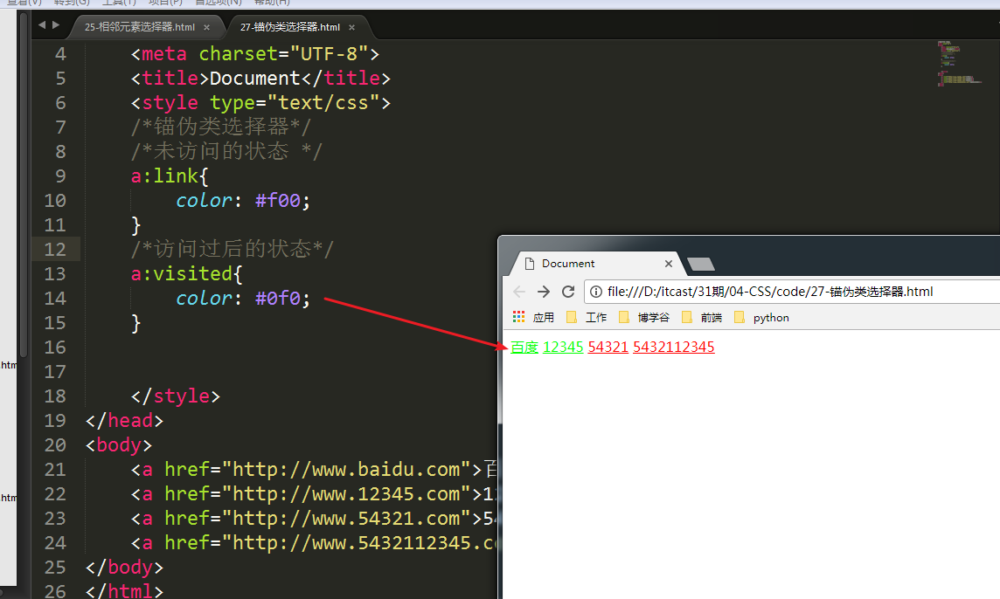
>
> 鼠标放上的状态
>
> 
>
> 激活状态：
>
> 
>
> **注意：**
>
> 超级链接的不同状态它其实是有顺序。也就是说锚伪类选择器设置其实是有顺序。
>
> 如果不按照锚伪类选择器的顺序，那么样式就会失效。
>
> **顺序：**要遵守"**爱恨准则**"要先有爱，才有恨。"Love Hate"


### 超级链接的美化

我们通常会去掉超级链接的下划线，然后同时会给超级链接设置一个颜色。

**一般情况下：**

正常状态与访问过后的状态的样式设置为一样

当鼠标放上的时候给其设置另外一个颜色 激活状态一般不会设置 因为激活状态的时间太短

**举例：**

a:link,a:visited{去掉超级链接的下划线;设置一个颜色;}

第一步：我们需要创建一个叫"28-对超级链接的美化.html"


第二步：我们开始写CSS代码 然后对超级链接进行美化

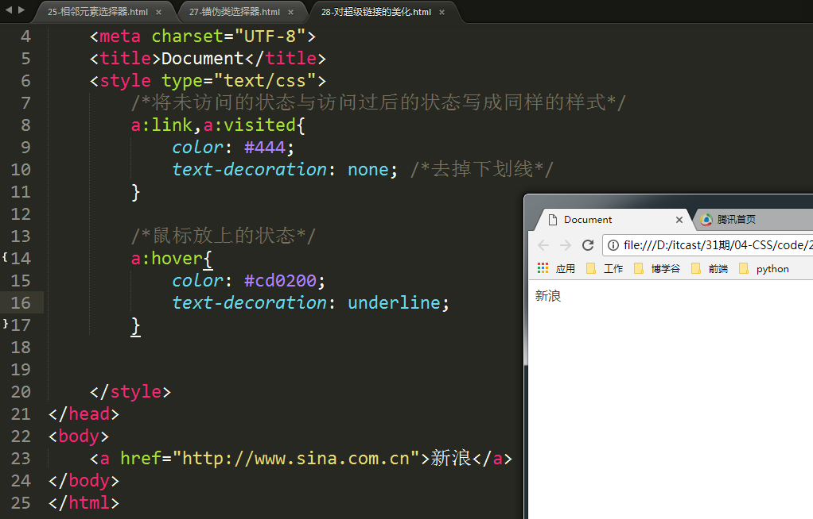

接下来我们来观察 www.qq.com 这个网站是如何对超级链接进行美化？

```css
a{color:#172c45;text-decoration:none}
```

上面的这种设置的方式 是集合了a:link与a:visited的功能

```css
a:hover{color:#cd0200;text-decoration:underline}
```

请参考：29-借鉴腾讯网对超级链接的美化效果.html


## 属性选择器

**什么是属性选择器？**

-   属性选择器它是与HTML标签的属性名和属性值有关。

-   属性选择器是通过HTML标签的属性名和属性值来匹配元素。

**attr** 是英文单词"attribute"的简写，中文意思"属性" 属性名。

**val** 是英文单词"value"的简写，中文意思是"值" 属性值。


创建31-属性选择器.html文件

先观察[attr\]的含义： 通过属性名来匹配元素

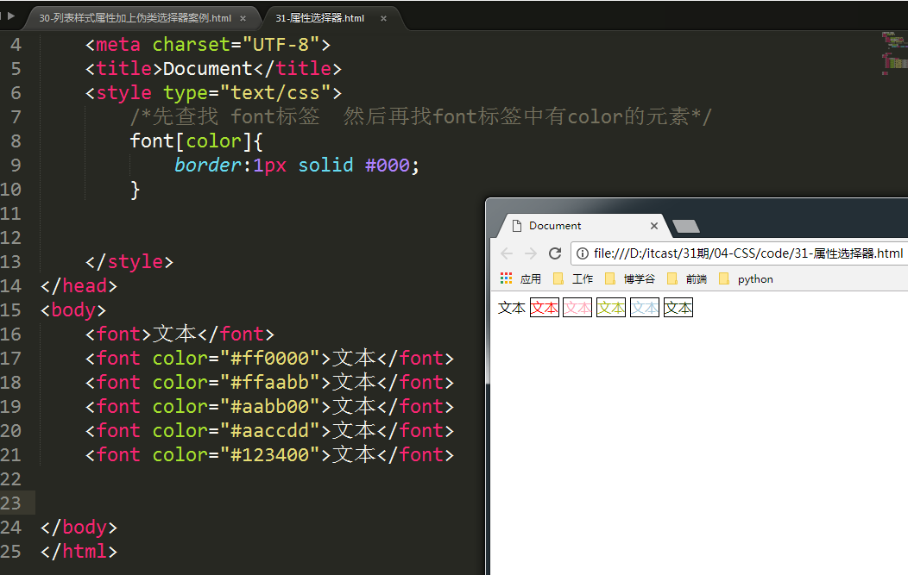

观察\[attr=val\]的含义： 通过属性名要等于指定的值来匹配元素


观察\[attr\^=val\]的含义： 通过属性名要等于指定的值开头的元素才匹配


观察\[attr\$=val\]的含义： 通过属性名要等于指定的值结尾的元素才匹配


观察\[attr\*=val\]的含义： 通过属性名中包含指定值则匹配


# 五、尺寸样式属性


# 六、文本与字体属性

## 文本属性

| **属性名**      | **值**                                                       | **含义**                                                     |
| --------------- | ------------------------------------------------------------ | ------------------------------------------------------------ |
| color           | \#ff0000或red或rgb(3,5,8)                                    | 给文本设置颜色                                               |
| text-align      | left(居左)、right(居右)、center(居中)                        | 设置文本的水平方向对齐 。  **注意：**这个属性只能给块级元素使用 |
| text-decoration | none(去掉文本修饰线)、**underline**(下划线),、overline(上划线) 、line-through(删除线) | 设置文本修饰线                                               |
| text-transform  | capitalize、uppercase 、lowercase                            | 大小写转换或者首字母大写                                     |
| line-height     | 固定值或百分比                                               | 设置行高 一行文字的高度                                      |
| text-indent     | px或者em                                                     | 设置首行缩进  ，允许负值                                     |
| letter-spacing  | px                                                           | 设置字符间距 ，  专用于对汉字设置间距                        |
| word-spacing    | px                                                           | 设置单词间距 ，  专用于对英文单词设置间距                    |


## 字体属性


| 属性名      | **值**                                                       | **功能**                                                     |
| ----------- | ------------------------------------------------------------ | ------------------------------------------------------------ |
| font-style  | normal(正常)、(italic)斜体                                   | 设置文本为斜体                                               |
| font-weight | normal(正常)、bold(加粗)                                     | 设置文字粗细                                                 |
| font-size   | px                                                           | 给文本设置大小   ，如12px、14px 记得加单位                   |
| font-family | 微软雅黑、楷体、宋体…..                                      | 给文本设置字体                                               |
| font        | 举例：font:italic bold 14px “微软雅黑”   font-style \| font-weight \|   font-size \| line-height \| font-family | 简写属性。   能够同时给文本设置斜体、加粗、大小、行高、字体  。   每一个值之间需要使用空格，  并且一定要有顺序 |


## 文本与字体属性综合案例


```html
<!DOCTYPE html>
<html lang="en">
<head>
	<meta charset="UTF-8">
	<title>Document</title>
	<style type="text/css">
		.one{
			color: #b52f28;
			font-size: 24px;
		}

		.two{
			font-size: 12px;
			color: #ccc;
			font-family: 楷体;
		}
		.three{
			color: #00a;
		}
	
		.first{
			font-size: 36px;
			color: #0f0;
		}
		.second{
			font-size: 36px;
			color: #0ff;
			font-style: italic;
			font-family: "宋体";
		}
	</style>
</head>
<body>
	<p class="one">新华社北京5月15日电 中共中央总书记、国家主席、中央军委主席、中央外事工作委员会主任习近平5月15日上午主持召开中央外事工作委员会第一次会议并发表重要讲话。习近平强调，要加强党中央对外事工作的集中统一领导，准确把握当前国际形势发展变化，锐意进取，开拓创新，努力开创中国特色大国外交新局面，为实现“两个一百年”奋斗目标、实现中华民族伟大复兴的中国梦作出更大贡献。</p>
	<p class="two">新华社北京5月15日电 中共中央总书记、国家主席、中央军委主席、中央外事工作委员会主任习近平5月15日上午主持召开中央外事工作委员会第一次会议并发表重要讲话。习近平强调，要加强党中央对外事工作的集中统一领导，准确把握当前国际形势发展变化，锐意进取，开拓创新，努力开创中国特色大国外交新局面，为实现“两个一百年”奋斗目标、实现中华民族伟大复兴的中国梦作出更大贡献。</p>
	<p class="three"><span class="first">新</span>华社北京5月15日电 <span class="second">中共中央总书记、国家主席、中央军委主席</span>、中央外事工作委员会主任习近平5月15日上午主持召开中央外事工作委员会第一次会议并发表重要讲话。习近平强调，要加强党中央对外事工作的集中统一领导，准确把握当前国际形势发展变化，锐意进取，开拓创新，努力开创中国特色大国外交新局面，为实现“两个一百年”奋斗目标、实现中华民族伟大复兴的中国梦作出更大贡献。</p>
	<p>新华社北京5月15日电 中共中央总书记、国家主席、中央军委主席、中央外事工作委员会主任习近平5月15日上午主持召开中央外事工作委员会第一次会议并发表重要讲话。习近平强调，要加强党中央对外事工作的集中统一领导，准确把握当前国际形势发展变化，锐意进取，开拓创新，努力开创中国特色大国外交新局面，为实现“两个一百年”奋斗目标、实现中华民族伟大复兴的中国梦作出更大贡献。</p>
</body>
</html>
```


# 七、列表样式属性

这里的列表指的是：**无序列表**和**有序列表**

因为在整个网页布局中无序列表是使用的最多的。


**list-style-image**：将列表前面的项目符号设置为一张图片 。它的值是：url(图片的地址)

凡是在CSS中跟图片地址有关的， 都需要将图片的地址放置在url(图片的地址)

**list-style：**这个属性是一个简写属性 它集成了上面三个属性的功能。可以同时设置上面的三个属性。每一个属性值之前使用空格分隔！ 它的属性值可以有一个也可以有两个也可以三个。其属性值个数不定，位置也不定！

**要记的：**

```css
list-style-type:none;
list-style:none;
```

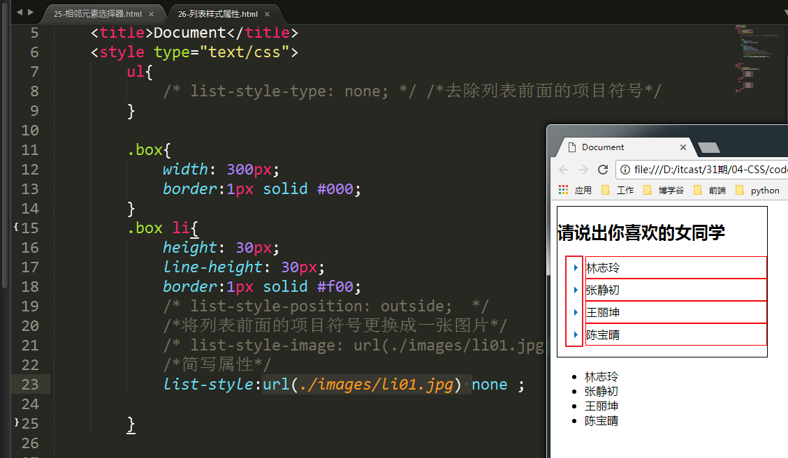


# 八、列表样式属性加上伪类选择器案例

创建 30-列表样式属性加上伪类选择器案例.html

```html
<!DOCTYPE html>
<html lang="en">
<head>
	<meta charset="UTF-8">
	<title>Document</title>
	<style type="text/css">
		li{list-style: none;}
		.box li{
			line-height: 30px;
		}

		/*对a标签进行美化*/
		a{
			text-decoration: none;
			color: #222;
		}
		
		a:hover{
			color: #f00;
			text-decoration: underline;
		}
	</style>
</head>
<body>
	<div class="box">
		<ul>
			<li><a href="#">习近平会见朝鲜劳动党友好参观团</a></li>
			<li><a href="#">习近平会见朝鲜劳动党友好参观团</a></li>
			<li><a href="#">习近平会见朝鲜劳动党友好参观团</a></li>
			<li><a href="#">习近平会见朝鲜劳动党友好参观团</a></li>
			<li><a href="#">习近平会见朝鲜劳动党友好参观团</a></li>
			<li><a href="#">习近平会见朝鲜劳动党友好参观团</a></li>
			<li><a href="#">习近平会见朝鲜劳动党友好参观团</a></li>
		</ul>
	</div>
</body>
</html>
```


# 九、块级元素与行内元素

在HTML中有两个元素 一种元素称之为**块级元素**， 另外一种元素称之为**行内元素**

块级元素的代表是：**div标签**

行内元素的代表是：**span标签 **

**块级元素的特点：**

1）块级元素它很霸道，它不允许其它的标签或者内容与其排列成一行， 独占一行的空间


2）块级元素可以设置宽度与高度

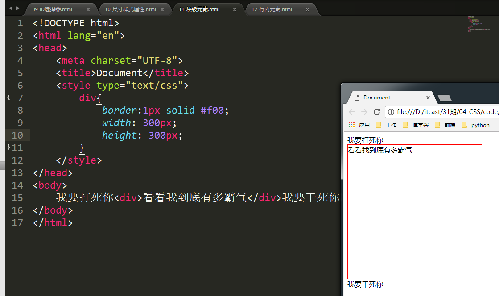

3）如果不能块级元素设置宽度 ，那么它默认宽度会是其父元素的100%


**行内元素的特点：**

1.  它允许其它的标签或者是内容与其排列成一行


2）行内元素不能设置宽度与高度 ，它的宽度与高度要由其内容来决定。


在CSS中块级元素使用block来表示

在CSS中行内元素使用inline来表示

文本修饰标签、a标签、input标签是行内元素

排版标签、列表标签、表格、表单标签是属于块级元素

**img标签 既不是行内元素也不是块级元素 。它同时拥有行内元素与块级元素的元素 ，行内块元素**


# 十、继承性

所谓的继承性指的不是给自身设置样式，它身上的样式是继承性！

## 祖先元素身上的样式会被后代所继承


## 就近原则


## 并不是所有的属性都能够被继承


在CSS中有以下属性能够被继承：

**文本、字体、列表属性能够被继承！**

**一般情况下我们会给body标签设置以下样式**

**字体大小、字体、文本颜色 **

```html
body{
	font-size:XXXX;
	font-family:XXX;
	color:xxxx;
}
```


**有一个标签非常特殊：a 标签 。这个标签的样式不能继承其父级元素 ，这个标签只能给自己设置！**


# 十一、选择器的优先级

选择器的优先级指的是属性设置在当前元素的身上！

## 单个选择器之间的优先级

行内样式\>ID选择器\>类选择器\>标签选择器


## 多个选择器之间的优先级

**关于多个选择器之间的优先级的计算方法：**

我们要数ID选择器、类选择器、标签选择器的个数

ID选择器个数,类选择器个数,标签选择器个数

无论多少个标签选择器都干不过一个类选择器

无论多少个类选择器都干不过一个ID选择器

无论多少个ID选择器都干不过一个行内样式


个数相同时：如果多个选择器之间的个数相同时要观察CSS代码的书写顺序 ，**谁写在后面就听谁写**！


选择器之间优先级的问题


# 

# 十三、!important属性

## 什么是important

important在英文中含义是"重要的"意思

## !important在CSS中的作用

它主要是用来提升属性的权重。其属性的权重值无穷大！

## 语法格式

```css
属性:值 !important;
```

一定要注意!important的语法规则：

-   正确的写法

    -   属性:值 !important;

-   错误的写法

    -   属性:值;!important; 不能将!important写在分号的外面 ，一定要写在分号的里面。

    -   属性:值 important; 不能将`!`给忘记了。

## 使用!important一定要注意以下几点：

先创建02-!important.html


1.  !important它是提升的属性的权重，而不是提升选择器的优先级！

2.  !important它不能提升继承过来的权重！

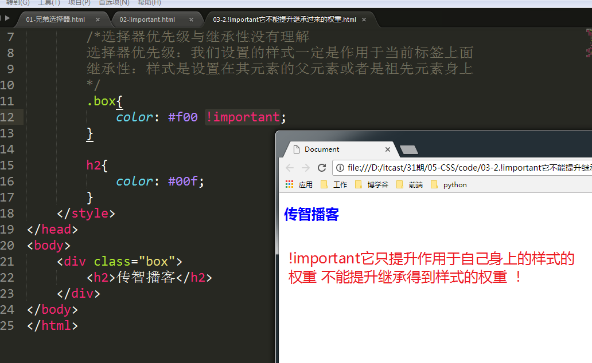

**关于!important综合使用的案例：**


# 十四、CSS层叠性

==一个标签内可以携带多个类名 (CSS层叠性)==

**类名：指的是class的属性值**

一个标签内可以携带多个类名，指的是class的属性值可以有多个，每一个属性值之间使用空格分隔。

**举例：**

```
<标签名 class="值1 值2 值3"></标签名>
```

**多个类名的优点：**

减少CSS的代码量


**注意：**

如果说一个标签内的多个类名，它们设置的样式是一样的话，就会存在样式的冲突！

这个时候我们主要要观察CSS中的代码的书写顺序 谁写在后面就听谁的！

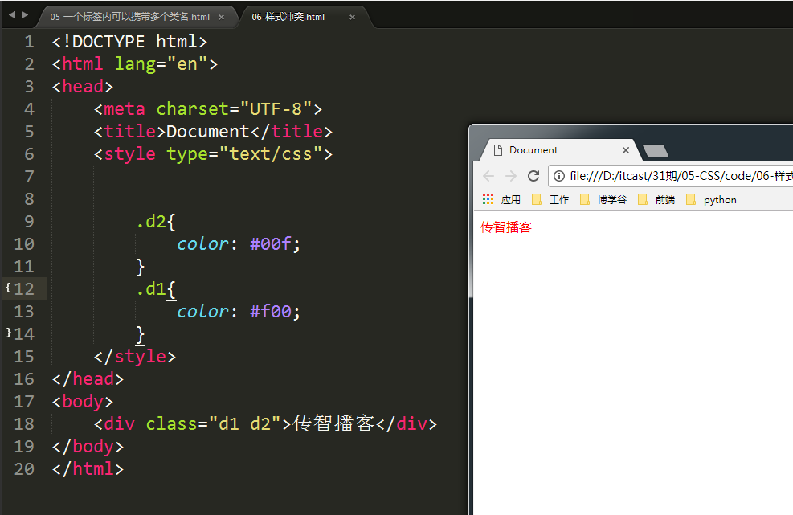

# 十五、背景样式属性


注意：

-   **background-color**：用于给元素设置背景颜色， 但是前提这个元素要么有内容，要么有宽度和高度才可以。

-   **background-image** 用于给元素设置背景图片， 图片的地址一定放在url(图片的地址) 。但是前提这个元素要么有内容，要么有宽度和高度才可以 ，背景图片默认是平铺的。

    
-   **background-repeat** 是用于设置背景图片是否平铺 repeat(是平铺)、repeat-x(水平方向平铺)、repeat-y(垂直方向平铺)、no-repeat(不平铺)
  

-   **background-position** 用于设置背景图片的位置 ，如果要设置背景图片的位置 ，这个属性就会有两个值。

    水平位置 ， 垂直位置 。这两个值的表示方式有三种 ：`英文单词` `固定值 ` `百分比 ` 。  并且这三种方式可以混合使用 ，可以同时使用英文单词或者是固定值或者是百分比。

    -   英文单词的表示方式

        -   水平位置：left(居左)、center(居中)、right(居右)
        -   垂直位置：top(居上)、center(居中)、bottom(居下)
        
    

-   固定值的表示方式

    固定值可以是负数， 右下是正值， 左上是负值

    

-   百分比的表示方式

    

-   混合表示方式

    关于位置的表示方式， 可以是这三种表示方式混合表示

    


# 十六、CSS雪碧图 (CSS精灵图)

**什么是雪碧图？**

在一张大图片上 ， 面放了很多个小图片， 我们可以使用CSS中的图片定位的属性来找到这张大图中的小图片所在的位置。


**background-attachment** 属性


-   **background** ：简写属性 ，它可以同时设置多个样式 ，比如背景颜色、背景图片、背景图片是否平铺 ，水平位置， 垂直位置。

-   **background**：简写属性 ，其值的个数不定， 顺序也不定， 每一个值之前使用空格分隔。


# 十七、背景样式属性综合案例

```html
<!DOCTYPE html>
<html lang="en">
<head>
	<meta charset="UTF-8">
	<title>Document</title>
	<style type="text/css">
		li{
			list-style: none;
			line-height: 30px;
			height: 30px;
			background-image: url(images/li01.jpg);
			background-repeat: no-repeat;
			/*设置背景图片的位置*/
			background-position: left center;
			padding-left: 12px;
		}
		a{
			text-decoration: none;
			color: #444;
		}
		a:hover{
			color: #f00;
		}
	</style>
</head>
<body>
	<div class="box">
		<ul>
			<li><a href="#">开奥迪男子醉驾撞警车未果</a></li>
			<li><a href="#">开奥迪男子醉驾撞警车未果</a></li>
			<li><a href="#">开奥迪男子醉驾撞警车未果</a></li>
			<li><a href="#">开奥迪男子醉驾撞警车未果</a></li>
			<li><a href="#">开奥迪男子醉驾撞警车未果</a></li>
			<li><a href="#">开奥迪男子醉驾撞警车未果</a></li>
			<li><a href="#">开奥迪男子醉驾撞警车未果</a></li>
			<li><a href="#">开奥迪男子醉驾撞警车未果</a></li>
			<li><a href="#">开奥迪男子醉驾撞警车未果</a></li>
			<li><a href="#">开奥迪男子醉驾撞警车未果</a></li>
		</ul>
	</div>
</body>
</html>
```

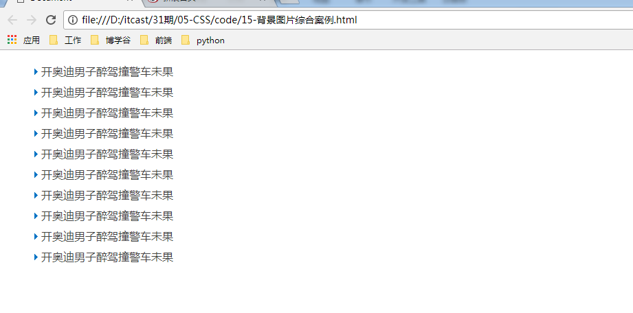

# 十八、标准文档流(了解)

## 什么是标准文档流

我们制作的HTML网页和PS画图软件画图时有本质上面的区别：

HTML网页在制作的时候 都得遵循一个"流"的规则：==从左至右、从上至下==

使用PS软件画图时 ，我们想在哪里画个东西 ，就可以在哪里画。

## 标准文档流要注意的事项

1)  空白折叠现象


2)  高矮不齐，底部对齐


**在标准文档流中，**标签只会有三种：

* 行内元素
* 块级元素
* 行内块级元素


# 十九、浮动

**需求：**

能够实现让多个元素排在同一行，并且给这些元素设置宽度与高度！

让多个元素排在同一行：**行内元素的特性**

给这些元素设置宽高：**块级元素的特性**

在标准文档流中的元素只有两种：块级元素和行内元素。如果想让一些元素既要有块级元素的特点也要有行内元素的特点，只能让这些元素脱离标准文档流。


**浮动**可以让元素脱离标准文档流 ，就可以实现让多个元素排在同一行 ，并且可以设置宽高！

浮动主要是用来解决让多个元素排列在同一行！！！可以是块元素 ，还可以是行内元素。

浮动它是通过一个浮动属性来实现。


**float：**这个属性有两个值 left(向左浮动) 向左移动 、right(向右浮动) 向右移动


什么叫浮动元素：

凡是设置了float属性的元素我们就称之为浮动元素！


**浮动元素的特性： **

-   浮动元素它脱离标准文档流， 它不再占用空间了

-   我们可以把浮动理解为"漂"

-   浮动元素它的层级要比标准文档流里面的元素层级要高，它会将标准文档流中的元素给压盖住

-   浮动元素它会向左或者向右进行浮动(移动)

-   浮动元素它遇到了父元素的边框然后就停止了浮动

-   浮动元素它还会遇到上一个浮动元素后就停止了浮动

-   浮动元素浮动以后 ，其父元素不会再包裹着浮动元素

```html
<!DOCTYPE html>
<html lang="en">
<head>
	<meta charset="UTF-8">
	<title>Document</title>
	<style type="text/css">
		.box{
			border:1px solid #000;
			width: 600px;
		}
		.div1{
			width: 100px;
			height: 100px;
			background-color: #f00;
			float: right; /*向右浮动*/
		}
		.div2{
			width: 100px;
			height: 100px;
			background-color: #0f0;
			float: right; /*向右浮动*/
		}
		.div3{
			width: 100px;
			height: 100px;
			background-color: #00f;
			float: left; /*向左浮动*/
		}
	</style>
</head>
<body>
	<div class="box">
		<div class="div1"></div>
		<div class="div2"></div>
		<div class="div3"></div>
	</div>
</body>
</html>
```

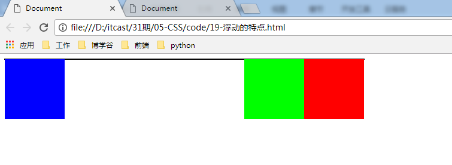

# 二十、浮动案例

浮动的主要目的 ：就是为了实现让**块元素排列在一行**

不是说只有块元素才可以浮动，行内元素也是可以浮动！

```html
<!DOCTYPE html>
<html lang="en">
<head>
	<meta charset="UTF-8">
	<title>Document</title>
	<style type="text/css">
		 body{

		    margin-top: 0px;
		    margin-right: 0px;
		    margin-left: 0px;
		    margin-bottom: 0px;

		 }
		.box{
			width: 100%;
			height: 30px;
			background-color: #ccc;
		}
		.inner_c{
			width: 1000px;
			height: 30px;
			line-height: 30px;
			background-color: #f00;
			margin: 0 auto; /*可以实现标签的水平居中*/
		}
		
		.floatR{
			float: right;
		}
	</style>
</head>
<body>
	<div class="box">
		<div class="inner_c">
			<span>传智播客</span>
			<span class="floatR">黑马程序员</span>
		</div>
	</div>
</body>
</html
```

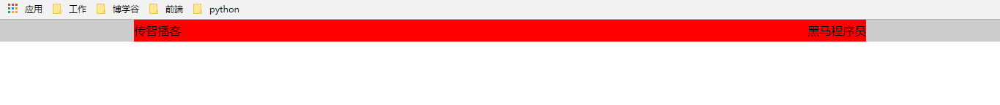

# 二十一、清除浮动

**注意：**

只要有浮动， 那么必须有清除浮动。

**为什么要清除浮动？**

-   因为经过浮动了元素 ，它会影响到它下面的元素的排版布局。

-   还有浮动元素的父元素没有将浮动元素包裹着。

**只要清除了浮动**， 不会影响到浮动元素的下面进行排版布局， 浮动元素的父元素会将浮动元素从视觉上包裹着


**清除浮动有以下四种方法：**

-   给浮动元素的**父元素**设置一个**固定的高度**


-   使用清除浮动的样式属性` clear ` 。clear这个属性是专用于来清除浮动的 ，这个属性有三个值 
    -   clear:left;  清除左浮动
    -   clear:right; 清除右浮动
    -   clear:both; 两者都清除 

> 这个属性一般是用在最后一个浮动元素的下面新建一个空白的div ，这个div什么都不要放 ，不要给这个div里面放置内容， 它只做一件事件就是清除浮动


-   使用`overflow:hidden `这个属性来清除浮动， overflow是一个属性

> overflow:hidden 它原意是用来将溢出的部分进行隐藏， 但是它还可以用于清除浮动


> **overflow:hidden** 它一般主要是用来将列表的浮动给清除。 overflow:hidden这个方法是给浮动元素的父元素来设置！


-   使用**伪元素**来清除浮动


**注意：**

什么时候需要清除浮动，我们的宗旨 ：凡是浮动了元素它影响到下面的元素进行排版的 ，就需要清除。

# 二十二、盒子模型

CSS它把HTML的每一个标签都看作为一个盒子

标签里面可以存放内容\-\--标签、文本、图片........

在一个网页中其实就是由一个一个的盒子组成！

**什么是盒子？**

盒子是用来存储物品

**思考一下：**一个盒子是由哪些部分进行组成！

我们可以将一个盒子理解为一个快递的包裹：

有内容+有填充物+纸盒子

那我们如何去理解CSS中的盒子呢？


在CSS中一个盒子的组成部分：内容(content)+内填充(padding)+边框(border)+外边距(margin)

一个盒子中的主要属性：width、height、padding、border、margin

**width：**指"宽度"的意思 但是这里的宽度指的盒子里面的内容的宽度 而不是盒子的宽度

**hegiht：**指"高度"的意思 但是这里的高度指的盒子里面的内容的高度 而不是盒子的高度

**padding：**是"内填充"的意思，指的盒子里面的内容到盒子边框的距离

**border：**是"外边框"的意思 指的盒子的边框

**margin：**是"外边距"的意思 指的是盒子与盒子之间的间距


问：请回答如何计算一个盒子的总宽度？

**一个盒子的总宽度**=盒子里面内容的宽度+左右两边的填充+左右两边的边框线

**一个盒子的总高度**=盒子里面内容的高度+上下两边的填充+上下两边的边框线

**注意：**一个盒子的高度一般情况下是不用设置的，因为一个盒子的高度它应该是由其内容来决定的。

为什么要去计算盒子的宽度？ 为了排版


# 二十三、padding

padding是"内填充"的意思 指的是盒子中间的内容到边框的这一段距离

方法有两种：第一种我们称之为**全写属性**，第二种我们称之为**简写属性**

padding是有4个方向的 所以我们能够分别的描述这4个方向的padding

## 全写属性

padding-top：上内填充

padding-right：右内填充

padding-bottom：下内填充

padding-left：左内填充

## 简写属性

-   **padding**：这个属性是有方向的 可以同时表示四个方向。 这个属性的方向是有顺序的 ，顺序是顺时针方向， 也就是：上、右、下、左 这个顺序

-   padding:10px 20px 30px 40px; /\*表示上10 右20 下30 左40\*/

-   padding: 10px 20px 30px; 表示上10 左右是20 下30

-   padding: 10px 20px; 表示上下10 左右20

-   padding: 10px; 表示上右下左四个方向的内填充都是10

如果说单独设置某一个方向的内填充 ，这个时候我们需要使用到全写属性 ；如果说要同时设置四个方向的内填充 就建议使用简写属性！


# 二十四、margin

margin它表示"外边距"的意思 **它是指盒子与盒子之间的距离 **

margin它也是有4个方向的 所以我们也能够通过4个方向对其进行描述

方法有两种：第一种我们称之为全写属性，第二种我们称之为简写属性

## 全写属性

margin-top：上外边距

margin-right：右外边距

margin-bottom：下外边距

margin-left：左外边距

## 简写属性

-   margin：简写属性它是有方向的 ，这里的方向是一个顺时针的方向， 它的方向是的顺序是：上、右、下、左

-   margin:10px;  表示上右下左这四个方向的外边距都是10像素。

-   margin:10px 20px; 表示上下这两个方向的外边距为10像素 ，左右两个方向的外边距为20像素

-   margin:10px 20px 30px;  表示上外边距为10像素 ，左右外边距为20像素 下外边距为30像素

-   margin:10px 20px 30px 40p;  表示上外边距为10像素， 右外边距为20像素 ，下外边距为30像素 ，左外边距为40像素

> 
>
> 什么情况下使用margin使用情况下使用padding
>
> 盒子里面的内容到边框的距离 padding
>
> 盒子与盒子之间的距离就使用 margin

# 二十五、margin的注意事项

## margin合并现象

**什么是margin的合并现象**

> 1、在标准的文档流中， 垂直方向的元素的margin值会合并 ，它会取较大的值。
>
> 
>
> 2、水平方向是没有margin的合并现象
>
> 
>
> 3、浮动元素垂直方向的盒子它是没有margin合并现象
>
> 

## margin居中

margin的值可以是auto auto表示"自动"的意思。 当左外边距与右外边距的值都是auto时，当前的这个盒子会在其父元素中水平居中。


**注意：**

-   使用margin来实现水平居中时， 一定要有固定的宽度(给这个盒子设置一个宽度) 。只有块元素可以实现水平居中， 行内元素是不能实现居中的。

-   只有标准文档流中的盒子才可以使用margin来实现水平居中。

-   margin属性是用来实现盒子的水平居中， 而不是文本的水平居中。

-  **text-align**这个属性它是用于实现文本的水平方向对齐方式 ，如果其值为center就表示文本水平居中， 但是它不能实现盒子的水平居中

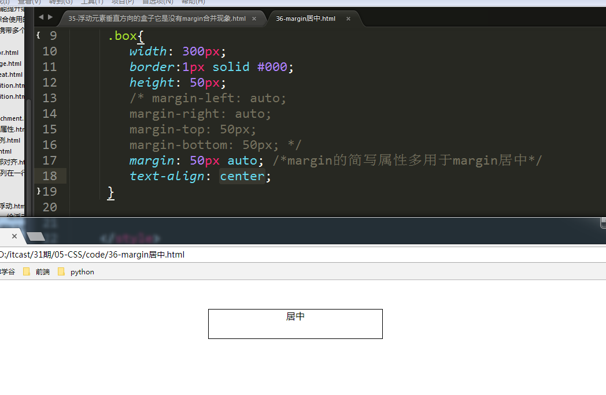

## margin塌陷现象


第一种方法：给其父元素设置一个边框线


第二种：给其父元素设置overflow:hidden这个属性也可以实现


第三种方法：给其父元素设置一个padding-top来实现


**注意：**

margin属性是用于描述兄弟与兄弟之间的关系 ，而不是用于描述父子之间的关系。

如果是父子关系， 要善于使用父元素的padding ，而不是使用子元素的margin！


**如何保证一个盒子高度或者是宽度不变？**

假设一个盒子的总高度是500，本身已经设置了height属性为500，但是突然又设置100个像素 的上内填充 ，这个时候为了保证盒子的高度不变 ，就要减少内容的高度

反过来说， 如果盒子的内容的变高导致整个盒子变高了 ，就要减内填充。


# 二十六、关于HTML标签的默认样式

因为有一些HTML标签是有默认的样式的 ，有一些内填充与外边距 ，这些样式它会影响到我们使用CSS来布局网页！所以我们需要将这些标签的内填充与外边距的值都要设置为0

**设置的方法有两种：**

1，`*{margin:0;padding:0;} `将所有的标签的内填充与外边距都设置为0 

2，找到对应的标签将这些标签的内填充与外边距设置为0 ，我不知道哪些标签有默认的样式。可以借鉴其它的CSS代码

```css
body,dd,dl,fieldset,form,h1,h2,h3,h4,h5,h6,input,legend,ol,p,select,td,textarea,th,ul{margin:0;padding:0}
```

如果在CSS中的属性的值是数值型数据时候需要加单位

如果值为0 ，可以不用加px


# 二十七、border

border：它是"边框"的意思

**border-width**

**border-color**

**border-style**

边框有三个要素：粗细、线型、颜色


**语法格式：**

```css
border：粗细 线型 颜色;
```

说明：

边框的颜色可以省略不写， 但是如果不写的话就表示边框的颜色为黑色， 其它的两个属性值不能不写 ，如果不写的话就会不显示边框。

**边框的线型：** 


**其实边框也是有四个方向的：**

border-top:上边框
border-right:右边框

border-bottom:下边框

border-left:左边框

border-top-color 颜色

border-top-width 粗细

border-top-style 线型


# 二十八、display

display 它是"显示"的意思，它就是用来将行内元素与块级元素之间的相互转换！将隐藏的元素显示或者是将显示的元素进行隐藏。它主要是给JavaScript来使用。

**display 属性取值**：inline(行内)、block(块级)、none(无)、inline-block(行内块)

**如何将一个行内元素转换为块级元素呢？**

将display这个属性的值设置为block 这个行内元素就会强制的转换为了块级元素。转换为块级元素后，当前的行内元素就会拥有块级元素的特点。

当我们将一个行内元素的display属性的值设置为block以后， 那么这个元素就会被转换为块级元素。


**如何将一个块级元素转换为行内元素呢？**

将display这个属性的值设置为inline 这个块级元素就会强制的转换为了行内元素。转换为行内元素后，当前的块级元素就会拥有行内元素的特点。

将我们将一个块级元素的display属性的值设置为inline以后 这个元素就会从块级元素转换为行内元素。


**注意：**

-   如果说将行内元素转换为了块级元素，那么这个元素它就会拥有块级元素的特点

-   如果说将块级元素转换为了行内元素，那么这个元素它就会拥有行内元素的特点。

将一个显示的元素隐藏、将一个隐藏的元素显示。

```
display:none(将一个显示的元素进行隐藏)
display:block(将一个隐藏的元素显示出来)
```


# 二十九、position

position 在英文中表示"位置"的意思， 它主要是用于实现对元素的定位

**在CSS中定位分为三种：**

position:fixed 固定定位

position:relative 相对定位

position:absolute 绝对定位

**注意：**

在使用定位属性时，一定要配合定位的坐标来使用！

**left：**表示定位的元素离左边多远

**right：**表示定位的元素离右边多远

**top：**表示定位的元素离上边多远

**bottom：**表示定位的元素离下边多远


## 固定定位

**语法：**

```css
position:fixed;
```

**固定定位，**它是相对于浏览器窗口来进行定位。不管页面如何滚动，固定定位元素显示的位置不会改变！


**特点：**

-   固定定位元素它脱离了标准文档流

-   固定定位元素的的层级比标准文档流里面的元素要高 ，所以固定定位元素它会压盖住标准文档流里面的元素

-   固定定位元素它不再占用空间

-   固定定位元素它显示的位置不会随着浏览器滚动而滚动

**案例1：使用固定定位来实现返回顶部的按钮**


**案例2：使用固定定位来实现顶部的导航栏**

```html
<!DOCTYPE html>
<html lang="en">
<head>
	<meta charset="UTF-8">
	<title>Document</title>
	<style type="text/css">
		*{
			margin: 0;
			padding: 0;
		}
		li{
			list-style-type: none;
		}

		.box{
			width: 100%;
			height: 58px;
			background-color: #222;
			/*固定定位*/
			position: fixed;
			left: 0px;
			top: 0px;
		}
		.inner_c{
			width: 1100px;
			height: 58px;
			line-height: 58px;
			margin: 0px auto;
		}
		.floatL{
			float: left;
		}
		
		.floatL ul li{
			float: left;
			width: 160px;
			text-align: center;
		}
		.floatR{
			float: right;
			color: #9d9d9d;
		}
		a{
			text-decoration: none;
			color: #9d9d9d;
			display: block;
			width: 160px;
			height: 58px;

		}
		a:hover{
			color: #fff;
		}

		body{
			padding-top: 58px;
		}
	</style>
</head>
<body>
	<div class="box">
		<div class="inner_c">
			<div class="floatL">
				<ul>
					<li><a href="#">bootstrap中文网</a></li>
					<li><a href="#">bootstrap中文网</a></li>
					<li><a href="#">bootstrap中文网</a></li>
					<li><a href="#">bootstrap中文网</a></li>
					<li><a href="#">bootstrap中文网</a></li>
					<li><a href="#">bootstrap中文网</a></li>
				</ul>

			</div>
			<div class="floatR">关于</div>


		</div>
	</div>
	
</body>
</html>
```


## 相对定位

**语法：**

```css
position:relative;
```

相对定位它是相对于"原来的自己"来进行定位！

**特点：**

-   相对定位元素它没有脱离标准文档流

-   相对定位元素如果没有设置定位的坐标，那么相对定位元素它还在原来的位置

-   相对定位元素设置了定位的坐标以后，那么它会在老家留下一个坑

-   相对定位元素它的层级比标准文档流中的元素要高 所以会将标准文档流里面的元素压盖住

-   相对定位元素的定位坐标值可以是负数

**注意：**

相对定位元素它会在老家留下一个坑，所以一般情况下它很少单独使用，相对定位元素它主要是用来配合"绝对定位"元素来使用的。


## 绝对定位

**语法：**

```css
position:absolute;
```

**什么是绝对定位？**

绝对定位元素是相对于"祖先定位元素"来进行定位！

**什么是祖先定位元素？**

绝对定位元素它会先去判断其父元素是否设置了定位的属性， 如果有设置定位的属性 ，那么它就会相对于其父元素来进行定位；但是如果它的父元素没有设置定位属性， 那么它就会去查找其父元素的上一级元素是否设置了定位的属性，如果有设置就相对于其父元素的上一级元素进行定位， 但是如果没有设置， 那么会继续往向一级进行查找，如果其祖先元素都没有设置定位属性，那么它会相对于"浏览器窗口"来进行定位！

**子绝父相**：子元素设置绝对定位，其父元素设置相对定位。

子绝父绝、子绝父固都可以。但是一般我们只会使用子绝父相。


**问题：**

如果当前元素的父元素与其爷爷元素都设置了相对定位，那么请回答当前的绝对定位元素它会相对于"谁"来进行定位？

答：当前的绝对定位元素它会相对于其父元素来进行定位，也就是说当绝对定位元素查找到了其祖先元素已经设置了定位的属性就**不会再去查找上一级元素**。

**特点：**

-   绝对定位元素它脱离了标准文档流

-   绝对定位元素它不再占用空间

-   绝对定位元素它会压盖住标准文档流中的元素

-   绝对定位元素它会相对于其"祖先定位元素"来进行定位，这里的祖先定位元素可以是相对定位，也可以是固定定位，还可以是绝对定位。 但是我们一般只会给其实祖先定位元素设置相对定位属性。"子绝父相"子元素设置绝对定位父元素设置相对定位

```html
<!DOCTYPE html>
<html lang="en">
<head>
	<meta charset="UTF-8">
	<title>Document</title>
	<style type="text/css">
		*{margin: 0;padding:0;}
		.box{
			width: 600px;
			border:1px solid #000;
			margin:100px auto;
			position: relative;
		}
		.div1{
			width: 100px;
			height: 100px;
			background-color: #f00;
		}

		.div2{
			width: 100px;
			height: 100px;
			background-color: #0f0;
			/*绝对定位
			它是相对于其祖先定位元素来进行定位的  它先会去判断其父元素是否有设置定位的属性 如果有相对于其父元素来进行定位  如果没有就查找其父元素的上一级元素   然后依次查找  如果它的祖先元素都没有定位  最后它会找到body标签来进行定位 
			*/
			position: absolute;  
			left: -50px;
			top: -50px;
					
		}
		.div3{
			width: 100px;
			height: 100px;
			background-color: #00f;
		}
		.yeye{
			width: 900px;
			border:1px solid #000;
			
			margin: 100px auto;
			position: relative;
		}
	</style>
</head>
<body>
	<div class="yeye">
		<div class="box">
			<div class="div1"></div>
			<div class="div2"></div>
			<div class="div3"></div>
		</div>
	</div>
	
</body>
</html>
```


**案例二：使用绝对定位来实现京东网的焦点轮播图的效果**

```html
<!DOCTYPE html>
<html lang="en">
<head>
	<meta charset="UTF-8">
	<title>Document</title>
	<style type="text/css">
		*{
			margin:0px;padding:0px;
		}
		.jd{
			width: 790px;
			height: 340px;
			margin:100px auto;
			/*相对 定位*/
			position: relative;
		}
		li{
			list-style-type: none;
		}
		
		a{
			text-decoration: none;
			/*将行内元素转换为块元素*/
			display: block;
			height: 40px;
			width: 30px;
			line-height: 40px;
			text-align: center;
			background-color: rgba(0,0,0,0.3);
			color: #fff;
			font-weight: bold;
			/*绝对定位*/
			position: absolute;
			top: 44%;
			font-size: 24px;
			/*将a标签隐藏 */
			display: none;
		}
		.left{
			left: 0;
		}
		.right{
			right:0;
		}
		
		/*当鼠标放在jd这个div上面时 要让a标签显示出来*/
		.jd:hover a{
			/*如何将一个隐藏的元素显示出来  也是使用提display属性  但是值是block     */
			display: block;
		}

		a:hover{
			background-color: rgba(0,0,0,0.6);
		}


	</style>
</head>
<body>
	<div class="jd">
		<div class="img">
			<ul>
				<li></li>
			</ul>
		</div>
		<a href="#" class="left"><</a>
		<a href="#" class="right">></a>
	</div>
</body>
</html>
```


### 绝对定位的盒子居中

绝对定位之后，所有标准流的规则，都不适用了。所以`margin:0 auto;`失效。

> width: 600px;
>
> height: 60px;
>
> **position: absolute;**
>
> **left: 50%;**
>
> top: 0;
> **margin-left: -300px; → 宽度的一半并且是负数**


```html
<!DOCTYPE html>
<html lang="en">
<head>
	<meta charset="UTF-8">
	<title>Document</title>
	<style type="text/css">
		*{
			margin:0px;padding:0px;
		}
		.jd{
			width: 790px;
			height: 340px;
			margin:100px auto;
			/*相对 定位*/
			position: relative;
		}
		li{
			list-style-type: none;
		}
		
		a{
			text-decoration: none;
			/*将行内元素转换为块元素*/
			display: block;
			height: 40px;
			width: 30px;
			line-height: 40px;
			text-align: center;
			background-color: rgba(0,0,0,0.3);
			color: #fff;
			font-weight: bold;
			/*绝对定位*/
			position: absolute;
			top: 44%;
			font-size: 24px;
			/*将a标签隐藏 */
			display: none;
		}
		.left{
			left: 0;
		}
		.right{
			right:0;
		}
		
		/*当鼠标放在jd这个div上面时 要让a标签显示出来*/
		.jd:hover a{
			/*如何将一个隐藏的元素显示出来  也是使用提display属性  但是值是block     */
			display: block;
		}

		a:hover{
			background-color: rgba(0,0,0,0.6);
		}

		.focus{
			width: 120px;
			height: 12px;
			position: absolute;
			left: 50%;
			bottom: 20px;
			margin-left: -60px;
		}
		.focus li{
			width: 12px;
			height: 12px;
			background-color: #f00;
			border-radius: 50%;
			float: left;
			margin-right: 15px;
		}

		.focus li.last{
			margin-right: 0px;
		}

	</style>
</head>
<body>
	<div class="jd">
		<div class="img">
			<ul>
				<li></li>
			</ul>
		</div>
		<a href="#" class="left"><</a>
		<a href="#" class="right">></a>
		<div class="focus">
			<ol>
				<li></li>
				<li></li>
				<li></li>
				<li></li>
				<li class="last"></li>
			</ol>
		</div>
	</div>
</body>
</html>
```


# 三十、z-index属性

-   z-index表示谁压盖着谁，数值大的会压盖住数值小的

-   只有定位的元素才有z-index值 。只有设置了固定定位、相对定位、绝对定位了的元素它们才会拥有z-index

-   z-index的值是没有单位的。 值是一个正整数 。默认的z-index的值是0

-   如果多个定位元素没有设置z-index属性 或者z-index值设置一样 ，那么写在HTML后面的定位元素就会压盖住前面的定位元素

    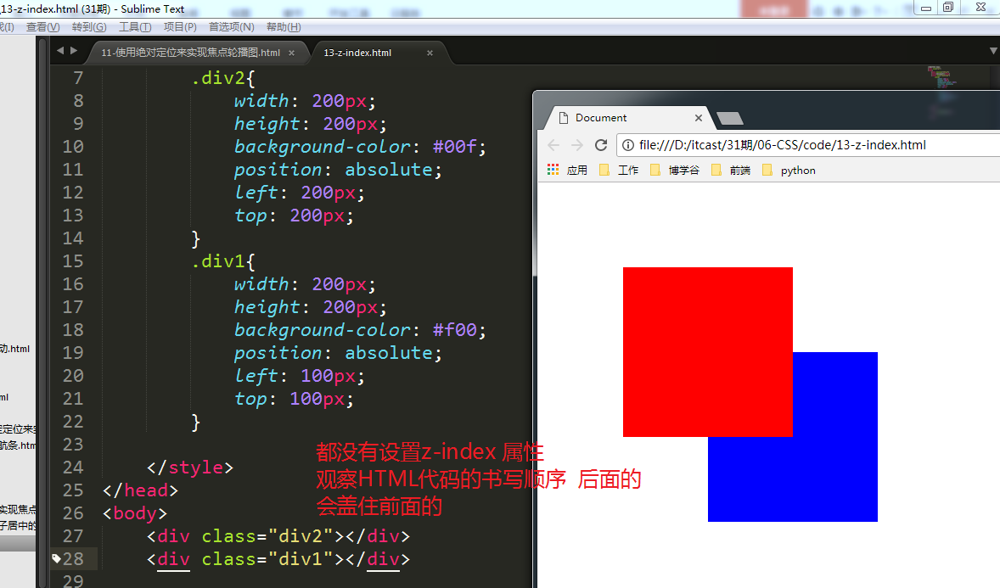

    ```html
    <!DOCTYPE html>
    <html lang="en">
    <head>
    	<meta charset="UTF-8">
    	<title>Document</title>
    	<style type="text/css">
    		*{
    			margin: 0;
    			padding: 0;
    		}
    		li{
    			list-style-type: none;
    		}
    
    		.box{
    			width: 100%;
    			height: 58px;
    			background-color: #222;
    			/*固定定位*/
    			position: fixed;
    			left: 0px;
    			top: 0px;
    			z-index: 99999999;
    		}
    		.inner_c{
    			width: 1100px;
    			height: 58px;
    			line-height: 58px;
    			margin: 0px auto;
    		}
    		.floatL{
    			float: left;
    		}
    		
    		.floatL ul li{
    			float: left;
    			width: 160px;
    			text-align: center;
    		}
    		.floatR{
    			float: right;
    			color: #9d9d9d;
    		}
    		a{
    			text-decoration: none;
    			color: #9d9d9d;
    			display: block;
    			width: 160px;
    			height: 58px;
    
    		}
    		a:hover{
    			color: #fff;
    		}
    
    		body{
    			padding-top: 58px;
    		}
    		p{
    			width: 100px;
    			height: 100px;
    			background-color: #f00;
    			position: relative; /*相对定位*/
    		}
    	</style>
    </head>
    <body>
    	<div class="box">
    		<div class="inner_c">
    			<div class="floatL">
    				<ul>
    					<li><a href="#">bootstrap中文网</a></li>
    					<li><a href="#">bootstrap中文网</a></li>
    					<li><a href="#">bootstrap中文网</a></li>
    					<li><a href="#">bootstrap中文网</a></li>
    					<li><a href="#">bootstrap中文网</a></li>
    					<li><a href="#">bootstrap中文网</a></li>
    				</ul>
    
    			</div>
    			<div class="floatR">关于</div>
    
    
    		</div>
    	</div>
    	<p></p>
    	
    	
    </body>
    </html>
    ```

    

* 如果父元素怂了  那么子元素再牛逼都没有用

  ```html
  <!DOCTYPE html>
  <html lang="en">
  <head>
  	<meta charset="UTF-8">
  	<title>Document</title>
  	<style type="text/css">
  		.box{
  			width: 200px;
  			height: 200px;
  			background-color: #f00;
  			position: relative;
  			z-index: 999;
  		}
  		.box1{
  			width: 200px;
  			height: 200px;
  			background-color: #00f;
  			position: relative;
  			z-index: 2;
  		}
  		.son{
  			width: 100px;
  			height: 100px;
  			background-color: pink;
  			position: absolute;
  			left: 300px;
  			top: 400px;
  			z-index: 2;
  		}
  
  		.son1{
  			width: 100px;
  			height: 100px;
  			background-color: skyblue;
  			position: absolute;
  			left: 350px;
  			top: 250px;
  			z-index: 99999;
  		}
  
  	</style>
  </head>
  <body>
  	<div class="box">
  		<div class="son"></div>
  	</div>
  
  	<div class="box1">
  		<div class="son1"></div>
  	</div>
  </body>
  </html>
  ```


  


# 三十一、CSS 3

## CSS3与CSS2之间的区别

**css3**=css2+新语法+新的属性

就是对css2进行扩充 删减 优化

## 结构伪类

| **选择器**                                       | **功能**                        |
| ------------------------------------------------ | ------------------------------- |
| **E:first-child**                                | 匹配第一个孩子                  |
| **E:last-child**                                 | 匹配最后一个孩子                |
| **E:nth-child(n)**                               | 匹配第n个孩子                   |
| **E:nth-child(2n)**   或   **E:nth-child(even)** | 匹配偶数的孩子  如：2、4、6…..  |
| **E:nth-child(2n+1)**   **E:nth-child(odd)**     | 匹配奇数的孩子  如：1、3、5…..  |
| **E:only-child**                                 | 匹配有且只有一个孩子 (独生子女) |
| **E:nth-last-child(n)**                          | 匹配第几个孩子，倒着计算        |

```html
<!DOCTYPE html>
<html lang="en">
<head>
	<meta charset="UTF-8">
	<title>Document</title>
	<style type="text/css">

		ul{
			width: 600px;
			list-style: none;
			margin: 100px auto;
		}
		li{
			width: 80px;
			height: 80px;
			text-align: center;
			line-height: 80px;
			border:1px solid #000;
			float: left;
			margin: 0px -1px -1px 0px;
		}

		/* li:first-child{
			background-color: #f00;
		} */

		/* li:last-child{
			background-color: #f00;
		} */
		/* li:nth-last-child(3){
			background-color: #f00;
		} */

		li:nth-child(7n){
			background-color: #f00;
		}

		li:only-child{
			background-color: purple;s
		}

	</style>
</head>
<body>
	<ul>
		<li>1</li>
		<li>2</li>
		<li>3</li>
		<li>4</li>
		<li>5</li>
	</ul>
	
	<ul>
		<li>独生子女</li>
	</ul>

</body>
</html>
```


## border-collapse

这个属性主要是用于来合并表格的边框线， 其值为：`collapse`

```css
border-collapse:collapse;
```


## 伪元素

| **选择器**        | **功能**                           |
| ----------------- | ---------------------------------- |
| **:first-letter** | 操作当前元素中第一个字             |
| **:first-line**   | 操作当前元素中第一行文字           |
| **::before**      | 在之前插入，在一个盒子内部的最前面 |
| **::after**       | 在之后插入，在一个盒子内部的最后面 |


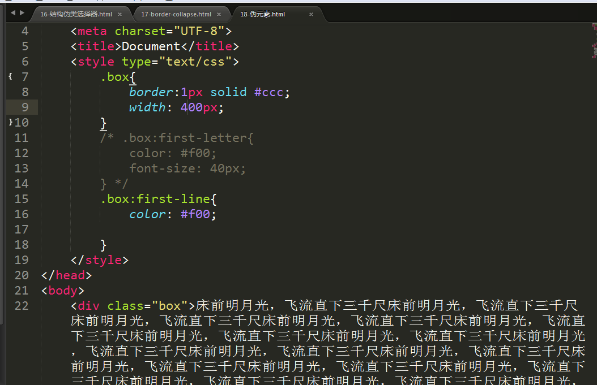

 


## 文本阴影

```css
text-shadow:水平阴影 垂直阴影 模糊距离 阴影颜色
```


**描述：**

-   文字阴影可以有多组值，多组之间用逗号隔开就可以

-   水平阴影正值，阴影在右边， 负值在左边

-   垂直阴影正值，阴影在下边，负值在阴影上边

-   模糊距离，值越大越模糊


## 盒子阴影

```css
box-shadow:水平方向阴影 垂直方向阴影 模糊距离 阴影尺寸 阴影颜色 内/外阴
```

水平阴影和垂直阴影必须的写，其余的是可以省略不写;


-   盒子阴影可以有多组值，多组之间用逗号隔开就可以

-   水平阴影正值阴影在右边 ，负值在左边

-   垂直阴影正值在下边，负值在上边

-   模糊尺寸，值越大越模糊


## 圆角边框

```css
border-radius:左上 右上 右下 左下;
```

如果说border-radius的四个值都是一样的话，就可以只需要写一个参数就可以了。


## CSS透明度

只要是颜色，都可以用透明度

```css
rgba(红色,绿色,蓝色,透明度)
```

**a**：表示透明度的意思 。透明度取值：0\~1之间 。0表示完全透明 ，1表示不透明

-   背景颜色透明

    ```css
    Background-color:rgba(255,255,255,0.3)
    ```

-   文本颜色透明

    ```css
     Color:rgba(255,255,255,0.3)
    ```

-   边框颜色透明

    ```css
    Border:1px solid rgba(255,255,255,0.5)
    ```

想给图片设置透明度


