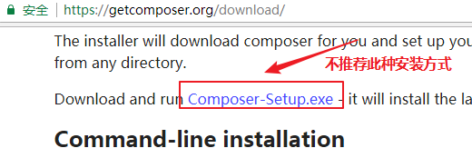
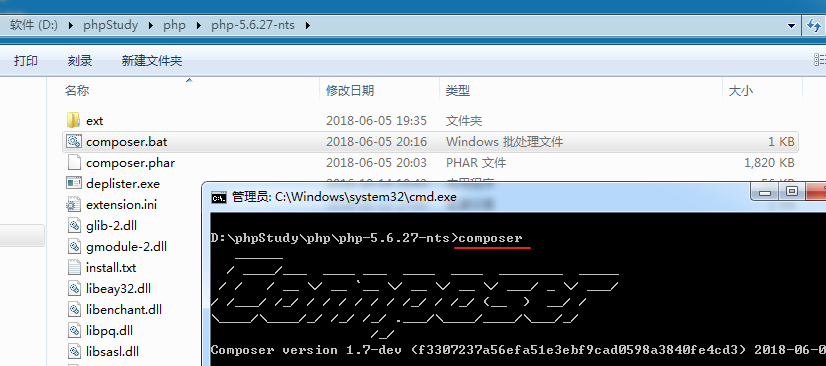
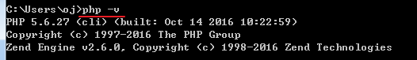
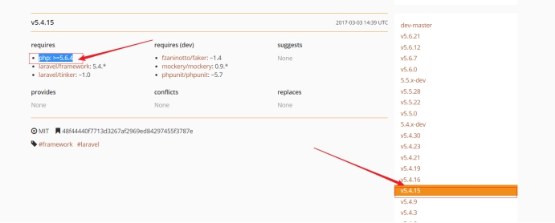
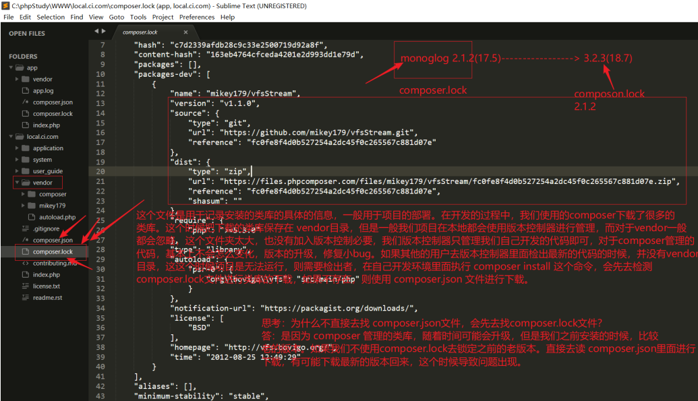
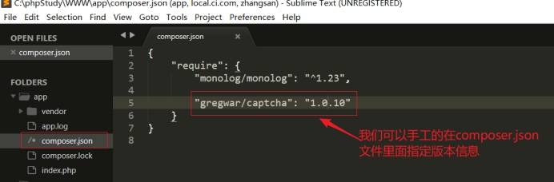

# Composer

## 前言

 

当我们在做项目开发的时候，我们不可避免的需要进行一些`通用性`的功能，例如文件上传、缩略图的处理、二维码生成等等；当遇到这些需求后我们可以自己进行代码编写，函数封装、类库封装等操作，然后形成自己的代码库，以便下一次使用，但是自己写出来的代码毕竟经受的检验较少，所以我们一般会去网上搜寻相关的类库进行使用（便捷性），但是如果是在网上搜索的代码安全性和健壮性又很难得到保障，则这个时候有个我们迫切的需要一个类似nodejs里面的npm、python里面的pip、java里面的maven、linux下yum、apt-get等这样的包管理器，可以帮我们去管理这些类库，让开发者专门于业务的开发。哪里有需求，则哪里就有活雷锋，这个时候PHP的类库管理工具composer横空出生了！

 例如：我们现在学习laravel框架

```
> composer create-project laravel/laravel=5.2.* local.laravel52.com
```

例如：我们现在学习日志类

```
> composer  require monolog/monolog 
```


当我们使用composer管理的这些类库的时候，这些类库都遵循PHP-FIG这个组织制定的一些列的规范，所以在正式需要composer之前，我们的先了解一下这些规范(PSR : php 标准推荐)。

 

## psr规范简介

**php-fig**组织：主要是为了多个开源产品之间的一个互通问题。所以有一些开发者资源的组织起来来规范了PHP代码书写的标准，形成的标准规范被称为PSR规范。注意，该规范里面定义了很多的标准，例如：

 

psr-1：代码基本规范，规范代码基本书写风格

psr-2：对psr-1该版本的补充，增强

psr-3：对日志类库进行规范 ，例如常见的 monolog类库（定义好日志类的 interface）

psr-4：类库的自动加载机制，命名空间需要和类库的目录结构一致

 

**参考文档：**

http://psr.phphub.org/

<http://www.cnblogs.com/52php/p/5852572.html>


## Composer简介

今天学习的知识点是PHP里面的类库管理，在正式讲解该知识点的时候，我们回顾这样一些这样的场景，当我们在Windows上装一些软件的时候，在iPhone手机或者安卓上装APP的时候，我们会怎么做呢？

 

我们习惯于去软件管家商店进行下载APP store，例如常见的QQ软件管家，360软件管家，同样的问题也是会在PHP开发里面出现，例如我们的项目需要使用验证码、做文件上传、还有微信开发的类库，则我们该如何处理这些类库呢？

答： 百度查询…

 


在互联网上存在一个[PHP的应用商店](https://packagist.org/)，提供了PHP开发过程中常见的类库（需要遵循psr规范）。但是该网站只是提供一个类库对应的描述信息，以及下载地址。最终的类库文件的源码还是存在**GitHub代码托管**平台上的。该商店只是提供了对应的链接，下载的时候还是去GitHub上面进行下载。

 

 

 

那么我们使用什么样的工具去下载PHP应用商店里面的类库信息呢?

答：使用**composer软件**即可。


Composer 是 PHP 的一个包==依赖管理工具== ， 不是一个包管理器。 能够帮助我们安装我们项目所需要的依赖包。

除了解决文件依赖的关系，它还有更多的**优点**：

* 下载网络上别人分享的优秀的类库（包）。
* 可对下载的类库进行管理，如：删除、更新等众多便利的操作。


其实composer也就类似与Linux中yum，前端中的npm、bower等操作。这些工具都是可以用来管理我们项目的依赖文件。


**Composer 官网**：<https://getcomposer.org/>

**Composer 包地址**：https://packagist.org/

**国内网站**：<http://www.phpcomposer.com/>

 

## 为什么要学习Composer呢？

1. 不用重复造轮子（把被人的上传类库拿过来直接使用，不要自己编写）
2. 不用过分的关心某个功能的底层，只需要会看文档即可
3. 解决类库的依赖问题（例如某个项目需要使用其他的产品，则会自动的解决）
4. ..............

 

## 如何使用Composer呢？

### 安装

**安装方式一般有两种方式：**

* 第一种方式：

  去composer官网( https://getcomposer.org/download/ )下载`Composer-setup.exe`进行在线安装，由于此软件安装需要联网且服务器在国外安装很难成功，所以这里推荐使用下面第二种方式进行安装。

  

* \[**==推荐==**\]第二种方式

  去官网https://getcomposer.org/download 下载`composer.phar`文件。

  

  找到并进入 PHP 的安装目录,将下载的`composer.phar` 复制到 ==PHP 的安装目录==下面，也就是和 php.exe 在同一级目录。

  

  在 PHP 安装目录（如，`D:\phpStudy\php\php-5.6.27-nts`）下新建一个` composer.bat `文件，并将下列代码保存到此文件中。

  ```basic
  @php "%~dp0composer.phar" %*
  ```

  至此composer的安装就完成。


### 测试

 进入对应php版本目录(`D:\phpStudy\php\php-5.6.27-nts`)中输入`composer`指令，出现如下提示代表安装成功：



  

  为了可以全局（任意位置）访问composer，可以把php.exe的所在目录（`D:\phpStudy\php\php-5.6.27-nts`）定义在环境变量path选项中。

  

  设置好后输入`php -v`  即可看到php版本号。

  

  cmd中任意位置输入`composer`指令：

  


通过上面的安装我们可以使用composer这个软件，没有任何问题，但是在使用过程，可能还需要去开启PHP的一些扩展。

1. php_curl扩展
2. php_openssl扩展
3. php_fileinfo扩展
4. php_mbstring扩展（多字节扩展库）

在成功开启后，使用 phpinfo函数进行测试。

 

### 为composer配置国内镜像

由于composer需要去网址为https://packagist.org 获取代码库地址，再通过地址去github上去下载代码到我们项目本地，由于这两个地址服务器都在国外，访问比较慢，也不稳定。


**镜像原理**

 

 

配置国内镜像：https://pkg.phpcomposer.com/

输入命令

其它源：

```
composer config -g repo.packagist composer https://packagist.laravel-china.org 
```


**全局配置**：

```
composer config -g repo.packagist composer https://packagist.phpcomposer.com
```


如上，参看composer配置命令，可查看composer配置保存的路径，全局的默认在当前用户文件夹下。


**局部配置**：若只想在当前项目中有效，把上面的命令去掉 -g 即可。

```
composer config  repo.packagist composer https://packagist.phpcomposer.com
```


# ==Composer常见命令使用==

在composer做类库的管理过程中，我们先需要去PHP的应用商品。去查看开发过程中需要的类库。然后使用composer进行下载。

 


 

## composer create-project 命令

该命令是用来安装项目的，可以通过该命令去下载对应的项目文件，例如 laravel框架。

```
> composer create-project   团队名称/包名称[=版本号] [指定下载目录]  [-vvv打印交互信息]
```

注意：在使用composer安装项目的过程中，我们可能需要做两件事

1. 指定安装的目录名称
2. 指定安装的版本，默认是安装最新的版本

**注意：** 如果不指定版本，则下载最新的版本，如果不指定安装目录，则会把框架下载到命令执行的文件夹下，以包名称创建一个目录。


注意：版本号需要根据packagist.org网站提供的版本进行指定

 


**示例：**

```
> composer create-project laravel/laravel=5.4.15  mylaravel
```

现在的意思是安装laravel5.4.15这个版本，并且把该包安装到 mylaravel文件夹下。

 

 

```
> composer create-project laravel/laravel 
```

当我们不指定版本信息，也不指定安装目录的时候，这样会在命令执行目录下安装一个最新的laravel产品，并且文件夹的名称为laravel。

 

## composer require 命令

该命令是用来安装项目开发中的依赖文件，例如上传类库、验证码类库。

 

```
composer require 厂商/包名[=版本号]
```

**注**：若不指定版本号默认安装最新版本


**示例**

如安装tp5验证码1.0.3 版本：

`composer require topthink/think-captcha=1.0.3`

如安装tp5验证码1.0的最高版本：

`composer require topthink/think-captcha=1.0.*`


## composer.json文件

该文件是用来记录composer管理的类库信息，以及项目的信息、作者、联系方式....


## composer.lock文件



主要是为了防止项目部署的时候，去下载最新的版本导致不兼容，在安装之后，需要把当前版本锁定起来。以后部署的时候，还是使用当时所锁定的版本，如果希望使用最新的版本，而不是锁定的版本，只需要删除该文件即可。

 

## composer install 命令


以后去公司之后，如果从git或者是svn上面检出了laravel项目，则第一步应该是先去项目的根目录下执行 **composer install** 去根据 composer.lock 或者composer.json 文件下载项目开发中的依赖信息。

  

**安装`composer.json`指定的依赖包**

```
composer install
```

会自动安装在composer.json文件中所指定的各种依赖包，执行成功后会**多处**生成一个composer.lock的锁文件。后面需要更新依赖库只能通过`composer update`实现安装。

`composer.json`文件说明：
https://docs.phpcomposer.com/01-basic-usage.html#composer.json-Project-Setup

`composer.json`文件架构详解：https://docs.phpcomposer.com/04-schema.html


## 在配置文件指定具体的版本

1. 指定版本

 

 

2. 使用命令进行安装

```
> composer install
```


删除composer.lock文件，重新执行 `composer install` 命令


安装后


 

## composer update-类库升级

如果我们在开发过程中，现在希望某个类库可以升级

 

 

1. 修改一个composer.json里面的信息

 

 

2. `composer update`进行更新

 


## 其它命令

* **查看所有的composer可以使用的命令**

  ```
  composer list
  ```


* **查看某个命令的使用**

  ```
  composer require --help
  ```

  

* **删除指定的包**

  ```
  composer remove topthink/think-captcha
  ```

  

* **搜索指定的包**

  ```
  composer search topthink/think-captcha
  ```

  

* **更新依赖包**

  ```
  composer update
  ```

  若修改`composer.json`中**require**指定的依赖包，则存在`composer.lock`文件，则只能通过

  `composer update`进行更新。


* **取消镜像**

  ```
  composer config -g --unset repos.packagist
  ```

  

* **查看当前composer版本**

  ```
  composer -v
  ```

  

* **升级composer版本**

  ```
  composer selfupdate
  ```

------


# 演示：项目下载

例如这里演示一下ci这个小框架的使用。

1. 在网站进行搜索ci框架

 

 

2. 使用`composer create-project` 进行安装

 

 

3. 查看

 

 

4. 启动一下


```
> php -S localhost:8080 -t . 
```
使用PHP开启一个调试服务器，使用的端口是8080 

`-t `代表是设置网站根目录

`. `代表将当前目录设置为网站根目录


5. 浏览器查看


# 演示：日志类库下载

**参考阅读**

[热门的包](https://packagist.org/explore/popular)

[Monolog 优化及打造 ELK 友好的日志格式](https://laravel-china.org/articles/3567/monolog-optimization-and-elk-friendly-log-format) 


这里演示monolog的使用。

1. 查看下载并monolog

 

 

2. 查看安装后的目录结构

 

3. 使用

 

一般来说类库的使用方式，需要查看文档。

 

 

# 版本号问题

**参阅文档：**

[版本语义化](https://semver.org/lang/zh-CN/)

[Composer 基本使用](https://docs.phpcomposer.com/01-basic-usage.html)

 

注意：在我们使用composer管理类库的时候，存在一些版本的配置信息。

 

 

```
^

~

*
```

具体的含义

 

 

 

如果只有两位版本号 x.y，则这个时候 ^ ~ 是代表一样的含义，就是代表 >x.y 但是小于 (x+1).0;

 

^1.2

~1.2

都是代表版本大于1.2 但是要小于 2.0;

 

但是如果版本号是 x.y.z 则这个时候，^ ~ 代表含义是不一样的

~1.2.3 代表含义 代表的大于bug修复版本，但是小于次版本号

^1.2.3 代表含义 代表大于当前版本，但是小于主版本号

 

 

 

# **相关资料**

[Composer是干嘛的，怎么用它](http://blog.csdn.net/think2me/article/details/38456931)

[Composer使用](https://www.cnblogs.com/52fhy/p/5246013.html)

[如何创建一个自己的【Composer/Packagist】包](https://segmentfault.com/n/1330000006227425)

[Laravel5学习笔记：Composer.json配置文件说明](http://blog.csdn.net/hel12he/article/details/46503875)

[动手开发自己的第一个 composer 包](https://www.cnblogs.com/zhangwei595806165/p/5814476.html)

[提交PHP组件到Packagist 发布自己的Composer包](http://www.jquerycn.cn/a_16976)


[**利用 Composer 完善自己的 PHP 框架**](https://lvwenhan.com/php/410.html)


[如何从 phpcomposer 的 Composer 镜像迁移到 Laravel China 维护的镜像？](https://laravel-china.org/wikis/16722)


