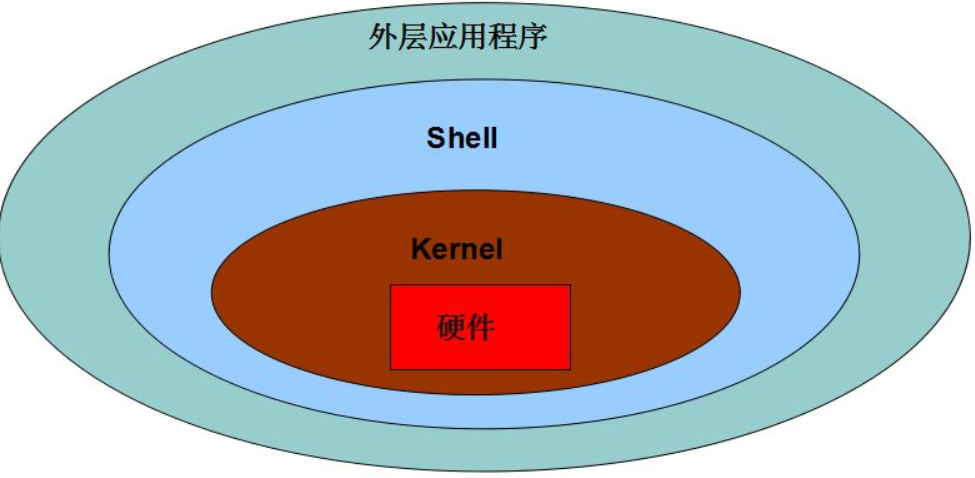

# linux发展历史

**wamp** 

**w**：windows

**a**：apache 

**m**：mysql数据库（Oracle 商业公司 ）   MariaDB（mysql分支 和mysql完全兼容）

**p**: PHP 有可能是Python


**lamp**：linux操作系统


**lnmp** ：

**l** ： linux操作系统 

**n**：Nginx web服务器（俄国人开发的， 解决互联网Web2.0 问题：C10k问题  ）

* <1. 硬件升级 2. 集群架构 LB集群 负载均衡集群 3. 优秀web软件>


==**注意：黄金搭档 慢慢的被取代了。PHP市场被分割的很厉害。**==

  1. Python web领域 爬虫（以前PHP里面的数据采集 dedecms系统 火车头采集系统 PHP第三方采集库）
  2. golang web领域（不是太成熟、很有远景）


## 常见操作系统简介

常见的操作系统，你知道的有哪些？

+ Windows 操作系统（傻瓜操作系统）：常见的有xp（国企 1. 买版权 2. 习惯操作 3. 内部系统）、Vista（安全 但很慢）、window7（成功）、window8（过渡的）、window10（成功）等，该桌面版操作系统非常适合大众使用；同时也有windows server服务器端的操作系统，适合运行服务（周期性的死机，闭源操作系统）。

+ Ubuntu操作系统：中文叫做乌班图，是一个非常成熟的linux桌面版，非常的绚丽，这个操作系统下去一定要多了解，很多的公司使用的是该操作系统。( window > mac > linux（Ubuntu天生适合做开发） )

+ MacOS 操作系统：苹果公司出的操作系统，需要使用苹果的硬件才可以使用，但是目前也可以在普通的PC上使用，俗称**黑苹果**。该操作系统天生适合做开发，一般被程序员和`设计师`钟爱。


+ RedHat操作系统：俗称红帽，该操作系统一般被企业使用，当我们听到红帽子5、红帽子6、红帽子7 的时候，代表的就是该操作系统，一般来说这个操作系统是需要收取服务费，一年最基本大概10w左右。

+ CentOS操作系统：该操作系统为社区版操作系统，适合在互联网企业，是完全免费的，但是这个操作系统没有提供服务支持，当遇到问题需要自己解决。并且该操作系统是完全基于红帽的，规则如下：centos5.5基于红帽子5； centos6.5 ，centos6.8 基于红帽子6等。


==注意==：现在能接触到的都是 **分时操作系统**。

* 即，**多任务**：同一时间可以运行多个任务（并行）。
* 以前的是 **批处理**：一次只能做一件事 串行

cpu 42亿次左右(1s)  1/60s-60个(单cpu 微观上还是串行) 宏观上并行。


==注意==：**实时操作系统**。如，独享 ucosii 导航系统（导弹）。


## linux发展史

参考【linux发展史】


1. centos 和 reahat是完全一样的
2. 都是类 Unix操作系统（为什么叫类Unix操作系统？遵循 postfix规范 到时候操作系统的目录结构是基本一样的、命令也是基本相同、管理方式也是基本相同....）


## linux含义

linux狭义：指李纳斯开发的linux内核部分（3% ），最基本的内核代码，操作系统的核心，只负责最基本的设备管理（1. 内存管理 2. 硬件控制...）


linux广义：指linux各个厂商基于linux内核研发的linux产品，例如红帽、Debian、Ubuntu等。我们常用的就是 Centos5 或者 Centos6 基于RedHat公司的产品进行开发。完全免费。


注意：目前这个内核代码版本是在 4.x左右。

http://kernel.org/


注意：虽说目前的最新的版本是4.x，但是在linux的发行版里面的使用的最多的还是**2.6.x**这个版本的内核。（因为从2.x之后的版本就不在由李纳斯本人开发维护，而是交给他的团队维护）。


## CentOS简介

CentOS（Community Enterprise Operating System：社区企业操作系统）是Linux发行版之一，它是来自于Red Hat Enterprise Linux依照开放源代码规定释出的源代码所编译而成。由于出自同样的源代码，因此有些要求高度稳定性的服务器以CentOS替代商业版的Red Hat Enterprise Linux使用。两者的不同，在于CentOS是完全免费的，而RedHat的使用需要收取服务费的。但是Centos目前也被RedHat收购了。

 

**其主要的特点如下：**

1、简单易用,安全性高,且支持图形操作界面,并且linux对硬件的要求是非常的低的。如果不安装图形化的界面，只要给一个128M都完成可以使用。（单片机 ARM 几M即可）

2、其安装步骤支持全图形操作，且有中文包补丁 

3、能够免费实现在线软件安装服务(yum包管理器) 

4、被誉为世界上最适合作为服务器的底层的Linux操作系统,其性能十分稳定 （web业务来说， 基本都是linux ，比如，Ubuntu server|desktop）

5、有32位和64位两种操作系统安装镜像 

6、多任务，多用户的操作系统。

 

**其主要的版本有：**

1、CentOS5.5

2、CentOS6.5

3、CentOS6.8

4、CentOS7.0 (区别还是很明显的：服务器管理方式不一样， 基本的命令也有一些不同)


5和6之间基本没有区别。

 

理论上会某个linux发行版，其他的linux操作系统全部都会。其他的发行版只是在linux的内核上加入一些自己的软件或者是软件管理器。


# CentOS安装

1. 下载操作系统镜像
2. 安装（1. 裸机   2. 虚拟机模拟一台电脑）
3. 购买阿里云的云服务


## 什么是虚拟机？

虚拟机实际上是一个虚拟PC的软件，它可以在现有的操作系统上虚拟出一个新的硬环境，相当于虚拟了一台新的计算机，从而实现了一台机器独立运行两个或者两个以上的操作系统。

虚拟机软件：Vmware、VirtulBox


## VMware软件安装

一般软件的安装方式，全程下一步即可。


## 虚拟电脑的创建

参考【虚拟电脑创建和centos操作系统的安装.doc】


## centos操作系统的安装

参考【虚拟电脑创建和centos操作系统的安装.doc】

 


# ==文件系统树==

在正式学习linux之前，我们有必要了解下linux的文件系统树，linux的这种树形结构是规定好了的，不允许随便更改。其实在windows下也存在文件系统树（是从盘符开始 c:/windows/a.txt）


在Windows里面是存在多个盘符，每个盘符下存在很多的文件和文件夹。但是这个东西如果是在linux下则不再成立，因为linux有自己的文件系统树。


linux下没有那么多的盘符，linux下只存在一个盘符，叫做 根目录 （`/`），根下存在很多的目录，但是对于linux这些目录都是事先规定好，基本所有的发行版都是一样。

```cmd
/（c:/）
├── bin
│   ├── bash
│   ├── ls
│   ├── mkdir
├── boot
│   └── vmlinuz-2.6.32-696.6.3.el6.x86_64
├── dev
│   ├── block
│   └── zero
├── etc
│   ├── yum.conf
│   └── yum.repos.d
├── home
│   └── asion
├── lib
│   ├── libnss_dns.so.2 -> libnss_dns-2.12.so
├── lib64
│   ├── device-mapper
│   ├── libxtables.so.4 -> /etc/alternatives/libxtables4.x86_64
├── lost+found
├── ls.txt
├── media
├── mnt
├── opt
├── patch
│   └── libiconv-glibc-2.16.patch
├── proc
│   ├── vmallocinfo
│   ├── vmstat
│   └── zoneinfo
├── root
│   └── day1
├── run
│   └── cloud-init
├── sbin
│   ├── shutdown
│   ├── wipefs
│   └── xfs_repair
├── selinux
├── srv
├── sys
│   └── power
├── tmp
│   ├── Aegis-<Guid(5A2C30A2-A87D-490A-9281-6765EDAD7CBA)>
│   └── test.pl
├── usr
│   ├── bin
│   ├── src
│   └── tmp -> ../var/tmp
├── var
    ├── bt_apacheVersion.pl
    ├── tmp
    └── yp
```


## bin目录

简介： **binary**  的简写， 主要存放linux下可以执行的==二进制命令==（如常见的ls），普通用户和超级管理员都可以使用的二进制命令。


## sbin目录

简介：**super bin**，超级管理员可以执行的==二进制命令==，普通用户不可以执行。


## home目录

简介：home ==用户的家目录==，每当在linux下创建一个登陆用户，就会在该目录下创建对应的文件，其用户可以在该目录下执行可读可写的操作。


## root目录

简介：==root 超级管理员的家目录==。


## etc 配置文件目录

简介：etc 该目录主要存放系统的==配置文件==信息，例如apache、mysql等服务的配置文件。


## usr目录

简介：usr 是**Unix software resource**的简写，表示Linux的==软件资源==目录主要是存放用户自定义安装软件的目录，lamp环境的 Apache MySQL php都会安装在这里，类型Windows下的Program Files。


## var目录

简介：var是**variable**单词的简写，代表是可变的，到时候该目录主要存放系统的日志，以及网站的根目录等等。


## Linux和Windows的区别（重要）

1. Linux没有盘符，windows拥有盘符；在linux下一切都是从 根目录(`/`)开始的。
2. Linux严格区分大小写，而windows不区分大小写，由于linux严格区分大小写，因此linux认为a.php和A.PHP是两个不同的文件，而在windows当中windows会认为这是2个相同的文件。
3. windows大部分的工作是通过图形操作界面就能够完成，linux大部分的工作是通过命令行来完成


# ==Shell==

## 简介

在linux使用的过程中，一般来说可以作为桌面系统进行使用，例如常见的Ubuntu操作系统，但是更多的是做为服务器进行使用。一般来说如果是在服务器模式下使用的话，这个时候是没有安装桌面的，这个时候我们就要一个人机交互的转换程序，这个工具一般被称为shell，也叫作cli（命令行接口）。现在由于我们是学习，所以安装了图像界面，在图形界面下，我们也是可以开启一个命令行终端的。除了常见的命令行shell，还有图形化的shell，一般简写为Gui，例如window操作系统。





## 常见的linux shell分类

常见的shell有==sh==、==bash== 、==csh==等，一般来说我们都是使用的bash，该shell解释器位于`/bin/bash`，是一个二进制的命令，可以帮我们去翻译用户的行为，并且在linux下是存在编程的，叫做shell编程。可以做linux下的自动备份，定时任务等(运维，现在来说一般也不错shell编程 。现在一般使用Python进行运维管理，实现自动化运维)。

现在云服务器太方便。（阿里云支持弹性升级）（BPG IDC机房 郊区）（1. 游戏公司 不可能买云服务器 I/O 虚拟化 2. 银行 3. 大型企业 平安银行 不用电脑记账 手工记账 打算盘 纸张抄）


**如何查看当前系统使用的shell呢？**

```shell
# echo $SHELL
```

 

**那么当前linux操作系统支持哪些shell呢？**

```powershell
# cat /etc/shells
```

 

**如何使用sh呢？**

```shell
# sh
```


**如何退出呢？** 

```shell
# exit
```


## 命令符解释器

当打开一个shell终端后，会出现一个光标在闪烁，被称为命令提示符：


**注意**：由于linux在服务器环境下，一般来说都是没有图形化的界面，都是通过命令行进行操作，所以必须要掌握好相关的命令。到时候可以在命令提示符下输入相关的命令，然后通过这些命令完成相关的任务。


## 命令格式讲解

```shell
# 命令  -选项  参数
```

**命令**：是linux系统提供的二进制的命令（`/bin`  `/sbin/`    `/usr/bin`），一般分为超级管理员命令和普通用户的命令，超级管理员没有权限限制。

**选项**：选项是用来修饰命令的。

**参数**：参数是命令作用的主体，命令在谁的身上产生效果。


例如ls是展示某个目录下的文件信息，但是如果需要展示全部的文件信息，可以加-a选项。

如果是要查看root家目录下的文件信息，则需要使用 

``` shell
# ls  -la 
# ls  -la  /root
```


## ls 列出文件命令


list： 列出目录里面的文件信息，在linux下有一个哲学，linux下一切皆文件，所以展示的既有文件，也包含文件夹。
``` shell
# ls
```

以详细的方式展示文件信息 `-l` (longtext 以长格式，详细信息)
``` shell
# ls -l
```

展示所有文件，包含隐藏文件
``` shell
# ls -la
```

列出指定文件夹下的文件信息
``` shell
# ls -l /
```


## ll命令


小写字母 `l`，这个命令其实就是`ls -l`指令的简写。
``` shell
# ll
```


## clear 清屏

```shell
# clear
```


## su 切换用户命令

**su**  :  全称 （switch user）

如果当前是root用户切换为普通用户，那么是不需要输入任何密码的，因为root是超级管理员。如果当前的用户是一个普通的用户切换成为root，那么必须输入超级管理员的密码。同时需要注意，在输入密码的过程中，密码是没有回显的。

```shell
# su - root
```

注意：如果直接使用 `su` 用户名进行切换，一般也不会自动回到用户的家目录，这个时候我们可以在su后面加上` - `选项，在做切换后即可回到用户的家目录。


## shutdown 关机命令

需要注意：该命令只有**root**才可以执行。参见的选项如下

```shell
-h: 关机  相当于 halt
-r：重启  相当于 reboot
时间：分钟为单位。0 和 now 都是立即执行

示例：
# shutdown –h now
# shutdown -h 5

# shutdown –r  now
```


## halt 立刻关机命令

需要注意：该命令只有**root**才可以执行。

```shell
# halt
```


## reboot重启命令

需要注意：该命令只有**root**才可以执行。

```shell
# reboot
```


## pwd命令

打印当前用户所处的位置(print working directory)

```shell
# pwd
```


## cd  目录切换命令

在每个用户登录操作系统之后，默认是在其家目录里面，但是对于超级管理员和普通用户的家目录是不一样的。

1. 超级管理员root 是在` /root`目录 
2. 普通用户asion是在 `/home/asion`目录


**问题：**当超级管理员登录系统之后(/root--->.. / --> /home/asion)，要去到asion的家目录，如何去？

答：

1. 使用**绝对路径**的方式：代表从根目录 (`/`) 开始到达指定位置的路程 `/home/asion`
2. 使用**相对路径**的方式：参考点（当前的位置），然后经历的路程叫做相对路径 `../home/asion`


==linux三个比较特殊的目录==

1. 在linux里面` .` 和`  ./` 代表的含义当前目录
2. 在linux里面` ..` 和`  ../ `代表上级目录
3. `~ `代表当前用户的家目录


change directory改变当前的目录

```shell
# cd /
# pwd
```


# ==远程连接linux操作系统==

**为什么要使用远程连接工具去操作？**

答：

1. 实际生产环境里面的linux服务器都是没有桌面（CLI 命令行模式）
2. 服务器一般来说都是部署在郊区的机房或者购买阿里云的云服务器。


## 背景

通过上面的学习，我们大致了解了linux的基本命令的使用方式，在实际的服务器使用过程中，一般来说都是购买的云服务器，这个时候云服务器的提供商会给我们提供一个服务器的公网IP（互联网是可以直接访问）地址和超级管理员的密码进行**远程的链接**管理。例如阿里云的服务器的管理如下:

```
Connecting to 47.52.65.14:22...
Connection established.
To escape to local shell, press 'Ctrl+Alt+]'.

Last login: Thu Aug 30 12:06:31 2018 from 157.122.54.188
Welcome to Alibaba Cloud Elastic Compute Service !
[root@dockerTest ~]# 

```


## ssh简介

如果要进行远程连接，这个时候需要在linux上运行一个sshd服务(是一个c/s架构)，然后通过一个ssh客户端进行连接操作远程服务器。该服务默认使用的端口是22端口，使用的通信协议使用 ssh协议，并且ssh协议是**加密传输的**，可以保证信息的安全不被窃取。现代的服务器上默认都是会安装该服务的，并且该服务器也是处于监听状态的。

通常提供：

1. 公网IP地址
2. 账号root和密码（1. 初始化密码  2. 初始化公钥和私钥）


## ssh客户端简介

**ssh的客户端比较多，常见的如下：**

1. **putty** 是最为最出名，最原始，最老牌的一款简洁工具 （功能非常简陋 瑞士军刀）

2. **xshell** 是一款商业化工具，用户友好，提供免费的个人使用【首选 √】

3. **secureCRT** 一款老牌工具

4. **ssh 命令工具**，一般linux或者Mac自带(cmder： windows下加强版的命令行工具，可以模拟出来linux下常见命令)

   ```shell
   > ssh root@129.12.34.34
   ```


## ip地址查看

```shell
# ifconfig
```

```
[root@dockerTest ~]# ifconfig
eth0      Link encap:Ethernet  HWaddr 00:16:3E:04:45:64  
          inet addr:192.168.0.40  Bcast:192.168.0.255  Mask:255.255.255.0
          UP BROADCAST RUNNING MULTICAST  MTU:1500  Metric:1
          RX packets:14631 errors:0 dropped:0 overruns:0 frame:0
          TX packets:13924 errors:0 dropped:0 overruns:0 carrier:0
          collisions:0 txqueuelen:1000 
          RX bytes:13082659 (12.4 MiB)  TX bytes:3486380 (3.3 MiB)

lo        Link encap:Local Loopback  
          inet addr:127.0.0.1  Mask:255.0.0.0
          UP LOOPBACK RUNNING  MTU:65536  Metric:1
          RX packets:608 errors:0 dropped:0 overruns:0 frame:0
          TX packets:608 errors:0 dropped:0 overruns:0 carrier:0
          collisions:0 txqueuelen:0 
          RX bytes:199504 (194.8 KiB)  TX bytes:199504 (194.8 KiB)

[root@dockerTest ~]# 

```


## xshell使用

在成功安装后，配置IP地址和用户名以及密码后即可链接服务器。

1. 新建链接，输入服务器IP地址

   

2. 输入用户名和密码

   

3. 链接使用

   


## ssh命令使用

以 `root`用户登录到 IP为 `120.23.34.42`的主机：

```shell
# ssh root@120.23.34.42
```

注意：在windows下的命令行需要使用特定的命令行工具cmder。


# ==文件夹和文件相关命令==

常见操作：**增加**、**修改**、**删除**、**重命名**、**复制**、**移动**，其注意的命令如下：

* `touch` 创建文件（本身的功能是用于更新某个文件的文件信息 例如文件的修改时间戳信息）

* `mv`  移动或重命名文件（在相同位置时则重命名）

* `rm`  删除文件

* `cp `  复制文件

* `mkdir` 创建文件夹

* `file` 用于查看文件的类型（文件：不要单纯理解为文本文件，可以是一个文件夹。)

  

  ==一切皆文件== —-《linux/Unix哲学》


## 文件相关的命令

```shell
创建文件的命令
# touch fileName
```


```shell
修改文件的名称(在相同位置)
# mv  OldFileName  NewFileName
```


```shell
文件删除的命令  -f 强制  -r 递归
# rm fileName
```


```shell
复制文件(源文件  目标文件)
# cp  sourcefileName  destFileName
```


```shell
移动文件到指定目录
# mv  fileName  directoryName 
```


学习：(根据视频进行一步一步学习)


## 文件夹相关操作

文件夹：新增，改名，删除，文件移动到文件夹

```shell
文件夹的创建
# mkdir  directoryName 
```


```shell
目录的名称修改
# mv  oldDirName  newDirName
```


```shell
文件夹的删除
注意：当删除文件夹的时候需要加上 -r 参数递归删除  -f 代表强制删除
# rm  -rf  dir1
```

解释：` -r `递归删除，如果文件夹下有文件，则先删除对应的文件，然后在删除文件夹， `-f `force代表强制删除，不做用户的交互提示。


```shell
文件夹的复制，需要加上 -r 参数 递归
# cp  -r  dir1  newDir2
```


```shell
文件夹的移动，文件夹的移动的时候不需要加上 -r 选项
# mv dir1 dir2 
```


## 文件内容查看命令

对于文件的内容查看，主要有如下命令：

* `cat ` 阅读文件内容【记住】

* `less` 翻页查看

* `more` 翻页查看

* `tail ` 查看文件尾部 【记住】（实际开发不是拿它看单个文件内容，而是用于做日志输出的查看） `-f `代表不断的刷新日志内容

   ```shell
   # tail -f nginx.log
   1. 占据终端 取消 ctrl + c
   2. 如果 nginx.log 文件有内容被加入了，则会立马在屏幕显示，一般用于调试
   ```

* `head`  查看文件头部

* `file` 查看文件类型

* `echo` 输出字符串

* `>、>>`  输出重定向

* `stat` 查看文件信息

* `date` 查看日期


复制一个文本文件，做演示

```shell
# cd 
# cp /etc/password ./
```


```shell
cat fileName(cat 命令代表查看文件里面的内容)
# cat fileName
```


```shell
echo 为文件追加内容 
# echo hi 
# echo hi > a.txt
注意：
  1. > 代表的是覆盖
  2. >> 代表的是追加
```


```shell
less 也是查看文件内容的命令
# less fileName
注意：
1. 需要使用 q 退出
2. less命令在文本信息过多的情况下，可以做翻页查看，使用上下键来翻页
3. 查找，查找该文本里面是否包含自己需要的内容 输入 /关键字 可以实现查找
```


```shell
more 命令也可以实现翻页[使用空格键做翻页]
# more fileName
```


```shell
head 代表查看文件的头部行数
# head fileName
注意：
	-n Number head命令默认取出前10行的内容，如果使用 -n 则代表取出指定行数的内容。
```


```shell
tail 查看文件尾部的行数
# tail fileName
```


```shell
file 命令 查看文件的类型
# file fileName
```


```shell
stat 命名 查看文件时间戳信息
# stat fileName
```


# ==linux常用使用技巧==

## 终止操作

```shell
终止操作 【ctrl+c】
# ls /
```


## 定位行首

```shell
光标定位 快速的从命令的尾部切换首部(ctrl+a)
# ls -la /root
```


## 定位行尾

```shell
快速的从命令的首部切换尾部(ctrl+e)
# ls -la /root
```


## 历史命令查看

```shell
使用键盘的上下键可以查看曾经输入过的命令
# ls
```


## 历史命令查看

```shell
也可以使用history命令来显示之前执行的过的命令，可以通过 !数字 来执行之前的命令
# history
```


## tab键补齐

```
tab补齐，可以使用 tab 键 快速的补齐命令 或者 文件 已经 文件夹的名称
```


## 重定向

```shell
重定向
有的时候可能希望将某些命令的输出保存起来，保存到一个文本文件里面
例如：希望将 date 命令输出的日期保存到 date.txt文件里面
# date > a.txt
# cat a.txt
```


## linux下的帮助

如果在linux下对于有些命令记不清参数是什么了，这个时候可以通过如下的方式进行解决

1. 百度
2. 查看系统的帮助（英文）

   * 在命令的后面加上 --help

   ```
   [root@dockerTest ~]# ls --help
   Usage: ls [OPTION]... [FILE]...
   List information about the FILEs (the current directory by default).
   Sort entries alphabetically if none of -cftuvSUX nor --sort.
   
   Mandatory arguments to long options are mandatory for short options too.
     -a, --all                  do not ignore entries starting with .
     -A, --almost-all           do not list implied . and ..
         --author               with -l, print the author of each file
     -b, --escape               print octal escapes for nongraphic characters
         --block-size=SIZE      use SIZE-byte blocks.  See SIZE format below
     -B, --ignore-backups       do not list implied entries ending with ~
     -c                         with -lt: sort by, and show, ctime (time of last
                                  modification of file status information)
                                  with -l: show ctime and sort by name
                                  otherwise: sort by ctime
     -C                         list entries by columns
         --color[=WHEN]         colorize the output.  WHEN defaults to `always'
                                  or can be `never' or `auto'.  More info below
     -d, --directory            list directory entries instead of contents,
   ```

   

   * 在命令的前面加上 man，使用空格翻页，q键退出

   ```
   # man ls
   
   LS(1)                            User Commands                           LS(1)
   
   NAME
          ls - list directory contents
   
   SYNOPSIS
          ls [OPTION]... [FILE]...
   
   DESCRIPTION
          List information about the FILEs (the current directory by default).  Sort entries alphabetically if none of -cftuvSUX nor --sort.
   
          Mandatory arguments to long options are mandatory for short options too.
   
          -a, --all
                 do not ignore entries starting with .
   
          -A, --almost-all
                 do not list implied . and ..
   
          --author
                 with -l, print the author of each file
   
          -b, --escape
                 print octal escapes for nongraphic characters
   
          --block-size=SIZE
                 use SIZE-byte blocks.  See SIZE format below
   ```


