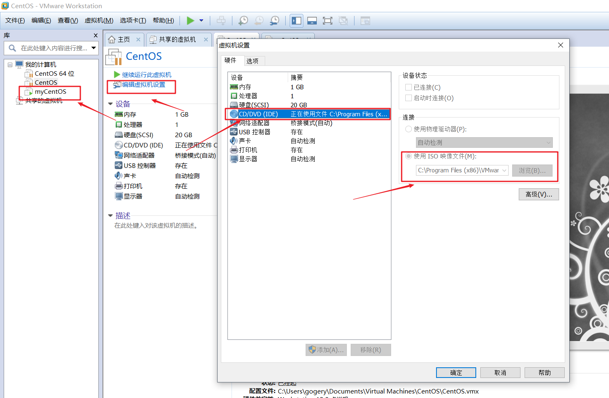
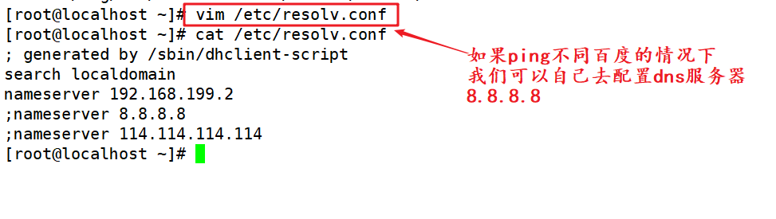

# linux软件安装管理

## 简介

在window下我们进行软件管理还是比较容易的，通过图形界面直接下一步下一步即可，但是在linux服务器下，都是命令行的界面，我们一般会安装一些软件服务，例如apache、mysql、ftp....等，则该如何处理呢？

 

## 软件包类型简介

在linux下软件包一般分为

1. 使用c语言编写的**源码包**，一般来说被称为 tar包；示例：httpd-2.2.18.tar.gz
2. 二进制**rpm**包，一般来说的命名 vsftpd-2.12.3-el5.i386.rpm，一般就类似windows下的.exe文件包
   * 红帽包管理用的是rpm包，debian是deb包


注意：有的时候我们还经常听到脚本安装包（例如：install.sh 这个是一个linux的shell脚本，通过执行该脚本可以进行某些软件的安装，一般被称为**脚本安装包**，在linux里面其实是没有脚本包，方便一些不太懂linux人进行软件的安装），脚本安装包只是linux下的一个shell脚本，脚本里面的内容还是使用源码或者rpm包进行安装的。

【lamp / lnmp环境搭建一般来说都是使用的一键安装包，里面其实就是使用的 shell编写的脚本安装。】


### 源码包优缺点

**优点：**

1. 开源，自己可以修改里面的代码做定制化开发，一般遵循GPL、 apache、 MIT、lGPL....协议（代码可以自行修改，一般来说还要继续的开源）

2. 在进行编译的时候，可以更加的灵活的配置，更适合自己的操作系统

3. 卸载方便，注意：在linux下的源码包安装的软件，卸载特别方便，直接删除文件夹，不会产生任何的垃圾文件

 

**弊端：**

1. 安装的步骤比较多，容易出现问题，需要自行解决

2. 编译时间比较长

如果只有源码包，对于初学者都不知道如何编译，阻碍了linux发展，则很多linux的发行商进行了思考，制作出了可以使用的二进制包，不需要在进行编译。


### 二进制包优缺点

在centos相关的发行版里面使用的 rpm包(RedHat package manager) ；在以Debian系列(Ubuntu)的发行版里面的二进制包一般来说 deb包

**优点**： 

1. 安装简单，不需要编译

2. 安装速度快

 

**弊端：**

1. 不能看到源码

2. 功能不够灵活

3. 存在依赖性


## rpm包的管理

### rpm包的命名规则

**rpm包在哪里呢？**

答：在系统光盘里面，或者是在国内的一些镜像网站，一般被称为yum源，163、搜狐、清华、阿里云....

http://mirrors.163.com/.help/centos.html


示例：vsftpd-2.0.5-16.el5_4.1.i386.rpm

包名-主版本.次版本.修改版本-发布次数-linux发行版-适用平台(i386  i686 x86_64).扩展名


**注意：**一般一个完整的包被称为 **包全名** [vsftpd-2.0.5-16.el5_4.1.i386.rpm]

一般来说包全名前面的部分被为 **包名**

 

**注意：**

* 见到 i386 i686这些都是32位操作系统使用；
* 还有 x86_64都是64位操作系统使用。


### 挂载

**如何使用光盘里面的内容呢？**

答：挂载光盘。

注意：由于我们的虚拟电脑并没有物理光驱，我们只能通过虚拟的光驱将镜像挂载到linux文件系统树上面。


注意：**什么是挂载？**

答：将光驱里面的镜像文件和linux文件系统树产生一个关联。将物理光驱里面的内容放置在文件系统树的某个文件夹里面，文件夹被称为`挂载点`。当我们访问这个挂载点的时候，就相当于在访问这个镜像里面的内容。


### 挂载实操

1. 将镜像访问在虚拟的光驱里面，进行连接

   

2. 创建挂载点(/mnt/cdrom  约定俗成。 mnt代表的挂载的目录 ；cdrom代表的光驱)

   ```
   # mkdir /mnt/cdrom 
   ```

3. 使用 mount 命令进行挂载

   ```
   # mount /dev/cdrom /mnt/cdrom
   
   注意：/dev代表是linux下的设备文件夹
   ```

4. 查看镜像里面的内容

   ```
   # cd /mnt/cdrom
   
   # ls
   ```


### rpm包的依赖性问题

windows下装一些软件的时候需要 .netframkework4.0，这个被称为依赖(缺少 xxxx.dll文件  文件丢失)。

windows下装一些软件的时候需要 kernerl.dll 动态链接库不存在，无法链接。


一般在使用rpm包的时候，会产生一个依赖问题，主要包含如下三种依赖

1. 树形依赖 A->B->C

2. 环形依赖 A->B->C->A

3. 模块依赖、库文件依赖 lib.so.2 文件不存在，www.rpmfind.net查询解决


### rpm相关操作

注意：在演示rpm包的时候的时候，必须确保自己的光盘已经被挂载，并且处于挂载点的CentOS目录下。


1. 例如现在使用rpm的安装vsftpd软件包，安装的时候，需要`包全名`

```
# cd /mnt/cdrom/CentOS

# rpm -ivh vsftpd-2.0.5-16.el5_4.1.i386.rpm 

-i install的简写
-v view 可视化【verbose】
-h hash 显示进度条
由于上面的包没有任何的依赖性，一下就装好了。
```


2. 卸载软件包，只需要使用包名

```
# rpm -e vsftpd
-e  卸载 erase
```


3. 系统已安装的rpm包查看

```
# rpm -qa

-q query查询的意思
-a all查询所有


额外的命令，查看操作系统里面是否安装了 xxx rpm包
# rpm -qa | grep xxx
```


4. rpm包里面的内容查看，可以通过该命令查看该安装包到时候安装在哪里，配置文件在哪里等

```
# rpm -qlp sound-juicer-2.16.0-3.el5

-q query查询
-l longtxt 详细信息
-p package 显示包信息
```


### 依赖演示

演示：rpm包的依赖问题，演示httpd软件的安装

```
# cd /mnt/cdrom/CentOS

# ls | grep httpd
```


由于上面的http的包在安装的时候出现了依赖问题，不断的尝试去解决依赖，是不利于linux下的rpm包的软件的发展，所有官方进行进一步的升级，推出来一个在线软件安装的服务，叫做yum安装。


## yum在线安装方式

### 简介

由于rpm的依赖性，造成用户体验不好，则这个时候redhat公司开发了一个在线安装方式，在网上提供了一个软件仓库，通过一些命令就可以该仓库下载软件，进行安装，并解决依赖性问题。一般软件仓库被称为yum源，可以在linux操作系统的指定目录查看该配置信息。

1. 有点类似PHP里面的 composer

   ```
   # composer create-project laravel/laravel=5.1.* local.laravel.com -vvv
   ```

2. nodejs里面 npm

   ```
   # npm install jquery@2.13.3
   ```

3. 前端里面的 bower 包管理器

   ```
   # bower install bootstrap#2.3.4
   ```


1. 进入 `/etc/yum.repos.d` 目录，即可查看

   ```
   [root@dockerTest yum.repos.d]# cd /etc/yum.repos.d/
   
   [root@dockerTest yum.repos.d]# pwd
   /etc/yum.repos.d
   
   [root@dockerTest yum.repos.d]# ls
   CentOS-Base.repo  epel.repo  epel.repo.rpmnew  epel-testing.repo
   
   ```

2. `CentOS-Base.repo`内容如下，里面记录了软件仓库的地址

   ```
   [root@dockerTest yum.repos.d]# cat CentOS-Base.repo 
   [base]
   name=CentOS-$releasever
   enabled=1
   failovermethod=priority
   baseurl=http://mirrors.cloud.aliyuncs.com/centos/$releasever/os/$basearch/
   gpgcheck=1
   gpgkey=http://mirrors.cloud.aliyuncs.com/centos/RPM-GPG-KEY-CentOS-6
   
   [updates]
   name=CentOS-$releasever
   enabled=1
   failovermethod=priority
   baseurl=http://mirrors.cloud.aliyuncs.com/centos/$releasever/updates/$basearch/
   gpgcheck=1
   gpgkey=http://mirrors.cloud.aliyuncs.com/centos/RPM-GPG-KEY-CentOS-6
   
   [extras]
   name=CentOS-$releasever
   enabled=1
   failovermethod=priority
   baseurl=http://mirrors.cloud.aliyuncs.com/centos/$releasever/extras/$basearch/
   gpgcheck=1
   gpgkey=http://mirrors.cloud.aliyuncs.com/centos/RPM-GPG-KEY-CentOS-6[root@dockerTest yum.repos.d]# 
   ```

3. 由于软件仓库的服务器在国外，一般不稳定。则我们可以将yum更改为国内的yum源，例如阿里云、163、sohu都有提供相应的yum源 清华大学的yum源

   https://www.cnblogs.com/zzsdream/p/7405083.html


### yum相关操作

注意：

1. 必须要联网才可以使用yum源

2. 如果不是教室的这种环境（上网需要做认证），如果是家里，则我们的虚拟机使用桥接之后直接可以上网的。但是现在是在教室，有限制。

3. 在给自己的虚拟机配置一个网卡（使用NAT服务进行转换）

4. 注意：如果网络不通，建议修改下DNS

   


1. 查看yum里面的所有包 

   ```
   # yum list
   ```


2. 搜索某个rpm包 （httpd、Nginx、mysql、PHP）

   ```
   # yum search packageName
   ```


3. yum安装某个包

   ```
   # yum install packageName
   注意：一般都会加上 -y （yes）选项，全自动执行，不需要用户在做确认操作
   # yum install -y packageName
   ```


4. yum卸载某个包

   ```
   # yum remove -y packageName
   ```


   示例：使用yum安装vsftpd软件

   ```
   # yum install -y vsftpd
   ```


### yum源更新实操

如果大家使用就是阿里云的ECS服务器，则不需要更新yum源。


由于centos5.5默认自带的yum源已经不再提供维护，则需要用户自己去配置yum源。

1. 备份之前的yum源配置文件【重视：以后在linux下做任何修改配置文件的操作，在改之前一定要备份】【修改apache、  nginx 、mysql等配置文件之前一定要备份】

   ```
   # cp /etc/yum.repos.d/CentOS-Base.repo /etc/yum.repos.d/CentOS-Base.repo.backup
   ```

2. 修改配置文件，增加如下信息

   ```
   # vim /etc/yum.repos.d/CentOS-Base.repo
   
   
   # CentOS-Base.repo
   #
   # The mirror system uses the connecting IP address of the client and the
   # update status of each mirror to pick mirrors that are updated to and
   # geographically close to the client.  You should use this for CentOS updates
   # unless you are manually picking other mirrors.
   #
   # If the mirrorlist= does not work for you, as a fall back you can try the 
   # remarked out baseurl= line instead.
   #
   #
   [base]  
   name=CentOS-$releasever - Base  
   #mirrorlist=http://mirrorlist.centos.org/?release=$releasever&arch=$basearch&repo=os  
   #baseurl=http://mirror.centos.org/centos/$releasever/os/$basearch/  
   baseurl=http://vault.centos.org/5.11/os/$basearch/  
   gpgcheck=1  
   gpgkey=file:///etc/pki/rpm-gpg/RPM-GPG-KEY-CentOS-5  
   
   
   #released updates   
   [updates]  
   name=CentOS-$releasever - Updates  
   #mirrorlist=http://mirrorlist.centos.org/?release=$releasever&arch=$basearch&repo=updates  
   #baseurl=http://mirror.centos.org/centos/$releasever/updates/$basearch/  
   baseurl=http://vault.centos.org/5.11/updates/$basearch/  
   gpgcheck=1  
   gpgkey=file:///etc/pki/rpm-gpg/RPM-GPG-KEY-CentOS-5  
   
   
   #additional packages that may be useful  
   [extras]  
   name=CentOS-$releasever - Extras  
   #mirrorlist=http://mirrorlist.centos.org/?release=$releasever&arch=$basearch&repo=extras  
   #baseurl=http://mirror.centos.org/centos/$releasever/extras/$basearch/  
   baseurl=http://vault.centos.org/5.11/extras/$basearch/  
   gpgcheck=1  
   gpgkey=file:///etc/pki/rpm-gpg/RPM-GPG-KEY-CentOS-5  
   
   
   
   
   #additional packages that extend functionality of existing packages  
   [centosplus]  
   name=CentOS-$releasever - Plus  
   #mirrorlist=http://mirrorlist.centos.org/?release=$releasever&arch=$basearch&repo=centosplus  
   #baseurl=http://mirror.centos.org/centos/$releasever/centosplus/$basearch/  
   baseurl=http://vault.centos.org/5.11/centosplus/$basearch/  
   gpgcheck=1  
   enabled=0  
   gpgkey=file:///etc/pki/rpm-gpg/RPM-GPG-KEY-CentOS-5  
   
   
   
   
   #contrib - packages by Centos Users  
   [contrib]  
   name=CentOS-$releasever - Contrib  
   #mirrorlist=http://mirrorlist.centos.org/?release=$releasever&arch=$basearch&repo=contrib  
   #baseurl=http://mirror.centos.org/centos/$releasever/contrib/$basearch/  
   baseurl=http://vault.centos.org/5.11/contrib/$basearch/  
   gpgcheck=1  
   enabled=0  
   gpgkey=file:///etc/pki/rpm-gpg/RPM-GPG-KEY-CentOS-5</span></strong></span> 
   
   ```

3. 生成缓存

   ```
   # yum makecache
   ```

4. 查看yum仓库

   ```
   # yum list
   ```


## 源码编译

### 编译前的准备

源代码就是编译安装c语言开发的代码程序。需要使用一定的编译器，一般使用的编译器：**gcc编译**。

```
[root@dockerTest ~]# gcc -v
Using built-in specs.
Target: x86_64-redhat-linux
Configured with: ../configure --prefix=/usr --mandir=/usr/share/man --infodir=/usr/share/info --with-bugurl=http://bugzilla.redhat.com/bugzilla --enable-bootstrap --enable-shared --enable-threads=posix --enable-checking=release --with-system-zlib --enable-__cxa_atexit --disable-libunwind-exceptions --enable-gnu-unique-object --enable-languages=c,c++,objc,obj-c++,java,fortran,ada --enable-java-awt=gtk --disable-dssi --with-java-home=/usr/lib/jvm/java-1.5.0-gcj-1.5.0.0/jre --enable-libgcj-multifile --enable-java-maintainer-mode --with-ecj-jar=/usr/share/java/eclipse-ecj.jar --disable-libjava-multilib --with-ppl --with-cloog --with-tune=generic --with-arch_32=i686 --build=x86_64-redhat-linux
Thread model: posix
gcc version 4.4.7 20120313 (Red Hat 4.4.7-23) (GCC) 
[root@dockerTest ~]# 


```

如果使用上面的命令后，看到不着这些信息，或者见到 `gcc command not  found`，则使用如下安装`gcc`

```
# yum install -y gcc
```


时间同步【在编译的时候，要注意当前服务器的时间一定要是准确的时间】

```
# ntpdate time.windows.com

ntpdate 命令，是时间同步的
在互联网上有一些服务器【 time.windows.com 】专门用来规范时间。
```


**小命令**：如何把windows下的源码包传递到linux服务器，除了ftp，还有一个小工具 lrzsz命令

```
# yum install -y lrzsz
```

上传：在linux服务器输入rz之后，然后回车，在windows下选择需要上传的文件

```
# rz 
```

下载：在linux服务器下输入sz 待下载的文件，然后回车，将linux服务器下的文件下载到windows操作系统

```
# sz 待下载文件
```


### 实操

1. 源码上传 (/usr/local/src 一般用于源码编译的时候，保存源码信息的目录)

   ```
   # cd /usr/local/src
   ```

   ```
   # rz
   ```

   

2. 解压源码

   ```
   # tar -zxvf  httpd-2.2.11.tar.gz
   ```

   `-z `代表含义这个包使用的 gzip(互联网上常见的压缩算法)进行压缩

   `-x `代表是抽取、提取 e**x**tract 

   `-v` view 代表显示视图

   `-f` file 文件

3. 进入解压目录

   ```
   # cd httpd-2.2.11
   ```

4. 收集操作系统的相关信息，检测编译器是否存在，底层的函数库是否存在

   ```
   # ./configure --prefix=/usr/local/apache2
   ```

   注意：` --prefix=/usr/local/apache2` 指定软件安装的目录，一般用户自定义的软件安装在 `/usr/local`目录下

5. 编译

   ```
   # make
   ```

6. 安装，将编译后的二进制命令复制到指定的目录

   ```
   # make install
   ```

7. 服务启动

   ```
   # /usr/local/apache2/bin/apachectl -k start
   ```

8. 源码包的软件，如果要卸载，直接删除安装目录即可

   ```
   # rm -rf /usr/local/apache2
   ```


# linux服务管理

## 简介

linux是一个专业做服务器的软件，在上面会运行一些服务，这个时候我们需要对应服务进行相应的管理，例如服务的查看，启动，关闭等。在Windows下也是可以查看系统里面的服务信息。


在正式讲解服务之前，我们需要先了解一下linux的运行级别的概念，这个到服务时候会有相关联系，所以我们要先了解下linux的运行级别。

1. 命令行模式
2. 桌面模式
3. 单用户（windows下安全模式，修复）
4. ....


## linux的运行级别简介

一般linux有7种运行模式，最常见的运行模式是 命令行模式 和 桌面模式，可以去 `/etc/inittab`文件查看。

```
[root@dockerTest ~]# cat /etc/inittab 

# inittab is only used by upstart for the default runlevel.
#
# ADDING OTHER CONFIGURATION HERE WILL HAVE NO EFFECT ON YOUR SYSTEM.
#
# System initialization is started by /etc/init/rcS.conf
#
# Individual runlevels are started by /etc/init/rc.conf
#
# Ctrl-Alt-Delete is handled by /etc/init/control-alt-delete.conf
#
# Terminal gettys are handled by /etc/init/tty.conf and /etc/init/serial.conf,
# with configuration in /etc/sysconfig/init.
#
# For information on how to write upstart event handlers, or how
# upstart works, see init(5), init(8), and initctl(8).
#
# Default runlevel. The runlevels used are:
#   0 - halt (Do NOT set initdefault to this)
#   1 - Single user mode
#   2 - Multiuser, without NFS (The same as 3, if you do not have networking)
#   3 - Full multiuser mode
#   4 - unused
#   5 - X11
#   6 - reboot (Do NOT set initdefault to this)
# 
id:3:initdefault:

```

0 代表：关机模式（此模式 linux是关机状态）

1 代表：单用户模式（例如root的密码忘记了，可以在该模式下完成密码的找回）

2 没有NFS网络共享的多用户模式（NFS：network file system）

3 代表的是命令行模式（一般生产环境都是使用的该模式，该模式下没有桌面程序）

4 暂时没有被使用（保留）

5 代表的是 桌面模式（该模式是用户常见桌面操作， 常见的桌面程序有 gnome kde）

6 代表重启


## 模式切换

在root登录下 ，可以使用 init命令做模式的切换

```
# init 3(命令行模式)

# init 5(图形化模式)

# init 6(重启操作系统)

# init 0(关机)
```


## 默认模式

`id:3:initdefault: `代表linux默认的运行模式，为命令行模式，在生成环境使用该模式。


## 不同模式下程序行为

在不同的运行模式下，程序的行为表现是不一样的，例如apache在命令行模式下是默认是启动的，但是在图形化模式默认是关闭的。进入默认运行模式对应的` /etc/rc.d/rcN.d/`目录下，里面以**K**开头的代码默认不启动，以**S**开头的代表开机启动。


## linux服务分类

==【在运行模式3下的服务的管理】==


**在linux下的服务主要分为两类：**

1. rpm包安装的服务（yum）

2. 源码包安装的服务

 

由于服务的安装方式不一样形成了**两**类服务，造成服务的管理方式不一样的。


## 查看已安装的服务

rpm包安装的服务（yum本质还是 rpm包安装）

```
# chkconfig --list
# chkconfig --list | grep 关键字 查看某个指定的服务的在某些级别下的状态
```


源码包安装的服务

```
一般在/usr/local/目录下查看
# ls /usr/local
```


## 服务状态查看

在linux下的服务的状态查看主要通过如下两个方式：

1. 查看服务的进程，在linux下每当启动一个服务的时候，则会在linux操作系统里面创建对应的进程。可以通过查看进程的名称来得知服务是否在运行。

   例如apache就叫做 httpd ，Nginx叫做 nginx。 一般服务的名称都是启动的脚本命令  或者就是 服务名称+d  (damon后台守护进程的意义，24小时常驻内存，监听端口，接收请求)

   ```
   # ps axu | grep 进程名称
   ```

   等价命令

   ```
   # ps -ef | grep 进程名称
   ```

2. 查看服务对应的端口

   ```
   # netstat -tunple  |  grep 端口  //如，80 、3306
   ```


测试: curl 发网络请求[百度一下 测试]

```
# curl localhost
# curl -v localhost
# curl -I localhost
```


##  rpm服务-管理（yum）

由于服务一般分为**rpm**包服务，源码包服务，则对应的启动方式是不一样的。对于rpm包安装的服务的启动脚本都在` /etc/init.d/ ` 目录下，通过**service**命令进行操作。

```
# service httpd  start|stop|restart|status
```

httpd 这个名称是这个httpd服务的脚本文件，里面有httpd服务启动的命令。

需要注意：service命令都是去查看/etc/init.d/对应的服务脚本进行启动，所以我们**也**可以通过绝对路径的方式来启动rpm包服务。

```
# /etc/init.d/httpd start|stop|restart
```


**通过上面的命令我们可以对服务进行管理，如何实现服务的开机自启动呢？**

方式一：通过`chkconfig `命令进行设置

```
# chkconfig --level 运行级别 服务名称 on|off
```


方式二：通过修改` /etc/rc.d/rc.local` 文件，加入启动的命令

```
# vim /etc/rc.d/rc.local

 /etc/init.d/httpd start
```

但是需要注意：以上两种方式是**互斥**的，只能使用启动一种来管理对应的服务，不然就会造成服务的重复启动，会保错。

 

rpm包管理总结：

1. 查看服务的状态

   a) ps axu | grep  服务进程名称

   b) netstat -tunple | 服务的端口

   c) service 服务的名称 status | start | stop

   d) /etc/init.d/服务的名称 start | status | stop

 

2. 设置服务的自启动

   a) chkconfig --level  2345 服务名称 on | off

   b) /etc/rc.d/rc.local  里面定义服务的启动


## 源码包服务-管理

对于源码包安装的服务，需要通过绝对路径的方式进行管理，例如apache的管理：

```
# /usr/local/apache2/bin/apachectl -k start|stop
```


注意：源码包不能通过 service 服务的名称 start 进行启动，会报错，因为源码包里面的没有提供相应的服务器的启动的脚本放置在 /etc/init.d/服务启动脚本。


# linux系统管理

## 简介

linux下会运行很多的服务，当服务运行后，在系统里面的表现为一个进程，进程存在对应的进程信息，例如进程的id。对服务的管理，就是对该进程的管理。例如window下也可以查看进程的信息。

那么在linux下如何查看进程信息呢？


## 进程查看

方式一：bsd风格

```
# ps aux 
```


方式二：linux风格

```
# ps -ef
```


## 进程树查看

```
# pstree
```

一般进程有主进程，父进程，子进程等。通过pstree可以查看进程相关的信息，系统运行的第一个进程为init进程。


小命令：使用 **tree** 可以查看目录的信息

```
# yum install -y tree


[root@localhost home]# tree  /home/
/home/
|-- andy
|-- asion
|-- caoyang
|-- lilei
|-- lily
|   |-- a.txt
|   `-- dir
|       |-- a.txt
|       |-- b.txt
|       `-- demo.txt
|-- mark
|-- test
`-- xiaoming

9 directories, 4 files

```


## 服务器负载查看

通过top命令可以查看当前服务器的状态，判断其健康状态

```
# top
```


top每隔3s刷新一次，可以通过输入交互命令，例如按h显示帮助；按P则按照cpu使用进行排序，按M（shift+m）使用内存进行排序。按q进行退出。


## 杀死进程-[不要随便用]

查进程信息

```
ps axu | grep  关键字
ps -ef | grep 关键字
```

一般当某个进程无法正常关闭的时候，可以通过如下的方式进行进程的强制关闭。

1. `kill `杀死单一进程

2. `killall` 杀死全部进程(主进程负责协调、子进程干活， Nginx master\woker)

3. `pkill` 杀死全部进程


一个进程运行中，表现形式就是一个数字，一般叫做pid。


## 信号量查看

在杀死进程的时候，一般都是通过命令然后传递一个进程信号进行处理，linux支持的进程信号有如下：

```
[root@localhost home]# kill -l
 1) SIGHUP	 2) SIGINT	 3) SIGQUIT	 4) SIGILL
 5) SIGTRAP	 6) SIGABRT	 7) SIGBUS	 8) SIGFPE
 9) SIGKILL	10) SIGUSR1	11) SIGSEGV	12) SIGUSR2
13) SIGPIPE	14) SIGALRM	15) SIGTERM	16) SIGSTKFLT
17) SIGCHLD	18) SIGCONT	19) SIGSTOP	20) SIGTSTP
21) SIGTTIN	22) SIGTTOU	23) SIGURG	24) SIGXCPU
25) SIGXFSZ	26) SIGVTALRM	27) SIGPROF	28) SIGWINCH
29) SIGIO	30) SIGPWR	31) SIGSYS	34) SIGRTMIN
35) SIGRTMIN+1	36) SIGRTMIN+2	37) SIGRTMIN+3	38) SIGRTMIN+4
39) SIGRTMIN+5	40) SIGRTMIN+6	41) SIGRTMIN+7	42) SIGRTMIN+8
43) SIGRTMIN+9	44) SIGRTMIN+10	45) SIGRTMIN+11	46) SIGRTMIN+12
47) SIGRTMIN+13	48) SIGRTMIN+14	49) SIGRTMIN+15	50) SIGRTMAX-14
51) SIGRTMAX-13	52) SIGRTMAX-12	53) SIGRTMAX-11	54) SIGRTMAX-10
55) SIGRTMAX-9	56) SIGRTMAX-8	57) SIGRTMAX-7	58) SIGRTMAX-6
59) SIGRTMAX-5	60) SIGRTMAX-4	61) SIGRTMAX-3	62) SIGRTMAX-2
63) SIGRTMAX-1	64) SIGRTMAX	
```

1 杀死某个单一进程，重新读取配置文件，重启

5 全部干掉，可能造成数据丢失

9 优雅的全部干掉


## kill杀死单一进程

例一、通过kill命令传递HUP信号关闭httpd，重新读取配置文件，并重启进程

查看httpd进程

```
# ps aux | grep httpd
```


方式一：

```
# kill -1 httpd进程id
```

`-1`：数字 1 不是字母


方式二：

```
# kill -HUP httpd进程id
```

注意：传递的HUP是通过 `kill -l `查询出来的信号量去掉SIG后的部分

 

 

例二、通过kill命令传递KILL强制终止进程

方式一：

```
# kill -9 httpd进程id
```


方式二：

```
# kill -KILL httpd进程id
```


## killall杀死全部进程

通过killall命令杀死全部进程

```
# killall -9 进程名称
```


## pkill杀死全部进程

```
# pkill -9 进程名称
```


一般情况下不要尝试尝试杀死进行，因为服务的命令本身有提供开启、关闭、重启。杀掉进程有可能数据丢失。


# linux后台作业

## 简介

linux的后台作业，就是将某些操作放置后台进行处理，例如windows下的最小化操作，就是在后台操作。主要是为了多个任务进行操作，例如在当前终端复制一个比较大的文本，则会占据当前终端，例如mysql的服务器的启动，这些操作都要进行后台处理才合适。同时需要注意，当前操作的任务是和当前的终端进行绑定，如果当前终端关闭，则对应的操作会被关闭。


## 相关操作

**如何将某个操作放入后台呢？**

1. 例如在后台压缩一个文件，在操作命令的后面加上 & 符号，在后台是执行的

   ```
   # tar -zcf  etc.tar.gz  /ect  &
   ```

   `-z` 代表使用的gzip算法进行压缩

   `-c `  create 代表是要进行打包    `-x`代表是解压e**x**tract

   `-f `  file 指定打包文件的名称【包名规范：名称.tar.gz    xxx.tar.bz   xxx.7z】

2. 如果当前占据该终端，例如top命令，可以使用 ctrl + z 放入后台，进行暂停

   ```
   # top
   
    ctrl + z
   ```

3. 如何查看放在后台的任务呢?

   ```
   # jobs
   [1]+  Stopped                 top
   ```

4. 如何将后台暂停的任务恢复到前台执行呢？

   ```
   方式一
   # fg 工作信号id 
   方式二
   # %工作信号id
   ```


#  linux定时任务

## 简介

在linux服务器里面，一般来说我们都要定期的去做某些操作，例如数据库的备份【1. 全量备份，但是一般这个需要消耗很大的系统资源，一般周期长，一般选择在凌晨3-5点左右完成，不能在人多的时候完成。  2. 增量备份，最小化的备份】，但是由于服务器在白天的压力一般比较大，则对于数据库的备份一般来说都是在夜晚2-5点进行操作。这个时候就需要使用linux的系统定时任务来进行操作。例如让定时任务定期执行某个PHP脚本，来做一些操作，例如每周五下午五点统计该网站注册的的用户总人数发送给相关人员。周一的上午统计上个星期的业务总量，下了多少的订单，出了多少货；获取是定期生成静态页，定期让缓存失效，重新生成缓存。队列服务。订阅号


## crontab定时任务参数解释

**如何编写定时任务呢**

```
# crontab -e

* * * * * 执行程序，一般来说是一个shell脚本【shell编程】
```

其中这个五个星分别代表：

| 项目    | 含义                 | 范围                    |
| ------- | -------------------- | ----------------------- |
| 第一个* | 一小时当中的第几分钟 | 1-59                    |
| 第二个* | 一天中的第几个小时   | 0-23                    |
| 第三个* | 一个月中的第几个天   | 1-31                    |
| 第四个* | 一年中的第几个月     | 1-12                    |
| 第五个* | 一个星期中的星期几   | 0-7（0和7都代表星期天） |


对于前面的五个部分，有如下比较特殊符号需要讲解

| 项目 | 含义                                                         |
| ---- | ------------------------------------------------------------ |
| *    | 代表任何时间，比如第一个*，代表一个小时里面的每分钟都执行一次命令 |
| ,    | 代表不连续的时间，比如  0     9,12              * * * ，代表每天的9点0分，12点0分执行一次命令 |
| -    | 代表连续的范围，比如  0   10   * *     1-6 ，代表周一到周六的每天上午10点执行一次命令 |
| */n  | 代表每隔多久执行一次，比如 */10 * * * *，代表每个10分钟执行一次命令 |

解释如下的命令代表的含义

15 10 * * * /user/local/data.sh

每天的上午10点15分钟执行这个命令

 

30 8 * * 1 /user/local/data.sh

每周的周一的的上午8点30分钟执行这个命令

 

*/10  3 * * * /user/local/data.sh

每天的凌晨3点到4点之间每隔10分钟执行一次

 

0     10   1,15   *    2 /user/local/data.sh

最大的坑 注意：每月的号最好不要和星期进行放在一起，因为linux操作系统默认是进行并集操作，不是执行与操作。

相当于 每月的1号、15号，还有周二（只要是这个月的周二都要执行）的10点0分执行这个命令。


## 定时任务管理

### 添加

```
简单示例演示，每一分钟在 /var/date.log文件里面记录下当前时间
# crontab -e
* * * * * date >> /var/date.log
```

每一分钟向 /var/date.log 写入当前的时间信息，追加

注意：crontab -e 本质其实就是想往 /etc/crontab 文件里面写入上面的定时任务信息。

```
# vim /etc/crontab
```


### 查看

```
# crontab -l
```


### 清除

```
# crontab -r [注意：-r代表是删除所有的定时任务，没法删除单条的任务，如果删除单个直接vim进行编辑]
```


### 扩展

注意：linux下的定时任务的最小的精度是在分钟，没有秒级别的定时任务。如何设置秒级别的定时任务？

<https://www.cnblogs.com/adtuu/p/5213352.html>

 

注意：现在有这样需求，在每周五的下午五点统计该网站的这一周的注册会员的总数，发送给公司的XXX人员的 手机或者邮箱。

1. 定期的执行某个脚本

2. 统计网站的会员注册信息

3. 发送邮件或者手机短信


# lamp环境的搭建

## 简介

互联网上一般存在两种架构

1. **lamp架构**

   a) linux

   b) apache

   c) mysql 或者MariaDB；

   * MariaDB是mysql的另外的一个分支，mysql被Oracle收购了，有可能闭源，所以出现其他的分支版本，	MariaDB是原MySQL的作者之一进行主导开发，以他女儿名字命名。

   d) PHP或者Python

2. lnmp架构

   a) linux

   b) Nginx

   c) mysql或者MariaDB

   d) PHP或者Python


## 环境准备

关闭防火墙

```
# iptables -L 
# iptables -F
# service iptables stop
# chkconfig --level 35 iptables off

```

`-L `列出

`-F` 删除

`service iptables stop`


关闭selinux

```
# setenforce 0

# getenforce
```


时间同步(确保DNS的服务器需要正常)

```
# ntpdate  time.windows.com
```

如果上面的服务无法正常使用

```
[root@localhost ~]# date -s "2018-09-07 17:04:00"
2018年 09月 07日 星期五 17:04:00 CST

[root@localhost ~]# date 
2018年 09月 07日 星期五 17:04:01 CST
```


## ftp管理

使用一个ftp上传工具将源代码上传到服务器上。ftp也是linux下的一个服务，需要先安装对应的服务，启动服务后，通过客户端软件上传源代码。

安装

```
# yum install -y vsftpd
```

启动服务

```
# service vsftpd   start | status | restart | stop
```

注意：ftp也是一个 c/s 架构，并且监听的是 21 号端口。


## ftp客户端使用

1. 注意：这里不能使用root用户，需要使用普通用户andy进行ftp文件上传。一般来说，源码都会上传到 `/usr/local/src` 目录下。


2. 修改 `/usr/local/src `的其他人权限，是的其他用户可以把源码上传到该目录

   ```
   [root@localhost local]# chmod -R 757 /usr/local/src/
   
   [root@localhost local]# ls -ld /usr/local/src/
   drwxr-xrwx 5 root root 4096 09-07 17:29 /usr/local/src/
   ```

3. 上传操作


## apache安装

1. 解压Apache的tar包

   ```
   # cd /usr/local/src
   
   # tar -zxvf httpd-2.2.11.tar.gz
   ```

2. 进入解压后的目录，然后使用 configure命令收集操作系统的信息

   ```
   # cd httpd-2.2.11
   # ./configure --prefix=/usr/local/apache2
   ```

3. 编译

   ```
   # make
   ```

4. 安装

   ```
   # make install 
   ```

5. 成功安装后，启动apache服务器

   ```
   /usr/local/apache2/bin/apachectl -k start
   ```


## mysql安装

1. 将mysql的压缩包解压到 `/usr/local` 目录下

   ```
   # cd /usr/local/src
   
   #  tar -zxvf msyql-5.5.38-linux2.6-i686.tar.gz -C /usr/local
   ```

   `-C`代表：解压到指定目录

2. 为mysql的解压的目录创建一个软连接

   ```
   # cd /usr/local
   # ln -sv mysql-5.5.38-linux2.6-i686 mysql
   ```

   ln： 代表创建一个符号链接，就是一个快捷键

3. 进入mysql目录

   ```
   # cd /usr/local/mysql
   ```

4. 创建一个mysql的用户，来使得它运行MySQL软件

   ```
   # useradd mysql
   ```

5. 更改mysql目录及其子目录以及文件的所有者和所属组为mysql和mysql组

   ```
   # chown  -R  mysql:mysql  . 
   ```

6. 执行MySQL安装的脚本

   ```
   # ./scripts/mysql_install_db --user=mysql
   ```

7. 复制MySQL的配置文件到 `/etc/`目录下

   ```
   # cp support-files/my-small.cnf /etc/my.cnf
   ```

8. 复制mysqld脚本到系统服务目录

   ```
   # cp support-files/mysql.server /etc/init.d/mysqld
   ```

9. 加入系统服务列表

   ```
   # chkconfig --add mysqld
   ```

10. 启动mysql服务

  ```
  # service mysqld start
  ```

11. 登录MySQL服务器，注意：此时root密码为空

    ```
    # /usr/local/mysql/bin/mysql -uroot -p
    ```

12. 更改MySQL服务器的root密码

    ```
    [root@localhost htdocs]# /usr/local/mysql/bin/mysql -uroot -p
    Enter password: 
    
    Welcome to the MySQL monitor.  Commands end with ; or \g.
    Your MySQL connection id is 8
    Server version: 5.5.38 MySQL Community Server (GPL)
    
    Copyright (c) 2000, 2014, Oracle and/or its affiliates. All rights reserved.
    
    Oracle is a registered trademark of Oracle Corporation and/or its
    affiliates. Other names may be trademarks of their respective
    owners.
    
    Type 'help;' or '\h' for help. Type '\c' to clear the current input statement.
    
    mysql> use mysql;
    Database changed
    
    mysql> update user set password=password("admin88") where user="root";
    Query OK, 0 rows affected (0.00 sec)
    Rows matched: 4  Changed: 0  Warnings: 0
    
    mysql> flush privileges;
    Query OK, 0 rows affected (0.00 sec)
    
    ```


## php安装

1. 解压PHP源码包

   ```
   # cd /usr/local/src
   # tar -zxvf php-5.2.5.tar.gz
   ```

2. 进入解压后的PHP目录，在configure的时候，特别注意：需要指定**Apache**和**MySQL**的安装目录

   ```
   # cd php-5.2.5
   # ./configure --prefix=/usr/local/php --with-mysql=/usr/local/mysql/ --with-apxs2=/usr/local/apache2/bin/apxs   --with-config-file-path=/usr/local/php
   ```

3. 编译

   ```
   # make
   ```

4. 安装

   ```
   # make install
   ```

5. 复制PHP配置文件到指定目录

   ```
   # cp php.ini-dist /usr/local/php/lib/php.ini
   ```

6. 配置Apache的httpd.conf文件，增加如下信息，以后有.php结尾的文件都交给php模块处理

   ```
   [root@localhost htdocs]# vim /usr/local/apache2/conf/httpd.conf
   
   
   AddType application/x-httpd-php .php
   ```

7. 重启Apache

   ```
   # pkill -9 httpd
   
   # /usr/local/apache2/bin/apachectl -k start
   ```

8. 添加PHP测试文件

   ```
   # vim /usr/local/httpd/htdocs/test.php
   	
   	phpinfo();
   ```

9. 浏览器访问

   


# 扩展

## samba

### 简介

有的时候在开发的环境中，是多种操作系统环境交叉使用，例如，Windows的电脑做开发，linux电脑做服务器，彼此之间需要相关的传递文件，共享信息。彼此沟通非常麻烦。这个时候可以使用一个叫做 Samba（作者和linux是同样有名）的软件完美的解决彼此之间的沟通。


### 使用

1. 使用yum安装Samba软件

   ```
   # yum install -y samba
   ```

2. 添加一个系统用户，等会配合Samba软件一起使用

   ```
   # useradd sambatest
   # passwd sambatest
   ```

3. 添加上一步的用户到Samba服务里面

   ```
   # smbpasswd  -a  sambatest(将系统用户加入Samba的配置文件中，并为该用户设置密码)
   ```

4. 启动Samba服务

   ```
   # service smb start
   ```

5. Windows连接Samba服务的服务器

   ```
   window+r
   
   输入
   \\linux服务器IP地址
   ```


## Sudo

### 简介

可以用**root的身份**去执行一个命令，主要是**为辅助超级管理员**完成一些超级管理员不能登录下的操作。因为在实际的生产环境，root一般是很少连接远程连接服务器的，root权限过大，一般来说都是以普通用户进行登录管理，但是有的时候普通用户也想执行一下root用户的权限（例如服务器重启），该怎么办呢？


### 使用

1. 查看sudo信息

   ```
   # visudo -V
   ```

   如果不能显示上面的信息，使用如下方式进行安装

2. 安装sudo软件

   ```
   # yum install -y sudo
   ```

3. 编辑配置文件，使得一个普通用户可以使用root的身份去执行一些root才能操作的命令（例如关机 shutdown、 useradd）修改的其实是` /etc/sudoers`文件

   ```
   # visodu 
    caoyang ALL=(ALL) /sbin/shutdown
    caoyang ALL=(ALL)  /usr/sbin/useradd
   ```

4. 切换成普通用户，执行命令

   ```
   # su - caoyang
   ```

   注意：需要输入普通用户的密码


