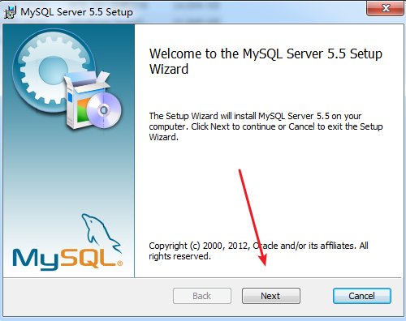
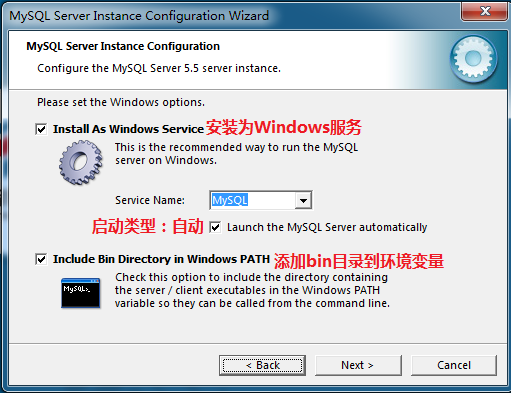
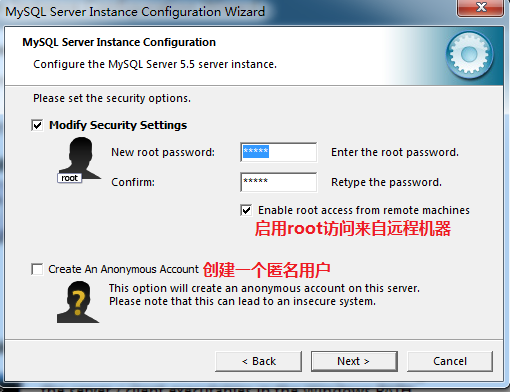

# MySQL数据库


----

**数据库**：永久性保存数据的仓库。


Mysql称为**关系型数据库** 

**非关系型**： 是将数据存在在内存中   \\\\
**关系型**：是将数据存储硬盘中


何谓关系型（关系模型），即利用关系(二维表)，去描述实体信息。    \\\\
与 实体之间有联系 的数据库架构就是 **关系型数据**！

 

**关系**：二维表

行，记录，一行就是一条记录。   \\\\
列，字段，一列就是一个字段。

SQL：结构化查询语言，操作关系型数据库的语言！SQL是一门编程语言并且它是**强类型**的编程的语言。

**学生表**

| **学号**   | **姓名** | **年龄** | **教室表中所属ID** |
| ---------- | -------- | -------- | ------------------ |
| Itcast1001 | 王小明   | 38       | 1                  |
| Itcast1002 | 王宝强   | 20       | 2                  |
| Itcast1003 | 梅超风   | 30       | 3                  |

 

**教室表**

| ID   | 教室号 | 所属班级   |
| ---- | ------ | ---------- |
| 1    | 305    | PHP25期    |
| 2    | 210    | PHP24期    |
| 3    | 311    | JavaEE48期 |

----


## 安装Mysql

mysql的安装分为两部分：**安装**与**配置**     \\\\
版本不同，界面可能有些不同

### 安装

 

 

 

 


### 配置

1）  安装完后进行配置界面

 

2）  选择“详细配置”选项


 

3）  选择“开发者机器”


4）  选择“多功能数据库”


 

5）  选择“手动设置连接数”


 

6）  允许防火墙通过


 

7）  设置默认字符集


 

8）  设置开机自启动



 

 

9）  设置root用户的密码



 

10）              选择执行


----


## 连接Mysql数据库 

MySQL是基于C/S架构的。   \\\\
客户端/服务器端架构 ，   一对一模式 


安装mysql时，自动携带一个命令行的客户端 mysql Client。   \\\\
利用该客户端，向服务器发送指令，然后等待执行结果即可！


操作mysql，就一定：通过操作mysql客户端，向mysql服务器发出指令，从而完成操作！


### 通过cmd命令行窗口管理Mysql服务


启动mysql服务器

```bash
net start mysql 
```

停止mysql服务器 

```bash
net stop mysql 
```

注： mysql 为安装 的服务名，有些新版本为 mysql80，按实际修改。前提为mysql要已安装已添加到环境变量中。


### 通过Window的服务来管理Mysql服务 


### 使用命令行窗口来作为Mysql客户端

先在键盘上面按下：**win**+**R**  然后输入 **cmd** ，回车键打开命令行窗口

```bash
mysql.exe   -h(主机名)  -P(端口号)  -u(用户名)  -p(密码)
```

本地主机可以省略 -h(主机名) 


----

