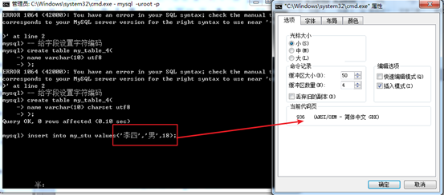
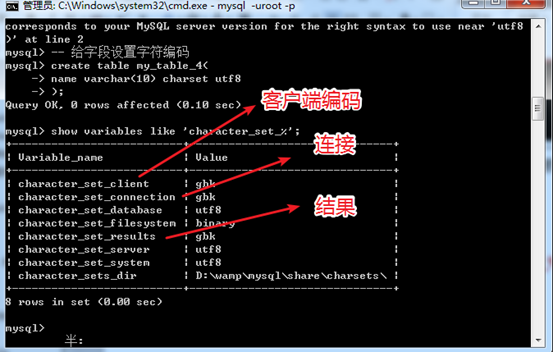
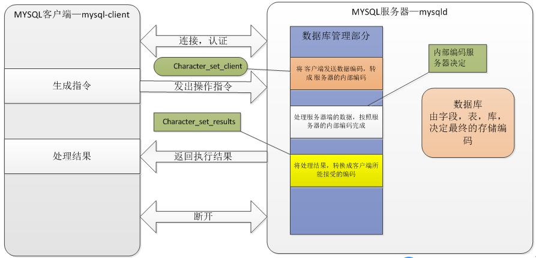
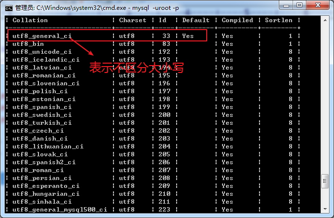
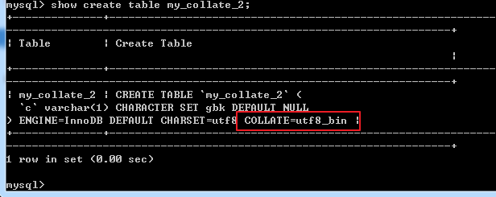

# MySQL 字符集

----

想在数据表中插入汉字 发现插入不了


**字符集**  \\\\
描述 可见到的图形，在存储和传输时 使用的编码 称之为字符集！

指的是：   \\\\
图形 与 编码 之间的对应关系！

 

字 => 11100101 11100001 00010100

----


## 数据存储的编码

数据是存储在服务器端的！究竟是以哪种编码保存的，怎么决定？   \\\\
数据是最终要映射（保存）到字段的层面上！因此决定数据的编码，也是最终由字段来决定！

 

* 在MSQL配置文件中 有字符编码设置的 
* 在创建数据库也可以指定字符编码 
* 在创建表也可以指定字符编码 
* 在定义字段的时候也可以指定其字符编码 

 

**确定数据的存储编码是由以下的方案完成的**：

1. 先看 字段的编码！如果存在则确定完毕！
2. 如果字段没有设置编码，查看表的编码，如果有，则确定数据编码！
3. 如果表没有编码，查看库的编码，如果有，则确定数据编码！
4. 如果库也没有编码，则有服务器程序确定！


典型的编码：**gbk，utf8**

----


## 客户端操作，查询的编码



在客户端与 服务器端交互时，存在两个重要的编码：

1. 客户端发送数据的编码
2. 客户端接收到服务器数据编码！

 

可以通过 **show variables like ‘character_set_%’** 展示以 **character_set**开头变量，其中就有上面的两个值：



 

 

在往Mysql服务器写入汉字的时候 报错：  \\\\

可使用 **set** **变量名 =** **变量值**


打开 黑窗口：   \\\\

第一步，选择数据库    \\\\
第二步，设置字符编码   \\\\

 

```bash
set names gbk|utf8
```

就是一个快捷操作，将上面三个配置同时更改成目标编码！ \\\\
设置gbk或utf8 ，不包含竖线 |

 

**注意**：set names gbk|utf8 取决于，客户端所能接受的编码！




----


# MySQL 校对集(collate)

指的是 **字符之间的比较关系**！

a B c

or？

B a c

可以被 校对集改变：

利用 **show collation;** 查看到所有的校对集！



校对集，依赖于**字符集**！

校对集，指的是，在某个字符集下，字符的排序关系应该是什么，称之为校对集！




典型的后缀：

`_bin `二进制编码层面直接比较：

`_ci `忽略大小写（大小写不敏感）比较

`_cs` 大小写敏感比较