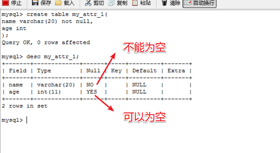
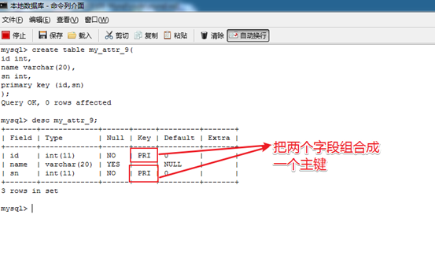
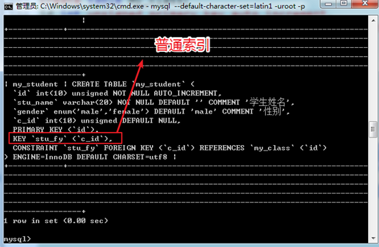
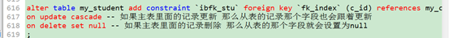

# MySQL 字段约束

----

## 非空值约束

mysql的**NULL**不是数据，也不是类型！只是标识字段属性！ \\\\
用于说明某个字段，是否可以为null  \\\\

是：NULL，而不是：‘NULL’

属性： \\\\
``null``   表示可以为空，默认  \\\\
``not null``  表示不能为空  \\\\
如果，在添加数据时 ，没有指定值，也可能会是NULL！  \\\\



----


## 默认值约束

**Default**：默认值 \\\\

当字段被设计的时候，如果允许默认条件下，用户不进行数据的插入，那么就可以使用事先准备好的数据来填充：通常填充的是NULL 。

```mysql
create table my_table(
name varchar(20) default '小米'
);
```

----


## 主键约束

**主键**，可以唯一标识记录的字段，是表中一列或多列的组合。主键约束要求主键列的数据**唯一**，且**不能为空**。\\\

主键分为：**单字段主键**  和 多字段联合的**复合主键**

一个表，只能有一个主键！ \\\\
典型的，在创建表时，主动增加一个 非实体的自然属性，充当主键，采用整型，运算速度快！

**关键字**： ``primary key``


#### 单字段主键

在定义列的同时指定主键，语法：  \\\\
``字段名  数据类型   primary key [默认值]``  \\\\


在定义完所有列之后指定主键，语法： \\\\
``[constraint <约束名>] primary key [字段名]``

```mysql
-- 在定义列的同时指定主键
create table my_table(
id  int(10) primary key,
name varchar(20)
);

-- 在定义完所有列之后指定主键
create table my_table(
id int(10),
name varchar(20),
primary key (id)
);
```


#### 复合主键

复合主键，语法： \\\\

``primary key [字段1,字段2,...字段n]``

```mysql
-- 复合主键
create table my_table(
id int(10),
name varchar(20),
primary key (id,name)
);
```



### 管理主键


```mysql
-- 添加主键
alter table  表名 add primary key(字段列表);

-- 删除主键
alter table  表名 drop primary key;
```


----


## 唯一值约束

**唯一值约束**，要求该列的值唯一，允许为空，且只能一个空值。   \\\\
唯一值约束可以确保列中不出现重复值。

**关键字**： ``unique``


在定义列的同时指定唯一，语法：  \\\\
``字段名  数据类型 unique   ``  \\\\

在定义完所有列之后指定唯一，语法： \\\\
``[constraint <约束名>] unique (字段名)``

```mysql
-- 在定义列的同时指定唯一
create table my_table(
name varchar(20) unique
);

-- 在定义完所有列之后指定唯一
create table my_table(
id int(10),
name varchar(20),
unique (name)
);
```

### 管理唯一

```mysql
-- 删除唯一
-- 索引的名字，可以通过 show create table 看到！
alter table 表名 drop  index  索引名称;

-- 增加唯一
-- 建议索引名字使用反引号(~按键)包裹
alter table 表名 add unique  key 索引名字 (字段列表);
-- 或
alter table 表名 add unique  index  索引名字 (字段列表);

```

----


## 外键约束

**外键**，用来在两个表的数据之间建立链接，可以是一列或多列，可以不是本表的主键，但对应另一表的主键。一个表可以有多个外键。


如，一个实体A的某个字段，刚好指向或者引用到另外一个实体B的主键，那么实体A的这个字段就是外键！ 所以，简单来说，外键就是外面的主键，就是指向其他表的主键的那个字段！


**作用**：外键主要是保持数据的一致性、完整性。


**主表(父表)**：对于两个具有关联关系的表而言，关联字段中``主键``所在的表是主表。 \\\\
**从表(子表)**：对于两个具有关联关系的表而言，关联字段中``外键``所在的表是从表。  \\\\


**关键字**： ``foreign key``


在定义列的同时指定外键，语法：  \\\\
``[constraint `外键名`] foreign key  [`索引名`] (外键字段列表)  references 主表(主键字段);   ``  \\\\

在创建表后增加外键，语法： \\\\
``Alter  table 从表 add [constraint `外键名`] foreign key  [`索引名`]  (外键字段列表) references 主表(主键);``

```mysql
-- 在定义列的同时指定外键
create table my_table(
id int,
c_id int,
constraint `stu_fy` foreign key (c_id) references my_class(id)
);

-- 在创建表后增加外键
alter table my_table add constraint `stu_fy` foreign key (c_id) references my_class(id);
```

创建外键后会自动增加一个普通索引，可以指定普通索引的名称，也可以让系统分配 。




### **删除外键**

外键不允许修改，只能先删除后增加  \\\\
基本语法：``alter table 子表 drop  foreign key 外键名字;`` \\\\
外键名字可以通过 ``show create table table_name ``查看  \\\\

注意： \\\\

**外键不能删除产生的普通索引，只会删除外键自己**

```mysql
alter table my_table drop foreign key `stu_fy`;
```

### 约束模式

可以在创建外键的时候，对外键约束进行选择性的操作。

 

基本语法： 
``Alter table 从表 add [constraint `外键名`] foreign key  [`索引名`]  (外键字段列表) references 主表(主键)  on 约束模式;``

**约束模式**有三种：

1. **district**：严格模式，默认的，不允许操作
2. **cascade**：级联模式，一起操作，主表变化，从表数据跟着变化
3.  **set null**：置空模式，主表变化（删除），从表对应记录设置为空：前提是从表中对应的外键字段允许为空

 

外键约束主要约束的**对象**是主表操作：从表就是不能插入主表不存在的数据

 

通常在进行约束时候的时候，需要指定操作：**update**和**delete**

常用的约束模式： ``on update cascade``, ``on delete set null``，更新级联，删除置空




### 注意事项

1. 外键约束，只能在 当前的 mysql的的 **innodb** 表类型（引擎）下才会生效！
2. 外键字段需要保证与关联的主表的主键**字段类型完全一致**
3. 因为外键有非常强大的数据约束作用，而且可能导致数据在后台变化的不可控。导致程序在进行设计开发逻辑的时候，没有办法去很好的把握数据（业务），所以外键比较少使用。 因为我们是站在PHP的层面去操作Mysql数据库  所以外键使用的概率非常小。

----


## 自动增长

**自动增长**，可以从1开始，逐一递增的数值 。\\\\

**关键字**： ``auto_increment``


一张表只可有一个字段使用 ``auto_increment`` 约束，且该字段必须为主键。\\\\


典型的，从1 开始，没有负数，可以采用 无符号 **unsigned**整型！   \\\\
**注意**： unsigned，不是列属性，是类型的一部分！（包括zerofill）因此位置上与类型在一起！


语法： \\\\

``字段名  数据类型  auto_increment``

```mysql
create table my_table(
id int(11) primary key auto_increment
);
```

----


## 字段注释

**字段注释**，主要是用于给字段进行注释，方便自己和他人阅读字段的含义。

关键字： ``comment``

```mysql
create table my_table(
id int(11),
name varchar(23) not null  comment '用户名'
);
```


