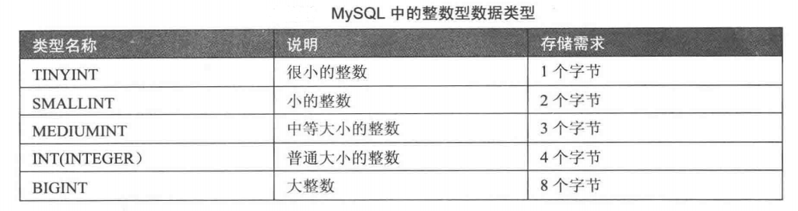
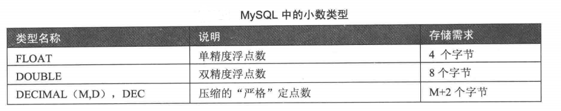
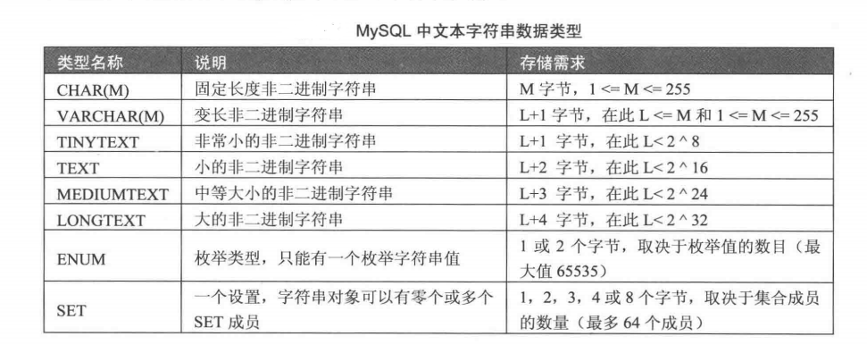
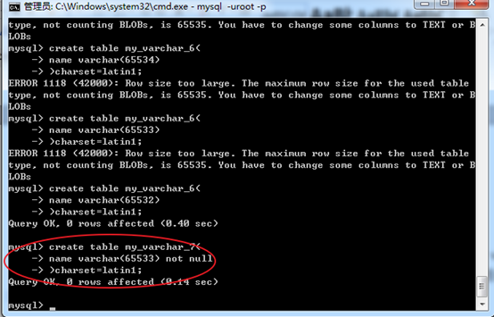

# MySQL 数据类型

----

MySQL 支持多种据类型，主要有 数值类型、日期/时间类型 和 字符串类型。

 数值类型：包括整数类型(**tinyint** ， **smallint**  ， **mediumint** ， **int**  / **intege** ， **bigint**)，浮点类型(**float** ， **double**)，定点类型(**decimal**)。

日期时间类型： 包括 **year**  ， **time** ， **date** ， **datetime**  和 **timestamp**。 

字符串类型： 分为 文本字符串(**char** ， **varchar** ，  **text**，**enum** ，**set** ) 和 二进制字符串(**binary** ，**varbinary** ，**blob**)包括 等。

----


## 数值类型

数值类型主要用来存储数字，Mysql提供多种数值类型，不同的类型提供不同的取值范围，可以存储的值范围越大，其所需的存储空间越大。

### 整数类型




```mysql
create table my_table (
id    int(10),
...
...
);
```

``int(10)``  10 表示显示宽度，并非是限制存储个数。


**注意**： 宽度只用于显示，并不能限制取值范围和占用空间。如果宽度不够，则采用前导零补齐！此时需要 额外的属性 ``zerofill`` 来设置！如果超过设置的宽度，不会报错。

```mysql
-- 前导零补齐
create table my_table (
id  int(10) zerofill
);
```


mysql的整型，有php整型不具备的概念：  \\\\

**有符号** \\\\
默认，表示有正数和负数。 \\\\

**无符号**  \\\\
只能表示正数或0。那么最大的正数会很大！ \\\\
可通过 整型的 **unsigned**选项设置其无符号  \\\\

```mysql
-- 设置无符号
create table my_table(
id int unsigned
);
```


mysql中，没有 布尔型！\\\\
但是 存在 boolean这个关键字，表示 tinyint(1)  \\\\
典型的，0表示假，1表示真！

```mysql
create table my_table(
sex tinyint(1)
);
```


### 浮点类型和定点类型

Mysql使用浮点数和定点数来表示小数。 \\\\
浮点类型：单精度浮点类型(float) 和 双精度浮点类型(double)。 \\\\
double 比 float 精度更高，小数位更多。




```
float(M,D)
double(M,D)
decimal(M,D)
M：所有的有效位数，也表示显示宽度
D：其中的小数位数
以上两个值，决定一个浮点数的有效范围！

典型的浮点数
float(10, 2);
99999999.99
```

**注意**，浮点数，近似值，不是精确值！如果一个数，很大，接近最大值，可能出错！

```mysql
create table my_table(
m  float(10,2)
);
```


关于小数：

1. 支持 科学计数法7e3 
2. 同样支持 unsigned，无符号
3. 同样支持 zerofill


无论是浮点还是定点，如果超出了精度范围(M)，则会四舍五入。\\\\
对精度要求比较高时(如 货币，科学数据等) 使用定点类型比较好。\\\\
浮点类型在减法和比较运算时也容易出错，应尽量避免。

----


## 日期时间类型


### date

**日期类型：**系统使用3个字节来存储数据，对应的格式为：YYYY-mm-dd，能表示的范围是从1000-01-01 到9999-12-12，初始值为0000-00-00


### time

**时间类型：**能够表示某个指定的时间，但是系统同样是提供3个字节来存储，对应的格式为：HH:ii:ss，但是mysql中的time类型能够表示时间范围要大的多，能表示从-838:59:59~838:59:59，在mysql中具体的用处是用来描述时间段。


### datetime

**日期时间类型：**就是将前面的date和time合并起来，表示的时间，使用8个字节存储数据，格式为YYYY-mm-dd HH:ii:ss，能表示的区间1000-01-01 00:00:00 到9999-12-12 23:59:59，其可以为0值：0000-00-00 00:00:00

datetime插入年份时 可以选择2位数或者是4位数的年份

datetime进行两位数插入的时候，有一个区间划分，零界点为69和70：当输入69以下，那么系统时间为20+数字，如果是70以上，那配系统时间为19+数字

**建议插入4位数的年份！！！**

 

### timestamp

**时间戳类型：**mysql中的时间戳类型只是表示从1970年1月1日开始，但是其格式依然是：YYYY-mm-dd HH:ii:ss

### year

**年类型：**占用一个字节来保存，能表示1900\~2155年，但是year有两种数据插入方式：0\~99和四位数的具体年

year进行两位数插入的时候，有一个区间划分，零界点为69和70：当输入69以下，那么系统时间为20+数字，如果是70以上，那配系统时间为19+数字

**建议插入4位数的年份！！！**


**注意**：因为在PHP中有强大的date()与strtotime() time()函数  所以站在PHP的角度这个日期时间类型用的不多 

----


## 字符串类型




### char

格式：

``字段名 char(L)``  ：L表示最大的字符数（不是字节数） \\\\ 

最基本（定长）的字符串类型！  \\\\
用于保存，长度固定的内容！\\\\
速度快，但是保存变长数据，会浪费空间！\\\\


### varchar

格式：

``字段名 varchar(L)``  ：L表示最大的字符数 （不是字节数）  \\\\
可变长度的字符串！  \\\\
用于保存长度可变的数据！  \\\\
保存变长数据时，节省空间，但处理起来麻烦些！  \\\\


``char(L)，varchar(L)``  \\\\
L,表示每个数据的最大长度！单位是 字符数（不是字节数）

 

**L的值不是多大都可以的，有最大值**：

1. mysql一条记录最大不能超过65535个字节！（字段的长度加起来，不能超过这个值）
2. 长度单位是字符数，与编码是相关的！
3. 由于varchar是变长，需要记录下真实的数据到底有多长！每个varchar类型的数据，还需要额外的1个或2个字节保存真实数据的长度！（取决于真实数据的长度）
4. 整条记录，还需要1个字节来保存那些字段为null


 采用单字节编码测试下：  \\\\
``Latin1``   \\\\
测试发现只有一个字段，而且是单字节字符集，还是不能是65535  \\\\

为什么是 65532呢，少了三个字节?  \\\\
因为 varchar 类型还需要额外的1个或2个字节保存真实数据的长度。整条记录，还需要1个字节来保存那些字段为null。





**但是，在使用时，varchar 超过255就选择 text来保存！**

 

### text

文本，不限长度的字符串！   \\\\
该字段，不需要指定长度，而且也不会算入到记录的总长度内！   \\\\
比如：文章管理系统  有会文章  可以选择使用text这个字符串类型来存储 

```mysql
create table my_table(
t text
);
```


### 怎么选择？

定长，**char**   \\\\
变长较短（255）个字符之内，**varchar**   \\\\
变长，较长，**text**


 

### enum

枚举，enum，单选   \\\\
需要在定义枚举类型时，列出哪些是可能的！ 如： \\\\

```
enum(‘男’,’女’,’保密’);
```
在处理时，类似 字符串型进行操作！

 

意义在于：
1.  限定值的可能性！
2.  速度快，比普通的字符串速度快！

枚举型 是利用 整数进行管理的，速度比字符串快！ 每个值，都是一个整数标识，从第一个选项开始为1， 逐一递增！

**站在mySQL的角度 建议使用enum来存储类似于单选的这种数据  ，但是站在PHP的角度来说 建议不要使用**


### set

集合，set，复选  \\\\
类似于 enum枚举，在定义时，也需要指定其已有值！ \\\\

**集合**：是一种将多个数据选项可以同时保存的数据类型，本质是将指定的项按照对应的二进制位来进行控制：1表示该选项被选中，0表示该选项没有被选中。


**注意：**站在 mysql的角度，尽量多用 枚举和集合！ \\\\
但是站在php操作mysql的角度，尽量少用！（兼容性差）


----


