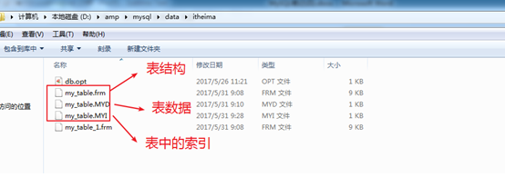
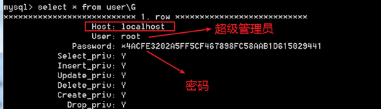
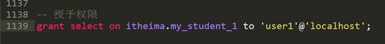

# MySQL 管理

----

## 数据的备份

属于**DCL**：数据控制语言！control 

**备份**：就是将已有的数据复制一份，存放到其他的存储单元！

常见的有：**文本备份**，**数据备份**和**sql备份**


### 文本备份

文本备份是最简单的，复制——粘贴！   \\\\
一般认为，只适合**Myisam**存储引擎的表！   \\\\
因为Myisam引擎的表它会将表分为**三**个部分来进行存储    \\\\

文本备份的缺点：   \\\\
每次都需要备份整个全部文件，非常浪费磁盘空间！




### 数据备份

就是只备份一张表的数据部分！

采用这种备份方式，如果误删了表的全部记录，还可以还原（也就是误使用delete语句），但是如果将整个表都删除了（误使用drop），不能还原！

#### 备份语法

``select  *|字段列表  into  outfile 文件地址  from 表名; ``

```mysql
select * into outfile 'd:/stu.sql' from stu;
```


#### 还原语法

``load data infile 文件路径  into  table 表名[字段列表];``

```mysql
load data infile 'd:/stu.sql' into table stu;
```

----


### 数据的导出工具 mysqldump

将表的结构和数据通过sql语句的形式进行备份！

mysql中有一个专门用来sql备份的客户端 ``mysqldump.exe``！ 位于bin目录下，不需要登录即可使用。在命令行窗口使用。

#### 备份语法

1 备份库

```cmd
## 备份一个库
mysqldump  –hPup  -B  需要备份的数据库 > 指定的文件中 
# -h 主机名，本地可省略
# -P 端口，可省略
# -u 用户名
# -p 密码
# >  输出重定向

##示例
mysqldump -u root -p -B studb > d:/studb.sql 
```

2  备份表 
```cmd
## 一次备份一个表
mysqldump  –hPup   数据库 表名 > 指定的文件中  

## 一次备份多个表
# 表名之间是使用空格分隔
mysqldump  –hPup   数据库  表名1  表名2  表名n > 指定的文件中  

# -h 主机名，本地可省略
# -P 端口，可省略
# -u 用户名
# -p 密码
# >  输出重定向

## 示例
mysqldump -u root -p -B studb stu1 > d:/studb.sql 
mysqldump -u root -p -B studb stu1  stu2 > d:/studb.sql 
```


#### 还原语法

```mysql
## 导入到指定库中
mysql  –hPup 数据库名 < 备份路径
# -h 主机名，本地可省略
# -P 端口，可省略
# -u 用户名
# -p 密码
# <  输入重定向

## source 还原备份(需要登录mysql)
#  可以在mysql客户端登陆后，使用 source 指令，来强制执行一个文件内的sql语句！
#  使用source这个命令导入文件时，文件名不需要加引号 
source 备份路径;


##示例
mysql -u root -p  studb < d:/studb.sql 

source d:/studb.sql 
```

----


## 用户和权限管理

**用户权限管理**：在不同的项目中给不同的角色（开发者）不同的操作权限，为了保证数据库数据的安全。

 

通常，一个用户的密码不会长期不变，所以需要经常性的变更数据库用户密码来确保用户本身安全（mysql客户端用户）

 

### 用户管理

Mysql需要客户端进行连接认证才能进行服务器操作：需要用户信息。Mysql中所有的用户信息都是保存在mysql数据库下的``user``表中。




默认的，在安装Mysql的时候，如果不选择创建匿名用户，那么意味着所有的用户只有一个：root超级用户 


在mysql中，对用户管理中，是由对应的**Host**和**User**共同组成**复合主键**来区分用户。   \\\\
``User``：代表用户名。    \\\\
``Host``：代表允许访问数据库的客户端（IP或者主机地址）。如果host使用%代表所有的用户（客户端）都可以访问。   \\\\


#### 创建用户

基本语法：
```mysql
-- 使用 create user 语句创建用户
create user 'username' identified by '明文密码';
-- 或
create user 'username'@'host' identified by '明文密码';

-- -------------------------------------------------------------------------------
-- 使用 grant 语句创建用户
-- TODO 


-- -------------------------------------------------------------------------------
-- 直接操作mysql数据表(不推荐)
-- 必须拥有对mysql.user表的insert权限
-- TODO:有些版本可能某些字段不同
-- insert into mysql.user(Host,User,Password,[privilegelist]) 
-- values('host','username',password('pwd'),privilegevaluelist);

```
**用户** ： 可以是 ``'用户名'`` 或``'用户名'@'主机地址'``     \\\\
**主机地址**：  省略时默认为`` %``  ，即所有主机可访问此账户。   \\\\
``privilegelist``  权限字段   \\\\
``password()``  加密密码   \\\\
``privilegevaluelist`` 对应的权限的值


示例：

```mysql
-- create user 语句创建localhost主机才可用的用户
create user 'bb'@'localhost' identified by '123456';

-- create user 语句创建任何主机都可用的用户
 create user 'aa' identified by '1111';
 
```


#### 删除用户

基本语法：

```mysql
-- 使用 drop user 语句删除用户(推荐)
drop user 'username'@'host'; 
-- 或
drop user 'username'[,'username2',...]; 

-- -------------------------------------------------------------------------------
-- 使用 delete 语句删除用户
delete from mysql.user where host='host' and user='username';
```

示例：

```mysql
-- 使用 drop user 语句删除用户
drop user 'bb'@'localhost';
-- 或
drop user 'aa';

-- 使用 delete 语句删除用户
delete from mysql.user where host='localhost' and user='bb';
```


#### 修改密码

Mysql中提供了多种修改的方式：基本上都必须使用对应提供的一个系统函数：``password()``，需要靠该函数对密码进行加密处理。 


##### 普通用户修改密码

普通用户登录后，通过``set``语句设置自己的密码。

```mysql
set password = password('new_password');
-- TODO ： 某些版本可能无法使用 password(),改用如下
set password = 'new_password';
```

``'new_password'``  新密码


##### root用户修改普通用户密码

```mysql
-- 使用 set 语句修改
set password for 'username'@'host' = password('new_password');
set password for 'username' = password('new_password');

-- 使用 set 语句修改  无法使用password()时，改用如下(推荐)
set password for 'username'@'host' = 'new_password';
set password for 'username' = 'new_password';

-- -------------------------------------------------------------------------------
-- 使用 update 语句修改(不推荐)
-- TODO:有些版本可能某些字段不同
-- update mysql.user set Password=password('new_password')
-- where User='username' and Host='host';

-- -------------------------------------------------------------------------------
-- 使用 grant 语句修改
-- 使用 grant usage 语句(*.*)指定某个账户密码而不影响其权限
-- grant usage on *.* to 'username'@'host' identified by 'new_password';
-- grant usage on *.* to 'username' identified by 'new_password';
```


##### root用户修改root的密码

```mysql
-- 使用 set 语句修改
set password = password('new_password');
-- TODO ： 某些版本可能无法使用 password(),改用如下
set password = 'new_password';

-- -------------------------------------------------------------------------------
-- 使用 mysqladmin 命令在命令行中指定新密码


-- -------------------------------------------------------------------------------
-- 修改 mysql.user 表

```


#### root 密码丢失的解决方案

如果忘记了root用户密码，就需要去找回或者重置root用户密码


1  **使用 --skip-grant-tables 选项启动mysql服务**

首先，停止mysql服务 。   \\\\

**启动服务器但是跳过权限**，当前启动的服务器没有权限概念：非常危险，任何客户端，不需要任何用户信息都可以直接登录，而且是**root**权限。

Windows 中，如果mysql目录添加到环境变量中，可直接使用 ``mysqld``或``mysqld-nt``来启动服务，否则，在bin目录使用如下命令：
```mysql
-- mysqld 命令
mysqld --skip-grant-tables

-- mysqld-nt 命令
mysqld-nt --skip-grant-tables
```

Linux 中，使用``mysqld_safe``或使用 ``/etc/init.d/mysql``命令来启动服务
```mysql
-- mysqld_safe 命令
mysqld_safe --skip-grant-tables user=mysql

-- /etc/init.d/mysql 命令
/etc/init.d/mysql start-mysqld --skip-grant-tables
```
启动mysql服务后，就可以用root用户登录了


2 **使用root登录，重置密码**
```mysql
-- widows:无需密码登录root
mysql -u root
```
登录成功后，可修改root的密码，参考 **root修改root的密码** 章节。


3 **加载权限表**

修改密码后，必须用如下语句加载权限表，新的密码才能生效，同时mysql服务器开始权限验证。

```mysql
flush privileges;
```

之后，将``mysqld --skip-grant-tables``的窗口关闭，即可使用新密码来登录mysql。

 

### 权限管理

在mysql中将权限管理分为三类：

1、  数据权限：增删改查（select|update|delete|insert）   \\\\
2、  结构权限：结构操作（create|drop）   \\\\
3、  管理权限：权限管理（create user|grant|revoke）：通常只给管理员如此权限   \\\\


#### 授予权限：grant

将权限分配给指定的用户

基本语法：``grant 权限列表 on 库名.表名 to 用户;``   \\\\
**权限列表**：使用逗号分隔，但是可以使用``all privileges``代表全部权限   \\\\
**数据库.表名**：可以是单表(``数据库名字.表名``)，可以是具体某个数据库(``数据库.*`` )，也可以整库（``*.*``）




#### 取消权限：revoke

权限回收：将权限从用户手中收回

基本语法：``revoke  权限列表 on  库名.表名  from '用户名' [@主机地址];``


#### 刷新权限：flush

Flush：刷新，将当前对用户的权限操作，进行一个刷新，将操作的具体内容同步到对应的表中。

基本语法：``flush privileges;``


