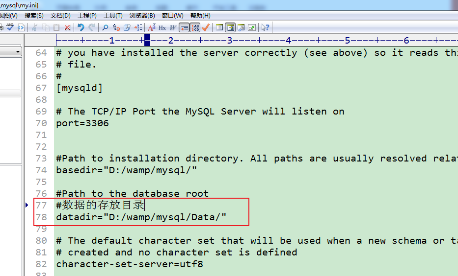

# MySql  数据库操作

----


## 概述


**SQL (Structured Query Language)**，结构化查询语言，是数据库系统的通用语言。


**数据查询语言(Data Query Language, DQL)** \\\\
只查询数据，不改变数据库中的数据，命令动词有 Select


**数据定义语言(Data Definition Language,DDL)** \\\\
创建、修改或删除数据库中的各种对象，包括表、视图、索引等。命令动词有  Create   Drop  Alter


**数据操纵语言(Data Manipulation Language,DML)**  \\\\
对数据库中的数据的插入、删除、修改等，命令动词有 insert   update  delete  


**数据控制语言(Data Control Language,DCL)**  \\\\
权限管理、控制事务、对数据库进行监视等，命令动词有  grant  revoke

----


## 库操作

### 创建数据库

```mysql
create database 库名  [库选项];
```
库选项，指字符集的设置，可选。


每个库，会对应一个数据目录，存放在当前mysql配置的数据库目录内。




**数据库名的问题**

**大小写**，取决于mysql服务器所在的操作系统！（**建议是**，认为区分大小写） \\\\
**特殊名称，关键字，特殊字符等**，默认是不可以的！ 

但是，可以使用 反引号(~按键) 将 名称 包裹起来，告知服务器，此处一个名字，而不是特殊操作！ \\\\
中文等都可以作为标识符（库名），同样需要反引号！（多字节字符，还需要注意字符集的问题）


### 查看数据库

```mysql
-- 查看已存在的所有库，复数(s)
show databases;

-- 查看数据库的定义语句
show create database 库名;
```
**模糊查询**
```mysql
show databases  like '模式';
```

**like** 关键字 用于过滤多个数据库，通常与通配符一起使用。


``% `` 匹配任意字符的任意次数（包括0次）的组合  \\\\
``_`` 匹配任意一个字符 


### 修改数据库

```mysql
-- 修改数据库选项
alter database 库名 [库选项];
```
库选项，指字符集的设置，可选。


### 删除数据库

```mysql
-- 删除数据库
drop database 库名;
```
删除数据库后那么对应的存放数据库的的文件夹也同样被删除！

----


## 表操作
### 创建表
```mysql
-- 在创建表之前一定要选择指定的数据库：
use 库名;
```
```mysql
-- 创建表
create table 表名 (
字段的定义,
字段的定义
) [表选项];
```

其中表名，一定先要确定数据库！因此一个典型的表名是由两部分组成：

``所在库.表名``

test.itcast       test库内itcast表  \\\\
itcast.stu         itcast库内的stu表


但是我们可以使用``use``设置默认数据库，如果不指定则使用默认数据库（即当前数据库）
在使用 表名 但是没有指明其所在数据库时，默认数据库才会起作用！

**字段**才是最终的数据的载体（与变量的概念是类似的，都是保存数据的），SQL的是强类型，字段的类型是固定的，提前定义好的！

因此，在定义字段时，至少要字段名 和 字段类型！

两种最基本的mysql数据类型（**int**， **varchar,varchar**必须指定最大长度，单位：字符。int可以省略长度）


**表选项部分**   \\\\
典型的常用的表选项有： \\\\
字符集，表引擎(**myisam**   **innodb** )

```mysql
create table my_table(
name varchar(20),
age int
)engine=MyISAM charset=gbk;
```


### 查看表

```mysql
-- 查看当前数据库所有表
show tables;

-- 模糊查询
show tables like  '模式';

-- 查看表的定义语句
show create table 表名;

-- 查看表结构
desc 表名;
```

``desc``   describe 的简写，描述 。


**like** 关键字 用于过滤多个表，通常与通配符一起使用。


``%`` 匹配任意字符的任意次数（包括0次）的组合  \\\\
``_`` 匹配任意一个字符 


在mysql的命令行客户端，如果数据过多，不容易展示！可以使用  ``\G``  作为语句结束符！


### 修改表
#### 修改表选项

```mysql
alter  table  表名  [新选项];
```


#### 修改表名

```mysql
rename  table  原表名  to  新表名;
```

注意，表名可以由``库名.表名`` 形式的！ \\\\
因此，可以跨库修改表名，只要在表名前增加 库名即可


#### 修改表结构

##### 增加字段

```mysql
alter  table  表名  add  column  字段定义  [字段位置];
```

``[字段位置]``

如果不指定其位置 添加的字段会默认在该表最后面！ \\\\
使用关键字 **after** **字段名**  或 使用关键字，**first**  。如：

```mysql
-- after   在指定字段的后面
alter table my_table add column num int after name;

-- first   在最前面，后面无需指定字段
alter table my_table add column id int first; 
```


##### 修改字段

```mysql
-- 修改字段的定义，可用 after 或 first 关键字，在后面
alter  table  表名  modify  column  字段名  新的定义 [位置];

-- 示例
alter table my_table modify column age varchar(20) first;
```


##### 删除字段

```mysql
alter  table  表名  drop  column  字段名;

-- 示例
alter table my_table change column name new_name varchar(10);
```


##### 字段改名

```mysql
-- 字段改名
-- 需要在改名的同时修改定义，不变的话要原样输入
alter  table  表名  change  column  原字段名  新字段名  新字段定义;
```


#### 删除表

```mysql
-- 删除表 
drop table 表名;

-- 可使用  if exists ，表存在才执行命令
drop table if exists 表名;
```

----


## 数据操作
### 增加数据

增加 创建 插入 数据(记录)

```mysql
-- 插入单条记录
-- 标准语法
insert into table_name (column_list) values(value_list);

-- 扩展语法
insert into table_name set column_1=value_1,column_2=value_2,... column_n=value_n;


-- 同时插入多条记录,逗号分隔
insert into table_name (column_list) 
values(value_list),
	  (value_list),
	  (value_list);
```

``table_name``    表名  \\\\
``column_list``  字段列表，逗号分隔，可省略，表示在值列表中要插入所有字段。 \\\\
``value_list``    值列表，逗号分隔，要与字段对应。    \\\\
``column_n``        字段n   \\\\
``value_n``   	 值n   \\\\


**注意**：字段与值的数量一定要匹配。数值类型，通常不需要增加引号！ 而字符串类型都需要出现引号内（单引号）。


**蠕虫复制**  \\\\
就是在已有的数据的基础之上，将原来的数据进行复制，插入到对应的表中！

语法：
``insert  into  表名(字段列表)  select *|字段列表 from 表名;``

``(字段列表)``   可省略，即，数据插入所有字段中。   \\\\
`` * | 字段列表 ``    可用 * 或 指定字段

注：表名可相同，即本表的数据查询并追加到本表。

```mysql
-- 蠕虫复制
insert into my_table select * from my_table2;

```


### 查询数据

查询  检索  数据(记录)

```mysql
-- 简单的查询语法
select column_list from table_name [where condition];
```
``column_list``  字段列表，使用 * 表示 所有字段  \\\\
``table_name``    表名  \\\\
``condition``     条件表达式，默认是没有，表示永远为真，建议添加``where 1`` 


### 更新数据

```mysql
update table_name set column_1=newValue_1, column_n=newValue_n  [where condition]
```

``table_name``    表名   \\\\
``column_1``      字段1   \\\\
``newValue_1``     新值1  \\\\
``condition``     条件表达式，可以省略。**表示永远为真**。  \\\\

每个``字段=值`` 之间逗号分隔   \\\\
**注意** ：在修改和删除记录的时候一定要加指定的条件！ 

类似于 删除，也可以使用 ``order by ``和 ``limit ``确定更新的记录！ 


### 删除数据

```mysql
delete from table_name [where condition];
```
``table_name``    表名  \\\\
``condition``     条件表达式，可以省略。**表示永远为真，即删除所有记录**。   \\\\


**注意，**删除是不可逆的。要避免没有条件的删除！

```mysql
-- delete时，支持 order by 和 limit 来限制删除的数据记录!
delete from stu order by height desc limit 1;
```

如果清空表，此时可以独立使用`` truncate ``语句，完成清空表    \\\\
``truncate 表名`` 先将表给删除，然后再重新创建一张表，即 主键可重置。   \\\\

通常用于清除测试数据。

```mysql
truncate stu;
```

 

----


## 额外的操作 

在  create  与 drop 时，有两个额外的操作：

* `if not exists`  如果不存在
* `if exists`   如果存在

```mysql
-- 如果不存在则创建
create database if not exists 库名;

-- 如果存在才删除
drop database if exists 库名;
```

```mysql
-- 选择数据库
use 库名;
```


----


# 事务(transaction)

一组 SQL 的集合，要不集体都执行成功，要不集体都失败，指的是，应该生成的影响退回到改组sql执行之前！

往往一个业务逻辑，是由多条语句组合完成！

## 语法

**开启事务：** `start transaction`   可以简写成\[ `begin`\]

记录下来，之后所执行的sql！（操作与结果）

**提交：**`commit`

如果所有的sql都执行成功，则提交。将sql的执行结果持久化到数据表内！

**回滚：**`rollback`

如果存在失败的sql，则需要回滚。将sql的执行结果，退回到事务开始之前

无论 回滚还是提交，都会关闭该事务！（需要再次开启，才能使用）

**事务在没有进行提交与回滚之前，只针对当前的 连接生效！如果已经提交或者是回滚那么所有的连接都生效！**

开启一个A连接：


让学生表中的李莫愁这个字段的money +1000


提交之后 A连接


开启一个B连接：


## 事务的基本原理(autocommit)


提交，就会将结果持久化，不提交不会！

**如果不开启事务**，执行一条sql，马上会持久化数据！

可见，普通的执行，是立即提交！


修改**autocommit**这个内置变量的值

`show variables like 'character-set-%';`


因为，默认的mysql对sql语句的执行是自动提交的！


开启事务其实就是，关闭了自动提交的功能！改成了**commit**执行手动提交！

因此，可以通过简单的对 是否自动提交 加以设置，可以完成开启事务的目的！

自动提交的特征是保存在服务的一个叫做 autocommit的一个变量内的！

使用` set 变量名=变量值` 的形式就可以完成修改：


**注意：**==事务类似于外键约束，只被innodb引擎支持！==


## 事务的特点(ACID)

**原子性，一致性，隔离型，持久性**

**原子性**：事务是不可分割的。

**一致性**：保证数据在 事务的执行周期内，是一致的！

**隔离型**：多个事务之间的干扰关系！隔离级别！

**持久性**：事务一旦被提交，就不可能在被回滚！

