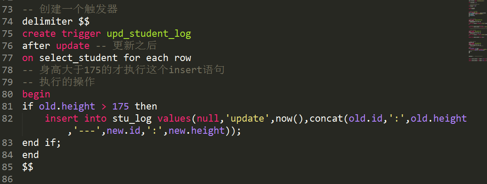
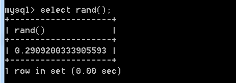
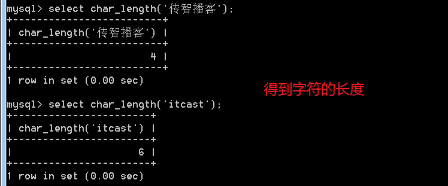

# SQL编程--触发器(trigger)

**场景：**

**日志系统**，记录对学生表有哪些操作！

解决的问题：

1.  得到每条学生记录被修改的时机，才能发出记录日志的动作！

2.  执行某段操作，需要得到当前处理的记录的信息！

触发器：一种编程设计！类似js的基于事件编程的程序设计的理念！可以在某个表的每条记录上，设置一个事件，从而对该表上的某些操作，加以监听！一旦所监听的行为出现，则会执行相应的代码。

```
记录				 =button

（修改，删除，增加）  =onclick

执行操作 			=alert('Hello');
```

以上的所有行为，都是采用 sql 完成的

## 语法

### 创建触发器

create trigger 触发器名字 触发条件，监听的内容，触发后执行的操作

```sql
CREATE TRIGGER trigger_name trigger_time trigger_event ON tbl_name FOR EACH ROW trigger_stmt
```

其中，触发条件，是由 事件的时机，与事件的内容 组成

时机：之前before，和之后after！

事件：增加insert，删除delete，修改update

因此，一共只有六种事件：

`before insert`   `before delete`   `before update`

`after insert` `after delete`   `after update`

监听的主体是由表中的记录发出的

`on table_name for each row`

执行的操作，就是一段 sql的集合！

 

 


### 删除触发器

`drop trigger trigger_name`


### 查看触发器的创建语法

`show create trigger trigger_name`


## 在触发程序中得到当前触发的记录信息

有，两个！

new（新的），old（旧的）

new，和old，都表示触发程序的记录！

new：新的记录。old：旧的记录！

取决于当前操作（intser，update，delete）去使用其中某个：

**insert**，增加记录，没有旧记录，只有new关键字可以使用

**delete**，删除记录，没有新纪录，只有old可用！

**update**，更新，既有新纪录，也有旧记录，更新前是旧记录，而更新后是新纪录！因此可以 new和 old


**更新日志：**

记录更新日志，要求是，只对某部分同学完成更新日志！

**只记录**，身高超过175学生的更新记录！记录学生id和修改前的身高与之后的身高

需要额外的增加条件判断！

**逻辑分支语句：**

```php
if 条件 then

语句体

else if 条件 then

语句体

....

else

语句体

end if;
```


**sql语句的结束符问题**

可以修改 最外层的语句结束符达到目的！

`delimiter $$`

将语句结束修改成 \$\$

记住用完后要再修改回来！

 

如果 触发程序由多条语句组成块。此时就需要使用

begin

end 将语句块包裹！

最终显示的代码

 


# SQL编程--存储函数

一：SQL也是一门程序设计语言！可以用其编程！

二：基本常规的编程要素：

* 变量，运算符，表达式，流程控制，函数


## 变量

典型的，字段名就是变量名，字段就是变量！

特殊的变量，例如系统内置变量（character\_set\_xxx, autocommit）

**变量的典型操作：**

*  赋值
* 取得值


### 用户自定义变量

用户自定义变量需要使用 @作为变量名的前缀，用于区分是否是系统内置变量！

set 语句 可以完成对变量的设置！

```sql
set 变量名=变量值;
```

 

怎么取得？

采用select 语句即可！

`select 变量名`

 


## SQL编程的的实现

一共有三种编程方式：

触发器，存储函数（自定义函数），存储过程

## 函数

### 内置函数

对于mysql来讲，有内置函数！


**rand()**,生成随机数的函数，得到0-1之间的随机数



典型的为了得到某个范围内的随机数，需要\* N倍：

需要配合上 取整使用，达到取得随机整数的目的：

**floor()** 向下取整：


**substring(字符串，位置，长度) **   ，截取字符串函数


注意，从1开始的下标! 而且是以为字符为单位：


**char\_length()**字符数量



**length()**字节长度


**concat()** 连接字符串


### 自定义函数

**函数的要素：**

函数名，函数体（返回值），函数参数

**函数的基本使用：**

声明，调用


#### 声明


注意多条语句，修改结束符

创建一个打招呼的函数


#### 调用

类似于系统函数即可！

`select 函数名`


注意，函数是存储在某个数据库内，因此与库是相关的！


#### 参数

**注意，**参数也是需要有类型之分

而且，不用使用@。原因是函数内的变量是不用区分的！参数是一个局部变量！


#### 函数局部变量与函数外全局变量的作用域问题

作用域是重叠的！在函数内，可以访问到函数外所定义的全局变量！


#### 局部变量

在 函数内的变量！

此时在函数内，使用 关键字 **declare** 来声明局部变量（js中类似var的作用）！


#### 流程控制

**分支**

```sql
if 条件 then

语句

else if 条件 then

语句

else

语句

end if;
```


**循环**

```php
while 条件 do

循环体

end while;
```

**示例：**求1-N之和：


练习：拼凑随机的名字！

getName(2\|3\|4)

参数为名字的长度，而返回值为名字！

业务逻辑：

取得姓，在某个集合内获取的！

再取的名字（根据字数，取得的数量不同）。


# SQL编程--存储过程

## 存储过程(procedure)

与函数类型，都是一个功能模块的代码！

相对于函数，函数，倾向于某个功能点。

而 存储过程，倾向于某个业务逻辑的整体实现！

**功能点**：自由得到用户名，函数


**业务逻辑**：向 select\_student 表内，插入1W条测试数据！，过程

### 语法

函数：`create function`

过程：`create procedure`

**创建**

```
create procedure 过程名 (参数列表)

begin

过程体，执行代码的集合

end
```

**注意没有返回值**

 

调用

不能直接调用！需要使用 **call** 关键字 调用 存储过程：


过程，是一个独立的业务逻辑，不能出现在表达式内。


## 存储过程的参数

功能类似函数的参数，也是在运行时传递数据。

但是，参数是分成 **三种** 类型：

### 输入，in

调用过程时，给过程传递数据，就是输入参数


使用过程来得到某个数的阶乘！


### 输出，out

调用过程之后，可以利用该参数，将数据传递出来！


### 输入输出，inout

同时完成 输入 和 输出功能。既可以输入数据，也可以输出数据！

利用：**in**，**out**，**inout**来声明参数，最像 php中 引用传递！


**典型，**可以利用过程，增加测试数据：

select\_student这个表中写入1W

**案例**：往某个表中写入1W条数据

1W条学生数据！


