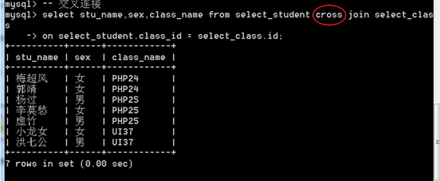

# MySQL 高级查询

----


## 数据查询

查询数据是整个业务逻辑中使用的最多而且也是最复杂的！


```mysql
select [字段表达式列表子句][from子句] [where 子句][group by 子句] [having 子句][order by子句] [limit 子句]
```

**七子句**    \\\\
from子句的后面的子句称五子句

**注意它们的书写顺序不能乱。**

----

### 字段表达式列表子句


```mysql
-- 示例
-- 5+10 
select 5+10;

-- now()
select now();

-- 使用 as 关键字指定别名
select now() as n;
```

as关键字可以省略 不建议省略    \\\\
凡是涉及到表达式到一定会牵扯到一个问题：优先级  \\\\
加上小括号，可提升优先级。 \\\\

----

### from子句

表示**查询的来源**，通常是表！


1，  可以写**表名列表**，使用逗号分割。

 ```mysql
select * from my_table1,my_table2;
 ```


如果此时没有条件，相当于形成了一个 笛卡尔积！  \\\\
A表的所有记录，都与B表的所有记录之间存在关联！  \\\\


出现了同样的字段名  可以用``as``关键字给字段取别名 

```mysql
select stu.id as s_id,class.id as c_id, name,class_name from stu,class;
```


2，  表的别名    \\\\

如果多次出现 ``表名.字段名``的情况，可以为表名起别名！ \\\\

如下``s.id`` 中的 ``s``使用的是后面定义的表别名

```mysql
select s.id as s_id,c.id as c_id, name,class_name from stu as s,class as c;
```


3，  dual 虚拟表   

```mysql
select 3+5 from dual;
```

----

### where子句

where 条件表达式

省略where子句，相当于永远为真

```mysql
-- 永远为真
select * from stu;
```


#### 比较运算符

``>       <       >=     <=   !=     =``

```mysql
-- 查询stu表中id>4的所有记录
select * from stu where id > 4;
```


#### 模糊查询

使用``like``关键字进行模糊查询    \\\\
可以使用 ``% ``和 ``_ ``作为通配符

``%`` 匹配任意字符的任意次数（包括0次）的组合  \\\\
``_`` 匹配任意一个字符 

 ```mysql
-- like 像
select * from stu where sex like 'fe%';
-- not like  不像，取反
select * from stu where sex not like 'fe%';
 ```


#### between  and 

范围比较，而且是闭区间！   \\\\
比如，``between 5 and 10``，相当于数学上的[5,10]

```mysql
-- 在 2和4之前
select * from my_table where id between 2 and 4;
-- 等价于
select * from my_table where where id >=2 and id <=4;
```

#### in与not in

都属于集合运算符，用于判断前面的元素是否在或不在一个集合当中！   \\\\

批量删除这个操作用的特别多。


**in**，在某个集合之内

``in (元素列表)``

```mysql
select * from stu where id in(3,4,8);
```


**not in**，不在某个集合内

``not in (元素列表)``

```mysql
select * from stu where id not in(3,4,8);
```


#### null 值的判断

不能使用普通的运算符，因为运算的结果都是null，而且不能作为查询条件！


应该使用 ``is null`` 或者 ``is not null`` 来判断！

```mysql
-- is null  是空值
select * from stu where id is null;

-- is not null  不是空值
select * from stu where id is not null;
```

函数 （``isnull()``）也可以完成类似的判断
```mysql
-- isnull()  是空值
select * from stu where isnull(id);

--  ! isnull()  不是空值
select * from stu where !(isnull(id));
```

----

### group by子句


对查询结果（已经通过where子句过滤之后的数据），按照某个字段，进行分组！   \\\\

 语法：``  group by  字段``


在分组的结果中，只会显示组内的头一条记录！因此，通常，分组之后的数据，除了分组的字段外，其他字段的逻辑含义很轻！ \\\\

 分组的作用，不在查询每个组内的具体数据。而其作用主要是在**分组统计**上。

#### 统计函数（聚合函数）

**count()**：求某个组内非null记录的个数。

通常就用count(*)来表示  统计记录数。典型的使用是 count(*)，但是除了*之外，是可以使用字段名的！

```mysql
select count(*) as c from my_table where 1 group by id;
select count(age) as c from my_table where 1 group by id;
```


**sum()**：求和。 \\\\
先根据某个或某几个字段进行分组，然后再对每一个组的某个字段进行相加！

```mysql
select sum(age) from my_table where 1 group by id;
```


**max()**：求某个组内某个字段的最大值 

```mysql
select max(age) from my_table where 1 group by id;
```


**min()**：求某个组内某个字段的最小值 

```mysql
select min(age) from my_table where 1 group by id;
```


**avg()**：求某个组内某个字段的平均值 

```mysql
select avg(money) from my_table where 1 group by id;
```


#### 分组后排序

分组成默认是升序(``ASC ``)    

``DESC`` 降序 


语法：

 ``group by 字段名  ASC|DESC ``

```mysql
select * from my_table where 1 group by id desc;
```


#### 多字段分组

``group by 字段1，字段2……``

```mysql
select * from my_table where 1 group by id,age desc;
```


#### 回溯统计

*回溯（su）统计*

其实就是向上统计！   \\\\
在进行分组统计的时候，往往需要做向上统计！   \\\\

比如，先统计各个班的最高分，然后就可以将各个班的最高分再进行一次统计，可以得到全年级的最高分！

 

在MySQL中，也支持回溯统计，其实就是在group by语句的后面加上``with rollup``即可！

```mysql
select * from my_table where 1 group by id with rollup;
```

----

### having子句  

功能上与where类似，都是条件子句！通常与聚合函数配合使用。   \\\\

主要的区别，在于执行时机：

**where**，是开始时，从数据源中检索数据的条件。   \\\\
**having**，是在筛选，分组之后，在得到的结果中，再次进行筛选的语法！   \\\\
**因此 having的结果 一定是 where 已经 过滤之后的结果!**   \\\\

```mysql
select avg(money) as m from my_table where 1 group by id having m>2000;
```

----

### order by 子句

对结果进行**排序**的语句！

**语法：**

``order by 字段名 [asc|desc], [字段名 [asc|desc],...]``

``asc``  升序  `` desc`` 降序

```mysql
select * from my_table order by id desc;
```

可按照多个字段进行排序 

```mysql
-- 先让 id 排序，再让 age 排序
select * from my_table order by id desc, age asc;
```

----

### limit 子句

限制 结果记录的数量！   \\\\
从所有的结果中，选择部分结果的字句。


可以从 某个位置开始，取得多少条！

语法：  \\\\

``limit  start,  size;``

``start `` ：起始位置   \\\\
``size``：取得的记录数

```mysql
-- 从第2条记录开始，获取5条记录
select * from my_table where 1 limit 1,5;
```


记录的起始下标为0


**注意**，第二个参数是 长度，而不是 终止位置！

limit使用的最多的地方就是用在分页！取得数量可理解为每页显示的数量。

----


## 子查询

### 概念

简单来说，所谓的**子查询**，就是一条select语句中又出现了其他的select语句！

**要求：**子查询的语句必须用一对括号括起来！

```mysql
select * from stu where height=(select height from stu order by height desc limit 0,1);
```


### 子查询的分类


两种分类依据：

1 依据 子查询出现的位置！   \\\\
**where型子查询 **， 出现在where子句内！   \\\\
**from 型子查询**， 出现在from子句内！   \\\\

 

2 依据 子查询的返回数据的格式！   \\\\
**标量子查询**，返回值是一个数据，称之为标量子查询！   一行一列的二维表   \\\\
**列子查询**，返回一个列，多行一列的二维表   \\\\
**行子查询**，返回一个行，一行多列的二维   \\\\
**表子查询**，返回的是一个二维表   \\\\


#### from型  表子查询

from型子查询一般就是当成一张表来使用，而且大部分出现在from之后，作为数据源！

```mysql
select * from (select * from stu where 1) as temp where 1 group by temp.id;
```


#### 列子查询

我们通常把列子查询的结果当成一个集合来使用！

所以，通常就是配合``in``或``not in``来使用列子查询！


#### 行子查询

一次性查出来一个行（多个行）使用 行进行匹配   


### exists型子查询


exists子查询的目的不是为了产生结果集，只是用来判断某个子查询是否查询到了数据！   \\\\
exists子查询返回的是一个布尔值！   \\\\

如果查询到了结果，就返回true（1），如果没有查询到数据，就返回false（0）   \\\\

exists出现在where条件里面 


---


## 连接查询

连接，多个表记录之间的连接！    \\\\

关键字 ： ``join``    \\\\

   \\\\
   

**语法：**   \\\\
``from 表名1  join   表名2  on 连接条件``

``join`` ，连接   \\\\
``on`` ，连接条件   \\\\

   \\\\

**分类：**    \\\\
内连接   \\\\
外连接(左外连接，右外连接)   \\\\
交叉连接   \\\\
自然连接   \\\\


### 内连接，inner join

记录与真实的记录连接，称之为内连接！（**两条真实存在的记录的连接**）

mysql默认的连接就是 ``inner join``


 

内连接，可以连接省略条件！   \\\\
on 可以省略：相当于连接条件永远成立！   \\\\
返回值是一个 **笛卡尔积！**


### 外连接，left join，right join

分成：左外连接``left join``，右外连接``right join``

连接的记录，可能是一方不存在的！（两条记录中，可能某条不存在）   \\\\
**注意：外连接一定要有连接的条件**


内连接，外连接差别不大，只是外连接会将没有连接成功的记录，也出现最终的连接的结果内，而内连接，连接的结果只有连接成功的（两条记录都存在的）   \\\\


**什么是左表** **和** **右表？**   \\\\
join关键字前面的（左边的）左表，join关键字后边的（右边的）右表！   \\\\

 

**左外**：如果出现左表记录连接不上右表记录的，左表记录会出现正在最终的连接结果内！而右表记录相应设置成NULL。   \\\\

**右外**：如果出现右表记录连接不上左表记录的，右表记录会出现正在最终的连接结果内！而左表记录相应设置成NULL。   \\\\

 

**总结**：左外连接它是以左表为主，右外连接它是以右表为主   \\\\

左右外连接其实它们可以是一样的 ，只需要换表所在的位置  


**工作中使用最多就是左外连接**


### 交叉连接，cross join

结果与 内连接一致！   \\\\
交叉连接 相当于 是 没有条件的内连接！    \\\\

内连接：


交叉连接：



 

### 自然连接，natural  join

自然连接它是拿多个表中**相同的字段名**来作为连接的条件    \\\\
mysql，自动判断连接条件，帮助我们完成连接！


## 连接条件，on，using

``on``，后面使用一个连接条件表达式！


``using(连接字段)``，要求使用同名字段进行连接！ 


----


# union查询，联合查询

将 多个查询的结果，并列到一个结果集合内！   \\\\
union要求两个表中的字段的数量要一样    \\\\
如果union 联合查询，集合里面字段的值是一样的话 ，会去重     \\\\


排序没有起作用


解决办法，添加 ``limit ``


----


# select语句的选项

``distinct``，取消相同的记录，即 去重复。   \\\\
默认是 all，可以不写，表示所有的记录都出现！ 

```mysql
select distinct age from stu;
```

