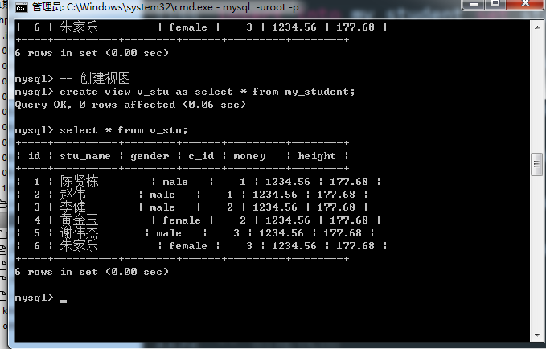
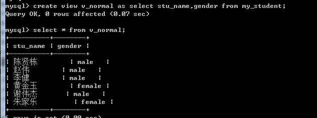
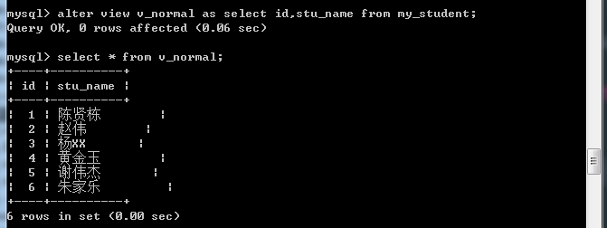
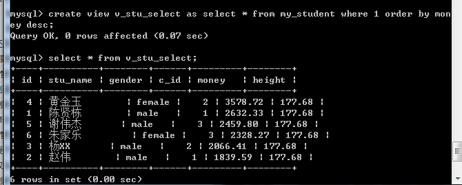
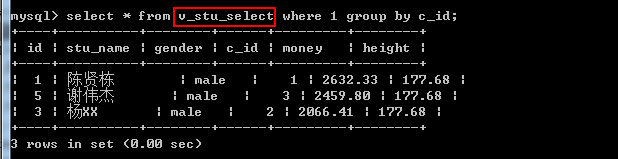
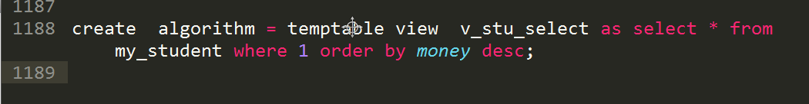

## MySQL 视图

**视图，view**

视图，是一张表，但是虚拟表！

是通过 一条 查询语句 得到一个张虚拟表！

因此，认为视图，就是 select语句的结果！

## 创建视图

视图的本质是SQL指令（select语句）

基本语法：`create view 视图名字 as select指令;` //可以是单表数据，也可以是连接查询，联合查询或者子查询

查看视图结构：视图本身是虚拟表，所以关于表的一些操作都适用于视图

比如有一个用户是超级管理员 我们可以给其看到所有的数据

普通用户我只想给其一个查看 学生姓名 、学生的所在班级

## 使用视图

视图是一张虚拟表：可以直接把视图当做"表"操作，但是视图本身没有数据，是临时执行select语句得到对应的结果。视图主要用户查询操作。

基本语法：`select 字段列表 from 视图名字 [字句];`

## 修改视图

修改视图：本质是修改视图对应的查询语句

基本语法：`alter view 视图名字 as 新select指令;`

## 删除视图

基本语法：`drop view 视图名字;`

## 视图算法(执行方式)

**算法(algorithm)**

**场景**

取得每个班级最高的学生信息

先将my\_student 表中的记录按照money字段进行降序排序 然后将其作为一个view表

然后再对v\_stu\_select 这个view表按照c\_id进行分组 想取得组内的第一条记录：但是发现在结果不对

视图 其实一共有三种执行方式：

merge，合并

temptable，临时表

undefined，未定义，就是默认的，mysql自己决定算法（从 merge，和temptable内选择）！

1、 merge算法是先合并后执行：group by是在order by之前执行，所以视图1是先合并后再执行，从而先执行的group by后执行order by，导致数据错误。

2、 temptable算法是先执行视图：拿到的数据就是排序好的数据，然后再执行外部select，进行group by，拿到的分组第一条一定是满足要求的。

注意：视图在使用过程中，如果出现了视图本身与外部select语句都有子句的情况下，要考虑是否选择temptable算法（系统倾向于使用merge）

