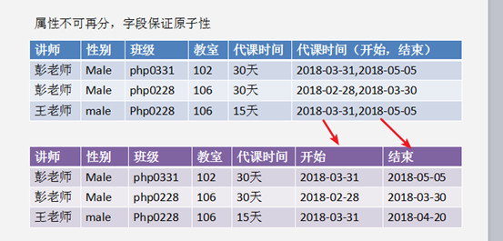
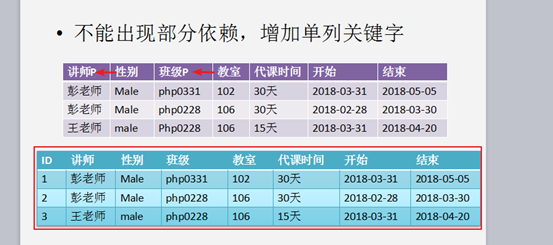
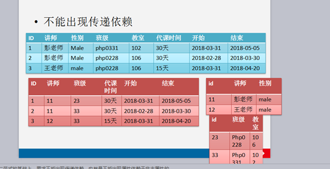

# 关系（二维表）的设计规范，范式

范式，**NF**，Normal Format，就是指对表的结构的要求！

目的：

1. 规范结构！
2. 减少数据冗余！

 

## 第一范式，1NF，字段原子性

要求字段不能再分，要求字段的原子性

原子：组成物质的最小单位，不可以再进行分割

----

## 第二范式，2NF，非部分依赖

**增加唯一主键即可！ID**

 

范式的要求，是逐渐递增！

在 满足 了 第一范式的前提下，不能出现部分依赖！

 

**部分依赖指的是**：普通字段 对 主键 是完全依赖的，而不应该是依赖主键的一部分！

依赖：可以通过那个 字段去决定另一个字段

 

因此，出现主键部分依赖的前提是，出现 复合主键！

 

消灭复合主键即可！增加一个唯一字段的主键即可。增加一个与业务逻辑毫无关系的，唯一的ID主键，
``int unsigned primary key auto_increment``

 

----

## 第三范式，3NF，非依赖传递  反第三范式|逆第三范式

在满足第二范式的前提下，取消 传递依赖，就是第三范式！

 

**传递依赖：**如果 字段B对字段A有依赖，而字段C对字段B存在依赖。则出现了传递依赖！

联表查询   效率就会很低   反第三范式

 

 