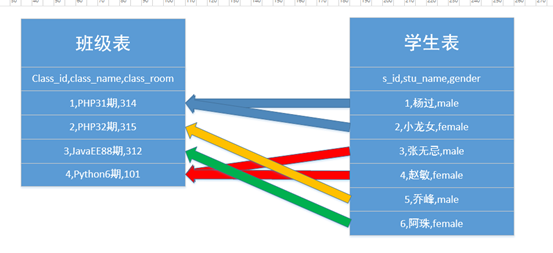
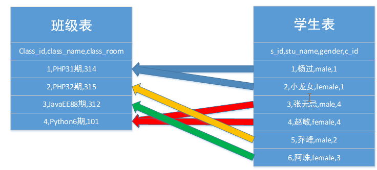
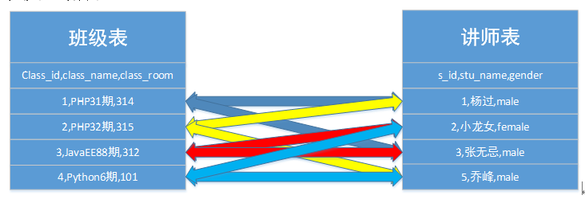
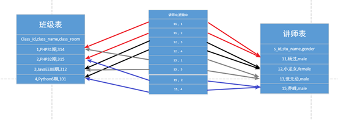

# 表关系

----

表关系：表与表之间（实体）有什么样的关系，每种关系应该如何设计表结构。

----

## 一对一

1：1

一对一：一张表中的一条记录与另外一张表中最多有一条明确的关系：通常，此设计方案保证两张表中使用同样的主键即可

 

**学生表**

| 学生ID（PRI） | 姓名 | 年龄 | 性别 | 籍贯 | 婚否 | 住址 |
| ------------- | ---- | ---- | ---- | ---- | ---- | ---- |
|               |      |      |      |      |      |      |

 

表的使用过程中：常用的信息会经常去查询，而不常用的信息会偶尔才会用到。

 

解决方案：将两张表拆分，常见的放一张表，不常见的放一张表

 

常用表

| 学生ID（PRI） | 姓名 | 年龄 | 性别 |
| ------------- | ---- | ---- | ---- |
|               |      |      |      |

 

不常用表

| 学生ID（PRI） | 籍贯 | 婚否 | 住址 |
| ------------- | ---- | ---- | ---- |
|               |      |      |      |

 

----

## 一对多

1：N  或者 N：1 

一对多，通常也叫作多对一的关系。通常一对多的关系设计的方案，在“多”关系的表中去维护一个字段，这个字段是“一”关系的主键。

 

``班级表  学生表  ``

 

一对多或者是多对一 应该是多的这一个表中 要新建一个字段来保存另外一端的所属ID 字段

----

## 多对多

 

多对多：一张表中的一条记录在另外一张表中可以匹配到多条记录，反过来也一样。

多对多的关系如果按照多对一的关系维护：就会出现一个字段中有多个其他表的主键，在访问的时候就会带来不便。

 

``班级表  讲师表`` 

既然通过两张表自己增加字段解决不了问题，那么就通过第三张表来解决。

 

**多对多解决方案；**增加一个中间表，让中间表与对应的其他表形成两个多对一的关系：多对一的解决方案是在“多”表中增加“一”表对应的主键字段。

