# NoSql之Redis数据库

 之前学习了memcache，一个缓存系统，在实际的使用中，Redis也是一个不错的nosql数据库（因为它的存储的value类型很多，并且功能也会memcache多很多）


## Redis简介

**Redis**是**Remote Dictionary Server**(远程数据服务)的缩写，它是NoSql中一款非常出色的产品，由意大利人 antirez(Salvatore Sanfilippo) 开发的一款`内存高速缓存数据库`同时支持`持久化`设置。该软件使用C语言编写，它的存储格式也是key-value然而它支持丰富的数据结构，具体一共有==5==种数据类型。

1. **String**（字符串类型）

2. **list**（链表）

3. **hash**（哈希表类型 映射  map）

4. **set**（无序的集合: 1. 无序性 2. 唯一性 3. 确定性）  

5. **sorted set**(有序集合、orderset、缩写为zset)（1. 有序性，存在一个排序的法则（数字 0-9   字母表 a-z   I II III xI.... ） 2. 唯一性 3. 确定性）


 

**==注意==**：上面我们说的value的数据类型，其实在底层都是一个字符串，只是这些字符串满足一种认为的特定格式，所有才有了这么多数据类型。


而且redis通过简单的配置把数据从内存保存到硬盘当中进行持久保存。Redis为高并发而生，是NoSql中的佼佼者。后起的nosql都是为了解决互联网上的高并发的问题。

 

## **常见的nosql产品**

 

网站：<http://www.nosql-database.org/>


## 常见nosql的比较

注意：key-value 底层的保存都是使用hash结构，特点就是时间复杂度为o(1)：随着数量的增加，在100w条里面查询一条记录和在1000w里面的时间数量级是一样的。

 


## Redis和Memcache

**memcache**不支持数据持久化，软件运行和安装都较小。Memcache是纯内存存储的数据库，单个key的value值只能保存1M的数据，默认最大的内存存储量是64M（`-m` 选项），Memcache具有分布式的算法功能（取模）。

 

**redis** 支持==数据持久化==和==内存存储==两种方式，软件运行比memcache大一点，可以设置缓存时间，redis集群是一个主从模式的，主服务器可用来读写，从服务器只能用来读。redis没有内置的分布式算法功能。Redis单个key的value可以存储的最大空间为**1G**，而总存储容量可以视硬盘的大小而定。

 

在PHP的官方当中Memcache具有Memcache类和Memcached类。而Redis(纯个人开发的产品)没有PHP官方的支持，**Redis的PHP扩展是其开发作者编写的**。


# ==Redis的安装和使用==

## Redis的安装操作系统和端口说明

redis是一款开源产品，主要开发平台为linux，所以原生的代码在linux下运行是最好的。

redis作者不愿意开发windows版本下的redis。微软技术小组，在redis源码的基础上，进行了开发windows版的redis，主要提供给ASP.NET使用，所以你也可以安装windows版本的redis程序。在本阶段当中，我们主要学习redis在Linux下的应用为主。

 

**Redis**默认使用的是`6379`端口，对一些众所周知的服务的端口一般我们不建议修改。

1. http 80
2. https 443
3. memcache 11211
4. redis 6379
5. mysql 3306
6. smtp 25
7. ipop3  110 (先发后收，从小到大)
8. sshd  22
9. ftpd  20、21
10. mongodb xxx
11. sphinx xxx


6379端口由来：redis作者为了追求一个女星，专门写了一个redis之后把端口命名为她的名字merz(九格宫键盘)。

<http://www.zhihu.com/question/20084750>

 

 


## **Windows下安装**

1. 复制软件

 

 

2. 在cmd里面启动服务（需要超级管理员的身份启动）

 

 

3. redis目录结构

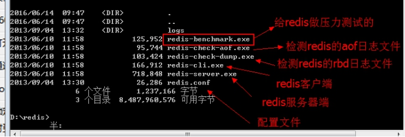 

 

4. 启动redis服务

 

​	如果要终止，则使用 `ctrl + c`即可。

 

## **Linux下Redis安装**

这个需要做源码的编译，下去可以百度一下 yum的安装，就是输入一条命令的事。

 

1. 上传源代码

 

 

2. 解压redis的源码包

 

 

3. 进入解压后的目录，然后进行`make`（redis安装不需要configure的过程）

 

 

4. 指定安装路径，进行安装` make   PREFIX=/usr/local/redis    install` （PREFIX必须大写）

 

 

6. 建立redis的配置文件目录和配置文件的副本

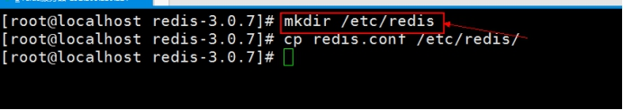 

 

7. 成功安装后的目录结构

 

 

## linux下redis服务的启动

 

1. 修改Redis的配置文件，将daemon改为yes

 

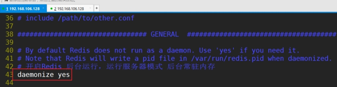 

 

2. 启动服务（跟随配置文件）

 

 

3. 使用客户端操作

 

​	注意：如果要终止则按`ctrl+c`

 

4. 关闭，在命令行输入` shutdown`

 

5. 如果停止不了，则采取杀死进程的方式

 

 


# ==Redis的数据类型==（重要）

需要注意：Redis是一个c/s的架构，在使用之前，必须确保服务器端是开启的，同时Redis也是一个key-value型的nosql的数据库。并且其value值的类型有如下的几种：

 

 

## string类型

1. **set**  设置值

   语法：`set   key  value`

 

 

2. **get** 获取值

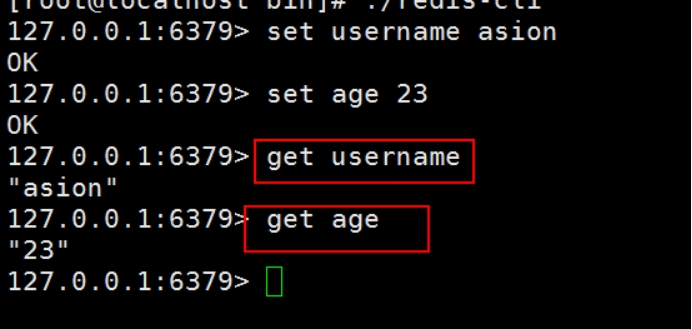 

 

3. **incr** 自增，默认自增1 $i++，注意：value的值必须是整数，还有如果key不存在则从0开始

 

 

 

 

4. **decr** 自减 默认是-1 $i--，值的类型必须是整数；如果key不存在默认是0

 

​	注意：可以使用tab键进行命令的补齐，也可以使用上下键来执行之前的命令。

 

5. **incrby** 指定自增的数字（步长）

 

 

6. **decrby** 指定自减的数字

 

 

一般来说是有key-value数据库最重要的就是key的设计。


==**如何设计redis下的key？**==

例如在mysql里面设计一张user表：

| id   | name  | password | email          | sex  |
| ---- | ----- | -------- | -------------- | ---- |
| 1    | asion | admin88  | gogery@163.com | m    |
| 4    | ruby  | admin    | ruby@sina.com  | f    |

注意：memcache的可以直接md5编码一下即可。 md5(key) ==> value


如果要把上面的user表转换成redis里面的key-value来保存，该如何设计key？

答：分如下几部

1.  把mysql里面的==表名称==换成redis里面key的前缀   **user:**

2. ​ 把mysql里面的表的==主键字段名称==换成后缀的第二个字符 **user： :id:**

3.  把对应记录的主键id==记录==换成key的第三个部分 **user：:id:: 1:**

4.  把mysql里面==其他所需的字段名==换成key的第四个部分 **user：:id::1:name** 


**保存邮箱的key：user：:id::1:email**

 

对应上面mysql表里面的数据，该这样保持在redis里面：

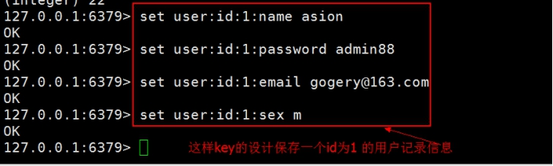 

取出数据：

 

取id为1的用户名

 


## hash类型

**redis里面value的hash类型完全和php里面的关联数组一样**。 和js里面的对象也是一样。

```
//php
$arrray = ['name'=>'caoyang', 'age'=>12]; 

//js 
var json = {'name':'caoyang', 'age':12}
```

 

1. **hset** 设置hash的单个值

 

2. **hget** 获取某个值

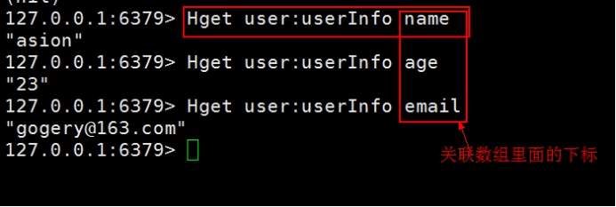 

3. **hmset** 设置hash的多个值

 

4. **hgetall**  获取整个key的hash值

 


## **link链表类型**（队列栈）

 

链表 可以从头部或者是尾部都可以存放数据

 

1. **lpush** 向链表的头部【左侧】压入数据    **L 的小写**

 

2. **rpush** 向链表的尾部【右侧】压入数据

 

 

实际使用：后台统计一下最近登录的10个用户

` select * from user order by logintime desc limit 10;`

换成redis的链表来实现的话，只需要设置一个链表，然后往链表的左侧压入10个username即可；如果10个满了，在链表右侧弹出一个值即可。

 

 

3. **lrange** 获取链表里面所有的元素

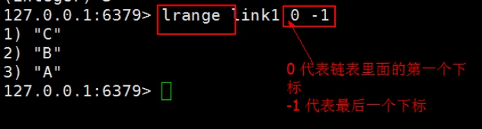 

4. **lpop** 删除链表里面头部的第一个元素，并返回该元素

 

5. **rpop**删除链表里面尾部的最后一个元素，并返回该元素

 

 

## **set类型**

集合分为两类：

* 无序集合

* 有序集合


 

一般来说我们口头上说的集合基本都是指的是**无序**即可。

 

集合：

 无序性， 元素的位置没有讲究

 唯一性， 里面的元素不能重复

 确定性， 元素的个数是确定的

 

交集：A∩B   === B∩A

并集：A∪B  === B∪A

差集：A-B  !===  B - A

差集定义：A-B 元素在A存在但是在B里面不存在。B-A元素在B里面存在，但是不在A存在

 

 

1. **sadd** 向集合里面添加元素，并查看

 

​	案例 ：来完成集合的交集、并集、差集

 

​	使用的场合，如豆瓣里面的==书签系统==。

 

 

集合实际使用的场合主要是==好友推荐，共同好友==。可能认识的人。

 

## orderset类型

orderset是set的一个升级版本【也叫作sortset】，意大利文叫zset，在set的基础上增加了一个顺序属性（权值1 2 3），这一属性在添加修改元素的时候可以指定，每次指定后，zset会自动重新按新的值调整顺序。有序列表值完成的是集合元素排序的功能。

 

有序集合里面的元素是有序的，并且也是唯一的，也是确定的。

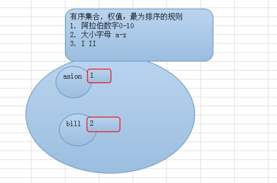 

1. **zadd** 添加有序集合

 

 

2. **zrange** 获取有序集合里面的元素

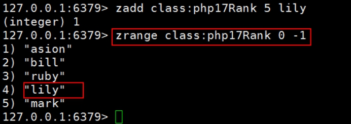 

 

3. `zrange  key 0 -1 WITHSCORES`  获取权值

 

 

实际应用场景：==最近最活跃的的前10个用户==。

最活跃：在有序集合里面权重最大。

如果现在这个场景使用mysql实现

| id   | name  | passwd  | lgtime  | lgnumber |
| ---- | ----- | ------- | ------- | -------- |
| 1    | asion | admin88 | 1234223 | 1        |
| 4    | bill  | admin88 | 53214   | 8        |

 

主要用户每登录一次，这个lgnumber 字段的次数就要+1；到时候可以统计登录次数最多的10个用户

` select * from user order by lgnumber desc limit 10;`


# ==php操作Redis==（重要）

通过上面的基本命令可以操作Redis后，一般来说我们都是编程语言进行操作，所以我们需要开启PHP操作Redis的扩展。

 

 http://www.runoob.com/redis/redis-tutorial.html


## **Windows下实现**

1. window下php操作redis扩展，前往该网站，搜索自己需要的PHP扩展

   下载地址：https://pecl.php.net/package/redis/2.2.7/windows

 

 

2. 选择合适的版本【注意：这里需要根据phpinfo函数的信息进行选择】

 

 

3. 点击上面的 【dll】链接后，选择合适的版本

 

 

4. phpinfo函数的信息

 

 

​	   到pecl网站下载合适的版本

 

 

5. 复制合适的扩展文件到php的ext目录

 

 

6. 修改php.ini文件，如果不存在则增加，存在则去除前面的分号

 


7. 重启集成开发环境

 

 

8. 浏览器访问

 


## Windows下简单操作

1. 在网站根目录编写如下代码

 

 

2. 浏览器访问即可

 

3. php操作redis手册

 


## **linux-开启PHP操作Redis的扩展** 

==**装扩展的的步骤**==

1. 下载对应的扩展源码（https://pecl.php.net/package/redis/2.2.7/windows）

2. 上传到 `/usr/local/src`

3. 解压` tar -zxvf `扩展包 `.tar.gz`

4. `cd `到解压目录

5. 执行一个 `/usr/local/php/bin/phpize` 执行这个生成一个 configure 文件（收集操作系统信息）

6. `./configure --with-php-config=/usr/local/php/bin/php-config `  ，收集操作系统信息，

7. 使用  `make && make install`  生成一个  扩展`.so `文件

8. 修改php.ini，加上  extension=  上一步 扩展.so  文件

9. 重启 php-fpm 

10. 使用 phpinfo() 函数查看

    

      

1. 上传源码包，并复制到`/usr/local/src`目录

 

 

2. 解压，并进入解压后的目录，并使用/usr/local/php/bin/phpize 生成文件

 

 

3. 使用`./configure --with-php-config=/usr/local/php/bin/php-config`来收集操作系统信息

 

 

4. 编译和安装

 

​	注意使用的编译和安装后会生产一个目录，目录下有一个NAME.so文件

 

 

5. 修改php.ini文件

 

​	增加如下内容

 

6. 重启Apache，并添加一个index.php测试文件

 

 

7. 浏览器访问这个测试文件

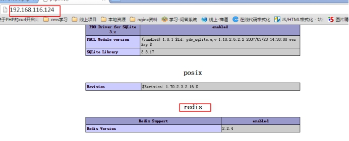 

 

8. 在网站根目录编写如下代码

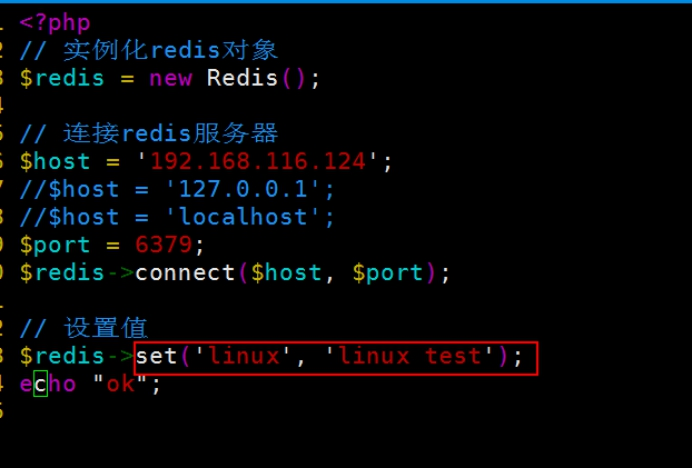 

 

8. 浏览器访问

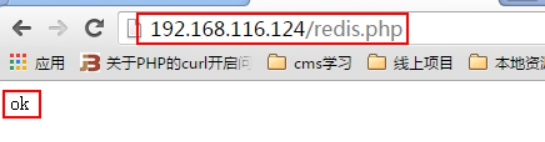 


# redis的一些小命令

1.` keys * `看所有的key【*  通配符，表示任意的字符】

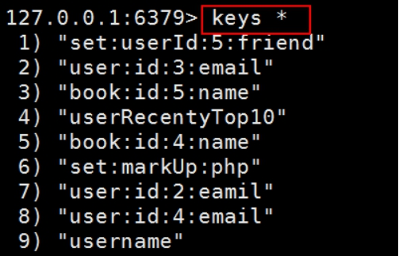 

 

2. `del 删除key`（成功返回1 不成功返回0）

 

 

3.` exists `检测key是否存在（存在返回1 不存在返回0）

 

 

4. `type` 查看value的类型

 

 

5. `flushdb `清空当前数据库所有的key，只在测试的时候使用，==线上千万不要使用==。

 


**注意：**

Redis下是存在数据库的概念，默认是存在**16**个数据库，每个数据库下我们可以保存属于自己的key-value的值。flushdb只是清空当前数据库的key。如果要清空所有的使用`flushall`。


Redis里面的 数据库可以认为是 key的一个集合。

 

6. `select Number`   切换数据库。redis默认是有16个数据库（下标从0开始），但是这个不怎么使用。

 

 

7. `flushall `清除所有数据库的key，千万==慎用==

 

 

8. `dbsize` 查看当前数据库的key的个数

 

 


# redis安全认证

在默认的情况下redis不需要任何密码就可以登录，为了设置客户端连接后进行任何其他操作前需要使用的密码，我们使用Redis的安全认证，然而这个安全认证的密码是明文的。

注意：memcache是没有权限机制，Redis是存在密码操作。后面的mongodb里面定义类似一套rbac（基于角色的权限管理）的机制。

 

1. 开启

 

 

​	重启redis的服务即可

 

 

2. 登录测试

 

​	解决：

 

​	还一种方案在登录的时候加参数` -a admin88`

 

 

# ==redis的持久化==（重要）

## 简介

注意：我们在使用Redis的时候，Redis里面的存储的数据是保存在内存里面，但是Redis提供了持久化的机制，可以将内存里面的数据持久保存在硬盘。

我们在使用数据的时候，其实是操作的内存，但是通过一定方式将内存的数据保存在磁盘。如果要实现持久化，则**有两种方式可以实现：**

1. 基于==快照==的方式，将内存的数据直接一次性的快照到磁盘上面，相对对系统的开销很大。
2. 基于==文件追加==的方式，定期把内存里面的数据追加到一个文本文件里面。


在redis当中，redis开发设计两种持久化的模式，如下：

 

Redis的快照模式，默认安装完成就会自动开启的持久化模式，可以通过查看redis命令的目录下的的快照文件dump.rdb。

`vim /etc/redis/redis.conf`

 

 

dump.rdb文件就是redis的快照文件，它保存了redis所有的数据信息和记录，如果当网站数据量变大，该文件也会随之增大，操作效率很低。因此我们有必要去把该模式改为 `aof 持久化模式`【append of file文件追加模式】。

 

Redis中的Aof模式：Redis的aof文件有点类似mysql的**binlog**日志【读写分离的时候】，该文件把用户的操作记录包括查询的过程全部记录，当服务器出现问题的时候，那么redis会将数据从内存中保存到aof文件当中，当服务器重新运行时那么aof就会根据操作的记录把数据重新还原到Redis的内存当中过去，以却保数据的完整性。我们作为应用者，只需要了解aof的持久化模式是记录用户的操作而非实时数据记录就可以了，然后我们需要知道如何开启aof持久化模式。

 

==快照模式和aof模式是完全互斥的。==

 

如果aof的模式一旦启动，那么快照就会失效，redis就会把所有的数据缓存到内存当中，如果你发生重启，停止，关闭服务器等行为，那么aof文件就会把内存中数据同步到硬盘中。

## 快照模式

1. 开启

 

`save 900 1 `表示的含义：如果在900s或者900s以上有1次对key的操作则把内存数据持久化到磁盘上

`save  300 10` 表示的含义：如果在300s或者300s以上有10次对key的操作则把内存数据持久化到磁盘上

`save 60 10000 `表示的含义：如果在60s或者60s以上有10000次对key的操作则把内存数据持久化到磁盘上

 

如果忘记了，则查看即可

 

2. 测试 

   可以使用  `bgsave background save`快速的把内存数据持久化到磁盘上。

 

 

## aof 模式

aof【append fo file】，和快照是互斥。

 

1. 修改 `/etc/redis/redis.conf`配置文件

 

 

2. 设置持久化数据的频率

 

 

**appendfsync always** 的选项表示redis的命令每一次只要运行那么就会马上写入aof操作文件当中，该选项是最没有效率的，然后它却是最具备操作记录完整性的。

**appendfsync everysec **的选项是redis比较==折中==的选项，表示每一秒中只要有操作那么就会进行操作记录，但是如果在某一秒当中redis发生故障，那么这一秒的数据操作记录将有可能发生丢失的情况，存在一定的风险，然而这个配置的性能比较适合中，所以建议使用，因为redis一秒中内可以写81000次/s所以虽然存在一定的风险，但只要不要把一些非常重要的敏感数据至于redis当中，那么就不需要过分担心这个问题。

**appendfsync no** 该配置的效率完全依赖您当前所在使用的操作系统和计算机的性能，即，系统空闲时才写入。如果操作系统稳定，计算机的性能强大，那么这一项是最有效率的，反而就是最差，所以一般最好不要设置该项。

 

