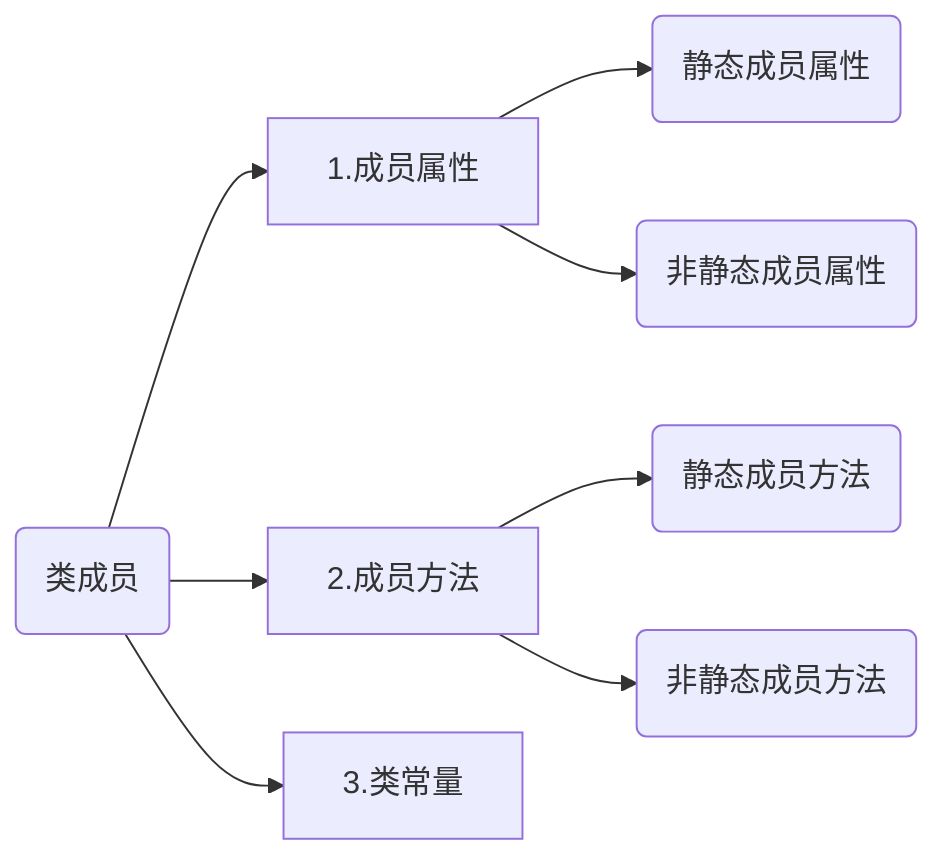

# 面向对象

## 1. 面向对象相关概念

### 为什么使用面向对象

编程思想有两个大类：1）面向过程思想；2）面向对象思想；


#### 面向过程思想介绍

我们来看以下场景：


==**小结**==：

面向过程思想：面向的是**==过程==**，强调的是**==过程中==**每一个执行的**==步骤==**。


#### 面向对象思想介绍

同样是相同的场景，使用面向对象的方式来解决最终的问题：


==**小结**==：

面向对象思想：面向的是**==对象==**，强调的是**==最终==**执行的**==结果==**。


#### 面向过程思想的局限性

1. 使用面向过程思想开发，代码冗余率高，重用性低；
2. 使用面向过程思想开发，如果中途需求发生改变，那么代码的改动量将会相当庞大。

 

正是由于有这些局限性，所以人们慢慢过渡到使用面向对象的方式来进行开发，解决上述局限性问题。

### 什么是面向对象

面向对象即==OOP== （Object Oriented Programming）

**==概念==**：以面向对象思想为指导的一种编程方式。


通俗的理解面向对象：==找个对象帮我做事==。


## 2. ==PHP中的类与对象==

### 类

程序本质上就是对现实世界的模拟。

 

现实世界中的类是一个比较抽象的概念，比如人类，鱼类，车类等，它其实就是**==拥有相同特性的事物的统称==**；

程序当中也有类的概念。

 

现实当中类的概念：具有相同 **==特征==** 和 **==行为==** 的一类群体的统称。

PHP中的类的概念：具有相同 **==属性==** 和 **==方法==** 的一类事物的集合。


==**PHP中类的定义语法**==

```php
//定义一个类，class是关键字
class 类名{
    类成员
}

#定义类的案例
<?php

//定义一个类
class Person{

}

echo '语法无误，成功定义出了一个名为Person的类'; 
```


### 类成员

类成员包括==三个大类==：



### 对象

对象需要**==基于类的定义==**创建出来。

**==创建对象的语法==**

```php
//需要先定义一个类
class demoA{
    
}

//然后再基于一个已有的类创建对象，关键字为：new
//基于demoA类创建了一个对象，将创建的对象赋值给$obj变量
$obj = new demoA;
```

构建一个名为code2.php的程序，代码如下：

```php
<?php

//定义一个类
class demoA{

}

//然后再基于一个已有的类创建对象，关键字为：new
//基于demoA类创建了一个对象，将创建的对象赋值给$obj变量
$obj = new demoA;
var_dump( $obj ); echo '<hr/>';
$obj1 = new demoA;
var_dump( $obj1 ); 
```

访问code2.php，效果为：

```mysql
object(demoA)#1 (0) { }   #这个是输出的$obj的内容
object(demoA)#2 (0) { }   #这个是输出的$obj1的内容
```


**==小结==**：

1. 创建对象之前必须要类的定义；
2. 根据一个已有的类使用关键字new来创建一个对象；


### 对象创建的原理

**==原理图==**：


**==小结==**：

1. 一个类最多**==只有==**一份**==专有==**的静态成员空间；
2. 每当new一个对象的时候，程序就会去内存中开辟一个全新的对象空间（也就是说new一次，就开一个）；
3. 静态成员属性、类常量和静态成员方法将会被放置在静态成员空间中；非静态成员属性和非静态成员方法将会被放置在每次new时新开辟出来的对象空间中；


### 类成员的定义

#### 成员属性

**==需求==**：定义名为Person的类，

1. 在Person类中定义一个非静态成员属性，名为"name"，值为"zhangsan"；
2. 在Person类中定义一个非静态成员属性，名为"age"，不指定值；
3. 在Person类中定义一个静态成员属性，名为"height"，值为"1.78"；
4. 在Person类中定义一个静态成员属性，名为"weight"，不指定值；

**==解答==**：构建名为code4.php的程序文件，代码如下：

```php
<?php

class Person{
    #成员属性
    //定义非静态成员属性，关键字public
    public $name='zhangsan';
    public $age;

    //定义静态成员属性，关键字是public、static，静态成员属性一定有static关键字，写在public后面
    public static $height=1.78;
    public static $weight;
}

echo '本例中定义了成员属性'; 
```

访问code4.php，输出的内容为，说明语法没有问题：

```mysql
本例中定义了成员属性
```


**==小结==**：

1. 定义非静态成员属性的关键字为public，在定义的时候可以指定初始值也可以不指定；
2. 定义静态成员属性的关键字为public、static，在定义的时候可以指定初始值也可以不指定；
3. 类的定义，在程序执行的过程中不会被执行，程序会选择直接跳过，因为这只是一个定义出来的结构，不是执行的代码段；


#### 成员方法

**==需求==**：定义名为Person的类，

1. 在Person类中定义一个名为singing的非静态成员方法，方法中输出"我会唱歌"；
2. 在Person类中定义一个名为dancing的静态成员方法，方法中输出"我会跳舞"；

**==解答==**：构建名为code5.php的程序文件，代码如下：

```php
<?php

class Person{
    #成员方法
    //非静态成员方法，关键字为public，结构与函数一致
    public function singing(){ 
        echo '我会唱歌'; 
    }
    //静态成员方法，关键字为public和static，结构与函数一致
    public static function dancing(){ 
        echo '我会跳舞'; 
    }
}

echo '本例中定义了成员方法'; 
```

访问code5.php，输出的内容为，说明没有语法错误：

```
本例中定义了成员方法
```

**==小结==**：

1. 定义非静态成员方法的关键字为public，结构与函数一致；
2. 定义静态成员方法，关键字为public和static，结构与函数一致；
3. 类的定义，在程序执行的过程中不会被执行，程序会选择直接跳过，因为这只是一个定义出来的结构，不是执行的代码段；


#### 类常量

**==需求==**：定义名为Person的类，

1. 在Person类中定义一个类常量，名为"AREA"，值为"广东省广州市"；

**==解答==**：构建名为code6.php的程序文件，代码如下：

```php
<?php

class Person{
    #类常量，关键字是const，其实类常量与普通常量在性质上没有区别，只不过定义的地方不同和之后调用的方式有所区别；
    const AREA='广东省广州市';
}

echo '本例中定义了类常量'; 
```

访问code6.php，输出的内容为，说明没有语法错误：

```
本例中定义了类常量
```

**==小结==**：

1. 定义类常量的关键字是const，注意不能用define函数来进行定义；


### 类成员的调用

#### 类的外部调用类成员

##### 成员属性

**==需求==**：定义名为Person的类，

1. 在Person类中定义一个非静态成员属性，名为"name"，值为"zhangsan"；
2. 在Person类中定义一个非静态成员属性，名为"age"，不指定值；
3. 在Person类中定义一个静态成员属性，名为"height"，值为"1.78"；
4. 在Person类中定义一个静态成员属性，名为"weight"，不指定值；
5. 实现在类的外部输出四个属性的值；

**==解答==**：构建名为code7.php的程序文件，代码如下：

```php
<?php

class Person{
    #成员属性
    //定义非静态成员属性，关键字public
    public $name='zhangsan';
    public $age;

    //定义静态成员属性，关键字是public、static，静态成员属性一定有static关键字，写在public后面
    public static $height=1.78;
    public static $weight;
}


#在类的外部调用类成员属性
//调用非静态的成员属性
$zhangsan = new Person;
var_dump( $zhangsan->name ); echo '<br/>';
var_dump( $zhangsan->age ); echo '<hr/>';

//调用静态的成员属性
var_dump( Person::$height ); echo '<br/>';
var_dump( Person::$weight );

```

访问code7.php，输出的内容为：

```mysql
string(8) "zhangsan" //$zhangsan对象调用$name属性的值
NULL  //$zhangsan对象调用$age属性的值

float(1.78) //Person类调用$height属性的值
NULL  //Person类调用$weight属性的值
```


**==小结==**：

1. 要想成功在类的外部调用非静态成员属性，需要：1）先使用new**创建一个对象**；2）然后使用这个对象来加上固定的符号"**==->==**"来实现调用；3）调用时指定的属性名字**==不需要加上"$"==**；
2. 要想成功在类的外部调用静态成员属性，直接使用**==所属类的类名==**加上"**==::==**"访问属性，访问时需要加上"**==$==**"；
3. "::"这个符号我们通常会称为"冒冒"，专业的叫法是：范围解析操作符；


##### 成员方法

**==需求==**：定义名为Person的类，

1. 在Person类中定义一个名为singing的非静态成员方法，方法中输出"我会唱歌"；
2. 在Person类中定义一个名为dancing的静态成员方法，方法中输出"我会跳舞"；
3. 实现在类的外部分别调用执行singing和dancing方法；

**==解答==**：构建名为code8.php的程序文件，代码如下：

```php
<?php

class Person{
    #成员方法
    //非静态成员方法，关键字为public，结构与函数一致
    public function singing(){ 
        echo '我会唱歌'; 
    }
    //静态成员方法，关键字为public和static，结构与函数一致
    public static function dancing(){ 
        echo '我会跳舞'; 
    }
}

#在类的外部实现访问成员方法
//访问非静态的成员方法
$obj = new Person;
$obj->singing();

echo '<hr/>';

//访问静态的成员方法
Person::dancing();

```

访问code8.php，输出的内容为：

```mysql
我会唱歌  #访问非静态成员方法singing输出的结果
我会跳舞  #访问静态成员方法dancing输出的结果
```


**==小结==**：

1. 访问类中的方法其实和调用函数效果差不多；
2. 访问非静态成员方法需要：1)先**创建一个对象**；2）再使用这个对象来加上"**==->==**"进行调用；
3. 访问静态成员方法需要：1)**指定所属的类名**；2）再加上"**==::==**"来进行访问；


##### 类常量

**==需求==**：定义名为Person的类，

1. 在Person类中定义一个类常量，名为"AREA"，值为"广东省广州市"；
2. 实现在类的外部调用输出类常量；

**==解答==**：构建名为code9.php的程序文件，代码如下：

```php
<?php

class Person{
    #类常量，关键字是const，其实类常量与普通常量在性质上没有区别，只不过定义的地方不同和之后调用的方式有所区别；
    const AREA='广东省广州市';
}

#在类的外部调用类常量
var_dump( Person::AREA ); 
```

访问code9.php，输出的内容为：

```mysql
string(18) "广东省广州市"  #输出类常量的值
```


**==小结==**：

1. 要想在类的外部访问类常量，需要：1）指定所属的类名；2）还需要加上"::"来进行直接访问；


**类的外部访问类成员总结**：

1. 类的外部访问非静态的成员属性

   ```php
   #第一步，需要先实例化一个类的对象
   $obj = new 类名;
   #第二步，再使用创建的对象调用相关的非静态成员属性，属性名部分不包括"$"符号
   var_dump($obj->属性名);
   ```

2. 类的外部访问静态成员属性

   ```php
   #直接使用所属的类名来进行访问
   var_dump(类名::$属性名);
   ```

3. 类的外部访问类常量

   ```php
   #直接使用所属的类名来进行访问
   var_dump(类名::类常量名);
   ```

4. 类的外部访问非静态成员方法

   ```php
   #第一步，需要先实例化一个类的对象
   $obj = new 类名;
   #第二步，再使用创建的对象调用相关的非静态成员方法
   $obj->方法名([实参列表]);
   ```

5. 类的外部访问静态成员方法

   ```php
   #直接使用所属的类名来进行访问
   类名::方法名([实参列表]);
   ```


#### 类的内部调用类成员

##### 成员属性

**==需求==**：定义名为Person的类，

1. 在Person类中定义一个非静态成员属性，名为"name"，值为"zhangsan"；
2. 在Person类中定义一个静态成员属性，名为"height"，值为"1.78"；
3. 在Person类中定义一个名为test的非静态成员方法，在test方法中实现输出"name"的值和"height"的值；
4. 在Person类中定义一个名为test_static的静态成员方法，在test_static方法中实现输出"height"的值，并且尝试输出"name"的值；

**==解答==**：构建名为code11.php的程序文件，代码如下：

```php
<?php

class Person{

    #成员属性
    //非静态成员属性
    public $name='zhangsan';
    //静态成员属性
    public static $height=1.78;

    #测试在非静态方法中访问成员属性
    public function test(){ 
        //访问非静态成员属性
        var_dump( $this->name ); echo '<br/>';
        //访问静态成员属性
        var_dump( Person::$height ); 
    }
    #测试在静态方法中访问成员属性
    public static function test_static(){ 
        //访问静态成员属性
        var_dump( Person::$height ); 
        //尝试访问非静态成员属性
        var_dump( $this->name ); 
    }
}

//调用非静态成员方法test
$obj = new Person;
$obj->test();

echo '<hr/>';

//调用静态成员方法test_static
Person::test_static();
```

访问code11.php，输出的内容为：

```mysql
string(8) "zhangsan"    #访问非静态方法test内部$this->name的输出内容
float(1.78)             #访问非静态方法test内部Person::$height的输出内容
float(1.78) 		   #访问静态方法test_static内部Person::$height的输出内容

#访问静态方法test_static内部$this->name的出错信息
Fatal error: Uncaught Error: Using $this when not in object context in F:\home\class\day6\code\code11.php:23 Stack trace: #0 F:\home\class\day6\code\code11.php(34): Person::test_static() #1 {main} thrown in F:\home\class\day6\code\code11.php on line 23
```


**==小结==**：

1. 在**==类的内部==**访问**==静态成员属性==**的方式

   ```php
   //访问方式如下
   本类的类名::$静态成员属性名
   ```

2. 在类的内部**==只有==**  **==非静态成员方法中==** 才能访问 **非静态成员属性**，访问方式是

   ```php
   //访问方式如下
   $this->非静态成员属性名
   ```

3. 如果在静态成员方法中访问非静态成员属性，则会直接报错；


##### 成员方法

**==需求==**：定义名为Person的类，

1. 在Person类中定义一个名为singing的非静态成员方法，方法中输出"我会唱歌"；
2. 在Person类中定义一个名为dancing的静态成员方法，方法中输出"我会跳舞"；
3. 在Person类中定义一个名为test的非静态成员方法，在test方法中调用singing和dancing方法；
4. 在Person类中定义一个名为test_static的静态成员方法，在test_static方法中实现dancing方法，并且尝试调用singing；

**==解答==**：构建名为code12.php的程序文件，代码如下：

```php
<?php

class Person{

    #成员方法
    //非静态成员方法
    public function singing(){ 
        echo '我会唱歌'; 
    }
    //静态成员方法
    public static function dancing(){ 
        echo '我会跳舞'; 
    }

    #在类的内部测试访问成员方法
    //非静态成员方法
    public function test(){ 
        //访问非静态成员方法singing
        $this->singing();
        echo '<br/>';
        //访问静态成员方法dancing
        Person::dancing();
    }

    //静态成员方法
    public static function test_static(){ 
        //访问静态成员方法dancing
        Person::dancing();
        //尝试访问非静态成员方法singing
        $this->singing();
    }
    
}

//调用非静态成员方法test
$obj = new Person;
$obj->test();

echo '<hr/>';

//调用静态成员方法test_static
Person::test_static();
```

访问code12.php，输出的内容为：

```mysql
我会唱歌      #访问非静态方法test内部$this->singing();的输出内容
我会跳舞      #访问非静态方法test内部Person::dancing();的输出内容
我会跳舞      #访问静态方法test_static内部Person::dancing();的输出内容

#访问静态方法test_static内部$this->singing();的报错内容
Fatal error: Uncaught Error: Using $this when not in object context in F:\home\class\day6\code\code12.php:30 Stack trace: #0 F:\home\class\day6\code\code12.php(42): Person::test_static() #1 {main} thrown in F:\home\class\day6\code\code12.php on line 30
```


**==小结==**：

1. 在**==类的内部==**访问**==静态成员方法==**的方式

   ```php
   //访问方式如下
   本类的类名::方法名([实参列表])
   ```

2. 在类的内部**==只有==**  **==非静态成员方法中==** 才能访问 **非静态成员方法**，访问方式是

   ```php
   //访问方式如下
   $this->方法名([实参列表])
   ```

3. 如果在静态成员方法中访问非静态成员方法，则会直接报错；


##### 类常量

**==需求==**：定义名为Person的类，

1. 在Person类中定义一个类常量，名为"AREA"，值为"广东省广州市"；
2. 在Person类中定义一个名为test的非静态成员方法，在test方法中输出类常量；
3. 在Person类中定义一个名为test_static的静态成员方法，在test_static方法中输出类常量；

**==解答==**：构建名为code13.php的程序文件，代码如下：

```php
<?php

class Person{

    #类常量
    const AREA='广东省广州市';

    #在类的内部测试访问成员方法
    //非静态成员方法
    public function test(){ 
        var_dump( Person::AREA ); 
    }

    //静态成员方法
    public static function test_static(){ 
        var_dump( Person::AREA ); 
    }
    
}

//调用非静态成员方法test
$obj = new Person;
$obj->test();
echo '<hr/>';

//调用静态成员方法test_static
Person::test_static();
```

访问code13.php，输出的内容为：

```mysql
string(18) "广东省广州市"    #访问非静态方法test内部Person::AREA的输出内容
string(18) "广东省广州市"    #访问静态方法test_static内部Person::AREA的输出内容
```


**==小结==**：

1. 在类的内部直接使用本类的类名加"::"访问类常量。


**==类的内部调用类成员总结==**：

1. 我们以在类的内部访问成员属性为例，构建了一张原理图，如下：

   

   从分析原理图的原理流程中，我们了解学习到：

   1. $this代表"哪个对象调用，就代表那个对象"，通俗的将就是，$this代表当前所在的这个对象空间，比如上图中的#1空间；
   2. 我们在案例测试中发现，在静态的方法中，如果调用非静态成员（包括非静态成员属性和非静态成员方法）时，将会报错；原因是：1）调用非静态成员都需要使用对象，而对象是在执行过程中才能确定的；但是静态方法是在编译时就确定了，所以要在一个编译阶段确定的方法中去调用未来执行阶段才能确定的对象成员，显而易见，是不能成功调用到的，我们永远没有办法确定未来有多少个对象，要调用这些对象中的哪一个。


### 对象的比较

在程序中，对象是保存在**变量中**的，变量之间可以使用"=="等于和"\=\=\="全等于进行比较，也就意味着对象也可以进行这两种比较。


**==需求==**：定义名为Person的类，

1. 在Person类中定义一个非静态成员属性，名为"name"，值为"zhangsan"；
2. 在类的外部分别对Person类创建两个对象；
3. 使用"=="等于 和  "\=\=\="全等于对两个对象进行比较，输出比较的结果；

**==解答==**：构建名为code14.php的程序文件，代码如下：

```php
<?php

class Person{
    public $name='zhangsan';
}

$obj1 = new Person;
$obj2 = new Person;

echo 'obj1：'; var_dump( $obj1 ); echo '<hr/>';
echo 'obj2：'; var_dump( $obj2 ); echo '<hr/>';

$re = $obj1==$obj2;
echo '等于比较(==)：'; var_dump( $re ); echo '<hr/>';

$re = $obj1===$obj2;
echo '全等于比较(===)：'; var_dump( $re ); echo '<hr/>';
```

访问code14.php，输出的内容为：

```php
obj1：object(Person)#1 (1) { ["name"]=> string(8) "zhangsan" }
obj2：object(Person)#2 (1) { ["name"]=> string(8) "zhangsan" }
等于比较(==)：bool(true)
全等于比较(===)：bool(false)
```


**==小结==**：

1. 如果使用等于比较(==)两个对象，则只比较对象的内容，不比较空间；
2. 如果使用全等于比较(===)两个对象，则不仅要比较对象的内容，还需要比较对象所在的空间是否是同一个空间，如果空间不同，则比较的结果也将会是false；


### self关键字

self关键字的**作用**是，在**==本类的内部==**代替**==本类的类名==**。


**==需求==**：定义名为Person的类，

1. 在Person类中定义一个静态成员属性，名为"name"，值为"zhangsan"；
2. 在Person类中定义一个类常量，名为"AREA"，值为"广东省广州市"；
3. 在Person类中定义一个名为test的非静态成员方法，在test方法中输出"name"的值和类常量的值；
4. 在Person类中定义一个名为test_static的静态成员方法，在test_static方法中输出"name"的值和类常量的值；

**==解答==**：构建名为code15.php的程序文件，代码如下：

```php
<?php

class Person{
    public static $name='zhangsan';
    const AREA='广东省广州市';

    #构建非静态的测试成员方法
    public function test(){ 
        echo '使用类名进行访问：<br/>'; 
        echo '静态成员属性name：'; var_dump( Person::$name ); echo '<br/>';
        echo '类常量AREA：'; var_dump( Person::AREA ); echo '<hr/>'; 
        
        echo '使用self代替本类的类名进行访问：<br/>'; 
        echo '静态成员属性name：'; var_dump( self::$name ); echo '<br/>';
        echo '类常量AREA：'; var_dump( self::AREA ); echo '<hr/>';  
    }

    #构建静态的测试成员方法
    public static function test_static(){
        echo '使用类名进行访问：<br/>'; 
        echo '静态成员属性name：'; var_dump( Person::$name ); echo '<br/>';
        echo '类常量AREA：'; var_dump( Person::AREA ); echo '<hr/>'; 
        
        echo '使用self代替本类的类名进行访问：<br/>'; 
        echo '静态成员属性name：'; var_dump( self::$name ); echo '<br/>';
        echo '类常量AREA：'; var_dump( self::AREA ); echo '<hr/>';  
    }
}


#调用非静态测试方法test
$obj = new Person;
$obj->test();

#调用静态测试方法test_static
Person::test_static();
```

访问code15.php，输出的内容为：

```mysql
#下面这两个部分是调用test方法的输出
使用类名进行访问：
静态成员属性name：string(8) "zhangsan" 
类常量AREA：string(18) "广东省广州市"

使用self代替本类的类名进行访问：
静态成员属性name：string(8) "zhangsan" 
类常量AREA：string(18) "广东省广州市"

#下面这两个部分是调用test_static方法的输出
使用类名进行访问：
静态成员属性name：string(8) "zhangsan" 
类常量AREA：string(18) "广东省广州市"

使用self代替本类的类名进行访问：
静态成员属性name：string(8) "zhangsan" 
类常量AREA：string(18) "广东省广州市"
```


**==小结==**：

1. self只有一个作用，可以在本类的内部代替本类的类名


### 构造方法

==**定义语法**==

```php
class 类名{
    //定义类中的构造方法，__construct这个名字不允许改变为其他名字，注意前面是两个下划线
    public function __construct([形参列表]){
    	#方法体 和 返回值
	}
}
```


**==需求1==**：不使用构造方法完成对属性的赋值操作，定义名为Person的类，

1. 在Person类中定义两个非静态成员属性，名分别为"name"和"age"，不指定值；
2. 在类的外部基于Person类创建两个对象，第一个对象设置name的值为"zhangsan"，age的值为12，打印该对象；第二个对象设置name的值为lisi，age的值为16打印该对象；

**==解答1==**：构建名为code16.php的程序文件，代码如下：

```php
<?php

class Person{
    //非静态成员属性
    public $name;
    public $age;
}

//创建一个$zhangsan对象
$zhangsan = new Person;
$zhangsan->name = 'zhangsan';
$zhangsan->age = 12;
var_dump( $zhangsan ); echo '<hr/>';

//创建一个$lisi对象
$lisi = new Person;
$lisi->name = 'lisi';
$lisi->age = 16;
var_dump( $lisi ); 
```

访问code16.php，输出的内容为：

```mysql
#下面这个为$zhangsan对象
object(Person)#1 (2) { ["name"]=> string(8) "zhangsan" ["age"]=> int(12) }
#下面这个为$lisi对象
object(Person)#2 (2) { ["name"]=> string(4) "lisi" ["age"]=> int(16) }
```


**==小结1==**：

1. 我们在这个操作案例中发现，如果每次实例化对象后，我们都要手动去为属性进行初始化赋值操作，当前创建两个对象，所以就做了2次这样的事情，如果以后有更多的对象被创建，那么我们需要重复的去做很多次同样性质的操作；非常的麻烦；


所以，在php中，我们可以通过构造方法提供的功能，使我们能够快速的对属性进行初始化赋值操作。


**==需求2==**：使用构造方法完成对属性的赋值操作，定义名为Person的类，

1. 在Person类中定义两个非静态成员属性，名分别为"name"和"age"，不指定值；
2. 在类的外部基于Person类创建两个对象，第一个对象设置name的值为"zhangsan"，age的值为12，打印该对象；第二个对象设置name的值为lisi，age的值为16打印该对象；

**==解答2==**：构建名为code17.php的程序文件，代码如下：

```php
<?php

class Person{
    //非静态成员属性
    public $name;
    public $age;

    //定义一个构造方法
    public function __construct($v1, $v2){ 
        
        $this->name = $v1;
        $this->age = $v2;
    }
}

//创建一个$zhangsan对象
$zhangsan = new Person('zhangsan', 12);
var_dump( $zhangsan ); echo '<hr/>';

//创建一个$lisi对象
$lisi = new Person('lisi', 16);
var_dump( $lisi ); 
```

访问code17.php，输出的内容为：

```mysql
#$zhangsan对象输出的内容
object(Person)#1 (2) { ["name"]=> string(8) "zhangsan" ["age"]=> int(12) }
#$lisi对象输出的内容
object(Person)#2 (2) { ["name"]=> string(4) "lisi" ["age"]=> int(16) }
```


**==小结2==**：

1. 构造方法的结构是固定的

   ```php
   public function __construct([形参列表]){
       方法体
   }
   ```

2. 只有当通过new关键字实例化一个对象时，构造方法才会被php自动调用执行，而且是new一次就自动调用执行一次；

3. php不负责定义构造方法，只负责自动在第"2"点所说的时机中自动调用；


#### 老版本的构造方法

**说明**：在php中，早期版本的**==构造方法的方法名==**与所在**==类的类名==**一致。


**==需求==**：使用老版本的构造方法完成对属性的赋值操作，定义名为Person的类，

1. 在Person类中定义两个非静态成员属性，名分别为"name"和"age"，不指定值；
2. 在类的外部基于Person类创建两个对象，第一个对象设置name的值为"zhangsan"，age的值为12，打印该对象；第二个对象设置name的值为lisi，age的值为16打印该对象；

**==解答==**：构建名为code18.php的程序文件，代码如下：

```php
<?php

class Person{
    //非静态成员属性
    public $name;
    public $age;

    //定义一个老版本的构造方法
    public function Person($v1, $v2){ 
        
        $this->name = $v1;
        $this->age = $v2;
    }
}

//创建一个$zhangsan对象
$zhangsan = new Person('zhangsan', 12);
var_dump( $zhangsan ); echo '<hr/>';

//创建一个$lisi对象
$lisi = new Person('lisi', 16);
var_dump( $lisi ); 
```

访问code18.php，输出的内容为：

```php
#因为老版本的构造方法在php7.x以后被归结到过时的语法中，所以，在项目中，应该选择使用__construct作为构造方法名
Deprecated: Methods with the same name as their class will not be constructors in a future version of PHP; Person has a deprecated constructor in F:\home\class\day6\code\code18.php on line 3
#$zhangsan对象的输出内容
object(Person)#1 (2) { ["name"]=> string(8) "zhangsan" ["age"]=> int(12) }
#$lisi对象的输出内容
object(Person)#2 (2) { ["name"]=> string(4) "lisi" ["age"]=> int(16) }
```


**==小结==**：

1. 老版本的构造方法是一个过时的语法；


### 析构方法

==**定义语法**==

```php
class 类名{
    //定义类中的析构方法
    public function __destruct(){
    	#方法体
	}
}
```


**==需求==**：定义名为Person的类，

1. 在Person类中定义1个非静态成员属性，名为"link"，不指定值；
2. 在Person类中定义1个构造方法，实现创建一个画布，并且将创建的画布资源保存给"link"；
3. 在类的外部创建2个基于Person类的对象，将2个对象打印出来；
4. 然后使用unset删除第一个创建的对象，查看最终效果；

**==解答==**：构建名为code19.php的程序文件，代码如下：

```php
<?php

class Person{
    public $link;

    public function __construct(){ 
        
        $this->link = imagecreate(400, 300);
    }

    //定义析构方法
    public function __destruct(){ 
        echo '执行了析构方法'; 
    }
}

//创建第一个对象
$obj1 = new Person;
var_dump( $obj1 ); echo '<hr/>';
$obj2 = new Person;
var_dump( $obj2 ); echo '<hr/>';

//删除第一个对象
unset($obj1);
```

访问code19.php，输出的内容为：

```mysql
#$obj1对象输出的内容
object(Person)#1 (1) { ["link"]=> resource(2) of type (gd) }
#$obj2对象输出的内容
object(Person)#2 (1) { ["link"]=> resource(3) of type (gd) }
#第一个输出的"执行了析构方法"内容是unset删除$obj1对象时输出的内容
#第二个输出的"执行了析构方法"内容是程序执行完毕，保存对象的变量$obj2自动销毁，导致对象被销毁时触发php执行析构方法输出的内容
执行了析构方法执行了析构方法
```


**==小结==**：

1. 析构方法的结构是固定的：

   ```php
   public function __destruct(){
       #方法体
   }
   ```

2. php不负责定义析构方法，只负责调用析构方法；

3. 当对象被销毁时，将会触发php自动调用执行析构方法；

4. 对象被销毁的两种情况：1)手动使用unset函数删除保存对象的变量；2）当程序执行结束时，保存对象的变量也将会被自动销毁；


### 对象的传值

在程序中，对象是保存在变量中的，变量存在值传递和引用传递，所以对象也就存在值传递和引用传递。 


#### 对象的引用传递与对象的值传递的效果

**==需求1==**：实现对象的引用传递，定义名为Person的类，

1. 在Person类中定义1个非静态成员属性，名为"name"，值为"zhangsan"；
2. 在类的外部创建第一个基于Person类的对象保存到变量$obj1中，将$obj1以引用传递赋值的方式赋值给$obj2变量，分别将两个对象都打印出来；
3. 改变$obj2中的name值为lisi，再次将两个对象打印出来，查看最终效果；

**==解答1==**：构建名为code21.php的程序文件，代码如下：

```php
<?php

class Person{

    public $name='zhangsan';
}

//创建一个对象
$obj1 = new Person;

//使用引用传递将$obj1赋值给$obj2
$obj2 = &$obj1;

echo '改变$obj2的name属性值之前<br/>'; 
echo '$obj1：'; var_dump( $obj1 ); echo '<br/>';
echo '$obj2：'; var_dump( $obj2 );  echo '<hr/>';

//修改$obj2对象中$name属性的值
$obj2->name = 'lisi';

echo '改变$obj2的name属性值之后<br/>';
echo '$obj1：'; var_dump( $obj1 ); echo '<br/>';
echo '$obj2：'; var_dump( $obj2 );  
```

访问code21.php，输出的内容为：

```php
改变$obj2的name属性值之前
$obj1：object(Person)#1 (1) { ["name"]=> string(8) "zhangsan" } 
$obj2：object(Person)#1 (1) { ["name"]=> string(8) "zhangsan" }
改变$obj2的name属性值之后
$obj1：object(Person)#1 (1) { ["name"]=> string(4) "lisi" } 
$obj2：object(Person)#1 (1) { ["name"]=> string(4) "lisi" }
```


**==小结==**：

1. 对象的引用 传递与变量的引用传递从效果上来是一样的，改变其中一个对象成员的值，也会影响另外一个对象成员的值；


**==需求1==**：实现对象的值传递，定义名为Person的类，

1. 在Person类中定义1个非静态成员属性，名为"name"，值为"zhangsan"；
2. 在类的外部创建第一个基于Person类的对象保存到变量$obj1中，将$obj1以值传递赋值的方式赋值给$obj2变量，分别将两个对象都打印出来；
3. 改变$obj2中的name值为lisi，再次将两个对象打印出来，查看最终效果；

**==解答1==**：构建名为code22.php的程序文件，代码如下：

```php
<?php

class Person{

    public $name='zhangsan';
}

//创建一个对象
$obj1 = new Person;

//使用值传递将$obj1赋值给$obj2
$obj2 = $obj1;

echo '改变$obj2的name属性值之前<br/>'; 
echo '$obj1：'; var_dump( $obj1 ); echo '<br/>';
echo '$obj2：'; var_dump( $obj2 );  echo '<hr/>';

//修改$obj2对象中$name属性的值
$obj2->name = 'lisi';

echo '改变$obj2的name属性值之后<br/>';
echo '$obj1：'; var_dump( $obj1 ); echo '<br/>';
echo '$obj2：'; var_dump( $obj2 );  
```

访问code22.php，输出的内容为：

```mysql
改变$obj2的name属性值之前
$obj1：object(Person)#1 (1) { ["name"]=> string(8) "zhangsan" } 
$obj2：object(Person)#1 (1) { ["name"]=> string(8) "zhangsan" }
改变$obj2的name属性值之后
$obj1：object(Person)#1 (1) { ["name"]=> string(4) "lisi" } 
$obj2：object(Person)#1 (1) { ["name"]=> string(4) "lisi" }
```


**==小结==**：

1. 从效果上看，对象的值传递效果与对象的引用传递效果一致，改变其中一个对象成员的值，也影响到了另外一个对象成员的值。


**==提问==**：为什么导致对象的值传递效果与对象的引用传递效果是一样呢？

#### 对象的引用传递与对象的值传递的原理

对象的引用传递 原理图：


对象的值传递 原理图：


**==小结==**：

1. 通过以上案例和原理的分析，我们发现，无论是对象的值传递还是对象的引用传递，效果都一样，最终我们没有办法通过值传递或者是引用传递的方式得到一个全新的对象空间。
2. 所以，到目前为止，我们只学习了一种方式能够得到全新的对象空间，这种方式就是实例化new的方式。


### 对象的克隆

==克隆语法==：

```php
class A{}
$obj1 = new A;

#基于一个已有的对象克隆出一个新的对象操作如下
$obj2 = clone $obj1;
```


**==需求1==**：定义名为soldierPig的类，

1. 在soldierPig类中定义4个非静态成员属性，名分别为"name、blood、defence、attack"，不指定值；
2. 在soldierPig类中定义一个构造方法，实现对4个属性的自动赋值；
3. 在类的外部使用实例化的方式创建一个基于soldierPig类的对象，保存到$z_boss中，值分别为：（烈火，10000， 2000， 1000）；
4. 在类的外部使用实例化的方式创建一个基于soldierPig类的对象，保存到$z1中，值分别为：（野猪，1000， 200， 100）；
5. 基于$z1克隆出$z2、$z3对象，同时改名为野猪1和野猪2；

**==解答1==**：构建名为code23.php的程序文件，代码如下：

```php
<?php

class soldierPig{
    
    public $name;
    public $blood;
    public $defence;
    public $attack;
    //构造方法
    public function __construct($v1, $v2, $v3, $v4){ 
        
        $this->name = $v1;
        $this->blood = $v2;
        $this->defence = $v3;
        $this->attack = $v4;
    }
}

$z_boss = new soldierPig('烈火', 10000, 2000, 1000);
var_dump( $z_boss ); echo '<hr/>';

$z1 = new soldierPig('野猪', 1000, 200, 100);
var_dump( $z1 ); echo '<br/>';
#使用克隆的方式克隆出更多的小野怪对象，因为这些小野怪大部分的属性都是一样
$z2 = clone $z1;
$z2->name = '野猪1';
var_dump( $z2 ); echo '<br/>';

$z3 = clone $z2;
$z3->name = '野猪2';
var_dump( $z3 ); 
```

访问code23.php，输出的内容为：

```mysql
#$z_boss输出的内容
object(soldierPig)#1 (4) { ["name"]=> string(6) "烈火" ["blood"]=> int(10000) ["defence"]=> int(2000) ["attack"]=> int(1000) }
#$z1输出的内容
object(soldierPig)#2 (4) { ["name"]=> string(6) "野猪" ["blood"]=> int(1000) ["defence"]=> int(200) ["attack"]=> int(100) } 
#$z2输出的内容
object(soldierPig)#3 (4) { ["name"]=> string(7) "野猪1" ["blood"]=> int(1000) ["defence"]=> int(200) ["attack"]=> int(100) } 
#$z3输出的内容
object(soldierPig)#4 (4) { ["name"]=> string(7) "野猪2" ["blood"]=> int(1000) ["defence"]=> int(200) ["attack"]=> int(100) }
```


**==小结==**：

1. 我们可以使用clone关键字来直接克隆（复制）一个已有的对象，形成一个全新的对象空间；


**提问**：上面这个案例中，每次克隆后都需要手动改名，比较麻烦，有没有方法能够让我们在克隆的同时就自动按照设定好的规则将名字进行修改呢？

### __clone魔术方法

==定义语法==：

```php
class 类名{
    
    public function __clone(){
        #方法体
    }
}
```


**==需求1==**：使用克隆魔术方法实现自动改名，定义名为soldierPig的类，

1. 在soldierPig类中定义4个非静态成员属性，名分别为"name、blood、defence、attack"，不指定值；
2. 在soldierPig类中定义一个构造方法，实现对4个属性的自动赋值；
3. 在类的外部使用实例化的方式创建一个基于soldierPig类的对象，保存到$z1中，值分别为：（野猪，1000， 200， 100）；
4. 基于$z1克隆出$z2、$z3对象，同时实现自动改名为野猪1和野猪2；

**==解答1==**：构建名为code24.php的程序文件，代码如下：

```php
<?php

class soldierPig{
    
    public $name;
    public $blood;
    public $defence;
    public $attack;

    public static $num=0;//定义了一个静态成员属性

    //构造方法
    public function __construct($v1, $v2, $v3, $v4){ 
        
        $this->name = $v1;
        $this->blood = $v2;
        $this->defence = $v3;
        $this->attack = $v4;
    }
    //定义一个__clone魔术方法
    public function __clone(){ 
        
        self::$num++;//先自增
        $this->name = '野猪' . self::$num;//然后再拼接名字
    }
}

$z1 = new soldierPig('野猪', 1000, 200, 100);
var_dump( $z1 ); echo '<br/>';
#使用克隆的方式克隆出更多的小野怪对象，因为这些小野怪大部分的属性都是一样
$z2 = clone $z1;
var_dump( $z2 ); echo '<br/>';

$z3 = clone $z2;
var_dump( $z3 ); 
```

访问code24.php，输出的内容为：

```mysql
#$z1输出的内容
object(soldierPig)#1 (4) { ["name"]=> string(6) "野猪" ["blood"]=> int(1000) ["defence"]=> int(200) ["attack"]=> int(100) } 
#$z2输出的内容
object(soldierPig)#2 (4) { ["name"]=> string(7) "野猪1" ["blood"]=> int(1000) ["defence"]=> int(200) ["attack"]=> int(100) } 
#$z3输出的内容
object(soldierPig)#3 (4) { ["name"]=> string(7) "野猪2" ["blood"]=> int(1000) ["defence"]=> int(200) ["attack"]=> int(100) }
```


**==小结==**：

1. 克隆魔术方法结构是固定的

```php
public function __clone(){
        #方法体
}
```

2. php不负责定义克隆魔术方法，只负责调用这个方法；
3. 当clone一个对象时，将会触发php调用这个魔术方法自动执行一次；

## 3. 全天总结

1. 类的定义

   ```php
   class 类名{
       
       类成员
   }
   ```

2. 类成员

   1）成员属性；2）成员方法；3）类常量

   成员属性包括：a)静态成员属性  b)非静态成员属性

   成员方法包括：a)静态成员方法  b)非静态成员方法

   类常量

3. 类成员的定义

   ```php
   class demo{
       
       #成员属性
       public $var1;//非静态
       public static $var2;//静态
       
       #类常量
       const AREA='GZ';
       
       #成员方法
       public function f1(){//非静态
           
           #方法体或返回值
       }
       
       public static function f2(){//静态
           
           #方法体或返回值
       }
   }
   ```

4. 类成员的调用

   外部调用

    	1. 静态成员（属性和方法）:  类名::$属性名；       类名::方法名([实参列表]);
   	2. 非静态成员（属性和方法）： $对象变量名->属性名;        $对象变量名->方法名([实参列表]);
   	3. 类常量：  类名::类常量名；

   内部调用

   1. 静态成员（属性和方法）:  类名::$属性名；       类名::方法名([实参列表]);

      **==类名可以被self关键字代替==**

   2. 非静态成员（属性和方法）： $this->属性名;        $this->方法名([实参列表]);

      在静态方法中不能访问非静态成员（属性和方法）

   3. 类常量：  类名::类常量名；

      **==类名可以被self关键字代替==**

5. 构造方法

   ```php
   public function __construct([形参列表]){
       #方法体
   }
   ```

   php不负责定义，只负责在new一个对象时自动调用

6. 析构方法

   ```php
   public function __destruct(){
       #方法体
   }
   ```

   php不负责定义，只负责在对象被销毁的时候自动调用（包括unset删除保存对象的变量或者程序执行结束）

7. 对象的克隆

   1. 使用关键字clone可以实现对象的克隆；

   2. __clone魔术方法

      ```php
      public function __clone(){
          #方法体
      }
      ```

      php不负责定义，只负责在使用clone关键字克隆对象时被php自动调用；


