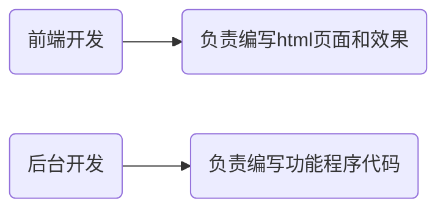

# SMARTY模板技术

## 1. SMARTY模板技术基本概念

### 为什么使用SMARTY模板技术

在web项目开发中，程序通常可以分为html模板页面和php程序页面，理想状态下，前端开发者负责编写html模板页面；而后台开发者负责编写php功能程序页面；



但是，由于长期以来html代码与php代码编写的特点，导致经常将html代码与php程序代码混合编写，这样的方式其实并不利于分工合作。

比如当我需要对现有页面进行改版，前端人员由于不懂PHP程序，只能先写好HTML页面模板，再交给后台开发人员重复一次以前嵌套PHP程序的工作。

 

而SMARTY模板技术，却很好的**将前端html代码与程序PHP代码进行的分离**，让前端开发者可以专心于开发前端的代码，而不必理会PHP程序；同时也让PHP程序开发者能够专注于PHP代码的构建，而不必为将数据嵌套进前端页面而烦恼。


### 什么是SMARTY模板技术

SMARTY模板技术**是众多模板技术中的一种**，而==模板技术==是一种==将HTML代码和PHP代码强制分离的模板机制==，它通过了某种方式让HTML代码与PHP代码在一起编写的过程中实现了强制分离。


所以SMARTY模板技术也就是：**一种将HTML代码和PHP代码强制分离的模板机制。**


### SMARTY模板技术的特点

SMARTY模板技术的主要特点：

> 1. smarty是一个基于PHP开发的PHP模板引擎，由于采用PHP编写，所以语法结构与PHP基本类似，语句比较自由；
> 2. 相对其他的模板引擎，具有更快的响应速度（速度快）；
> 3. Smarty插件非常灵活，可以任意的扩展；
> 4. 也有==不适合使用Smarty的地方==，比如一些需要实时更新的项目（股票的走势），因为Smarty把数据都缓存起来了，没法实时更新！

 

各框架和开源系统模板引擎使用一览：

>  ThinkPHP框架（引入了模板引擎技术）
>
> CI、YII（引入了模板引擎技术）
>
> DEDECMS（引入了模板引擎技术）
>
> ECSHOP（引入了模板引擎技术，使用的就是smarty模板引擎）


### SMARTY模板技术实现的基本原理

**==需求==**：封装一个名为smarty1的类，实现通过该类展示模板页面并输出数据到页面的效果。

**==解答==**：

第一步，构建名为t1.html的程序文件，代码如下：

```html
<!DOCTYPE html>
<HTML>
<head>
    <meta charset="UTF-8">
    <title>主页</title>
</head>
<body>
    <p>
		<span>标题：</span>{title}
	</p>
	<p>
		<span>作者：</span>{aa}
	</p>
	<p>
		<span>发布时间：</span>{date}
	</p>
	<p>
		{content}
	</p>
</body>
</HTML>
```

第二步，构建名为t1.php的程序文件，代码如下：

```php
class Smarty1{

    private $vars=array();

    public function assign1($key, $value){ //负责将全局作用域中的数据转移到局部作用域中
        
        $this->vars[$key] = $value;
    }

    public function display1($file){ //负责渲染模板页面的


        $content = file_get_contents($file);//读取html模板文件的内容

        //$content = str_replace('{title}', $this->vars['title'], $content);//替换$content中所有title字符位置上的内容
        //$content = str_replace('{aa}', $this->vars['aa'], $content);//替换$content中所有aa字符位置上的内容
        //$content = str_replace('{date}', $this->vars['date'], $content);//替换$content中所有date字符位置上的内容
        //$content = str_replace('{content}', $this->vars['content'], $content);//替换$content中所有date字符位置上的内容
        foreach( $this->vars as $k=>$v ){ 
            
            $search = '{' . $k . '}';
            $content = str_replace($search, $v, $content);//替换模板中的占位符
        }

        echo $content; //输出模板文件的内容
    }
}

$title = '劝学';
$auth = '荀子';
$date = '约公元前313年－公元前238年';

$content = '故不积跬步，无以至千里；不积小流，无以成江海。骐骥一跃，不能十步；驽马十驾，功在不舍。锲而舍之，朽木不折；锲而不舍，金石可镂。';

#实例化Smarty1类的对象
$smarty1 = new Smarty1;

$smarty1->assign1('title', $title);//调用assign1方法将全局作用域中的$title变量的数据转移到局部作用域数组$vars属性中
$smarty1->assign1('aa', $auth);//调用assign1方法将全局作用域中的$auth变量的数据转移到局部作用域数组$vars属性中
$smarty1->assign1('date', $date);//调用assign1方法将全局作用域中的$date变量的数据转移到局部作用域数组$vars属性中
$smarty1->assign1('content', $content);//调用assign1方法将全局作用域中的$content变量的数据转移到局部作用域数组$vars属性中


$smarty1->display1('./t1.html');//调用display1方法展示（渲染）模板页面
```


**==小结==**：

从演示的效果上来看，模板技术的实现就是：==读取==、==替换==和==输出==；


## 2. ==SMARTY部署==

SMARTY并不是PHP本身就自带的，在使用之前，需要先进行部署。


**==步骤==**：

第一步，下载SMARTY，www.smarty.cn下载SMARTY，解压，


第二步，在code目录下创建一个专有项目目录demo，


第三步，复制SMARTY核心类库目录libs，


转移粘贴到code/demo目录中，


将libs改名为smarty，


第四步，测试使用SMARTY，

在code/demo目录中创建一个名为index1.php的程序文件，


在index1.php中构建如下代码：


访问index1.php程序文件，


当我们看到上图所示的输出内容，则说明SMARTY部署成功。


==进一步测试使用SMARTY==

第一步，在code/demo下创建templates目录，


第二步，将准备好的模板文件index.html拷贝到code/demo/templates目录中，


第三步，在code/demo目录下创建程序文件，index.php，代码如下：

```php
#引入SMARTY核心类文件
include './smarty/Smarty.class.php';

#实例化Smarty类的对象
$smarty = new Smarty;

$title = '劝学';
$auth = '荀子';
$date = '约公元前313年－公元前238年';
$content = '故不积跬步，无以至千里；不积小流，无以成江海。骐骥一跃，不能十步；驽马十驾，功在不舍。锲而舍之，朽木不折；锲而不舍，金石可镂。';

$smarty->assign('title', $title);//调用assign方法将全局作用域转移到局部作用域中，assign也被称为是分配模板变量的
//第一个参数传递进去当作变量名，不包括$ ，但使用时要包括 $
$smarty->assign('aa', $auth); 
$smarty->assign('date', $date);
$smarty->assign('content', $content);


$smarty->display('index.html');//渲染模板文件
```

修改code/demo/templates/index.html文件的内容，代码如下：

```html
<!DOCTYPE html>
<HTML>
<head>
    <meta charset="UTF-8">
    <title>主页</title>
</head>
<body>
    <p>
		<span>标题：</span>{$title}
	</p>

	<p>
		<span>作者：</span>{$aa}
	</p>

	<p>
		<span>发布时间：</span>{$date}
	</p>

	<p>
		{$content}
	</p>
</body>
</HTML>
```

第四步，测试访问效果：


**==小结==**：

在程序中使用SMARTY的基本步骤：

1）引入SMARTY核心类文件；

2）实例化一个基于Smarty类的对象；

3）调用assign方法分配模板变量；

4）调用display方法渲染模板；


### SMARTY模板编译的原理

当我们首次访问网站的某个页面时，SMARTY会自动在项目的smarty核心库目录同级的目录中创建一个名为templates_c的目录，这个目录存放的就是SMARTY的模板编译缓存文件。

 

SMARTY有一个机制，如果第一次访问某个模板页面时，则会自动创建一个该模板页面对应的==编译缓存文件==；以后再来访问该页面，则SMARTY会判断该模板页面是否已经发生改变，如果没有发生改变，则直接去访问编译缓存文件，如果发现模板内容有被改变，则重新编译生一个新的缓存文件，覆盖老的缓存文件。


**==测试1==**：测试首次访问一个模板页面，观察是否生成对应的编译缓存文件。


当我们首次访问时，确实在demo/templates_c目录中生成了一个新的文件。


**==测试2==**：打开已经生成的编译缓存文件，输出"哈哈"，观察再次访问相同的页面时，是否会输出"哈哈"。


再次访问该页面，


说明再次访问该页面时，SMARTY将会自动去走缓存文件，而不会重新去编译Index.php及模板文件。


**==测试3==**：改变模板文件的内容，再次访问此页面，观察是否还会访问之前的缓存文件输出缓存文件中的"哈哈"。

修改index.html模板文件的内容，


再次访问index.php，


查看编译缓存文件的内容，如下图所示，


从测试的效果上看，如果我们对模板文件进行了修改，则SMARTY才会重新去生成新的编译缓存内容，覆盖掉老的编译缓存内容。


**==小结==**：

SMARTY模板编译缓存原理是：当首次访问时，SMARTY将会自动生成一个编译缓存文件，同时会记录下这个模板文件的最后修改时间；当再次进行访问时，SMARTY会先对比一下当前模板文件的最后修改时间和之前记录下来的模板文件最后修改时间是否一致，如果不一致，说明模板文件发生了改变，则将会重新生成一个编译缓存内容覆盖掉老的内容；如果一致，说明模板文件没有被修改，则SMARTY将会直接访问编译缓存文件的内容。


### SMARTY模板技术分类

SMARTY模板技术有两个分类：1）程序设计；2）模板设计；


## 3. ==SMARTY程序设计==

#### SMARTY属性设置

##### 定界符

在模板当中包裹SMARTY语句的符号，即定界符。

默认的左定界符：**=={==**

默认的右定界符：**==}==**


我们可以通过SMARTY对象中的两个属性修改定界符

> **left_delimiter**非静态属性          负责控制左定界符
>
> **right_delimiter**非静态属性      负责控制右定界符


**==需求==**：测试修改默认的左定界符为"{--"，右定界符为"?}"，查看页面访问效果。

**==解答==**：构建名为index2.php文件，代码如下：

```php
#引入SMARTY核心类文件
include './smarty/Smarty.class.php';

$title = '劝学';
$auth = '荀子';
$date = '约公元前313年－公元前238年';

$content = '故不积跬步，无以至千里；不积小流，无以成江海。骐骥一跃，不能十步；驽马十驾，功在不舍。锲而舍之，朽木不折；锲而不舍，金石可镂。';


#实例化Smarty类的对象
$smarty = new Smarty;

$smarty->left_delimiter = '{--';//修改默认的左定界符符号
$smarty->right_delimiter = '?}';//修改默认的右定界符符号


$smarty->assign('title', $title);//调用assign方法将全局作用域转移到局部作用域中，assign也被称为是分配模板变量的
$smarty->assign('aa', $auth);
$smarty->assign('date', $date);
$smarty->assign('content', $content);

$smarty->display('index2.html');
```

构建名为index2.html文件，代码如下：

```html
<!DOCTYPE html>
<HTML>
<head>
    <meta charset="UTF-8">
    <title>主页</title>
</head>
<body>
    <p>
		<!-- {--$title?} 定界符和变量直接是否有空格要根据定界符的定义-->
        <!--  定界符可包含数字或英文字母，但不推荐-->
        <span>标题1111：</span>{--$title?}
	</p>

	<p>
		<span>作者：</span>{--$aa?}
	</p>

	<p>
		<span>发布时间：</span>{$date}
	</p>

	<p>
		{$content}
	</p>
</body>
</HTML>
```

访问效果：


**==小结==**：

我们可以在程序中使用1)left_delimiter；2）right_delimiter修改SMARTY的左、右定界符。


##### 目录设置

在Smarty3.0以后的版本，我们可以调用Smarty对象的方法修改模板目录和编译缓存目录：

> **setTemplateDir方法**   修改模板目录
>
> **setCompileDir方法**    修改编译目录


**==需求1==**：在code/demo目录下创建名为view的目录，将存放模板文件的目录修改为code/demo/view目录，测试效果。

**==解答1==**：在code/demo下创建view目录：


创建code/demo/index3.php文件，代码如下：

```php
#引入SMARTY核心类文件
include './smarty/Smarty.class.php';

$title = '劝学';
$auth = '荀子';
$date = '约公元前313年－公元前238年';

$content = '故不积跬步，无以至千里；不积小流，无以成江海。骐骥一跃，不能十步；驽马十驾，功在不舍。锲而舍之，朽木不折；锲而不舍，金石可镂。';


#实例化Smarty类的对象
$smarty = new Smarty;

$smarty->setTemplateDir('./view');//修改默认存放模板文件的目录为code/demo/view目录


$smarty->assign('title', $title);//调用assign方法将全局作用域转移到局部作用域中，assign也被称为是分配模板变量的
$smarty->assign('aa', $auth);
$smarty->assign('date', $date);
$smarty->assign('content', $content);

$smarty->display('index3.html');
```

创建code/demo/view/index3.html文件，代码如下：

```html
<!DOCTYPE html>
<HTML>
<head>
    <meta charset="UTF-8">
    <title>主页</title>
</head>
<body>
    <p>
		<span>标题1111：</span>{$title}
	</p>

	<p>
		<span>作者：</span>{$aa}
	</p>

	<p>
		<span>发布时间：</span>{$date}
	</p>

	<p>
		{$content}
	</p>
</body>
</HTML>
```

访问效果：


**==小结1==**：

通过setTemplateDir方法可以改变存放模板文件的目录。


**==需求2==**：在程序中将存放编译缓存文件的目录修改为code/demo/view_c目录，测试效果。

**==解答2==**：创建code/demo/index4.php文件，代码如下：

```php
#引入SMARTY核心类文件
include './smarty/Smarty.class.php';

$title = '劝学';
$auth = '荀子';
$date = '约公元前313年－公元前238年';

$content = '故不积跬步，无以至千里；不积小流，无以成江海。骐骥一跃，不能十步；驽马十驾，功在不舍。锲而舍之，朽木不折；锲而不舍，金石可镂。';


#实例化Smarty类的对象
$smarty = new Smarty;

$smarty->setCompileDir('./view_c');//修改默认存放编译缓存文件的目录为code/demo/view_c目录


$smarty->assign('title', $title);//调用assign方法将全局作用域转移到局部作用域中，assign也被称为是分配模板变量的
$smarty->assign('aa', $auth);
$smarty->assign('date', $date);
$smarty->assign('content', $content);

$smarty->display('index4.html');
```

创建code/demo/view/index4.html文件，代码如下：

```html
<!DOCTYPE html>
<HTML>
<head>
    <meta charset="UTF-8">
    <title>主页</title>
</head>
<body>
    <p>
		<span>标题1111：</span>{$title}
	</p>

	<p>
		<span>作者：</span>{$aa}
	</p>

	<p>
		<span>发布时间：</span>{$date}
	</p>

	<p>
		{$content}
	</p>
</body>
</HTML>
```

访问后效果：


**==小结2==**：

我们可以通过setCompileDir方法来改变存放编译缓存文件的目录位置。


##### 常量设置

通常情况下，我们在项目程序文件中，会定义一个名为SMARTY_DIR的常量，定义这个常量可以向下兼容老版本的SMARTY。


**==需求==**：在程序中定义SMARTY_DIR常量，测试效果。

**==解答==**：创建code/demo/index4.php文件，代码如下：

```php
//                               F:/xxx/.../demo
define('SMARTY_DIR', dirname(__FILE__).'/smarty/');

#引入SMARTY核心类文件
include './smarty/Smarty.class.php';

$title = '劝学';
$auth = '荀子';
$date = '约公元前313年－公元前238年';

$content = '故不积跬步，无以至千里；不积小流，无以成江海。骐骥一跃，不能十步；驽马十驾，功在不舍。锲而舍之，朽木不折；锲而不舍，金石可镂。';


#实例化Smarty类的对象
$smarty = new Smarty;

$smarty->setCompileDir('./view_c');//修改默认存放编译缓存文件的目录为code/demo/view_c目录


$smarty->assign('title', $title);//调用assign方法将全局作用域转移到局部作用域中，assign也被称为是分配模板变量的
$smarty->assign('aa', $auth);
$smarty->assign('date', $date);
$smarty->assign('content', $content);

$smarty->display('index4.html');
```

访问后效果：


**==小结==**：

定义这个常量一般是为了兼容低版本的SMARTY.


## 4. ==SMARTY模板设计==

### SMARTY模板注释

语法：==**{\***注释内容***}**== 

**注意**：  是在定界符的基础上加上 ``*`` 

**==测试==**：创建code/demo/index5.php文件，代码如下：

```php
<?php

#引入SMARTY核心类文件
include './smarty/Smarty.class.php';

$title = '劝学';
$auth = '荀子';

#实例化Smarty类的对象
$smarty = new Smarty;


$smarty->assign('title', $title);//调用assign方法将全局作用域转移到局部作用域中，assign也被称为是分配模板变量的
$smarty->assign('aa', $auth);

$smarty->display('index5.html');
```

创建code/demo/templates/index5.html文件，代码如下：

```php
<!DOCTYPE html>
<HTML>
<head>
    <meta charset="UTF-8">
    <title>主页</title>
</head>
<body>
	<!-- 这是html的注释 -->
	{*这是SMARTY的注释*}
    <p>
		<span>标题1111：</span>{$title}
	</p>

	<p>
		<span>作者：</span>{$aa}
	</p>

</body>
</HTML>
```

访问后的效果:


**==小结==**：

SMARTY的注释在浏览器端是不可见的。


### SMARTY模板变量

SMARTY模板变量包括三个种类：1）简单模板变量；2）数组模板变量；3）对象模板变量；

#### 简单模板变量

概念：即分配的数据为标量数据类型的变量；


**==测试==**：创建code/demo/index6.php文件，代码如下：

```php
#引入SMARTY核心类文件
include './smarty/Smarty.class.php';

$title = 100;
$auth = '荀子';

#实例化Smarty类的对象
$smarty = new Smarty;

//往模板当中分配了一些标量类型的数据，$title和$auth所保存的数据都是标量类型的数据
$smarty->assign('title', $title);
$smarty->assign('aa', $auth);

$smarty->display('index6.html');

```

创建code/demo/templates/index6.html文件，代码如下：

```php+HTML
<!DOCTYPE html>
<HTML>
<head>
    <meta charset="UTF-8">
    <title>主页</title>
</head>
<body>
	<!-- 这是html的注释 -->
	{*这是SMARTY的注释*}
    <p>
		<span>标题1111：</span>{$title}
	</p>

	<p>
		<span>作者：</span>{$aa}
	</p>

</body>
</HTML>
```

访问后效果：


**==小结==**：

所谓的简单模板变量，指的是通过assign方法分配的是标量类型的数据。


#### 数组模板变量

概念：即分配的数据为数组数据类型的变量；


**==测试==**：创建code/demo/index7.php文件，代码如下：

```php
#引入SMARTY核心类文件
include './smarty/Smarty.class.php';

$title = ['title1'=>'劝学', 'title2'=>'四书五经'];
$auth = '荀子';

#实例化Smarty类的对象
$smarty = new Smarty;

$smarty->assign('bb', $title);//bb就是被分配到模板文件中的数组模板变量，因为$title就是个数组
$smarty->assign('aa', $auth);

$smarty->display('index7.html');
```

创建code/demo/templates/index7.html文件，代码如下：

```php
<!DOCTYPE html>
<HTML>
<head>
    <meta charset="UTF-8">
    <title>主页</title>
</head>
<body>
	<!-- 这是html的注释 -->
	{*这是SMARTY的注释*}
    <p>
		<span>标题1：</span>{$bb['title1']}   <!-- 读取数组变量元素的第一种方式 -->
		<span>标题2：</span>{$bb.title2}    <!-- 读取数组变量元素的第二种方式 -->
	</p>

	<p>
		<span>作者：</span>{$aa}
	</p>
</body>
</HTML>
```

访问后效果：


**==小结==**：

所谓的数组模板变量，指的是通过assign方法分配的是数组类型的数据。


#### 对象模板变量

概念：即分配的数据为对象数据类型的变量；


**==测试==**：创建code/demo/index8.php文件，代码如下：

```php
#引入SMARTY核心类文件
include './smarty/Smarty.class.php';

$title = ['title1'=>'劝学', 'title2'=>'四书五经'];

class A{
    public $auth1='荀子';
    public $auth2='孟子';
}

$a1 = new A;

#实例化Smarty类的对象
$smarty = new Smarty;

$smarty->assign('bb', $title);
$smarty->assign('aa', $a1);//aa就是分配到模板中的对象模板变量，因为$a1就是一个对象

$smarty->display('index8.html');
```

创建code/demo/templates/index8.html文件，代码如下：

```html
<!DOCTYPE html>
<HTML>
<head>
    <meta charset="UTF-8">
    <title>主页</title>
</head>
<body>
	<!-- 这是html的注释 -->
	{*这是SMARTY的注释*}
    <p>
		<span>标题1：</span>{$bb['title1']}   <!-- 读取数组变量元素的第一种方式 -->
		<span>标题2：</span>{$bb.title2}    <!-- 读取数组变量元素的第二种方式 -->
	</p>

	<p>
		<span>作者1：</span> {$aa->auth1}
		<span>作者2：</span> {$aa->auth2}
	</p>
</body>
</HTML>
```

访问后效果：


**==小结==**：

所谓的对象模板变量，指的是通过assign方法分配的是对象数据类型的数据。


### SMARTY系统变量

SMARTY系统变量有：

> ==**{$smarty.get.变量名称}**==    直接获取GET参数数据
>
> ==**{$smarty.post.变量名称}**==      直接获取POST参数数据
>
> **{$smarty.cookies.变量名称}**     直接获取COOKIE参数数据
>
> **{$smarty.session.变量名称}**     直接获取SESSION参数数据
>
> ==**{$smarty.const.常量名称}**==      直接获取常量参数数据
>
> ==**{$smarty.now}**==      直接获取当前时间的时间戳


**==测试==**：测试**{$smarty.get.变量名称}**、**{$smarty.const.常量名称}**、**{$smarty.now}**

创建code/demo/index9.php文件，代码如下：

```php
#引入SMARTY核心类文件
include './smarty/Smarty.class.php';


define('PATH', './source');
define('URL', 'www.home.com');

session_start();
//$_SESSION['height'] = 1.6;
//$_SESSION['weight'] = 200;

#实例化Smarty类的对象
$smarty = new Smarty;


$smarty->display('index9.html');
```

创建code/demo/templates/index9.html文件，代码如下：

```html
<!DOCTYPE html>
<HTML>
<head>
    <meta charset="UTF-8">
    <title>主页</title>
</head>
<body>
	<p>
		<span>常量1：</span> {$smarty.const.PATH}
		<span>常量2：</span> {$smarty.const.URL}
	</p>
	<p>
		<span>GET数据1：</span> {$smarty.get.name}
		<span>GET数据2：</span> {$smarty.get.age}
	</p>
	<p>
		<span>SESSION数据1：</span> {$smarty.session.height}
		<span>SESSION数据2：</span> {$smarty.session.weight}
	</p>
	<p>
		<span>当前时间戳：</span> {$smarty.now}
	</p>
</body>
</HTML>
```

访问效果：


**==小结==**：

使用系统变量，无需额外在程序中通过assign方法去分配，直接在模板中使用即可。


### SMARTY内置函数（内建函数）

#### foreach

==作用==：在模板中实现foreach遍历，性质相当于PHP中的foreach遍历。

==定义语法==：

```php
{foreach from=$目标数组的模板变量 [key=’保存元素下标的模板变量名’ ] item=’保存元素值的模板变量名’  [name=’当前foreach的别名’]}
       foreach遍历结构体
{/foreach}
```


**==测试==**：创建code/demo/index10.php文件，代码如下：

```php
#引入SMARTY核心类文件
include './smarty/Smarty.class.php';

$arr = [
    0=>['title'=>'新闻1', 'intro'=>'简介1', 'auth'=>'荀子'],
    1=>['title'=>'新闻2', 'intro'=>'简介2', 'auth'=>'孟子']
];

#实例化Smarty类的对象
$smarty = new Smarty;

$smarty->assign('datas', $arr);//分配了一个数组模板变量


$smarty->display('index10.html');
```

创建code/demo/templates/index10.html文件，代码如下：

```html
<!DOCTYPE html>
<HTML>
<head>
    <meta charset="UTF-8">
    <title>主页</title>
</head>
<body>
	<table border="1px">
		<tr>
			<td>新闻标题</td>
			<td>新闻简介</td>
			<td>新闻作者</td>
		</tr>
		{*  foreach($datas as $datas_key=>$datas_val){  *}

		{foreach from=$datas key='datas_key' item='datas_val'}
		<tr>
			<td>{$datas_val.title}</td>
			<td>{$datas_val.intro}</td>
			<td>{$datas_val.auth}</td>
		</tr>
		{/foreach}

		{* } *}
	</table>
</body>
```

访问效果：


**==小结==**：

内置函数foreach其实就相当于PHP中的foreach.


#### foreachelse

==作用==：当foreach遍历的数组为空数组或不存在时，则将执行foreachelse部分。


**==测试==**：创建code/demo/index11.php文件，代码如下：

```php
#引入SMARTY核心类文件
include './smarty/Smarty.class.php';

//$arr = [
    //0=>['title'=>'新闻1', 'intro'=>'简介1', 'auth'=>'荀子'],
    //1=>['title'=>'新闻2', 'intro'=>'简介2', 'auth'=>'孟子']
//];

#实例化Smarty类的对象
$smarty = new Smarty;

$arr = [];
$smarty->assign('datas', $arr);//分配了一个数组模板变量


$smarty->display('index11.html');
```

创建code/demo/templates/index11.html文件，代码如下：

```php
<!DOCTYPE html>
<HTML>
<head>
    <meta charset="UTF-8">
    <title>主页</title>
</head>
<body>
	<table border="1px">
		<tr>
			<td>新闻标题</td>
			<td>新闻简介</td>
			<td>新闻作者</td>
		</tr>
		{*  foreach($datas as $datas_key=>$datas_val){  *}

		{foreach from=$datas key='datas_key' item='datas_val'}
		<tr>
			<td>{$datas_val.title}</td>
			<td>{$datas_val.intro}</td>
			<td>{$datas_val.auth}</td>
		</tr>
		{foreachelse}
		<tr>
			<td>暂无数据</td>
		</tr>
		{/foreach}

		{* } *}
	</table>
</body>
</HTML>
```

访问效果：


**==小结==**：

foreachelse结构是当遍历的数组不存在或者为空时将会执行的部分。


#### foreach内置变量

foreach内置变量包括：

> {==**$smarty.foreach.**==foreach循环名==**.index**==}     表示获得当前循环的索引值
>
> {==**$smarty.foreach.**==foreach循环名==**.iteration**==}    表示获得当前遍历的次数（当前遍历到了第几次）


**==测试==**：创建code/demo/index12.php文件，代码如下：

```php
#引入SMARTY核心类文件
include './smarty/Smarty.class.php';

$arr = [
    0=>['title'=>'新闻1', 'intro'=>'简介1', 'auth'=>'荀子'],
    1=>['title'=>'新闻2', 'intro'=>'简介2', 'auth'=>'孟子'],
    2=>['title'=>'新闻3', 'intro'=>'简介3', 'auth'=>'孟子'],
    3=>['title'=>'新闻4', 'intro'=>'简介4', 'auth'=>'孟子']
];

#实例化Smarty类的对象
$smarty = new Smarty;

$smarty->assign('datas', $arr);//分配了一个数组模板变量


$smarty->display('index12.html');
```

创建code/demo/templates/index12.html文件，代码如下：

```php
<!DOCTYPE html>
<HTML>
<head>
    <meta charset="UTF-8">
    <title>主页</title>
</head>
<body>
	<table border="1px">
		<tr>
			<td>序号</td>
			<td>当前遍历的索引号</td>
			<td>新闻标题</td>
			<td>新闻简介</td>
			<td>新闻作者</td>
		</tr>
		{*  foreach($datas as $datas_key=>$datas_val){  *}

		{foreach from=$datas key='datas_key' item='datas_val' name='f1'}
		<tr>
			<td>{$smarty.foreach.f1.iteration}</td>
			<td>{$smarty.foreach.f1.index}</td>
			<td>{$datas_val.title}</td>
			<td>{$datas_val.intro}</td>
			<td>{$datas_val.auth}</td>
		</tr>
		{/foreach}

		{* } *}
	</table>
</body>
</HTML>
```

访问效果：


**==小结==**：

这两个foreach内置变量都需要foreach内建函数结构中才能够使用的。


#### include

==作用==：引入其他模板文件。

==定义语法==：

```php
{include  file=’模板路径’  [额外分配模板变量的名1=额外分配模板变量的值1]  [额外分配模板变量的名2=额外分配模板变量的值2] […]  [额外分配模板变量的名n=额外分配模板变量的值n]}
```


**==测试==**：创建code/demo/index13.php文件，代码如下：

```php

#引入SMARTY核心类文件
include './smarty/Smarty.class.php';

$arr = [
    0=>['title'=>'新闻1', 'intro'=>'简介1', 'auth'=>'荀子'],
    1=>['title'=>'新闻2', 'intro'=>'简介2', 'auth'=>'孟子'],
    2=>['title'=>'新闻3', 'intro'=>'简介3', 'auth'=>'孟子'],
    3=>['title'=>'新闻4', 'intro'=>'简介4', 'auth'=>'孟子']
];

#实例化Smarty类的对象
$smarty = new Smarty;

$smarty->assign('datas', $arr);//分配了一个数组模板变量

$smarty->display('index13.html');
```

创建code/demo/templates/common.html文件，代码如下：

```html
<!DOCTYPE html>
<HTML>
<head>
    <meta charset="UTF-8">
    <title>{$head_title}</title>
</head>
<body>
```

创建code/demo/templates/index13.html文件，代码如下：

```html
<!-- 在引入文件时，给目标文件传递参数，替换其中的占位符 -->
{include file='common.html' head_title='index13'}  
	<table border="1px">
		<tr>
			<td>序号</td>
			<td>当前遍历的索引号</td>
			<td>新闻标题</td>
			<td>新闻简介</td>
			<td>新闻作者</td>
		</tr>
		{*  foreach($datas as $datas_key=>$datas_val){  *}

		{foreach from=$datas key='datas_key' item='datas_val' name='f1'}
		<tr>
			<td>{$smarty.foreach.f1.iteration}</td>
			<td>{$smarty.foreach.f1.index}</td>
			<td>{$datas_val.title}</td>
			<td>{$datas_val.intro}</td>
			<td>{$datas_val.auth}</td>
		</tr>
		{/foreach}

		{* } *}
	</table>
</body>
</HTML>
```

访问效果：


**==小结==**：

我们可以通过include引入公共的模板文件。


#### if...elseif...else

==作用==：在模板中实现if..elseif..else分支。


**==测试==**：创建code/demo/index14.php文件，代码如下：

```php
#引入SMARTY核心类文件
include './smarty/Smarty.class.php';

$score = 90;

#实例化Smarty类的对象
$smarty = new Smarty;

$smarty->assign('score', $score);

$smarty->display('index14.html');
```

创建code/demo/templates/index14.html文件，代码如下：

```html
<!DOCTYPE html>
<HTML>
<head>
    <meta charset="UTF-8">
    <title>index14</title>
</head>
<body>
	
{if $score>90}
<span>优秀</span>
{elseif $score>60}
<span>及格</span>
{else}
<span>请继续努力</span>
{/if}

</body>
</HTML>
```

访问效果：


**==小结==**：

可以通过这个内置函数在模板中实现分支条件判断。


#### literal

==作用==：被literal包裹的部分将不会被当成smarty内容解析。


**==测试==**：创建code/demo/index15.php文件，代码如下：

```php
#引入SMARTY核心类文件
include './smarty/Smarty.class.php';

#实例化Smarty类的对象
$smarty = new Smarty;

$smarty->display('index15.html');
```

创建code/demo/templates/index15.html文件，代码如下：

```html
<!DOCTYPE html>
<HTML>
<head>
    <meta charset="UTF-8">
    <title>index14</title>
</head>
<body>

{literal}
<style>
.s1 {color:red}
</style>
{/literal}
<span class="s1">哈哈哈哈</span>

</body>
</HTML>
```

访问效果：


**==小结==**：

被literal包裹的内容将不会当成smarty的内容来解析。


#### ldelim和rdelim

==作用==：ldelim专门保存左定界符符号；rdelim专门保存右定界符符号。


**==测试==**：创建code/demo/index16.php文件，代码如下：

```php
#引入SMARTY核心类文件
include './smarty/Smarty.class.php';

#实例化Smarty类的对象
$smarty = new Smarty;

$smarty->display('index16.html');
```

创建code/demo/templates/index16.html文件，代码如下：

```php
<!DOCTYPE html>
<HTML>
<head>
    <meta charset="UTF-8">
    <title>index14</title>
</head>
<body>

<span>左定界符：</span>{ldelim}<br/>
<span>右定界符：</span>{rdelim}

</body>
</HTML>
```

访问效果：


**==小结==**：

在模板中我们可以使用ldelim和rdelim输出左右大括号符号。


### SMARTY变量调节器

基本语法：

```php
{变量名|调节器名1:参数1:参数2….|调节器名2:参数1:参数2….}
```


#### cat

==作用==：拼接字符串。


**==测试==**：创建code/demo/index17.php文件，代码如下：

```php
#引入SMARTY核心类文件
include './smarty/Smarty.class.php';

$name = '哪吒';
$age = 12;

#实例化Smarty类的对象
$smarty = new Smarty;

$smarty->assign('name', $name);
$smarty->assign('age', $age);

$smarty->display('index17.html');
```

创建code/demo/templates/index17.html文件，代码如下：

```php
<!DOCTYPE html>
<HTML>
<head>
    <meta charset="UTF-8">
    <title>调节器</title>
</head>
<body>

<span>cat调节器：</span>{$name|cat:$age}

</body>
</HTML>
```

访问效果：


**==小结==**：

cat可以实现字符串拼接。


#### date_format

==作用==：将时间戳格式化为年月日时间日期格式。


**==测试==**：创建code/demo/index17.php文件，代码如下：

```php
#引入SMARTY核心类文件
include './smarty/Smarty.class.php';

$name = '哪吒';
$age = 12;

#实例化Smarty类的对象
$smarty = new Smarty;

$smarty->assign('name', $name);
$smarty->assign('age', $age);

$smarty->display('index17.html');
```

创建code/demo/templates/index17.html文件，代码如下：

```html
<!DOCTYPE html>
<HTML>
<head>
    <meta charset="UTF-8">
    <title>调节器</title>
</head>
<body>

<span>cat调节器：</span>{$name|cat:$age}   <br/>
<span>date_format调节器：</span>{$smarty.now|date_format:'%Y-%m-%d %H:%M:%S'}  <br/>
<span>获得当前时间的年月日时分秒格式：</span>{date('Y-m-d H:i:s')}  <br/>

</body>
</HTML>
```

访问效果：


**==小结==**：

date_format可以将一个时间戳转换为年月日时分秒时间日格式。


#### default

==作用==：指定默认值。


**==测试==**：创建code/demo/index17.php文件，代码如下：

```php
#引入SMARTY核心类文件
include './smarty/Smarty.class.php';

$name = '哪吒';
$age = 12;

#实例化Smarty类的对象
$smarty = new Smarty;

$smarty->assign('name', $name);
$smarty->assign('age', $age);

$smarty->display('index17.html');
```

创建code/demo/templates/index17.html文件，代码如下：

```html
<!DOCTYPE html>
<HTML>
<head>
    <meta charset="UTF-8">
    <title>调节器</title>
</head>
<body>

<span>cat调节器：</span>{$name|cat:$age}   <br/>
<span>date_format调节器：</span>{$smarty.now|date_format:'%Y-%m-%d %H:%M:%S'}  <br/>
<span>获得当前时间的年月日时分秒格式：</span>{date('Y-m-d H:i:s')}  <br/>
<span>default调节器：</span>{$var2|default:'var2没有值就会用我'}  <br/>

</body>
</HTML>
```

访问效果：


**==小结==**：

default可以为模板变量指定默认值。


#### lower和upper

==作用==：lower负责将字母转换为小写；upper负责将字母转换为大写。


**==测试==**：创建code/demo/index17.php文件，代码如下：

```php
#引入SMARTY核心类文件
include './smarty/Smarty.class.php';

$name = '哪吒';
$age = 12;

#实例化Smarty类的对象
$smarty = new Smarty;

$smarty->assign('name', $name);
$smarty->assign('age', $age);

$smarty->display('index17.html');
```

创建code/demo/templates/index17.html文件，代码如下：

```html
<!DOCTYPE html>
<HTML>
<head>
    <meta charset="UTF-8">
    <title>调节器</title>
</head>
<body>

<span>cat调节器：</span>{$name|cat:$age}   <br/>
<span>date_format调节器：</span>{$smarty.now|date_format:'%Y-%m-%d %H:%M:%S'}  <br/>
<span>获得当前时间的年月日时分秒格式：</span>{date('Y-m-d H:i:s')}  <br/>
<span>default调节器：</span>{$var2|default:'var2没有值就会用我'}  <br/>

<span>lower调节器：</span>{'abcFEses'|lower}  <br/>
<span>upper调节器：</span>{'abcFEses'|lower|upper}  <br/>

</body>
</HTML>
```

访问效果：


**==小结==**：

lower和upper第一个是转换为小写字母，第二个是转换为大写字母。


#### escape

==作用==：负责将变量中的html标签当成普通字符串输出。


**==测试==**：创建code/demo/index17.php文件，代码如下：

```php
#引入SMARTY核心类文件
include './smarty/Smarty.class.php';

$name = '哪吒';
$age = 12;
$str = '<span style="color:yellow;">12345</span>';

#实例化Smarty类的对象
$smarty = new Smarty;

$smarty->assign('name', $name);
$smarty->assign('age', $age);
$smarty->assign('str', $str);

$smarty->display('index17.html');

```

创建code/demo/templates/index17.html文件，代码如下：

```html
<!DOCTYPE html>
<HTML>
<head>
    <meta charset="UTF-8">
    <title>调节器</title>
</head>
<body>

<span>cat调节器：</span>{$name|cat:$age}   <br/>
<span>date_format调节器：</span>{$smarty.now|date_format:'%Y-%m-%d %H:%M:%S'}  <br/>
<span>获得当前时间的年月日时分秒格式：</span>{date('Y-m-d H:i:s')}  <br/>
<span>default调节器：</span>{$var2|default:'var2没有值就会用我'}  <br/>

<span>lower调节器：</span>{'abcFEses'|lower}  <br/>
<span>upper调节器：</span>{'abcFEses'|lower|upper}  <br/>

<span>escape调节器：</span>{$str|escape}  <br/>

</body>
</HTML>
```

访问效果：


**==小结==**：

escape可以把标签当成普通的字符来输出。


#### nl2br

==作用==：负责将文件的回车换行转换为html的\<br/>标签。


**==测试==**：创建code/demo/index17.php文件，代码如下：

```php
#引入SMARTY核心类文件
include './smarty/Smarty.class.php';

$name = '哪吒';
$age = 12;
$str = '<span style="color:yellow;">12345</span>';

$str1 = "abcd\r\neeeeee";

#实例化Smarty类的对象
$smarty = new Smarty;

$smarty->assign('name', $name);
$smarty->assign('age', $age);
$smarty->assign('str', $str);

$smarty->assign('str1', $str1);

$smarty->display('index17.html');
```

创建code/demo/templates/index17.html文件，代码如下：

```html
<!DOCTYPE html>
<HTML>
<head>
    <meta charset="UTF-8">
    <title>调节器</title>
</head>
<body>

<span>cat调节器：</span>{$name|cat:$age}   <br/>
<span>date_format调节器：</span>{$smarty.now|date_format:'%Y-%m-%d %H:%M:%S'}  <br/>
<span>获得当前时间的年月日时分秒格式：</span>{date('Y-m-d H:i:s')}  <br/>
<span>default调节器：</span>{$var2|default:'var2没有值就会用我'}  <br/>

<span>lower调节器：</span>{'abcFEses'|lower}  <br/>
<span>upper调节器：</span>{'abcFEses'|lower|upper}  <br/>

<span>escape调节器：</span>{$str|escape}  <br/>

<span>nl2br调节器：</span>{$str1|nl2br}  <br/>

</body>
</HTML>
```

访问效果：


**==小结==**：

nl2br可以将\r\n回车换行符转换为html中的\<br/>标签。


#### strip_tags

==作用==：负责将html标签字符直接去除 。


**==测试==**：创建code/demo/index17.php文件，代码如下：

```php
#引入SMARTY核心类文件
include './smarty/Smarty.class.php';

$name = '哪吒';
$age = 12;
$str = '<span style="color:yellow;">12345</span>';

$str1 = "abcd\r\neeeeee";

#实例化Smarty类的对象
$smarty = new Smarty;

$smarty->assign('name', $name);
$smarty->assign('age', $age);
$smarty->assign('str', $str);

$smarty->assign('str1', $str1);

$smarty->display('index17.html');
```

创建code/demo/templates/index17.html文件，代码如下：

```html
<!DOCTYPE html>
<HTML>
<head>
    <meta charset="UTF-8">
    <title>调节器</title>
</head>
<body>

<span>cat调节器：</span>{$name|cat:$age}   <br/>
<span>date_format调节器：</span>{$smarty.now|date_format:'%Y-%m-%d %H:%M:%S'}  <br/>
<span>获得当前时间的年月日时分秒格式：</span>{date('Y-m-d H:i:s')}  <br/>
<span>default调节器：</span>{$var2|default:'var2没有值就会用我'}  <br/>

<span>lower调节器：</span>{'abcFEses'|lower}  <br/>
<span>upper调节器：</span>{'abcFEses'|lower|upper}  <br/>

<span>escape调节器：</span>{$str|escape}  <br/>

<span>nl2br调节器：</span>{$str1|nl2br}  <br/>
<span>strip_tags调节器：</span>{$str|strip_tags}  <br/>

</body>
</HTML>
```

访问效果：


**==小结==**：

strip_tags可以去除字符串中的标签。


## 5. 全天总结

1. 部署SMARTY

   1)转移核心类库目录(libs)到项目中（最好重命名，我们把它改为了smarty）

   2)在项目目录下还需创建一个名为tempates的目录

   3)在程序中引入Smarty核心类文件，并且实例化Smarty类的对象

   4)我们可以调用assign方法向模板中分配模板变量

   5)我们可以调用display方法渲染模板文件

2. SMARTY模板变量

   1）简单模板变量；2）数组模板变量；3）对象模板变量；

   简单模板变量：在模板中  "{$变量名}"

   数组模板变量：在模板中  "{$变量名['元素下标']}"或"{$变量名.元素下标}"

   对象模板变量：在模板中  "{$变量名->属性名}"

3. 内置函数foreach、include、if..elseif..else、literal


