# ==TP5第一天==

# 一、案例：搭建后台首页

## 步骤1：创建控制器和方法

在后台**admin**创建一个**IndexController**控制器的**index**方法，输出模板


## 步骤2：定义路由

```php
Route::get("admin/index/index","admin/index/index");
```


## 步骤3：创建或配置模版

在`admin/view/index/`创建一个`index.html`模板，此模板可以复制后台模板的index.html，同时更改静态资源文件路径

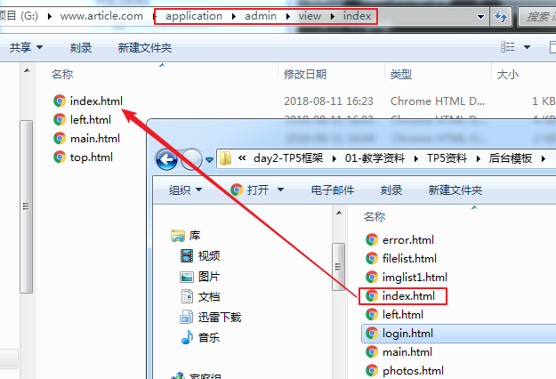


## 步骤4：模版公共部分处理

提取模版的公共部分，独立文件，并定义三个方法top、left、main

此模版已处理。

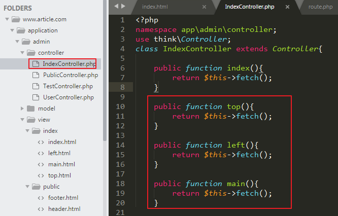

定义路由：

```php
Route::get("admin/index/top","admin/index/top");
Route::get("admin/index/left","admin/index/left");
Route::get("admin/index/main","admin/index/main");
```

复制对应的模板到`/admin/view/index`目录下面


修改`index.html`的iframe的src路径为对应的路由：

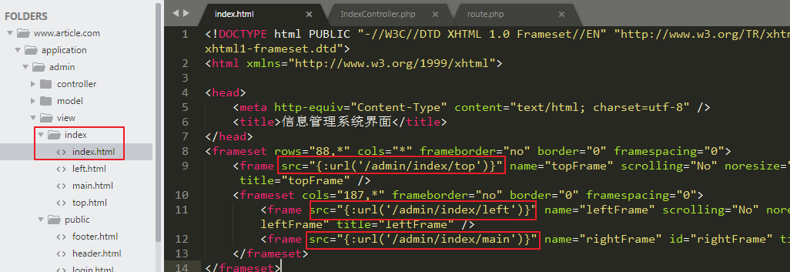


## 步骤5：模版修改

修改top.html、left.html、main.html模板的**静态资源文件**

**a**.  复制资源到`/public/static`中

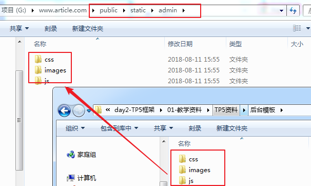
    
**b**.      `top.html`、`left.html`、`main.html`模板中进行替换路径(快捷键ctrl+h)
    
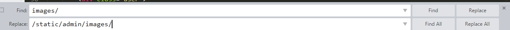
    
建议静态资源路径直接配置在文件`config.php`中，方便后期维护：
    
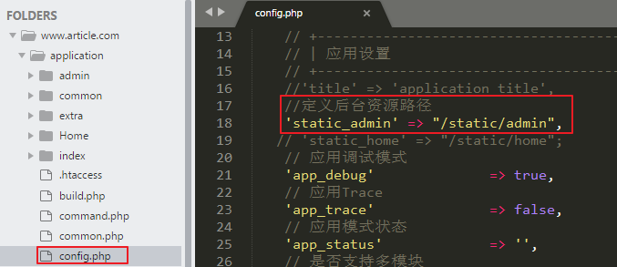
    
替换好如下所示，以top.html文件为例。
    
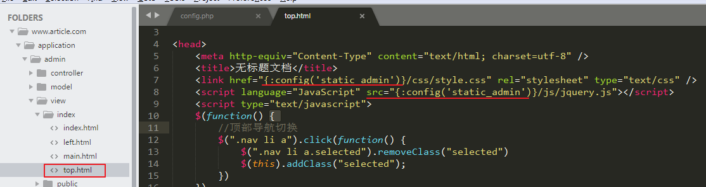
    
最终访问效果：
    
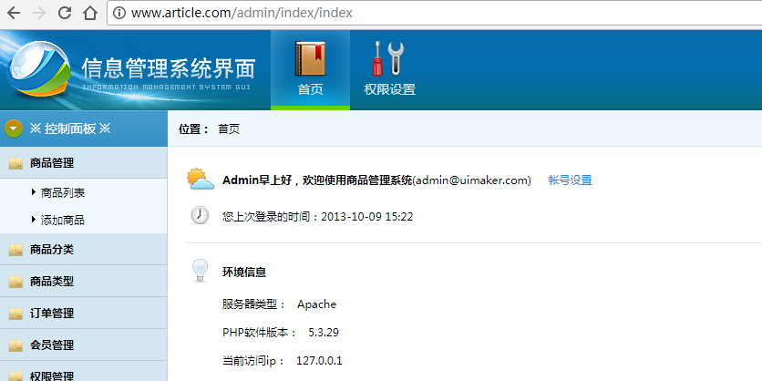

----


# 二、案例：搭建登录页

## 步骤1：创建控制器和方法

在后台admin中创建一个PublicController控制器的login方法，输出登录的内容

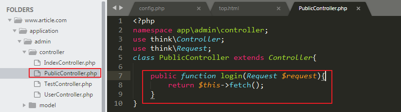


## 步骤2：定义路由

```php
Route::any('admin/public/login','admin/public/login');
```


## 步骤3：配置和修改模版

把后台模板`login.html`复制到`admin/view/public/`下面，并替换静态资源文件路径

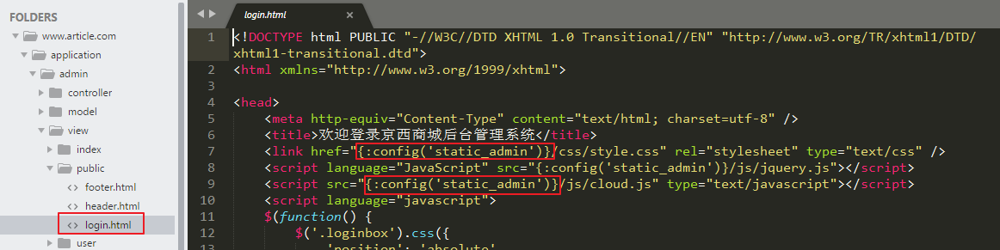

效果：

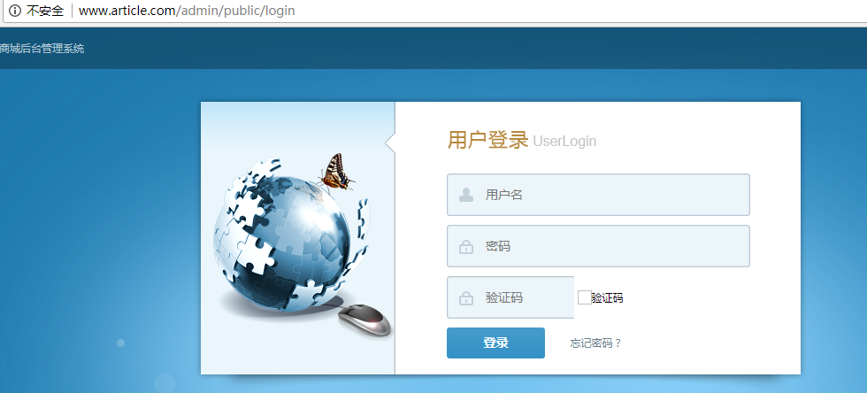

----


# ==TP5第二天==

# 一、案例：完成后台登录功能

## 1、代码实现

一般系统第一个用户都是手工添加的，在`application/config.php`中添加一个密码的加密串（盐）

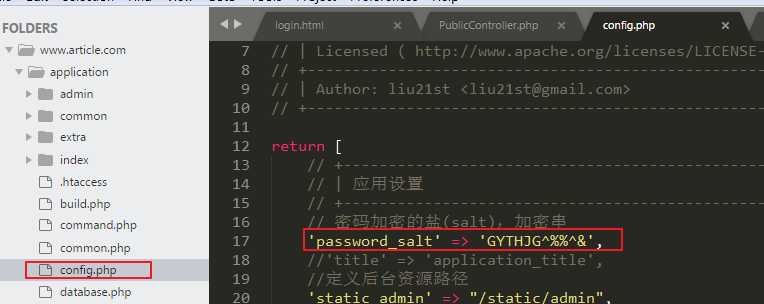

把密码和盐md5加密的结果复制到password字段中

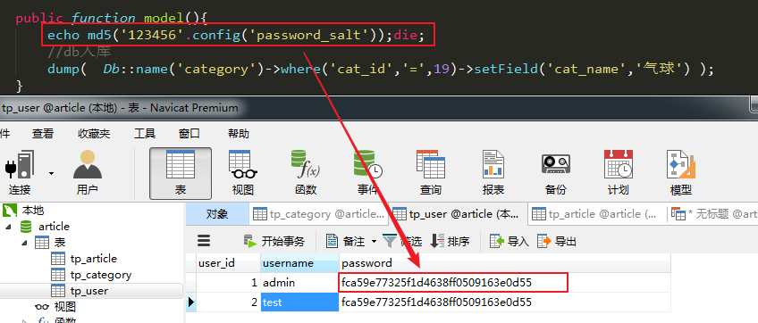

## 2、完成登录的实现 

**步骤1**：在login登录的表单中设置input的name属性和表的字段==保持一致==，同时设置提交方式为post提交

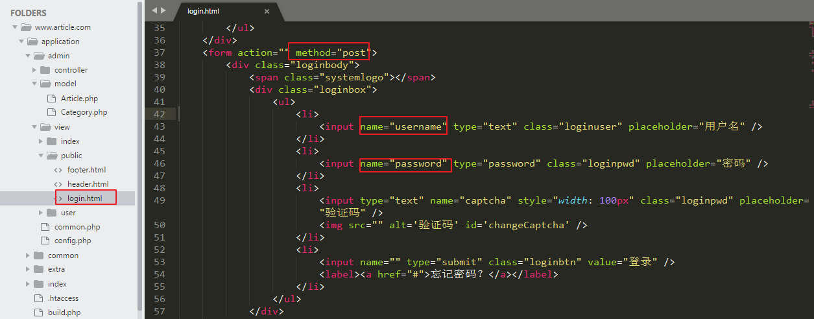

**步骤2**：在`login`方法中，判断是否是**post**请求，完成用户的登录逻辑

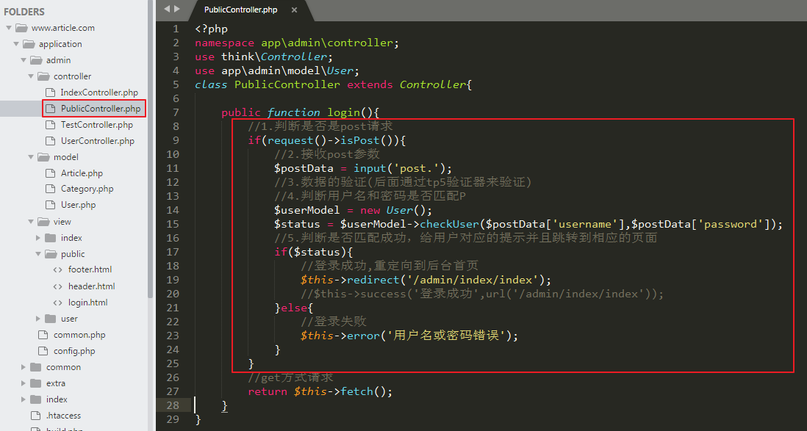

**步骤3**：在User模型中定义一个`checkuser`方法，判断用户名和密码是否匹配成功，成功把用户信息写入**session**中

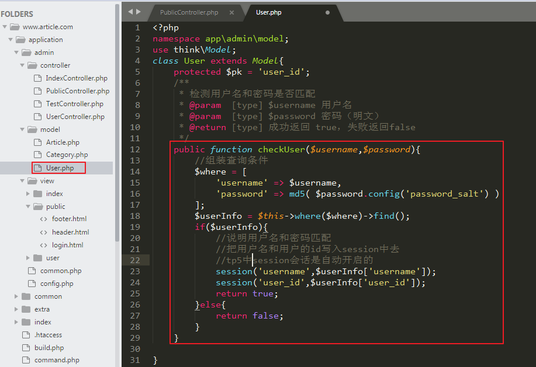

在后台首页，回显session的用户名，修改`top.htm`页面


效果：

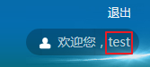

## 3、补充 

### 3.1、跳转

在应用开发中，经常会遇到一些带有提示信息的跳转页面，例如操作成功或者操作错误页面，并且自动跳转到另外一个目标页面。系统的`\think\Controller`类内置了两个跳转方法`success()`和`error()`

**成功跳转**：`$this->success($msg,$url,$data,$time)`

**失败跳转**：`$this->error($msg,$url,$data,$time)`

参数说明：

-   `msg`：跳转的提示信息

-   `url` ：跳转的地址。 可以直接使用助手函数`url()`生成地址。失败默认跳回上一页（`history.go(-1)`）。一般不需要指定

-   `data `：返回的数据，一般不写，留空即可

-   `time`  ：默认成功和失败等待时间都是3秒


### 3.2、重定向

**语法**:

```php
$this-> redirect($url,[$params]); 
```

**参数说明**：

-   `$url`：跳转的地址, 格式为 `模块/控制器/方法`

    \$this-\> redirect('index')，未指定模块和控制器，默认会重定向到**当前模块**的**当前控制器**的index方法。

    在路由的强制模式前提下，则url必须是路由中定义的规则

-   `$params`：跳转携带的参数，数组形式如：传参数id为3，`[id=>3]`

    

    **==问：什么时候使用跳转和重定向？==**

    答：

    **1、需要给用户操作的提示信息，则用跳转。**

    一般是删除或编辑失败的时候，这需要给用户提示错误信息，操作失败则用跳转error，成功用success。

    **2、不需要给任何提示信息，则用重定向。**

    如用户登录成功不需要给提示信息则直接redirect重定向到首页，登录失败就用error给用户提示错误信息。


### 3.3、session

**tp5中session会话默认是开启的**


-   设置sesion信息

    ```php
    session('键','值');
    ```

    

-   获取session信息

    ```php
    session('键');
    ```

    

-   清除session信息

    ```php
    session('键',null); //清除一个
    session(null); //清除当前会话所有的session
    ```

----


# 二、案例：完成后台退出功能

思路：**清除用户登录成功所设置的session信息**

**步骤1**：在后台`admin`的`publicController`控制器中建立一个`logout`的方法完成退出的实现

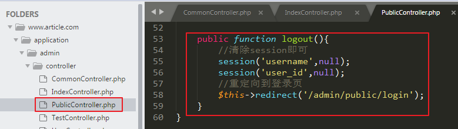

**步骤2**：设置退出链接的链接地址，并设置好路由

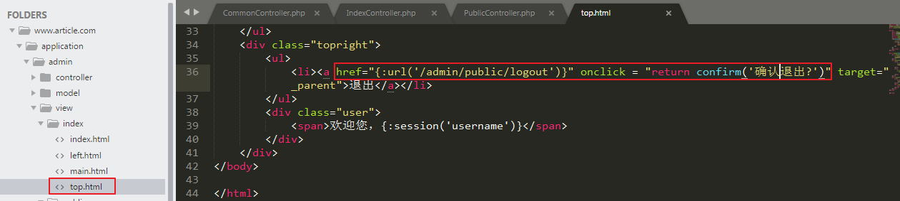

**步骤3**：定义退出路由

```php
Route::group('admin',function(){
	Route::get('/user/logout','admin/user/logout');
});
```

---


# 三、案例：完成登录防翻墙

**核心思想**： 建立一个公共的控制器如：`CommonController`，在此控制器中做权限验证，判断是否有没有session,其他需要验证用户登录session信息的控制器就需要继承此控制器即可。

把验证session的写在`CommonController`控制器的初始化方法`_initialize`中,

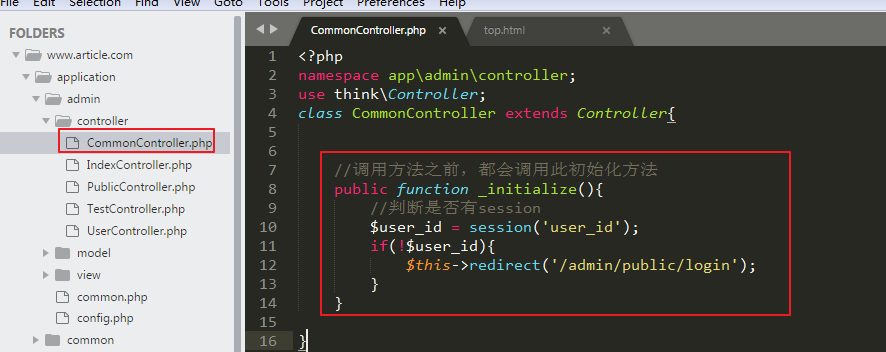

需要验证session的控制器，继承Common即可


注：Public控制器不可以继承，因为此时还没有登录进来，未有session信息。

----


# 四、验证器实现登录验证（新增）

## 1、验证器概述

ThinkPHP5.0使用独立的`\think\Validate`验证器类进行验证。

手册位置：验证==>验证器。


## 2、基本使用

**步骤1**. 先在控制器中先引入验证器类

```php
use \think\Validate;
```


**步骤2**. 定义验证规则和提示信息：

```php
$rule = [
'表单name值'	=> '规则'   // （多个规则竖线‘|‘隔开）	
      ......
];
//定义验证不通过的提示信息
$msg = [
	'表单name值.规则名'	=> '规则的不通过时的提示信息'
  ......	
]
```


**步骤3**. 进行数据验证

**单个验证：**

```php
$validate = new Validate($rule,$msg);
$result = $validate->check($data);
```

**参数**：$data是要验证的数据，要求是==一维数组==，其**键名**和规则**rule中的键名**需一致。
**返回值**：验证成功返回**true**,失败返回对应规则的错误提示信息，通过`$validate->getError());`可获取到错误信


**批量验证:**

当需要同时验证多个规则的时候使用`batch()`方法即可

```php
$result = $validate->batch()->check($data);
```

**返回值**：验证成功返回**true**，批量验证不通过，返回的是一个错误信息的数组[err1,err2]


## 3、代码如下

**步骤1**：引入验证器类

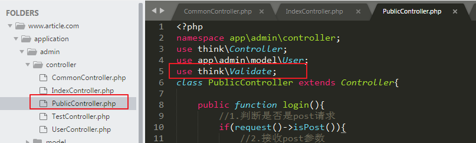

**步骤2**：在`login`方法中定义验证器进行数据的验证

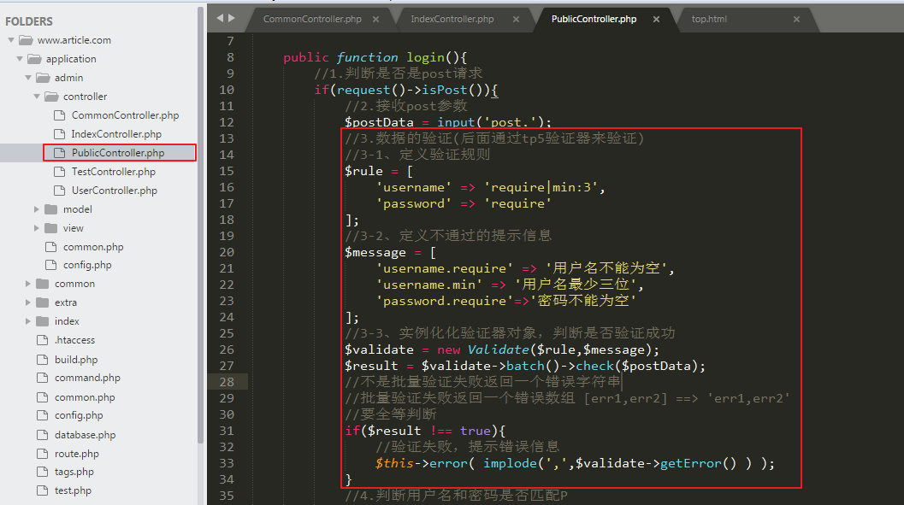

----


# ==TP5第三天==


# 一、案例：完成登录的验证码功能

手册位置：杂项\--\>验证码

**步骤1**：找到`login.html`模板，设置**img**的**src**为`{:captcha_src()} `

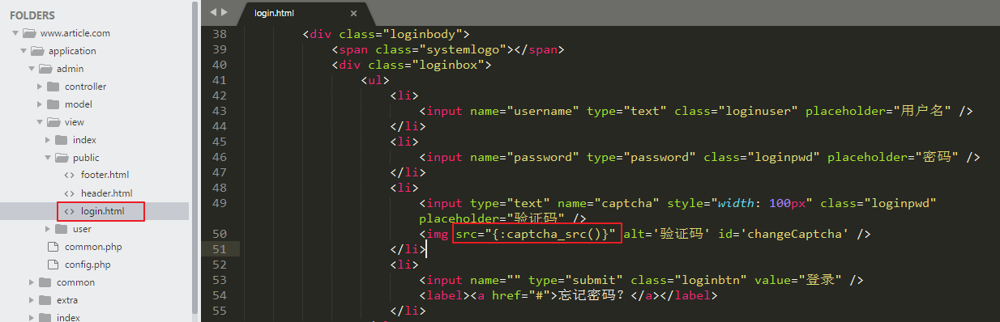

**步骤2**：设置验证码的配置

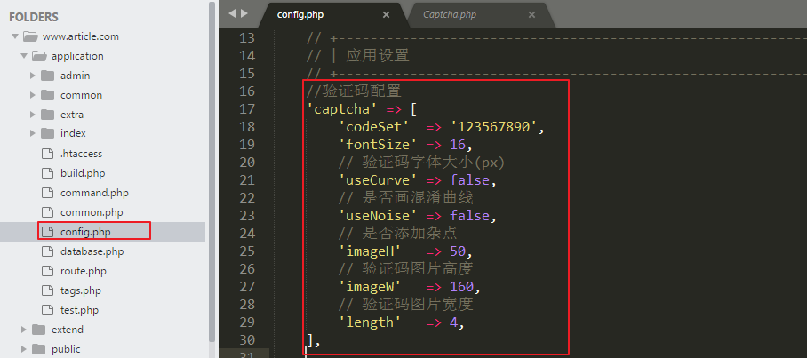

**步骤3**：设置随机数，单击验证码时，可重新请求验证码

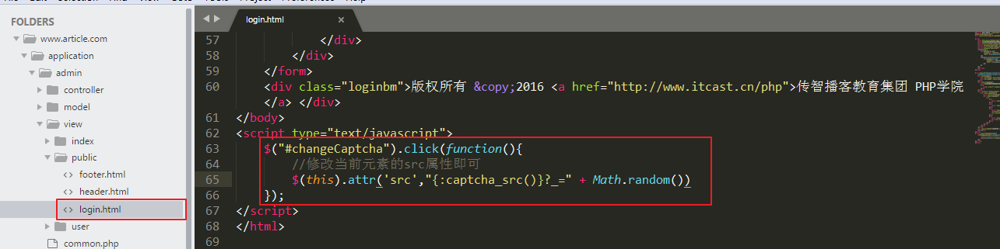

**步骤4**：单击登录按钮，在`login`方法中判断验证码是否输入正确

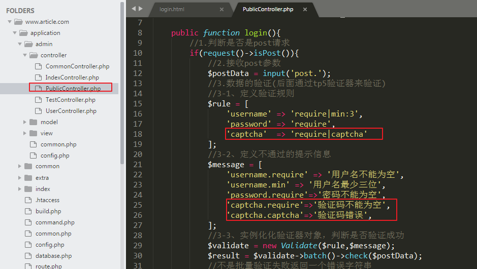

**步骤5**：页面输入错误，返回来时候。让验证码自执行单击事件，即刷新验证码：

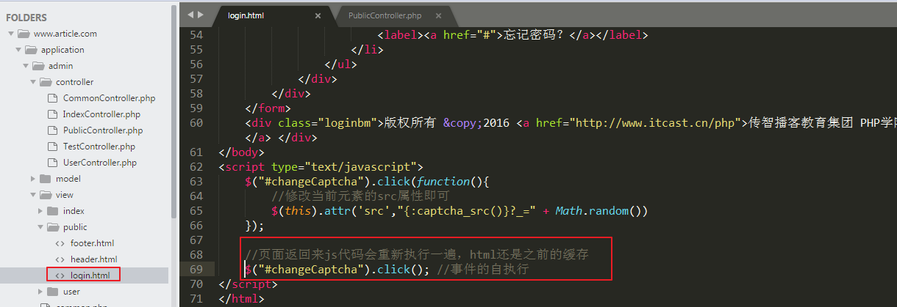

效果：


----


# 二、案例：完成文章分类的添加

## 1、输出添加分类的模板展示

**步骤1**：在后台`admin`的`CategoryController`控制器中添加一个`add`方法，输出模板

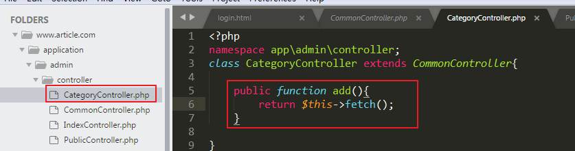

**步骤2**：定义访问的路由（`application/route.php`）

```php
Route::group('admin',function(){
	Route::get('/category/add','admin/category/add');
});
```

**步骤3**：设置后台的菜单链接

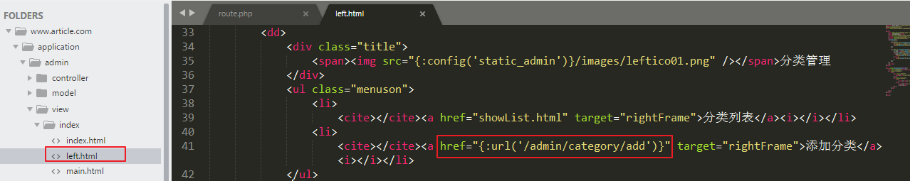

**步骤4**：把后台模板`add.html`模板文件复制到以下目录，并替换静态资源文件路径

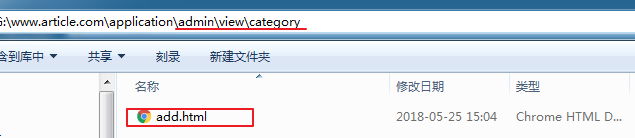

如替换css路径：

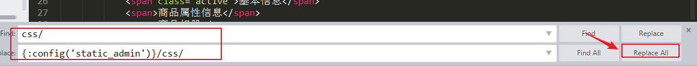

并修改模板的内容：

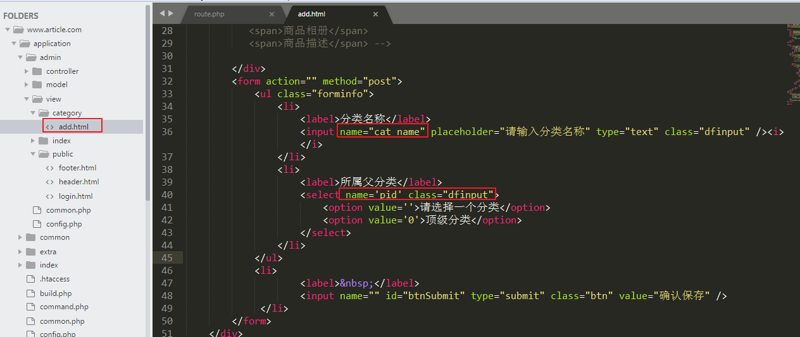

效果如下：

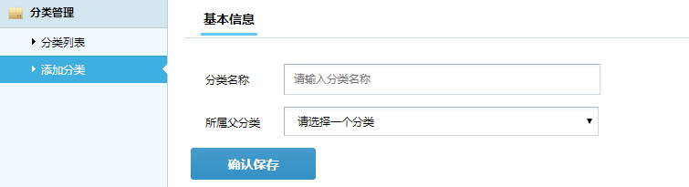

**步骤5**：==获取无限极分类数据显示在select框中==

a.  在`Category`模型中定义一个无限极分类的方法

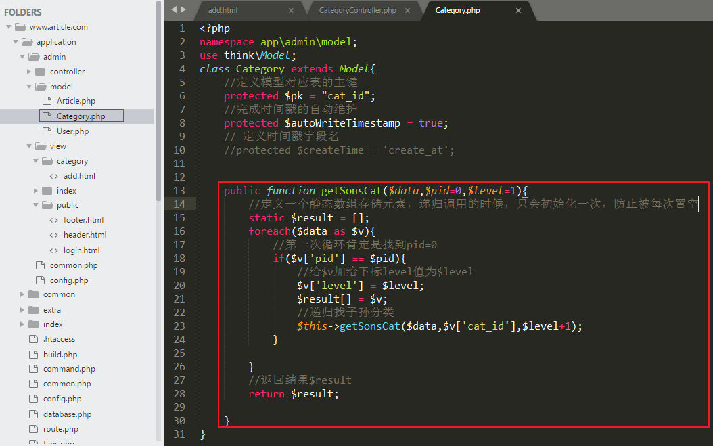

b.  控制器调用上面的方法，并把数据分类到模板中

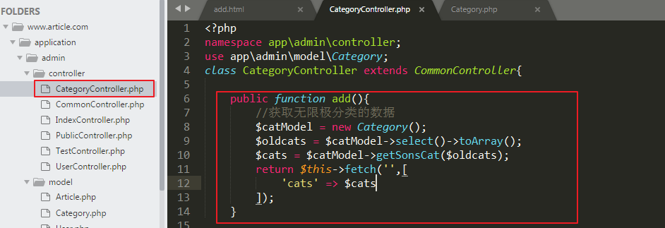

c.  模板中进行遍历

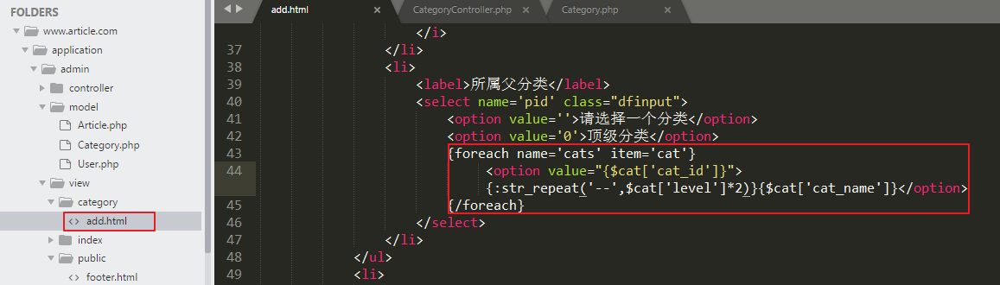
    
效果：
    
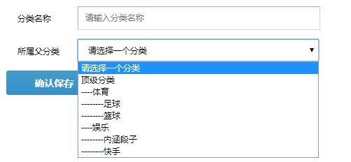


## 2、完成添加分类数据的入库

**步骤1**：把**get**路由换成**any**形式

```php
Route::group('admin',function(){
	Route::any('/category/add','admin/category/add');
});
```

**步骤2**：在`add`方法判断是否是**post**请求，完成数据的入库操作

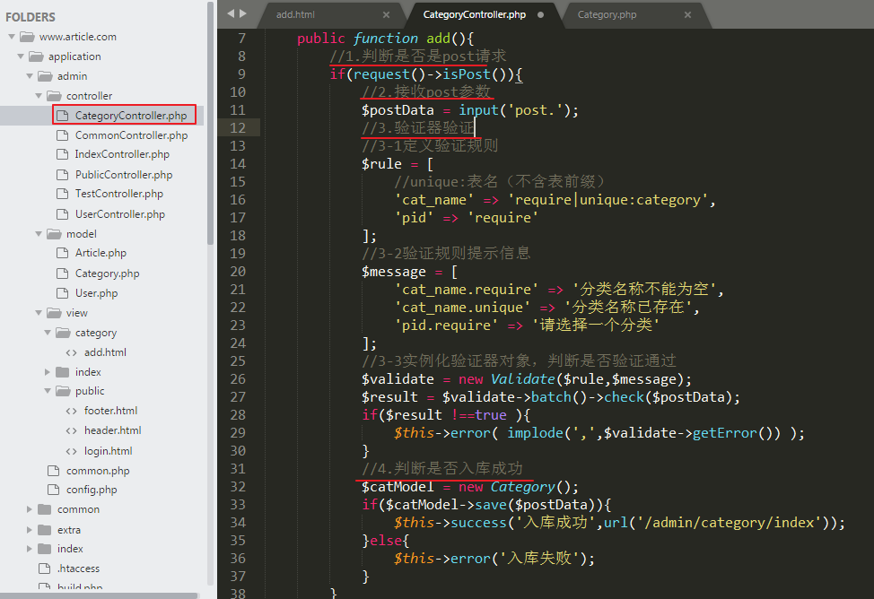

----


# 三、案例：完成文章分类的列表展示

**步骤1**：修改`left.html`文件的链接地址

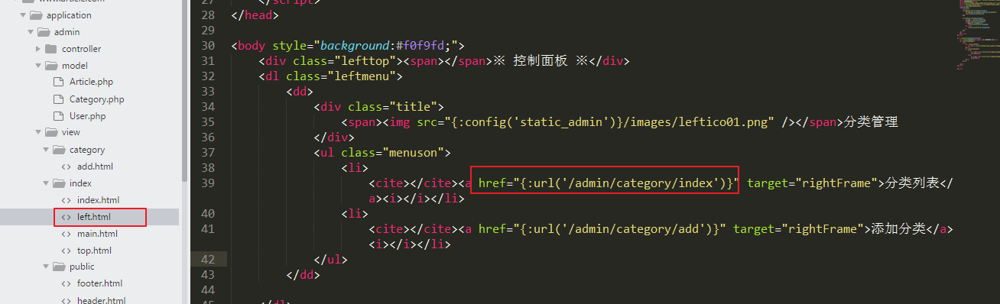

**步骤2**：设置路由

```php
Route::group('admin',function(){
	Route::any('/category/index','admin/category/index');
});
```

**步骤3**：建立一个`index`的方法，取出分类的数据并分配在模板中，输出模板内容

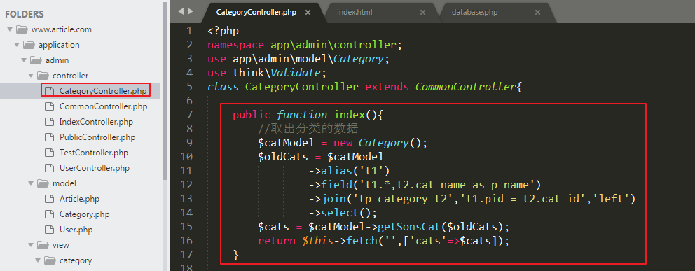

**步骤4**：把后台模板`showlist.html`复制到对应目录，并修改静态资源文件路径

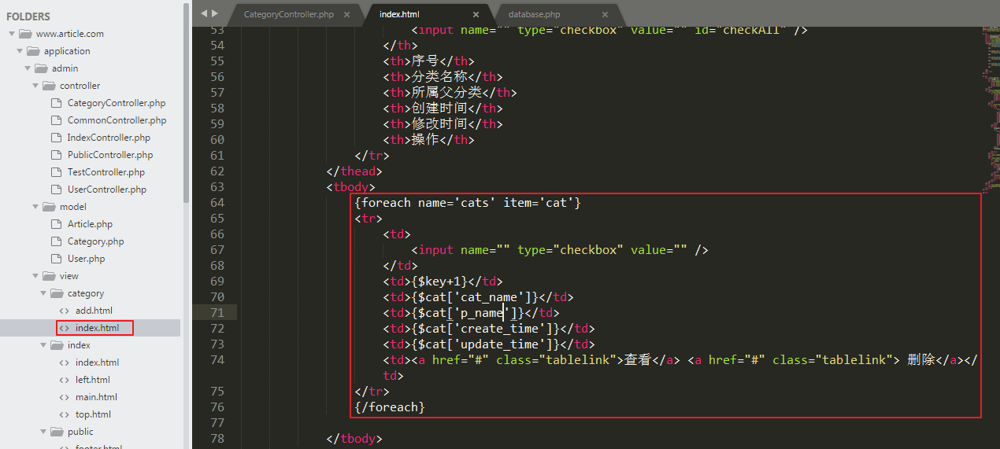

效果：

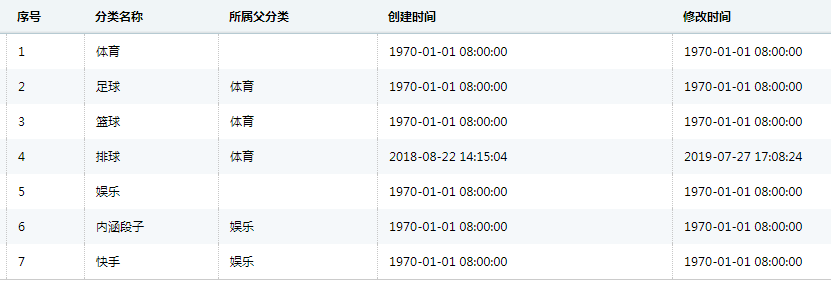

注：其中`create_time`和`update_time`在数据库中是时间戳**int**的格式，可以在配置文件`application/database.php`中修改以下配置项，在模板中显示时就会自动转化为日期格式：

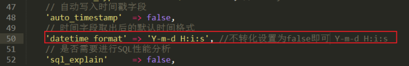

如果不想转化，可以在对应的模型类中进行取消。

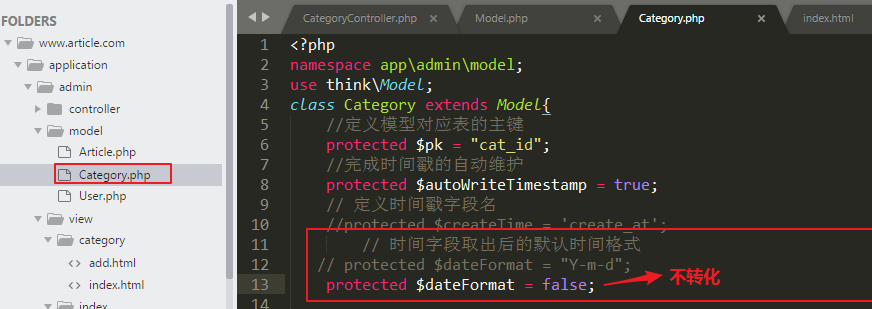

----


# 四、案例：完成文章分类的编辑 

## 1、实现编辑分类数据回显到模板中

**步骤1**：修改`index.html`模板的编辑的链接地址，并设置好路由

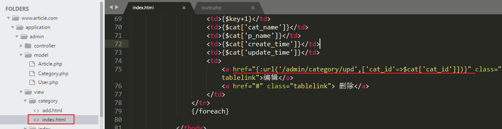

```php
Route::group('admin',function(){
	Route::any('/category/upd,'admin/category/upd);
});
```

**步骤2**：建立一个`upd`的方法，根据`cat_id`的参数，取出当前分类的数据，分配到模板中

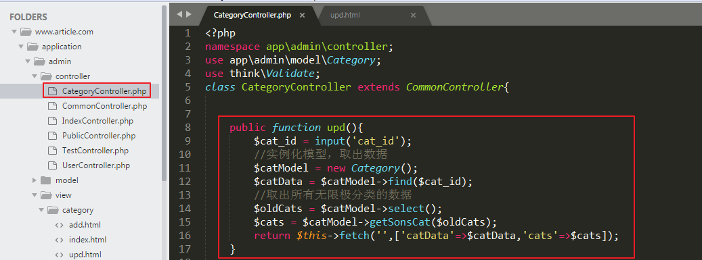

**步骤3**：在`upd.html`模板中进行回显数据。模板可复制当前的`add.html`

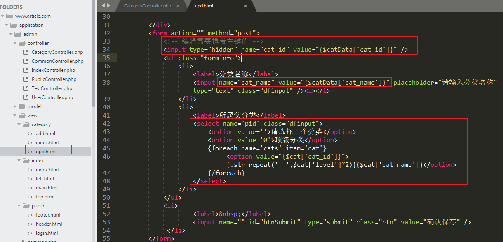

==小技巧：==

```
$("select").val(3); //把option的value=3的默认选中
$("select").val(当前分类的父分类cat_id);
```

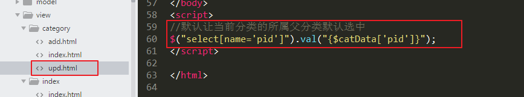


## 2、实现分类编辑的数据入库

在`upd`方法中判断**post**请求，完成编辑的数据入库

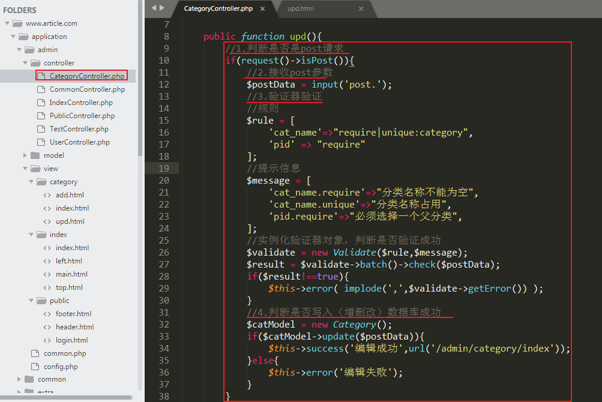

----


# 五、把验证器独立出来使用 

如果把验证的逻辑都写在控制器的方法中，那么方法就会变的很臃肿且难以维护，且还会写出和其他功能相同的规则，造成代码冗余，我们可以把这些验证规则单独写一个验证器类中。方便后期维护，让控制器方法逻辑更加直观。

**步骤1**：在模块中创建一个`validate`目录，存储验证器类。 验证类名建议和模型类名保持一致

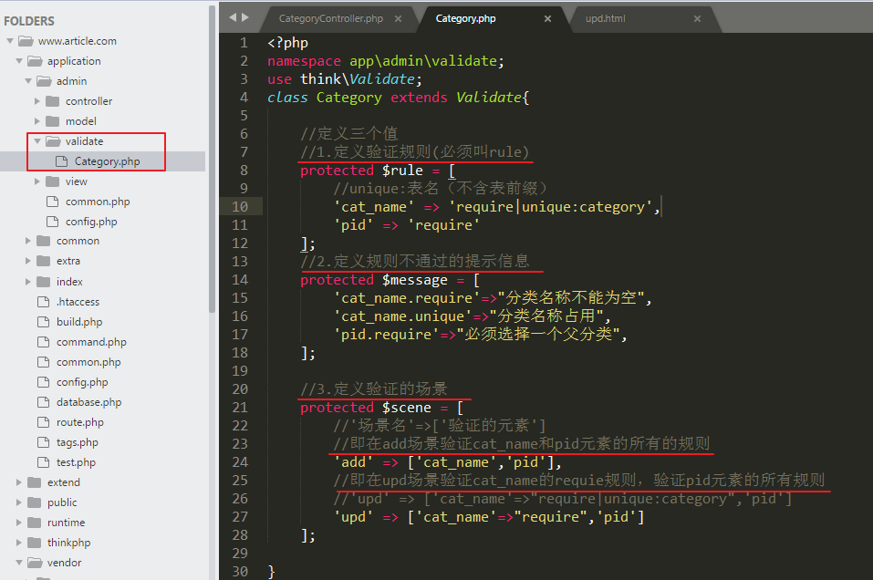

验证场景解读

```php
$scene=[
    //后面未写规则，则验证 【规则名】 下所有规则，多个规则用竖线 | 隔开
    //'场景名'=>['规则名'=>'规则|规则','规则名'],
    'upd'=>['cat_name'=>'require|unique','pid'],
];
```


**步骤2**：使用上面的验证器进行验证

如，在分类的`add`方法中使用：


**注：使用外部的单独验证器类进行验证，不需要引入。调用validae方法时候框架会自动加载**

**validate**方法的源码位置：`thinkphp\library\Controller.php`


**参数1**：验证的数据，要求是一个一维数组，键名是表的字段名。

**参数2**：`验证器名.场景名`

​		如果只写验证器名，则验证所有的元素规则。若只验证add场景下的元素，则这么写：验证器名.add

**参数3**：提示信息，默认写\[\]即可。

**参数4**：true为批量验证，false验证单个验证。

**返回值**：

验证成功，返回**true**

验证失败，批量验证返回**错误**数组，单个验证返回一个错误的字符串。

----


# 六、案例：使用Ajax完成文章分类的无刷新删除 

jqueyr发送ajax请求：

-   `$.ajax({})` 发送get也可以post，可以控制同步或异步。

-   `$.get(url,data,callback,dataType)` 只能发送get请求，默认是异步,只有成功的回调函数。

-   `$.post(url,data,callback,dataType) `只能发送post请求，默认是异步，只有成功的回调函。


**==删除分类的注意事项：==**

-   当前分类下不能存在子分类

-   当前分类下面不能存在文章

    

满足上面两个条件之一都不能删除。


**步骤1**：给`index.html`模板页面的删除链接阻止默认行为、设置自定义属性`cat_id`记录当前要删除的分类，设置类名为`delCat`。


**步骤2**：给`class='delCat'`，绑定单击事件，获取`cat_id`的属性值，发送ajax请求


查看get和post所传递的参数，查看抓包的**header**选项：


**步骤3**：在CategoryController控制器建立一个`ajaxDelCat`的方法，完成分类的删除

a.  定义路由

```php
Route::group('admin',function(){
	Route::get('/category/ajaxdelcat','admin/category/ajaxdelcat');
});
```


**步骤4**：判断状态码等于200，即删除成功，移除当前**tr**行


----


# 七、案例：完成文章的添加

## 1、输出添加文章模板的展示

**步骤1**：在后台`admin`创建一个`ArticleController`，并建立一个`add`方法输出模板内容。


**步骤2**：设置`add.html`模板的**name**名称


## 2、集成富文本编辑器到文章的内容添加页中

**步骤1**：把**ueditor**编辑器复制到`/public/plugins/`目录下面


**步骤2**：引入富文本编辑器的三个js文件（可参考上面的index.html文件）


给文本域textarea设置一个id，给此id进行初始化。


效果如下：


## 3、实现文章数据的入库

在`add`方法中判断是否是**post**请求，完成数据入库


定义验证器的**add**验证场景：


设置模型的时间戳自动维护：


----


# ==TP5第四天==

# 一、案例：完成文章的图片上传和缩略图生成

## 1、实现文章的图片上传

**上传文件的要求：**

-   **post**请求

-   设置**form**标签的`enctype='multipart/form-data'`

    

    **步骤1**：设置表单上传文件的要求

    

    **步骤2**：设置文件上传域`type=file`

    

    **步骤3**：在`add`的方法中，接收文件信息，进行文件上传

    手册位置：杂项-\>上传

    

    在当前控制器中，封装一个上传文件的方法，成功返回图片的路径

    

    上传成功如下：

    

    数据库存储的路径：

    

    **步骤4**：限制上传图片的一些要求：如图片的后缀，图片的大小

    


## 2、实现文章图片缩略图生成

手册位置：杂项-\>图像处理

安装`topthink/think-image`包通过执行以下指令：

```php
composer require topthink/think-image=1.0.7
```


下载好如下所示：


使用缩略图进行缩放处理：


表中存储的字段内容如下：


原图是路径默认反斜杠`\`分隔，缩略图路径默认是正斜杠，需要注意。

效果如下：


----


# 二、案例：完成文章列表的展示

## 1、实现文章列表在模板中展示

**步骤1**：设置`left.html`的链接地址


**步骤2**：设置路由

```php
Route::group('admin',function(){
	Route::any('/article/index','admin/article/index');
});
```

**步骤3**：在`ArticleController`建立一个`index`的方法，获取文章数据，分配到模板中


**步骤4**：模板中遍历数据


效果：


## 2、实现文章列表的分页功能

手册位置：杂项-\>分页

在`index`方法中，把模型的select方法改为**paginate**(每页显示的条数)


在模板中调用`render()`方法进行渲染出分页的页码结构：


注意：默认tp5分页页码是没有样式，我们自己需自定义样式，可以引入`page.css`文件。


效果：


----


# 三、案例：文章的编辑

## 1、实现编辑数据回显到模板中

**步骤1**：给`index.html`的编辑设置链接地址


**步骤2**：设置路由

```php
Route::group('admin',function(){
	Route::any('/article/upd,'admin/article/upd');
});
```

**步骤3**：建立一个`upd`方法，取出当前分类的数据，回显到模板中


**步骤4**：模板中进行回显


效果：


## 2、实现编辑数据入库

在`upd`方法中，判断是否是**post**请求


编辑还需要完成图片上传，有图片，则在上传时需要把原图给移除


----


# 四、案例：文章的删除

**步骤1**：给删除的链接地址设置一个**url**


**步骤2**：设置删除的路由

```php
Route::group('admin',function(){
	Route::any('/article/del,'admin/article/del');
});
```

**步骤3**：在`articleController`中建立一个`del`的方法，完成删除，并删除文章的图片


删除文件`unlink`方法：


----


# 五、案例：ajax+layer弹出层获取文章内容

**步骤1**：设置查看文章内容的标签


**步骤2**：给`class=showContent`绑定单击事件


**步骤3**：设置一个路由

```php
Route::group('admin',function(){
	Route::any('/article/showcontent','admin/article/showcontent');
});
```

**步骤4**：在`ArticleController`建立一个`showContent`方法，获取文章的详情，返回**json**格式数据


**步骤5**：把响应的内容在==layer==弹出层进行显示

a.  把下载下来的插件的压缩包中的layer文件夹复制`/public/plugins/`目录下


b.  引入上面插件的核心js文件layer.js


c.  页面层中显示内容


    
效果：


----


# 六、案例：实现上传图片的预览

参考文件：


**步骤1**：在`add.html`文件中引入核心js文件


**步骤2**：给上传文件域设置**onchange**事件，以及设置图片预览的区域


效果：


----


