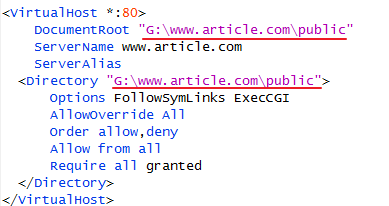
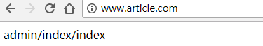
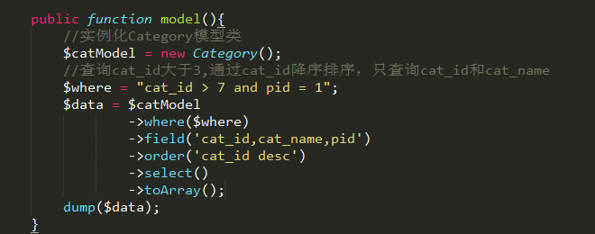
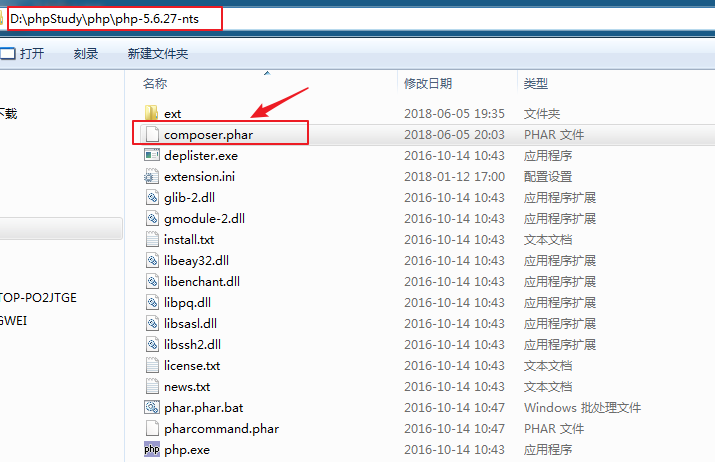
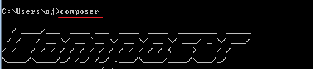

# ==TP5第一天==

# 一、框架概述 

## 1、什么是框架 

**框架(Framework)**，它是许多代码文件的集合，这些代码文件是程序结构的代码，不是业务代码，里面包含了许多函数、类库(分页类、验证码类、文件上传类、DB类、Image类\...)、设计模式(mvc、单例、AR..)等。

以后使用框架开发项目只需要写业务代码即可。


**现在企业中开发模式基本有三种:**

从快到慢排序：二次开发(需要修改源码)\-\--\>==**框架开发**==\-\-\--\>源码开发

**源码建房子**：从零开始-\>打地基-\>浇筑混泥土-\>装修\....

**框架建房子**：相当于毛坯房-\>各种装修。

**二次开发建房子**：相当于精装修的房子，只需要拎包入住。

现在企业开发较多的模式属框架开发。


## 2、框架开发的好处 

-   **框架能节省开发时间**

    每个项目中常用的类库框架都已经封装好，如分页类、图像类,文件上传类等，直接调用即可,非常方便。（减少重复造轮子）

-   **利于团队的合作开发**

    因为框架都是mvc设计模式,模块划分清晰，可以帮助我们快速、稳定、高效搭建web应用，从而提高开发效率。

-   **使用框架的过程中可以使得我们的注意力全部集中在业务层面，而无需关心程序的底层架构。**


## 3、框架的设计模式(MVC) 

基本现在主流的框架(CI、TP、laravel、YII、zend framework、symfony、cakephp),都是采用**单一入口**(index.php)，且都是采用**mvc**的设计模式，把一个web应用程序分为三块,**控制器**、**模型**、**视图**。

C-Controller 控制器

主要作用:就是接收用户的请求,在模型和视图之间起一个调度的作用

M-Model 模型

作用:对数据库做增删改查(curd)的

V-View视图

展示模板内容,给用户一个可操作的界面


**mvc(框架)形象理解-酒店（难以理解的东西一定要把抽象的东西给生活化，助于理解）**


## 4、常见的php开发框架

### （1）ThinkPHP框架（TP框架）

TP框架的logo：


主要开发中小型项目

ThinkPHP框架是我们国人开发采用mvc模式设计的一款比较优秀的框架。在我们国内使用量较多，且开发文档也多，方便学习。

### （2）CodeIgniter 框架

CodeIgniter框架：简称CI框架，主要开发中小型项目


### （3）YII(易框架)

YII(简称易框架):主要开发大型的web应用程序:


### （4）Laravel框架 

此框架使用量世界排名第一,有最优雅的框架称号。

注：Laravel底层代码很多都是借鉴了SymFony的优点。


### （5）Zend官方框架

Zend Framework：php官方提供的框架，非常笨重，主要开发大型的web应用程序。


### （6）Symfony国外框架


==框架只有最合适的，没有最好的，需结合自己的实际业务去选择最合适的。==

国内使用较多的框架是**TP**、**laravel**、**CI**。

**YII**，**Symfony**框架一般外企使用较多

----


# 二、ThinkPHP5框架

## 1、下载TP5框架

下载地址：<http://www.thinkphp.cn/down.html>


## 2、TP5框架的目录结构

手册位置：基础\--\>目录结构


```
1.	project  应用部署目录
2.	├─application           应用目录（可设置）
3.	│  ├─common             公共模块目录（可更改）
4.	│  ├─index              模块目录(可更改)
5.	│  │  ├─config.php      模块配置文件
6.	│  │  ├─common.php      模块函数文件
7.	│  │  ├─controller      控制器目录
8.	│  │  ├─model           模型目录
9.	│  │  ├─view            视图目录
10.	│  │  └─ ...            更多类库目录
11.	│  ├─command.php        命令行工具配置文件
12.	│  ├─common.php         应用公共（函数）文件
13.	│  ├─config.php         应用（公共）配置文件
14.	│  ├─database.php       数据库配置文件
15.	│  ├─tags.php           应用行为扩展定义文件
16.	│  └─route.php          路由配置文件
17.	├─extend                扩展类库目录（可定义）
18.	├─public                WEB 部署目录（对外访问目录）
19.	│  ├─static             静态资源存放目录(css,js,image)
20.	│  ├─index.php          应用入口文件
21.	│  ├─router.php         快速测试文件
22.	│  └─.htaccess          用于 apache 的重写
23.	├─runtime               应用的运行时目录（可写，可设置）
24.	├─vendor                第三方类库目录（Composer）
25.	├─thinkphp              框架系统目录
26.	│  ├─lang               语言包目录
27.	│  ├─library            框架核心类库目录
28.	│  │  ├─think           Think 类库包目录
29.	│  │  └─traits          系统 Traits 目录
30.	│  ├─tpl                系统模板目录
31.	│  ├─.htaccess          用于 apache 的重写
32.	│  ├─.travis.yml        CI 定义文件
33.	│  ├─base.php           基础定义文件
34.	│  ├─composer.json      composer 定义文件
35.	│  ├─console.php        控制台入口文件
36.	│  ├─convention.php     惯例配置文件
37.	│  ├─helper.php         助手函数文件（可选）
38.	│  ├─LICENSE.txt        授权说明文件
39.	│  ├─phpunit.xml        单元测试配置文件
40.	│  ├─README.md          README 文件
41.	│  └─start.php          框架引导文件
42.	├─build.php             自动生成定义文件（参考）
43.	├─composer.json         composer 定义文件
44.	├─LICENSE.txt           授权说明文件
45.	├─README.md             README 文件
46.	├─think                 命令行入口文件
```

==重点目录：==

-   应用**application**目录

-   框架的核心目录**thinkphp**

-   **public**目录供外访问的


每个application下面的模块目录都有mvc分层结构，如index模块


当然也可以在application目录中创建多个模块（分组）。

----


# 三、使用TP5框架部署项目

我们是使用ThinkPHP5+JavaScipt+Ajax+jquery以及和第三方插件结合起来，做一个文章管理系统，掌握怎样使用ThinkPHP5快速开发一个项目。

## 1、配置项目虚拟主机

**主要三个核心步骤：**

1. 使用phpStudy建立虚拟主机，把tp5框架部署在web虚拟目录中

2. 设置hosts文件ip和域名的映射

3. 重启apache服务器


步骤如下：

**步骤1**：把下载下来的框架程序复制到web虚拟目录


**步骤2**：使用phpstudy建立虚拟主机




==注：域名是绑定在项目的public目录下面==

**步骤3**：设置hosts文件ip和域名的映射


## 2、访问虚拟主机

输入配置的域名直接访问：


为什么会出现上面的一个笑脸？

答：那是因为受到框架的应用配置文件`application/config.php`的影响，默认访问index模块的index控制器的index方法，如下：


注：tp5默认支持老本tp3的**pathinfo**模式进行访问。
`http://域名/index.php/模块/控制器/方法名/参数1/值1/参数2/值2/`

例：访问index模块的index 控制器的index方法

`http://域名/index.php/index/index/index/参数1/值1/参数2/值2/`


当然tp5框架也支持像laravel框架那样定义路由来访问。


## 3、响应输出

控制器的所有操作方法都是`return`返回而不是直接输出，系统会调用`Response::send`方法将最终的应用返回的数据输出到页面或者客户端，并自动转换成配置项`default_return_type`（默认为html）配置的格式。所以，应用执行的数据输出只需要返回一个正常的PHP数据即可。

tp5也是建议统一使用`return`返回数据，而不是`echo`输出，如非必要，请不要使用`exit`或者`die`中断执行。


----


# 四、控制器 

## 1、控制器的作用

C：Controller

==作用==：主要是接受用户的请求，在模型和视图之间起调度的作用。

## 2、创建控制器

### （1）修改控制器后缀

由于国人命名的习惯，一般控制器名称后面都习惯加`controller`，我们可以通过以下配置文件设置后缀。

打开配置文件，`[项目目录]/application/config.php`，做如下修改：


上面改好之后，控制器==文件的命名==和==控制器类名==都需要更改：


##### !important 

**==注意： 不管是否修改，访问时都不能加后缀，因为默认会自动添加此后缀的。==**


### （2）创建控制器语法

**==语法规则：==**


**控制器类名**：控制器名（首字母大写）+Controlle
**控制器文件名**：控制器名+Controller.php
**控制器文件所在路径**：application/模块名/controller/


如在index模块下定义一个Test控制器：

控制器类名： `TestController`

控制器类文件名：` TestController.php`

文件定义位置：`index/controller/TestController.php`

==注：类名首字母大写==

代码如下：


访问：


### （3）隐藏入口文件进行访问（rewrite重写模式）

省去`index.php`入口文件访问，需要以下几步。

-   步骤1：在apache配置文件`httpd.conf`开启重写文件：

    

    

-   步骤2：找到重写文件`.htaccess`，在`[项目根目录]/Public/.htaccess` ,做如下修改：

    ```.htaccess
    <IfModule mod_rewrite.c>
      Options +FollowSymlinks -Multiviews
      RewriteEngine On
    
      RewriteCond %{REQUEST_FILENAME} !-d
      RewriteCond %{REQUEST_FILENAME} !-f
      RewriteRule ^(.*)$ index.php?/$1 [QSA,PT,L]
    </IfModule>
    ```

    

    (==注==：上图可能需要在index.php后边加"?"号)


-   **步骤3**：修改虚拟主机`httpd-vhosts.conf`的配置：加上`AllowOverride All `，默认phpstudy创建的虚拟主机自带这一行。

    

    最后重启apache服务器，省去入口文件index.php进行访问，输入：`http://域名/模块/控制器/方法`

    


### （4）开启调试模式

为了在开发过程中，开发者能够及时看到详细的错误信息，我们在开发阶段可以把`application/config.php`配置文件中的`app_debug`配置项设置为**true**,


如访问一个不存在的方法indexdd,会报详细的错误，这样有利于错误的排查


在如：访问一个不存在的控制器，报错如下：


若设置为`app_debug`为**false**,则会出现友好的提示：


==所以，项目上线后，我们要把此配置改为**false**，不要让用户看到我们网站报错。==

----


# 五、项目分组(模块)

## 1、创建分组

一个项目中一般都有**Home**、**Admin**分组，即前台和后台，那对应框架中就是一个具体的文件夹，每个项目文件夹都有对应的**控制器**、**模型**、**视图**对应的文件夹，tp5框架中默认有一个分组**index**。

我们只需要把`index`默认分组复制一份改名（如`admin`）放在**Application**目录下即可，同时修改对应类所在分组的命名空间即可。


在admin模块下面要建立一个**控制器**、**模型**、**视图**对应的文件夹，和一个**配置文件**和**公共函数文件**


复制分组的时候，记得更改类名所在的模块命名空间：


## 2、默认分组的设置

需修改框架的`application/config.php`配置文件，如设置默认访问admin分组的index控制器的index方法，做如下修改：


再次输入域名访问，访问的则是admin模块下的index控制器的index方法：



## 3、分组的访问权限控制

有些分组若不想让用户访问，可以设置为禁止访问。需修改框架的`application/config.php`的配置文件：


上图是设置禁止访问common和index分组。

再次访问禁止的index模块，会报错，模块不存在。


# 六、命令行操作(了解) 

手册位置： 命令行-->自动生成目录结构

## 1、命令行创建分组

自动生成以`APP_PATH`为起始目录，并且会自动生成模块的默认的Index访问控制器文件用于显示框架的欢迎页面。

* `__dir__` 表示生成目录（支持多级目录）
* `__file__` 表示生成文件（不定义默认会生成 config.php 文件）
* `controller` 表示生成**controller**类
* `model`  表示生成**model**类
* `view`  表示生成**html**文件（支持子目录）


创建文件`application/build.php`并填充内容，可以参考根目录` build.php`

```php
return [
    // 生成应用公共文件，位于 application 目录下
    '__file__' => ['common.php', 'config.php', 'database.php'],

    // 定义demo模块的自动生成
    // '模块名'=> [<模块下的内容，可空>]
    'demo' => [
        //创建文件，直接位于模块名目录下
        '__file__' => ['common.php'],   
        //创建目录，直接位于模块名目录下
        '__dir__' => ['behavior', 'controller', 'model', 'view'],  
        
        ############### 对上面的目录进一步构建 ###############
        //创建的控制器目录下的内容（控制器文件及控制器类）
        'controller' => ['Index', 'Test', 'UserType'],  
        //创建模型目录下的内容（文件及模型类）
        'model' => [], 
        //创建视图目录下的内容（模版文件，不需要加后缀，默认html后缀）
        'view' => ['index/index'], //相当于 view/index/index.html
    ],
    // …… 其他更多的模块定义
];
```

##### !important

**注意**：模版文件，不需要加后缀，默认html后缀。控制器等==后缀不会自动添加==。已存在的不受影响


创建`application/build.php`并填充如下内容：


cmd切换到**项目目录**执行如下命令(需要添加php到环境变量)：

```cmd
php think build
```

成功后，会生成对应设置的模块、控制器、模型和文件等


## 2、命令行创建控制器

同样，cmd切换到**项目目录**执行如下命令：
```
php think make:controller 分组/控制器名称
```

##### !important 

**注**：不写分组名会直接创建在`common`分组 `controller`中，`控制器名称`==不需要写后缀==，自动添加后缀的。


例：在admin模块中生成一个User的控制器

项目根目录\> php think make:controller admin/User

成功会提示successfully。

生成如下所示：


例如下述，要在index分组下创建UserController.php控制器文件

\[项目根目录\] \> php think make:controller index/User

生成的文件：


## 3、命令行创建模型类

同样，cmd切换到**项目目录**执行如下命令：
```
php think make:model 分组/模型名称
```

**注**： `模型名称`  后面并不会有自动添加的后缀


如，执行下面的指令可以生成`index`模块的`Blog`模型类库文件

```cmd
php think make:model index/Blog
```

生成的模型类文件如下：

```php
namespace app\index\model;
use think\Model;

class Blog extends Model
{

}
```

----


# 七、路由（重要）

我们之前是通过`pathInfo`模式进行访问控制器中的方法,但是这种访问模式url太长，难以记住，能不能通过简单的地址就可以访问？,可以的！，通过tp5提供的路由就可以实现。


## 1、路由模式

手册位置：路由-\>路由模式


在tp5中，路由模式有三种，分别是：

* 普通模式（默认模式pathinfo）
* 混合模式
* 强制模式


### （1）普通模式

此模式是框架的默认模式，默认是关闭路由的。在` appcation/config.php`文件中：
```
'url_route_on'  =>  false,
```

上面路由关闭后，不会解析任何的路由规则，只能采用默认的pathInfo模式访问url。如：

http:/域名/index.php/模块/控制器/方法/参数1/值1


### （2）混合模式

开启路由，并使用路由定义+默认pathInfo模式的混合。在` appcation/config.php`文件中：
```
'url_route_on'  =>  true,
'url_route_must'=>  false,
```

在`application/config.php`配置文件中开启路由功能后，访问的时候就会经过路由规则，根据定义的路由规则从而访问到某个控制器中的方法。

路由图解：


### （3）强制模式

开启路由，并设置必须定义路由才能访问。在` appcation/config.php`文件中：
```
'url_route_on'  =>  true,
'url_route_must'=>  true,
```

**注**：这种方式下面必须严格给每一个访问地址定义路由规则（包括首页），否则将抛出异常。

==推荐使用强制模式，方便后面url统一管理。==


## 2、定义路由

手册位置：路由-\>路由定义


把路由规则定义在`application/route.php`文件中。

需要先引入路由类`Route`
```php
use think\Route;
```


**==最简洁的定义方式如下：==**

```php
Route::get('路由表达式','路由地址');
Route::post('路由表达式','路由地址');
Route::any('路由表达式','路由地址');
或
Route::Rule('路由表达式','路由地址',['method'=>'get']);

其中any代表任意请求方式（get/post）都支持的路由规则
```


**例如**：

`Route::get('login','home/User/login');`

访问：[http://域名/index.php/login](http://域名/index.php/login)

路由到：[http://域名/index.php/home/User/login](http://域名/index.php/home/User/login)


`Route::get('houtai','admin/index/index');`

访问：[http://域名/houtai](http://域名/houtai)

路由到：[http://域名/admin/index/index](http://域名/admin/index/index)


如下的一个控制器**login**方法：


定义路由访问：


效果：


## 3、定义路由分组

一般前台的路由地址都含有**home**,后台则为**admin**,我们可以把相同的路由地址进行分组。

**路由分组语法：**

```php
Route::group('分组名',function(){
Route::get('路由表达式','路由地址');
});
```

`分组名` 只适用于 `路由表达式`，`路由地址`还是需要完整书写。


例如：

```php
Route::group('admin',function(){
Route::any('user/index','admin/user/index);
//定义更多...
});
```


访问：[http://域名/admin/user/index](http://域名/admin/user/index)

路由到：[http://域名/admin/user/index](http://域名/admin/user/index)

代码如下：


定义路由：


访问路由：


## 4、定义路由参数(路由参数绑定) 

### （1）定义单个路由参数

【**==定义==**】在路由表达式后面通过`:参数名`形式定义路由参数，`/`为参数分割符。

```php
Route::get("user/:id",'admin/test/test);
```


【**==传递==**】在url中传递参数方式为`http://域名/user/34` ，注意，直接写参数的值即可，如34。


【**==接收==**】上面对应路由规则方法，必须定义一个==相同形参名==id来接收，如：

```php
function test($id){
echo $id;
}
```


若路由参数**可缺省**，则在路由表达式通过`[:参数名]` 来指定，同样用`/`为参数分割符。

```php
Route::get("user/[:id]",'admin/test/test');
```

上面参数可缺省，且定义的\$id参数必须有**默认值**，否则报错

```php
function test($id = 0){
	echo $id;
}
```


### （2）定义多个路由参数

````php
Route::get("user/:id/:name/:email",'admin/test/test');
````

则对应的形参名也必须一致，如：

```php
function test($id,$name,$email){
	echo $id.$name.$email;
}
```

----


# 八、输出视图(模版)

**输出视图**（==渲染模版==）


**语法**：控制器中调用fetch方法，常用写法，支持跨模块：

```php
return $this -> fetch(模块@控制器/操作);  
```


注意：

==控制器要调用fetch方法，则必须继承Controller类==：``use think\Controller``

**fetch()一般下述3种用法：**

-   \[重点掌握\]调用：`view目录下/当前控制器名同名目录/当前操作名.html`同名模板文件

    `return $this -> fetch();`

-   调用：`view目录下/当前控制器/add.html`模板文件

    `return $this -> fetch('add');`

-   调用：`view目录下/user控制器/login.html`模板文件\[跨控制器\]

    `return $this -> fetch('user/login'); `

    

    代码如下：

1.  控制器输出模板内容

    

    定义好路由（`application/route.php`）：

    `Route::get('login/[:id]/[:name]','admin/user/login'); `

2.  建立对应的模板文件：

    

    效果：

    

----


# 九、模板分配变量 


**==语法==**：在控制器调用`assign`方法
```php
	public function index()
    {
        // 模板变量赋值
        $this->assign('name','ThinkPHP');
        $this->assign('email','thinkphp@qq.com');
        // 或者批量赋值
        $this->assign([
            'name'  => 'ThinkPHP',
            'email' => 'thinkphp@qq.com'
        ]);
        // 模板输出
        return $this->fetch('index');
    }
```

【推荐】或者把模板变量直接传递给fetch方法第二个数组参数：
```php
public function index()
{
        return $this->fetch('index', [
            'name'  => 'ThinkPHP',
            'email' => 'thinkphp@qq.com'
        ]);
}
```


代码如下：


在模板中默认通过一对花括号{ }，里面写分配过来的变量。


效果：


----


# 十、修改模版的定界符

注意：默认模板变量的边界符是一对{}，可以通过以下配置进行修改，`application/config.php`


----


# 十一、模板常用标签

手册位置： 模版-->内置标签


## 1、volist和foreach

**作用**：都是主要用来遍历数组


-   **volist标签**

    ```php
    {volist name="list" id="vo"}
    {$vo.id}:{$vo.name}<br/>
    {/volist}
    ```

    Volist标签的**name**属性表示模板赋值的变量名称，因此不可随意在模板文件中改变。**id**表示当前的循环变量，可以随意指定，但确保不要和name属性值冲突。

    

-   **foreach标签**

    ```php
    {foreach name="list" item="vo"}
        {$vo.id}:{$vo.name}
    {/foreach}
    ```

    name表示数据源 item表示循环变量。

    

    代码如下：

    控制器分配变量：

    

    模板输出变量：

    

    效果：

    

## 2、php标签

如果模板标签语法很难记，这里可以使用php标签统一进行一些代码的编写：


Php代码可以和标签在模板文件中混合使用，可以在模板文件里面书写任意的PHP语句代码 ，包括下面两种方式：

**使用php标签**

例如：

```html
{php}echo 'Hello,world!';{/php}
```

我们建议需要使用PHP代码的时候尽量采用php标签，因为原生的PHP语法可能会被配置禁用而导致解析错误。

**使用原生php代码**

```php+HTML
<?php echo 'Hello,world!'; ?>
```


注意：在php标签和原生的php中，可以自定义变量，同时也可以使用控制器分配过来的变量。


效果：


注：上面的原生php写法，可以通过配置文件进行禁用


## 3、include标签

**作用**：

一般网站页面的头部或尾部的网页效果都是一样的，我们就可以把这些网页的代码抽离出来放在一个html文件中，需要使用这些文件的时候，在模板中用include标签引入即可，从而**提高代码的复用性**。


**语法：**

```php
{include file='模版文件1,模版文件2,...' /}
```


**使用模版表达式**

模版表达式的定义规则为：**模块@控制器/操作**

例如：

```html
{include file="public/header" /} // 包含头部模版header
{include file="public/menu" /} // 包含菜单模版menu
{include file="blue/public/menu" /} // 包含blue主题下面的menu模版
```

可以一次包含多个模版，例如：

```
{include file="public/header,public/menu" /}
```

> 注意，包含模版文件并不会自动调用控制器的方法，也就是说包含的其他模版文件中的变量赋值需要在当前操作中完成。

==注意：file的路径是从当前模块的view目录下开始找起。==

更多参考手册


如：有一个`header.html`模板，其所在路径为：`admin/view/public/header.html`

在模板中引入此文件： `{include file="public/header" /}`


效果：


----


# 十二、助手函数

## 1、url()

手册位置：路由-\>URL生成。


**语法**：

```php
url('模块/控制器/方法'，参数); 
```

**作用**：会生成指定的url地址，第二个参数指定跳转携带的参数，若在模板中使用助手函数需要在花括号{}前面加个冒号：，如 `{:url()}`

`<a href="{:url('index/index/index',['id'=>1])}">跳转</a>`

注:如果路由模式为强制模式，则url中的第一个参数只能是定义的路由规则。

更多的助手函数,手册位置：附录-\>助手函数


## 2、config()


**语法**：

```php
config('配置名',[值]);
```

**作用**：获取和设置配置文件中的值。

传递第一个参数就是获取。

传递第二个参数就是设置。


注意：

**配置文件的优先级（==就近原则==）**：

动态配置(`config()`) \> 模块配置(`admin/config.php`) \>应用配置(`application/config.php`) \> 惯例配置（核心配置`thinkphp/convention.php`）


## 3、dump()和halt()

这是两个调试变量的函数：

```php
dump($data)
```
`dump()`函数等价`<pre /> + var_dump()`

而halt函数会停止代码的执行。
```php
halt($data)
```
`halt()`函数等价`<pre /> + var_dump()+die;`

----


# 十三、Request对象

手册位置：请求\--\>请求信息

## 1、获取Request对象 

图解Request对象、response对象：


图解说明：

-   服务端server把客户端请求过来的相关信息都封装在一个**Request**对象中。如请求地址、请求参数、请求类型、上传的文件信息等。

-   服务端server把响应给浏览器的相关信息都封装在一个**Response**对象。如响应http状态码200给客户端等。

    

**获取Request对象的方式：**

方式一：

引用`think\Request`类 ，`$request = Request::instance();`


方式二（最简单的方式）：

通过tp5框架提供的助手函数`request()`

```php
$request = request();
```


方式三：通过依赖注入（闭包）的方式，把Request对象注入到方法内部

```php
public function test(Request $request){  //声明参数类型
	dump($request);
}
```


更多的助手函数在手册： 附录-\>助手函数

所有的助手函数源码位置：`thinkphp/helper.php`


## 2、获取请求信息

手册参考位置：请求\--\>请求信息

```php
$request->domain();     // 获取当前域名
$request->url();         // 获取当前URL地址
$request->url(true);    // 包含域名的完整URL地址
$request->baseUrl();    // 获取当前URL地址 不含QUERY_STRING
$request->header();     // 获取当前请求的HTTP 请求头信息
$request->ip();          // 获取访问ip地址 

$request->module();      //获取当前访问模块名称
$request->controller(); //获取当前访问控制器名称
$request->action();     //获取当前访问操作名称 
$request->isAjax();     // 判断 是否是ajax请求
$request->isPost();     // 判断 是否是post请求
$request->isGet();     // 判断 是否是get请求
```

代码：


效果：


## 3、获取请求参数

手册参考位置：请求\--\>输入变量

**语法**：`变量类型方法('变量名/变量修饰符','默认值','过滤方法')`


### （1）获取GET和POST参数

==注：input()会自动获取get或post传递的参数==

这里推荐使用内置的助手函数`input()`可以获取到get或post参数

```php
 input('id'); // 接收id参数
 input('name');// 接收name参数
 input('get.'); //获取整个get数组参数
 input('post.'); //获取整个post数组参数
```


如果要获取的数据为数组的时候，一定要加`/a`修饰符才能正确获取到。

如：

```html
 <input type='text' name='ids[]' />
```

接收ids参数

```php
input('ids/a'); // 接收ids数组参数
```


tp5框架默认的修饰符为`/s`,如果传入字符串之外的变量可以使用下面的修饰符，包括：

-   `/s `  强制转换为字符串类型

-   `/d ` 强制转换为整型类型

-   `/b `  强制转换为布尔类型

-   `/a `  强制转换为数组类型

-   `/f` 强制转换为浮点类型

    


代码如下：


注：input函数底层默认默认采用PARAM方式进行读取变量，自动识别GET或POST提交的参数。

```php
// 获取当前请求的name变量
$request->param('name');
```


### （2）参数默认值

说明：当参数没有值的时候，可以在input的第二个参数设置其默认值。

如，当参数id没有值时候，设置默认值为0

```php
input('id',0); // 接收id参数
```


### （3）参数过滤

我们对接收到的参数往往需要对其做一些过滤处理，如下几个常用过滤方法：

-   **strip\_tags** :去除字符串的html和php标记

-   **strtolower** : 转化为小写

-   **htmlspecialchars**：把html标签转化为html实体符号（防止xss（js）攻击）

    如：大于号`>`会被转化为 `&gt;`

    如：大于号`<`会被转化为 `&lt;`

    \.....

    

**只需要在input的第三个参数设置相应的过滤函数即可。**

```php
input('name','','htmlspecialchars'); // 接收name参数,默认为空，经过htmlspecialchars处理
```


**也可以依次经过多个过滤函数处理：**

```php
input('name','','strip_tags,strtolower'); // 先去除标记，在转化为小写
```


==注意：==

框架默认**没有**设置任何过滤规则，你可以在配置文件`application/config.php`中设置全局的过滤规则。

```php
// 默认全局过滤方法 用逗号分隔多个
 'default_filter'         => 'htmlspecialchars',
```


----


# ==TP5第二天==

# 一、数据库操作

==**在TP5操作数据库常用有两种方式：**==

-   **通过Db构造器**

    ```php
    如：Db::table('think_user')->where('status',1)->select(); // #带数据表前缀
    如：Db::name('user')->where('status',1)->select(); #不带表前缀
    ```

-   **通过模型类**

    如：取出主键为1的数据(首先配置数据库的连接信息)

    ```php
    $user = User::get(1);
    ```

    


## 1、创建数据库数据

创建好数据库和数据表：

1. 创建数据库article:

	```mysql
	create database article;
	```

2. 创建数据表**tp\_user**(用户表)、**tp\_category**（分类表）、**tp\_article**（文章表）

   **tp_user表结构：**

   ```mysql
    create table tp_user(
        user_id int not null auto_increment,
        username varchar(30) not null default '' comment '用户名',
        password char(32) not null default '' comment '密码',
        primary key(user_id)
    )engine = Innodb default charset = utf8;
   ```

    **tp_category表结构：**
   ```mysql
    create table tp_category(
        cat_id smallint not null auto_increment,
        cat_name varchar(30) not null default '' comment '分类名称',
        pid  smallint not null default 0 comment '父分类的id',
        create_time int not null default 0 comment '创建时间',
        update_time int not null default 0 comment '更新时间',
        primary key(cat_id)
    )engine = Innodb default charset = utf8;
   ```

   **tp_article表结构：**

   ```mysql
   create table tp_article(
   	article_id smallint not null auto_increment,
   	title varchar(30) not null default '' comment '文章标题',
   	content  text   comment '文章内容',
   	cat_id smallint not null default 0  comment '文章所属分类',
   	ori_img varchar(150) not null default '' comment '原图的路径',
   	thumb_img varchar(150) not null default '' comment '缩略图的路径',
   	create_time int not null default 0 comment '创建时间',
   	update_time int not null default 0 comment '更新时间',
   	primary key(article_id)
   )engine = Innodb default charset = utf8;
   ```

==注：表名加前缀`tp_`，用于区分多个项目。==

可以向表添加几条模拟数据，方便后面进行查询


## 2、配置数据库信息

在`application/database.php`文件中配置数据库相应参数（* 标记）：

```php
return [
    // 数据库类型
    'type'            => 'mysql',
    // 服务器地址
    'hostname'        => '127.0.0.1',
    // * 数据库名
    'database'        => 'article',
    // * 用户名
    'username'        => 'root',
    // * 密码
    'password'        => 'root',
    // * 端口
    'hostport'        => '3306',
    // 连接dsn
    'dsn'             => '',
    // 数据库连接参数
    'params'          => [],
    // 数据库编码默认采用utf8
    'charset'         => 'utf8',
    // * 数据库表前缀
    'prefix'          => 'tp_',
```


## 3、模型 

### （1）模型作用

**M:Model**    模型

**作用**：主要对数据库进行一些增删改查的操作。


### （2）模型的定义

如文章分类表，名为`tp_category`，此表对应的模型类名和模型文件定义如下：

**模型类名**： `Category`，驼峰法，除开表前缀的数据表名称。

**模型类文件**： `Category.php `, 表名+.php

**模型类文件所在位置**：`模块名/model/Category.php`


给表`tp_category`建立模型文件如下：


其中模型中定义的属性`$pk`为表的主 键名称，若不指定则框架会自动识别。


==有关表名的注意事项：==

手册位置： 模型-\>定义


### （3）实例化模型

-   **方式一**（==推荐==）：在控制器中实化模型首先引入其模型类所在的命名空间，如引入上面的`Category`

    控制器中引入：

    ```php
    use app\admin\model\Category;
    ```

    然后实例化模型：

    ```php
    $catModel= new Category();
    ```

    

-   **方式二**：通过助手函数`model`（就不需要引入类的所在空间）：

    ```php
    $catModel = model('Category');
    ```


打印结果：


----


# 二、模型CURD操作

**C-create**： 新增数据

**U-update**： 更新数据

**R-read**： 查询数据

**D-delete**： 删除数据


## 1、新增数据-C

手册位置：模型-\>新增

### （1）添加一条数据

-   **方式一**【==推荐==】：通过`save`方法

    ```php
    $model->save($data);
    ```

    **参数**：$data为一维数组，其中[‘表字段名’=>’数据’]

    **返回值**：成功返回写入的记录数

    

    入库成功后，可以通过字段名当做模型对象属性获取对应的值，如获取自增主键字段值：

    ```php
    $model->save($data);  
    echo $model->cat_id; 
    ```

    

-   **方式二**：通过`create`方法

    使用模型名静态调用`create($data)`，如模型名为`User`:

    ```php
    User::create($data); 
    ```

    **参数**：\$data为一维数组，其中\['表字段名'=\>'数据'\]

    **返回值**：和save方法不同的是，create方法返回的是当前模型的对象实例


save方式：


create方式：


### （2）添加多条数据

   模型调用`saveAll`方法

   ```php
$model->saveAll($data); 
   ```

   **参数** ：  \$data为二维数组，见下图。

   **返回值** ： 成功返回对象集合。`[obj,obj,obj,....]`


   


### （3）过滤非数据表字段

注意：`allowField`需要实例化模型，不能直接类调用

-   只允许数据表中的字段写入

    ```php
    $model->allowField(true)->save($data) ;
    ```

    

-   只允许name和email字段写入

    ```php
    $model->allowField(['name','email'])->save($data);
    ```

    


### （4）(补充)数据库操作AR模式

**AR** ：Active Record 活跃的对象

-   模型类映射成表

-   对象映射表中的一条记录

-   属性映射到记录中某个字段

    

    

    **所以，入库成功之后如果是返回一个当前记录的数据对象，可以通过`$model->字段名`去获取对应的字段值**


## **2、更新数据-U**

手册位置：模型\--\>更新


### （1）更新方式一

```php
$model->save($data,更新条件);
```

==注==：之前save方法只传入第一个参数为新增，通过**第二个参数**指定更新条件则为更新。


或者通过`isUpdate(true)`方法明确指定`save`为**更新**操作，其中`$data`中==必须==带更新的**主键值**

```php
$model->isUpdate(true)->save($data);
```


更新若需要过滤非数据表的字段数据，使用`allowField(true)`：

```php
$model->isUpdate(true)->allowField(true)->save($data);
```


### （2）更新方式二(推荐)

   通过`update`方法实现，但这样就无法使用模型的**事件功能**。

```php
$model->update($data);
```

   **参数** ：\$data为一维数组，键名为表字段名，其中更新必须指定==更新条件==，否则更新失败。

   **返回值** : 成功返回当前数据对象。


==注：==

-   `save`只能是**模型**对象调用

-   `update`方法可以是**模型**对象或模型**类名**进行调用


## 3、删除数据-D

### （1）删除方式一(推荐) 

通过模型名静态方法`destroy`方法实现删除一条或多条数据

```php
Category::destroy(1);  // 删除主键为1的记录
Category::destroy('1,2,3');  //删除主键为1,2,3的记录
# 或数组形式
Category::destroy([1,2,3]); 
```

**参数**：主键值

**返回值**：返回受影响的行数


### （2）删除方式二AR模式 

先获取当前数据的模型对象，在调用delete方法进行删除

```php
$category = Category::get(1);  // 获取主键为1的记录
$category->delete();  //执行删除
```

**返回值**：delete删除成功返回受影响的行数。


**一般数据是不会删除的，通过逻辑删除。**

**逻辑删除** ：即通过表中的某个字段如`is_delete`进行维护 ,值为1就是删除，值为0就是未删除。

**物理删除**：直接删除这一条记录。


## 4、查询数据-R

### （1）获取一条记录

```php
Category::get(1);	// 获取主键值为1的记录
Category::find(1);  // 或获取主键值为1的记录， 推荐
```

**参数**：主键值

**返回值**：成功返回当前记录数据对象


**get和find的区别：**

-   `find()` ：可以是对象或类名调用，前面支持连贯操作（`where()`、`field()`、`order`等）。

    ```php
    $model->where('id = 1')->find()
    ```

-   `get()`： 也可以是对象或类名调用，前面==不==支持连贯操作，但可以传递一个闭包函数实现连贯操作。

    ```php
    Category::get(function($query){
    	$query->where('id = 1');
    });
    ```

    


### （3）获取多条记录

通过`select`或`all`方法，==推荐`select`==

```php
Category::all();  // 获取表所有数据
Category::all('1,2,3'); //获取主键值为1,2,3的记录
# 或数组形式
Category::all([1,2,3]); //获取主键值为1,2,3的记录

Category::select();  //获取表中的所有数据
Category::select('1,2,3');  //获取主键值为1,2,3的记录
```

**返回值**：`all`和`select`都是返回对象集合。\[obj,obj\]


**`all`和`select`的区别：**

-   `select()` ：可以是类名和对象调用，前面支持连贯操作。

-   `all()` ：可以是类名和对象调用，前面不支持连贯操作，但可以通过闭包函数实现。

需要把数据对象转化为关联数组，可以调用`toArray()`进行转换，打印数据更加直观


### （4）设置数据返回类型

模型默认查询数据方法`get`和`find`都是返回当前的数据对象object，可以调用`toArray`转化为关联数组。

all和select方法都是返回对象集合。如：\[object，object，object,\...\]，他们是不可以调用调用toArray方法的，但可以修改`application/database.php`文件配置项，可以指定返回数据类型为集合方可调用`toArray`。

```php
    // 数据返回类型
    'resultset_type'  => 'think\Collection', 
```

之后`all`和`selec()->toArray()`返回的就是二维关联数组


## 5、连贯操作

手册位置：数据库\--\>查询构造器\--\>链式操作


**注： 模型的链式操作方法和Db构造器链式操作的方法都通用；**


**TP5常用的模型或Db构造器连贯操作方法如下：**

-   `field("field1,field2...")`：查询指定的字段field1和field2，多个用逗号隔开。

-   `alias('数据表别名')`：给当前模型设置别名，一般在**join**联表时使用较多。

-   `where(查询条件)`：其中查询条件可以为表达式查询、数组查询、字符串查询。

-   `order("field desc")`：把查询的到结果集根据字段field降序（desc）或升序(asc)。

-   `group("field")` ： 把查询的结果集根据字段field分组。

-   `limit(offset,length)` ： 获取结果集指定条数的数据， offset为起始位置，length为获取记录的条数。

-   `join()`：与其他表进行关联查询

    

    注意：

    以上的连贯操作方法都是**返回当前模型的对象**，即方法底层都是返回当前模型对象(`return $this`)，所以他们之间的调用顺序不用按照原生的sql顺序来调用，但如果是查询数据，查询语句的最末端一定要确保是select或者是find方法。

    在原生的sql语句中一定要按照先后顺序调用：

    顺序为:join==\>where ==\> group ==\> having\=\=\>order==\>limit

    但在tp5中以上的连贯操作都不需要按照顺序。

    

### （1）where条件查询

-   **where表达式查询条件**

    

    

-   **where数组查询条件(推荐)**

    完整语法：

    ```php
    $where = [
        '字段名1'=> [表达式，'值']
        '字段名2'=> [表达式，'值']
    ]
    // 如果是等值（=）查询，可以不用指定表达式，直接写值即可,如下
    $where = [
    		'字段名' =>'值'
    ];
    ```

    

    

-   **where字符串查询条件**

    语法：

    ```php
    where('字符串条件')
    ```

    代码如下：

    

    注：

    -   默认多字段查询是**and**连接。如果想使用**or**连接,可以使用方法`whereOr()`  ；

    -   当排查sql语句是否有错误时，可以在连贯方法后面调用 `buildSql()`获得组装的sql语句，再把sql语句复制进行如navicat工具中进行执行，获取详细的错误信息。

        

        效果：

        


### （2）join联表

手册位置：数据库\--\>查询构造器\--\>链式操作\--\>join

基本语法：

```php
object join ( mixed join [, mixed $condition = null [, string $type = 'INNER']] )
```

**参数**：

`join`：要关联的（完整）表名以及别名

 支持三种写法：
```
写法1：[ '完整表名或者子查询'=>'别名' ]
写法2：'完整表名 别名'
写法3：'不带数据表前缀的表名'
```

`$condition`：关联条件。可以为字符串或数组， 为数组时每一个元素都是一个关联条件。

`$type`：关联类型。可以为: `INNER`、`LEFT`、`RIGHT`、`FULL`，==不区分大小写==，默认为`INNER`。


如：查询出文章所属分类名称：

sql原生写法：


使用模型的join实现上面的功能：


效果：


## 6、聚合（统计）函数

常用的有以下几个聚合（统计）函数


注意:调用统计函数前均支持连贯方法，但必须保证最末端是统计函数。


## 7、模型完成时间戳的自动维护

手册位置：模型\--\>时间戳

**步骤1**：首先给表设置 `update_time`、`create_time`字段，类型为**int**。


**步骤2：** 在当前表模型中开启时间戳的自动写入，在子类(`Category`)中设置覆盖父类。


开启时间戳自动写入之后，后面只要使用模型完成新增或编辑的操作，就会对表的两个时间字段字段进行自动维护。

----


# 三、通过Db构造器操作数据库

通Db构造器操作数据库无需实例化模型也可对数据进行CURD操作。但有些功能会没有，如模型的时间戳自动维护等。

手册位置：数据库\--\>查询构造器


## 1、查询数据-R

-   需先引入Db类

    ```php
    use think\Db;
    ```


-   **查询一条数据，返回一维关联数组**

    ```php
    Db::table('think_user')->field('username,email')->where(id,1)->find(); 
    // table('表名')
    ```

    

-   **查询多条数据，返回二维关联数组**

    ```php
    Db::table('think_user')->where(id,1)->select(); 
    Db::name('user')->order('id desc')->select(); #不带表前缀
    ```

    

-   通过助手函数`db(表名)`获取Db对象，其表名不含表前缀

    ```php
    db('category')->where(id,1)->find(); 
    ```

    

    ==注:==

    `Db::table('t_category')`：需要完整表名，带表前缀。

    `DB::name('category')`：是不带表前缀，且他们都支持连贯操作，只需保证最末端是select或是find或统计函数。

    模型和Db构造器的连贯方法都是**通用**的。


## 2、添加数据-C

-   **添加一条数据**

    ```php
    Db::table('tp_category')->insert($data);
    ```

    **参数**：\$data为一维数组，键名必须为表的字段名。

    **返回值**：成功返回1

    

-   或者直接使用`insertGetId`方法新增数据并返回新增记录的主键值

    ```php
    Db::name('category')->insertGetId($data);
    ```

    

-   **添加多条数据**

    添加多条数据直接向 Db 类的` insertAll `方法传入需要添加的数据即可

    ```php
    $data = [
        ['foo' => 'bar', 'bar' => 'foo'],
        ['foo' => 'bar1', 'bar' => 'foo1'],
        ['foo' => 'bar2', 'bar' => 'foo2']
    ];
    Db::name('user')->insertAll($data);
    ```

    返回值：成功返回添加记录的条数。


## 3、删除数据-D

-   **根据主键删除**

    ```php
    Db::table('think_user')->delete(1);
    Db::table('think_user')->delete([1,2,3]);
    ```

    

-   **条件删除**

    ```php
    Db::table('think_user')->where('id',1)->delete();
    Db::table('think_user')->where('id','<',10)->delete();
    ```

    `delete `方法返回影响数据的条数，没有删除返回 0

    

## 4、更新数据-U

手册位置：数据库\--\>查询构造器\--\>更新数据

### （1）更新数据表中的数据

```php
Db::table('think_user')->where('id', 1)->update(['name' => 'thinkphp']);
```

**返回值** ：成功返回受影响的行数，没做任何修改返回 0


若更新数据中包含主键id，可以省略where方法，可以直接使用：

```php
// 包含主键id  : 'id'=>1
Db::table('think_user')->update(['name' => 'thinkphp','id'=>1]);
```


### （2）更新某个字段的值

把id=1的记录name字段改为thinkphp

```php
Db::table('think_user')->where('id',1)->setField('name', 'thinkphp');
```

**返回值**：成功返回受影响记录的行数，没做任何修改返回 0


### （3）自增或自减一个字段的值

**自增** 

```php
setInc('字段名'，步长);
```

**自减**

```php
setDec('字段名'，步长);
```

**注意：若不指定第二个参数，默认自增或自减数为1**


**示例**

score 字段加 1

```php
Db::table('think_user')->where('id', 1)->setInc('score');
```


score 字段加 5

```php
Db::table('think_user')->where('id', 1)->setInc('score', 5);
```


score 字段减 1

```php
Db::table('think_user')->where('id', 1)->setDec('score');
```


score 字段减 5

```php
Db::table('think_user')->where('id', 1)->setDec('score', 5);
```


## 5、执行原生sql语句

**查询**

```php
Db::query('select... ');
```

**返回值**：成功返回二维关联数组


**增删改**

```php
Db::execute('insert/update/delete');
```

**返回值**：成功返回受影响的行数


----


# ==TP5第三天==

# 一、composer概述

## 1、什么是composer

Composer 是 PHP 的一个包==依赖管理工具== ， 不是一个包管理器。 能够帮助我们安装我们项目所需要的依赖包。

假设有个文件A.php,我们项目中使用需要就include A.php 包含进来，但是A.php又基于B.php,所以我们在A.php文件中又需要include B,但是不幸的B.php又基于C.php和D.php,于是又要在B.php进行include C.php和D.php 。假设C和D文件又基于其他文件，那么这样互相依赖的关系可能无止境。


那么在项目中使用**composer**就可以解决各个文件互相依赖的问题。

除了解决文件依赖的关系，它还有更多的**优点**：

-   下载网络上别人分享的优秀的类库（包）。
-   可对下载的类库进行管理，如：删除、更新等众多便利的操作。


其实composer也就类似与Linux中yum，前端中的npm、bower等操作。这些工具都是可以用来管理我们项目的依赖文件。


## 2、安装composer

**安装方式一般有两种方式：**

-   第一种方式：

    去composer官网( https://getcomposer.org/download/ )下载`Composer-setup.exe`进行在线安装，由于此软件安装需要联网且服务器在国外安装很难成功，所以这里推荐使用下面第二种方式进行安装。

    

-   \[**==推荐==**\]第二种方式

    去官网https://getcomposer.org/download 下载`composer.phar`文件。

    

    找到并进入 PHP 的安装目录,将下载的`composer.phar` 复制到 ==PHP 的安装目录==下面，也就是和 php.exe 在同一级目录。

    

    在 PHP 安装目录（`D:\phpStudy\php\php-5.6.27-nts`）下新建一个` composer.bat `文件，并将下列代码保存到此文件中。

    ```basic
    @php "%~dp0composer.phar" %*
    ```

    至此composer的安装就完成。

    进入对应php版本目录(`D:\phpStudy\php\php-5.6.27-nts`)中输入`composer`指令，出现如下提示代表安装成功：

    

    

    为了可以全局（任意位置）访问composer，可以把php.exe的所在目录（`D:\phpStudy\php\php-5.6.27-nts`）定义在环境变量path选项中。

    

    设置好后输入`php -v`即可看到php版本号。

    

    cmd中任意位置输入`composer`指令：

    


## 3、为composer配置国内镜像

由于composer需要去网址为https://packagist.org 获取代码库地址，再通过地址去github上去下载代码到我们项目本地，由于这两个地址服务器都在国外，访问比较慢，也不稳定。


配置国内镜像：https://pkg.phpcomposer.com/

输入命令

**全局配置**：

```
composer config -g repo.packagist composer https://packagist.phpcomposer.com
```


如上，参看composer配置命令，可查看composer配置保存的路径，全局的默认在当前用户文件夹下。


**局部配置**：若只想在当前项目中有效，把上面的命令去掉 -g 即可。

```
composer config  repo.packagist composer https://packagist.phpcomposer.com
```


## 4、composer相关命令

**包地址**：https://packagist.org/


**参考阅读**

[Composer 基本使用](https://docs.phpcomposer.com/01-basic-usage.html)

[Composer进阶使用 —— 常用命令和版本约束](https://segmentfault.com/a/1190000005898222)


-   **查看所有的composer可以使用的命令**

    ```
    composer list
    ```


-   **查看某个命令的使用**

    ```
    composer require --help
    ```

    

-   **composer创建项目**

    该命令是用来安装项目的，可以通过该命令去下载对应的项目文件。如，下载thinkphp框架

    ```
    > composer create-project   团队名称/包名称[=版本号] [指定下载目录]  [-vvv打印交互信息]
    ```

    ```
    composer create-project topthink/think  shop
    ```

    注：其中`shop`代表框架存放的目录，会自动生成，未指定则默认放在同名(`think`)目录


-   **安装一些第三方包** 

    该命令是用来安装项目开发中的依赖文件，例如上传类库、验证码类库。

    ```
    composer require 厂商/包名=版本号
    ```

    注：若不指定版本号默认安装最新版本

    如安装tp5验证码1.0.3 版本：`composer require topthink/think-captcha=1.0.3`

    如安装tp5验证码1.0的最高版本：`composer require topthink/think-captcha=1.0.*`

    

    **包名所有的版本**：https://packagist.org/packages/topthink/think-captcha

    


-   **安装`composer.json`指定的依赖包**

    ```
    composer install
    ```

    会自动安装在composer.json文件中所指定的各种依赖包，执行成功后会**多处**生成一个composer.lock的锁文件。后面需要更新依赖库只能通过`composer update`实现安装。

    `composer.json`文件说明：
    https://docs.phpcomposer.com/01-basic-usage.html#composer.json-Project-Setup

    `composer.json`文件架构详解：https://docs.phpcomposer.com/04-schema.html

    

-   **删除指定的包**

    ```
    composer remove topthink/think-captcha
    ```

    

-   **搜索指定的包**

    ```
    composer search topthink/think-captcha
    ```

    

-   **更新依赖包**

    ```
    composer update
    ```

    若修改`composer.json`中**require**指定的依赖包，则存在`composer.lock`文件，则只能通过

    `composer update`进行更新。


-   **取消镜像**

    ```
    composer config -g --unset repos.packagist
    ```

    

-   **查看当前composer版本**

    ```
    composer -v
    ```

    

-   **升级composer版本**

    ```
    composer selfupdate
    ```

---


# 二、使用composer安装tp5验证码

手册位置：杂项\--\>验证码

**步骤1**：切换到项目根目录即`composer.json `所在的目录，输入指令 `composer require topthink/think-captcha=1.0.*`进行安装。 在指定目录打开cmd，快捷键：ctrl+shfit+鼠标右键


**注：不要安装2.0以上版本，此版本需要tp5是5.1版本，我们tp5版本是5.0版本** 

默认下载的tp5框架已经帮我们下载好了验证码，不用composer安装可直接使用即可。


----


# ==TP5第四天==


# 一、XSS攻击

## 1、xss介绍


**演示**

如在输入框输入js代码：


页面访问此标题的时候就会弹出1，从而达成攻击；


## 2、防止xss攻击（防止js攻击） 


### 2.1、使用htmlspecialchars函数防止

**htmlspecialchars**函数的作用：将html标签符号转化为实体符号。

如：大于号"\>"会被转化为 `&gt;`

如：小于号"\<"会被转化为 `&lt;`

tp5框架的**input**函数第三个参数可以指定过滤函数，若想要==全局过滤==可以在配置文件`application/config.php`中添加全局的过滤函数：

```php
    // 默认全局过滤方法 用逗号分隔多个
    'default_filter'         => 'htmlspecialchars',
```


**注**：百度富文本编辑器，默认会进行过滤js代码。

设置好全局过滤函数之后，通过富文本编辑器添加的文章内容显示如下：


可见，全局设置的==缺点==会把html和js代码的特殊符号都进行转义。我们只希望转义危险的js代码，虽然解决了xss攻击，但富文本编辑器设置的html代码没有正常显示，这是我们不希望看到的。但可以借助`htmlspecialchars_decode()`进行反转，把html实体符号转化为html标签，但这又可能会造成xss攻击。


可见：

1.  不使用函数`htmlspecialchars()`进行处理，可能会出现xss攻击。

2.  使用`htmlspecialchars()`函数进行过滤，但页面的数据（富文本编辑器设置的内容）又不能正常显示出来，可以借助`htmlspecialchars_decode()`进行反转，把html实体符号转化为html标签，但这又可能会造成xss攻击。


我们的希望是html标签可以正常显示，但是又不希望js代码被执行。

**解决xss攻击办法：**

这时可以借助第三方防止xss攻击的插件如：**==HTMLPurifier==**，此插件会把浏览器提交过来的数据有选择性的过滤。只过滤危险的js代码，保留html代码，这就刚好满足我们的需求。


### 2.2、使用插件HTMLPurifier防止XSS攻击

**步骤1**：复制防止xss攻击的文件到extends目录中去


**步骤2**：把HTMLPurifier目录中的`example.php`中的`removeXSS` 函数复制到`common.php`文件中


修改应用配置`config.php`文件的全局过滤函数为上面的函数


测试如下：


可见，html代码可以正常显示，js代码被过滤了。

----


