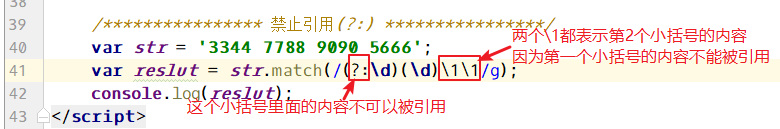

# 三、正则表达式概述

w3c手册位置：上面的JavaScript --- 左侧的JavaScript --- 右侧的参考书 --- 左侧的 **JS RegExp**

## 1、概述

**正则表达式(Regular Expression)**描述了一种字符串 匹配 的模式，可以用来检查一个字符串中是否含有某种子串、将匹配的子串做替换或者从某个字符串中取出符合某个条件的子串等。

==匹配==就是在某个字符串中查找你想要查找的内容（由正则表达式决定），如果查找到了，就表示匹配。没有查找到就表示不匹配。

正则表达式本身是一门独立的技术，可以被大多数编程语言所使用，如Javascript、PHP、Java

正则表达式也是用于查找字符串的，只是比正常的查找更加高级。

怎么高级了，比如在字符串“abacad”中查找a：

普通的查找：JavaScript语法：'abacad'.search('a'); //只查询一次，返回a首次出现的位置0.

普通的查询：php语法：strpos('abacad', 'a');

高级的查找：要求查找a，什么样的a呢？后面必须是c的a。这正是正则表达式的用武之地。

## 2、应用场景

（1）表单验证里面，验证字符的合法性，如邮箱是否合法，手机号是否合法等等。

（2）信息过滤，如论坛帖子或者评论中的非法字符，例如 sql注入、js脚本注入、煽动性的言论。

（3）信息采集，采集别人网站上面的内容，例如整页采集时 筛选出需求的部分

（4）信息替换。

（5）页面伪静态的规则。

----


# 四、入门案例

## 1、正则用法说明

```html
<script>

//查找str字符串中h是否存在

var str = 'php';

//var result = str.match(/参数就是正则表达式/); //返回存放匹配结果的数组

</script>

```

```javascript
	var str = 'php';
    var result = str.match(/h/); //返回值是 存放匹配结果的数组
    console.log(result); // Array [ "h" ]
```

==匹配不到，返回null==。

## 2、全局修饰符g

g是global，表示全局的意思，它是正则表达式语法中的修饰符，修饰符应该放到定界符(/)的后面。

```javascript
	var str = 'phphp';
    //    var result = str.match(/h/); //返回值是 存放匹配结果的数组
    //    console.log(result); // Array [ "h" ]
    var result = str.match(/h/g); //返回值是 存放匹配结果的数组
    console.log(result); // Array [ "h", "h" ]
```

不加g，表示只匹配一次，就终止继续向后查找；

加入g，表示执行全局匹配，会一直查找到字符串的结尾。

正则表达式要写到两条斜线之间，两条斜线是正则表达式是**定界符**，注意的是修饰符g要放到斜线的外面。

----


# 五、==正则语法==

## 1、量词

n+   匹配任何包含==至少一个== n 的字符串。匹配一个或多个前导字符（**前导字符就是紧挨着+号的前一个字符**） 

n*    匹配任何包含==零个或多个== n 的字符串。前导字符有没有都行 

n?    匹配任何包含==零个或一个== n 的字符串。 

n{X} 匹配包含 X 个 n 的序列的字符串。 

n{X,Y} 匹配包含 X 到 Y 个 n 的序列的字符串，包括X和Y个 。
        如，实际需求是4~16位，但n前面被占用了1位，所以都需要减去1， n{3,15}

n{X,} 匹配包含至少 X 个 n 的序列的字符串。 

n$    匹配任何结尾为 n 的字符串。(从末尾开始匹配)

^n    匹配任何开头为 n 的字符串。（注意位置在前面）

^n$   表示只匹配字符串n。也就是匹配整个字符串。

```javascript
//    var str = 'phhhhhhp php  phhhhp  phhhhhhp  pp';
//    var result = str.match(/ph+p/g);
//    var result = str.match(/ph?p/g);
//    var result = str.match(/ph*p/g);
//    var result = str.match(/ph{4}p/g);
//    var result = str.match(/ph{4,}p/g);
//    var result = str.match(/ph{4,6}p/g);
//    var result = str.match(/^ph?p/g); //表示只检查字符串的开头
//    var result = str.match(/ph?p$/g); //表示只检查字符串的结尾

    var str = "php";
    var result = str.match(/^php$/g); //只匹配php
    console.log(result);
```


## 2、元字符

==**.**==  表示==任意单个==字符。除了换行和行结束符。 

==**.\***== 表示任意字符串（0个或多个任意字符，除了换行和行结束符）**.**是任意一个字符，*表示任意个前导字符。二者组合表示任意字符串


==**\w**==  匹配任何数字、字母、下划线。**一个\w表示一个字符，想表示多个字符，可以配合量词，如\w{5}**。 

**\W**  匹配任何非数字、非字母、非下划线。 

==**\d**== 查找数字。 

**\D** 查找非数字字符。 

==**\s**== 查找空白字符。 一个\s表示一个空格

**\S** 查找非空白字符。 

==**\b**== 匹配单词边界。（边界字母个数没有限制；\b放前面表示匹配单词前面的边界，\b表示匹配单词后面的边界） 

**\B** 匹配非单词边界。 

**\n** 查找换行符。 

**\r** 查找回车符。 

**\t** 查找制表符。


## 3、方括号

方括号表示一个范围，也称为**字符簇**。


[abc]  查找方括号之内的任何字符。 

[^abc] 查找任何不在方括号之间的字符。（方括号中的^表示取反） 

[0-9] 查找任何从 0 至 9 的数字。表示匹配一个字符 

[a-z] 查找任何从小写 a 到小写 z 的字符。 表示匹配一个字符

[A-Z] 查找任何从大写 A 到大写 Z 的字符。 表示匹配一个字符

[A-z] 查找任何从大写 A 到小写 z 的字符。**包括下划线**。  表示匹配一个字符

[5-8] 查找5 <= 目标 <= 8的字符

**(**red|blue|green**)** 查找任何指定的选项。（竖线|表示**或**者）


## 4、修饰符

修饰符的用法，是修饰符一定要写到`/正则表达式/`之后，即 `/正则表达式/修饰符` **可以一次性使用多个修饰符**。

**i**  执行对大小写不敏感的匹配。实际上就是不区分大小写的匹配 

**g**  执行全局匹配（查找所有匹配而非在找到第一个匹配后停止）。 

**m** 执行多行匹配。


## 5、转义字符

转义字符是 “*==\\==" 如果匹配的字符串在正则中有特殊含义的都必须加转义字符。*

如 [ ] $ . * ? + | ^ { } ( )

==但是不要乱加转义。==


----


# 六、==分组/捕获和反向引用==

**捕获和反向引用的语法的解释**：

正则中出现的小括号，就叫**捕获**或者**分组**

在正则语法中（在`/…/`内），在捕获的后面，用`\1`来引用前面的捕获。用`\2`表示第二个捕获的内容….

```javascript
var str = '1234 5566 7788 9090';
//查找连续的四个数字
//var result = str.match(/[0-9]{4}/g);
//var result = str.match(/[0-9][0-9][0-9][0-9]/g);
//var result = str.match(/[0-9]+/g);
//var result = str.match(/\d\d\d\d/g);
//var result = str.match(/\d{4}/g);

//查询连续的四个数字，要求第1个数字和第2个数字相等，要求第3个数字和第4个数字相等
//如下详解：
// \1所处位置为2，\1指向的引用为第一个（）中的，所以，第1个数字和第2个数字相等
//var result = str.match(/(\d)\1(\d)\2/g);

//查询连续的四个数字，要求第1个数字和第3个数字相等，要求第2个数字和第4个数字相等
var result = str.match(/(\d)(\d)\1\2/g);
console.log(result);
```


在正则语法外（如replace时），用`$1`来引用前面的捕获。

```javascript
//替换
//var str = 'hello123';
//要求查询str中的数字，然后将数字变为连续的两个数字，如1变成11,2变成22,3变成33，....
//var result = str.replace(/(\d)/g, "$1$1");

//要求把下面的world hello替换成“hello world”
var str = "world hello";
var result = str.replace(/(\w+)(\s+)(\w+)/g, "$3$2$1");
console.log(result);
```


### **禁止引用**

**(?:正则)** 这个小括号中的内容不能够被引用



----


# 七、匹配中文（utf-8编码）

每个字符（中文、英文字母、数字、各种符号、拉丁文、韩文、日文等）都对应着一个Unicode编码。

查看Unicode编码，找到中文的部分，然后获取中文的Unicode编码的区间，就可以用正则匹配了。

前面我们用[a-z]表示小写字母，[0-9]表示数字，这就是一个范围表示，如果有一个数x能够表示第一个中文，有一个数y能够表示最后一个中文，那么[x-y]就可以表示所有的中文了。

**中文的Unicode编码从4E00开始，到9FA5结束**。

**完整的Unicode编码表**：http://blog.csdn.net/hherima/article/details/9045861

**[4E00-9FA5]**这个区间就能够表示中文。


**注意写法的细节**

```javascript
//javascript

var result = str.match(/[\u4e00-\u9fa5]/g);  //需要前缀 \u
```

```php
//php

//需要前缀 \x ，并且要用｛｝包裹
// (小写)u  ： 模式和目标字符串都被认为是 utf-8 的。
preg_match_all('/[\x{4e00}-\x{9fa5}]/u', $str, $out); 
```

**示例**

```javascript
var str = "hello中国，你好";
var result = str.match(/[\u4e00-\u9fa5]/g); //[ "中", "国", "你", "好" ] 
//var result = str.match(/[\u4e00-\u9fa5]+/g); //[ "中国", "你好" ]
console.log(result);
```


# 八、环视

**亦称为（断言/零宽断言/正向预测）**


**N(?=n)** **匹配任何其后紧接指定字符串 n** **的字符串**。

有一个字符串是“abacad”，从里面查找a，什么样的a呢？后面必须紧接b的a。

正则语法是：/a(?=b)/g

```javascript
	var str = 'ab ac ad';
    var result = str.match(/a(?=b)/g); // ["a"]
    console.log(result);
```


**N(?!n)** **匹配任何其后没有紧接指定字符串 n** **的字符串**。

有一个字符串是“abacad”，从里面查找a，什么样的a呢？后面不能紧接b的a。

正则语法是：/a(?!b)/g

```javascript
	var str = 'ab ac ad';
    var result = str.match(/a(?!b)/g); // ["a", "a"]
    console.log(result);
```

```javascript
	//查询大写字母，要求大写字母后面必须是一个数字	
	var str = 'H5 is Very Good';
    var result = str.match(/[A-Z](?=\d)/g); // ["a", "a"]
    console.log(result);
```


另外，还会看到`(?!B)[A-Z]`这种写法，其实它是[A-Z]范围里，**==排除==**B的意思，前置的(?!B)只是对后面数据的一个限定，从而达到过滤匹配的效果。

```javascript
	//(?!xxx)放到前面，表示排除的意思。比如查询所有的字母，但是不要[a-w]
    var str = 'H5 is Very Good';
    var result = str.match(/(?![a-w])[A-z]/g); // [ "H", "V", "y", "G" ]
    console.log(result);
```


 

# 九、正则对象的属性和方法


## 1、调用方式

正则对象中的成员方法和属性的正确调用方式：

和String对象类似，一种是**直接量语法**（`/[a-z]/.exec()`），另一种方法是实例化正则对象，然后**通过对象去调用成员方法**（`var reg = new RegExp(/[a-z]/);  reg.exec()`）

 ```javascript
str='abcdd';

//方式一：
/[a-z]/.exec(str)；//直接使用正则表达式调用方法

//方式二：
var reg = new RegExp(/[a-z]/);  //先实例化对象
reg.exec(str)； //然后通过对象去调用方法
 ```


## 2、exec方法和lastIndex属性

exec方法执行一个正则匹配，==只匹配一次==，匹配到结果就返回一个数组类型的结果，匹配不到就返回null。并将表示匹配的位置 置为下一个匹配的位置。

**lastIndex**一个整数，标示开始下一次匹配的字符位置。没有更多匹配重置lastIndex为0.

依次调用exec匹配下一个的例子：


匹配带子表达式(分组)的例子，带子表达式并且依次调用的例子：


 循环输出：


## 3、test方法

test方法检测目标字符串和正则表达式是否匹配，如果匹配返回**true**，不匹配返回**false**。

案例 --匹配手机号。

```javascript
/*
手机号特点：
    11位
    纯数字
    1开头
    23位判断[可选，去各大运营商查询]
 */
var tel = '13066668888';
var reg = /^1\d{10}$/g;
var result = reg.test(tel);
console.log(result);  //true
```
----


# 十、JS中支持正则表达式的 String 对象的方法

## 1、search()

在字符串中搜索符合正则表达式的结果。如果找到结果返回结果的==位置==（从0开始的下标），**并停止向后检索**，也就是说忽略全局标识符g；如果没有匹配结果，返回-1.

```javascript
	var str = '1234512345';
    var regexp = /2/g;
    var reslut = str.search(regexp);
    console.log(reslut); // 返回2所在的位置，结果是1
```


## 2、match()

在字符串中检索匹配正则表达式的子串；如果匹配，返回包含匹配结果的一个**数组**；不匹配返回**null**。

**不加全局g的情况**：

获取的结果只是第一个匹配的内容，匹配的内容中的第一个单元是匹配的结果，后面的单元是子表达式。


**加全局的g的情况**：

获取的结果是所有匹配的内容，但是**不**包含子表达式。


**多次调用和调用一次效果一样**。


如果要把所有的匹配结果、所有的子表达式都获取到，用什么方法？

答：循环使用正则方法exec()。


## 3、split()

将字符串分割成数组：

```javascript
	//用@或者. 将邮箱分割成数组	
	var str = '23423452@qq.com';
    var arr = str.split(/@|\./);
    console.log(arr); //[ "23423452", "qq", "com" ]
```


## 4、replace()替换

**默认只替换一次，加g全部替换**。

```javascript
	var str = '17:27:50';
    var result = str.replace(/7/, 5); //只替换一次  15:27:50
    var result = str.replace(/7/g, 5); //全部替换  15:25:50
    console.log(result);
```


**替换的时候，使用"$1"表示第一个子表达式的内容，用“$2”表示第二个子表达式的内容，以此类推**。

```javascript
	//替换abc为aabbcc：
	var str = 'abc';
    console.log(str.replace(/([a-z])/g, "$1$1")); //查找到a就替换，然后再查找b，再替换....
```


**用  $` 表示捕获的内容左侧的内容，用  $'  表示捕获的内容右侧的内容**

```javascript
    //替换成 x[x-y-z]z
	var str = 'xyz';
    console.log(str.replace(/(y)/g, "[$`-$1-$']"));
```


**复杂的替换，可以用函数处理如何替换**

替换aaa bbb ccc为Aaa Bbb Ccc


----


# 十一、==PHP中的正则表达式==

==语法和JavaScript中的正则语法基本一致==。

PHP中的正则函数：


## 1、preg_match()

**preg_match()  返回匹配的次数，它的返回值是0或者是1.**

0表示不匹配，1表示匹配一次，因为preg_match在匹配一次之后就停止向后检索了。


查看匹配的结果，使用第三个(引用类型)参数：


带有子表达式的例子：


## 2、preg_match_all()

**preg_match_all()** 返回完整匹配次数（可能是0），或者如果发生错误返回**FALSE**。 

执行正则表达式的全局匹配，类似于js中的带g的匹配。


带有子表达式的例子：


## 3、preg_replace();

替换字符串：

```php
//preg_replace('/正则表达式/', 替换成什么, 在哪里替换);

echo preg_replace('/h/', 'H', 'hello'); //Hello
echo preg_replace('/l/', 'L', 'hello'); //heLLo
```

补充：preg_replace_callback() ，即`替换成什么` 用函数来处理;

```php
echo preg_replace_callback('/[a-z]+/', function($x){
    return ucfirst($x[0]); //$x,表示每次匹配到的结果。在本例中，分别表示数组类型的hello和world
}, 'hello world');
```


**案例：解决贪婪问题？**

下面的是贪婪模式：


非贪婪模式：

```php
$str = "this is a [b]php[/b], that is a [b]javascript[/b]";

//$str = preg_replace('/[b](.*)[/b]/', '<b>$1</b>', $str);

//解决贪婪模式方式一，和js一样，加 ？
//$str = preg_replace('/\[b\](.*?)\[\/b\]/', '<b>$1</b>', $str);  
//解决贪婪模式二，PHP独有的，加修饰符 U
$str = preg_replace('/\[b\](.*)\[\/b\]/U', '<b>$1</b>', $str); 

echo $str;
```


## 4、php中匹配中文

`[\x{4e00}-\x{9fa5}]/u`

```php
//php

//需要前缀 \x ，并且要用｛｝包裹
// (小写)u  ： 模式和目标字符串都被认为是 utf-8 的。
preg_match_all('/[\x{4e00}-\x{9fa5}]/u', $str, $out); 
```


## 5、PHP中使用正则注意点

PHP中正则的使用除了//以外，外面还要加引号，这个引号要用==单引号==。

----


