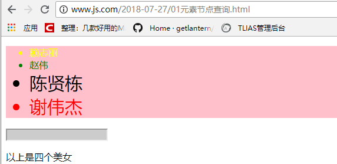
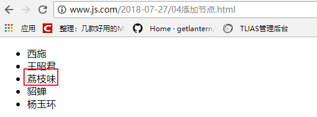

# 三、==DOM==（重点）

## 3.1、DOM介绍

### 3.1.1、什么是DOM

​	DOM全称是Document Object Model（文档对象模型），它是JS将HTML按文档结构和内容层次抽象出的模型，==使得JavaScript有了访问HTML的能力，能够实现对HTML中内容的操作==。DOM存在广泛，PHP以及其他语言也有各自的DOM模型。


### 3.1.2、节点与DOM模型

​	DOM模型呈现树状结构，因此也叫“树模型”，==树中的内容（标签、属性、文本）称为“节点”==，==节点在dom中就是对象==。包含有元素节点（标签）、属性节点、文本节点。dom模型中，每个节点，都是一个JavaScript对象。

​	根据 W3C 的 HTML DOM 标准，HTML 文档中的所有内容都是节点：

- 整个文档是一个文档节点，用document对象表示
- 每个 HTML 元素是元素节点，比如html、head、body、a、h1
- HTML 元素内的文本是文本节点 
- 每个 HTML 属性是属性节点，比如href 
- 注释是注释节点


### 3.1.3、节点之间的关系

节点之间的关系犹如人类家族中的族谱。节点之间的关系包括：

- 父子关系
- 兄弟（姐妹）关系


单词：

- `first`：第一个
- `last`：最后一个
- `Child`：孩子（单数）
- `Children`：孩子（复数，很多孩子）
- `parent`：父亲
- `Node`：节点
- `next`：下一个
- `previous`：上一个
- `Sibling`：兄弟姐妹

 

## 3.2、元素节点==查询==操作

### 3.2.1、基于文档查询

文档是document，基于文档查询即调用document对象中的方法查询页面中的节点。

需要掌握的单词：

- `get`：获取
- `Element`：一个元素
- `Elements`：多个元素
- `By`：根据….
- `Tag`：标签

下表所列方法都是document对象中的方法，调用方式为 `document.getEle.....`

| 方法名                            | 返回值            | 支持       |
| --------------------------------- | ----------------- | ---------- |
| ==getElementById(元素id)==        | 一个dom对象       | 所有浏览器 |
| ==getElementsByTagName(标签名)==  | 包含dom对象的数组 | 所有浏览器 |
| getElementsByClassName(类名)      | 包含dom对象的数组 | IE8+       |
| getElementsByName(元素的name属性) | 包含dom对象的数组 | 所有浏览器 |
| ==querySelector(css选择器)==      | 一个dom对象       | IE7+       |
| ==querySelectorAll(css选择器)==   | 包含dom对象的数组 | IE7+       |

01元素节点查询.html 代码如下：

```html
<body>

<ul>
    <li>赖志丽</li>
    <li id="zw">赵伟</li>
    <li class="r">陈贤栋</li>
    <li class="r">谢伟杰</li>
</ul>
<input type="text" name="username" />
<p class="r">以上是四个美女</p>

<!--script标签 一定 要写到p下面-->
<script>
    //根据id获取元素
    var zw = document.getElementById('zw');
    //console.log(zw);
    zw.style.color = 'green';

    //根据标签名获取元素
    var lis = document.getElementsByTagName('li'); //获取了所有的li，是一个数组
    lis[0].style.color = 'yellow';

    //根据class来获取元素
    var rs = document.getElementsByClassName('r'); //获取的是类名为r的元素，是一个数组
    rs[1].style.color = 'red';

    //根据标签的name属性来获取元素
    var inputs = document.getElementsByName('username'); //获取的是一个数组
    inputs[0].style.backgroundColor = '#ccc';

    //根据css选择器获取元素
    var ul = document.querySelector('ul'); //获取的是 一个 元素，是对象
    ul.style.backgroundColor = 'pink';

    var lis_r = document.querySelectorAll('ul li.r'); //选择ul中类为r的li元素，是一个数组
    for(var i=0; i<lis_r.length; i++) {
        lis_r[i].style.fontSize = '30px';
    }
</script>

</body>
```

效果：




### 3.2.2、相互关系查询

相互关系查询可以分为下面三种情况：

- 根据父节点查找子节点
- 根据子节点查父节点
- 查询兄弟节点

具体属性/方法见下表：

| 方法/属性                     | 说明                                    | 返回      | 支持       |
| ----------------------------- | --------------------------------------- | --------- | ---------- |
| 父节点.children               | 查询所有子节点，非w3c标准(不包含空白)   | 数组      | 所有浏览器 |
| 父节点.**childNodes**         | 查询所有子节点，包括文本节点(包含空白)  | 数组      | 所有浏览器 |
| 父节点.firstChild             | 查询第一个子节点，包括文本节点          | 对象      | 所有浏览器 |
| 父节点.firstElementChild      | 查询第一个子节点，不包括文本节点        | 对象      | IE8+       |
| 父节点.lastChild              | 查询最后一个子节点，包括文本节点        | 对象      | 所有浏览器 |
| 父节点.lastElementChild       | 查询最后一个子节点，不包括文本节点      | 对象      | IE8+       |
| 父节点.**getElementBy**....() | 节点继续调用getEle...系列方法查询子节点 | 数组/对象 | 所有浏览器 |
| 子节点.parentNode             | 查询父节点                              | 对象      | 所有浏览器 |
| 兄弟.previousSibling          | 查询上一个兄弟，包括文本节点            | 对象      | 所有浏览器 |
| 兄弟.previousElementSibling   | 查询上一个兄弟，不包括文本节点          | 对象      | IE8+       |
| 兄弟.nextSibling              | 查询下一个兄弟，包括文本节点            | 对象      | 所有浏览器 |
| 兄弟.nextElementSibling       | 查询下一个兄弟，不包括文本节点          | 对象      | IE8+       |

创建02相互关系查询.html ,代码如下：

```html
<body>

<ul>
    <li>赖志丽</li>
    <li id="zw">赵伟</li>
    <li class="r">陈贤栋</li>
    <li class="r">谢伟杰</li>
</ul>

<ul>
    <li>赖志丽</li>
    <li id="zw1">赵伟</li>
    <li class="r">陈贤栋</li>
    <li class="r">谢伟杰</li>
</ul>

<script>
    /******************* 根据父节点查询子节点 *********************/
    var ul = document.getElementsByTagName('ul')[0]; //父节点

    //children
    var lis1 = ul.children;
    for (var i=0; i<lis1.length; i++) {
        lis1[i].style.color = 'green';
    }

    //childNodes  --  查找子元素，包含空白
    var lis2 = ul.childNodes;
    console.log(lis2.length);
    console.log(lis2[0].nodeType);

    //自定义函数，获取父元素里面的所有元素类型的节点
    function myChildren(parentNode){
        var children = parentNode.childNodes; //获取了父节点的所有子节点（包括文本节点和元素节点）
        var result = []; //用于保存元素类型的子节点
        for (var i=0; i<children.length; i++) {
            //nodeType == 1, 表示元素节点
            if(children[i].nodeType == 1) {
                result.push(children[i]); //push方法，表示向result数组中添加单元
            }
        }
        return result;
    }
    var lis3 = myChildren(ul); //传入父节点，然后拿到所有元素类型的子节点
    for (var i=0; i<lis3.length; i++) {
        lis3[i].style.backgroundColor = '#ccc';
    }

    //获取第一个子节点
    var first1 = ul.firstChild; //获取的是一个空白
    console.log(first1);
    var first2 = ul.firstElementChild; //获取的是第一个li
    first2.style.fontSize = '30px';

    //父节点继续调用getEle...系列方法，查找子元素
    var lis4 = ul.getElementsByTagName('li');
    for (var i=0; i<lis4.length; i++) {
        lis4[i].style.fontFamily = '隶书';
    }

    var zw = document.querySelector('#zw');
    zw.parentNode.style.border = 'solid 2px red';
    
    //这里两个previousSibling，因为它会包含空白
    zw.previousSibling.previousSibling.style.border = "solid 1px blue"; 
    zw.previousElementSibling.style.padding = '10px';
</script>

</body>
```


### 3.2.3、遗留DOM

早期DOM访问形式，在一些特定元素的获取上比较方便。被保留下来使用，W3C标准化之后 称为“0级DOM”。

==document.body==                                          访问body节点             返回body节点  

**document.forms**                                        访问所有的表单           返回数组

==document.formName[index].name==       访问表单项                   返回单个表单项或数组

document.anchors                                    访问所有的锚点           返回数组

document.links                                          访问所有的链接           返回数组

document.images                                     访问所有的图片           返回数组

document.all                                              访问所有的元素           返回数组

 

03遗留DOM.html ，代码：

```html
<body>

<form name="myform1">
    <input type="text" name="username" />
    <input type="text" name="email">
</form>

<form name="myform2">
    <input type="text" name="username" />
    <input type="text" name="email">
</form>


<script>
    var body = document.body;
    body.style.backgroundColor = '#ccc';

    //快速获取form
    var myform1 = document.myform1;
    myform1.style.border = 'solid 1px red';

    var forms = document.forms[0]; //找第一个form的方式
    //快速找form中的表单项
    var user1 = document.myform1.username;
    user1.style.backgroundColor = 'yellow';
</script>

</body>
```

效果：


## 3.3、元素节点==增删改==操作

### 3.3.1、增加元素节点/创建节点

方法一：**父节点.appendChild(子节点)**

04添加新节点.html  代码：

```html
<body>
<ul>
    <li>西施</li>
    <li>王昭君</li>
    <li>貂蝉</li>
    <li>杨玉环</li>
</ul>

<script>
    //向ul中，添加一个li，内容是 赖志丽

    //1、 先找到父节点，然后向里面添加子元素
    var ul = document.querySelector('ul');
    //2、创建li
    var li = document.createElement('li');
    //3、创建文本节点
    var text = document.createTextNode('赖志丽');
    //4、把文本节点放到li里面，相当于父节点添加子节点
    li.appendChild(text);
    //5、把组合好的li，放到ul里面
    ul.appendChild(li);

</script>

</body>
```

预览效果：


方法二：**父节点.insertBefore(新节点, 参照的节点);**

04添加节点.html 代码

```html
<ul>
    <li>西施</li>
    <li>王昭君</li>
    <li>貂蝉</li>
    <li>杨玉环</li>
</ul>
<script>
    /*********** 把新的节点放到 貂蝉前面 ***********/
    var ul1 = document.getElementsByTagName('ul')[0];
    var li1 = document.createElement('li');
    var text1 = document.createTextNode('荔枝味');
    li1.appendChild(text1);
    //必须找参照的节点貂蝉
    var diaochan = ul1.children[2];
    //添加
    ul1.insertBefore(li1, diaochan);

</script>
```

效果：



### 3.3.2、克隆节点

05克隆节点.html:


### 3.3.3、修改节点

方法：**父节点.replaceChild(新节点, 待替换的节点);**

06替换节点.html  代码：

```html
<body>

<ul>
    <li>张飞</li>
    <li>关羽</li>
    <li>赵云</li>
    <li>刘备</li>
    <li>马超</li>
</ul>

<script>
    //把刘备替换成黄忠  父节点.replaceChild(新节点, 待替换的节点)
    var ul = document.querySelector('ul');
    var hz = document.createElement('li'); //新节点
    var text = document.createTextNode('黄忠');
    hz.appendChild(text); //将新节点li和文本组合到一起

    var lb = document.querySelectorAll('li')[3]; //原来的节点
    //替换
    ul.replaceChild(hz, lb);
</script>

</body>
```

效果：


### 3.3.4、删除节点

方法：**父节点.removeChild(子节点);**

07删除节点.html   代码：

```html
<body>

<ul>
    <li>张飞</li>
    <li>关羽</li>
    <li>赵云</li>
    <li>刘备</li>
    <li>马超</li>
</ul>

<script>
    //把刘备删除， 父节点.removeChild(要删除的子节点);
    var ul = document.getElementsByTagName('ul')[0];
    var lb = document.getElementsByTagName('li')[3];
    //删除
    ul.removeChild(lb);

</script>

</body>
```

效果：（刘备被删除了）


## 3.4、属性节点操作

==属性肯定属于元素，所以对属性的任何操作都要先找到元素节点==。

### 3.4.1、获取元素的属性

**元素节点.attributes**                                获取元素的所有属性

**元素节点.getAttribute(属性名)**              获取指定属性的值

**元素节点.属性名**                                      获取指定属性的值，用于获取元素不存在的属性的值比较准确


08获取元素的属性.html  代码：


### 3.4.2、添加/修改元素的属性

**元素节点.setAttribute(属性名，属性值)**           设置（==修改/添加==）一个属性值

**元素节点.属性名 = 值**                                          设置元素的属性

09添加、修改属性.html  代码：

```html
<body>

<input type="text" name="username">

<script>
    var input = document.querySelector('input');
    //添加value和size属性
    input.setAttribute('value', '赵伟');
    input.size = 5;

    //修改属性
    input.name = 'email';
    input.setAttribute('type', 'password');
</script>

</body>
```

效果图：


### 3.4.3、删除元素的属性

**元素节点.removeAttribute(属性名)**    删除一个属性


### 3.4.4、判断元素是否有哪个属性

**elementNode.hasAttribute(属性名)**           检测是否有某个属性，有返回true，没有返回false

见上图。


## 3.5、操作css样式

### 3.5.1、设置css样式

语法： **elementNode.style.css样式 = 值**

**css样式的写法：**

①、一个单词的直接写即可。比如color height …

②、样式名称带中横线的，去掉中横线，后面单词首字母大写。比如fontSize  lineHeight  backgroundColor


### 3.5.3、获取节点全部css样式

使用 "**node.style.样式名称**" 的方式只能获取==行内样式和js已经设置过的样式==。

**要想获取全部的样式，则必须使用下面的方法：**

- 在IE中支持 **node.currentStyle.样式名称**

- 火狐支持 **getComputedStyle(node).样式**

13获取css样式.html

```html
<body>

<p>hello</p>

<ul>
    <li style="color:red;">hello</li>
</ul>

<script>
    //获取li的字体颜色
    var li = document.getElementsByTagName('li')[0];
    console.log(li.style.color);
    //获取p的字体大小
    var p = document.getElementsByTagName('p')[0];
    //console.log(getComputedStyle(p).fontSize); //火狐、谷歌、IE8+
    //console.log(p.currentStyle.fontSize); //IE8及更低版本浏览器

    //设置一个兼容各个浏览器的获取css样式的方法
    function getStyle(node, styleName){
        if(node.currentStyle){ 
            //IE8及更低版本浏览器
            return node.currentStyle[styleName];
        }else{
            //火狐、谷歌、IE8+
            return getComputedStyle(node)[styleName];
        }
    }
    console.log(getStyle(p, 'fontSize'));

</script>

</body>
```


## 3.6、DOM属性（了解）

DOM属性指的是DOM对象的属性。

**innerHTML**

​       ==获取/设置元素里的html内容==

**innerText**

​    ==获取/设置元素里面的文本内容==

获取节点里面的内容：


设置节点里面的内容：


==无论调用innerHTML还是innerText，给元素设置内容的时候，都会覆盖原来的内容==。

**nodeName**

​       nodeName 是只读的 

​	元素节点的 nodeName 与标签名相同 

​	属性节点的 nodeName 与属性名相同 

​	文本节点的 nodeName 始终是 #text 

​	文档节点的 nodeName 始终是 #document

**nodeValue**

​       元素节点的 nodeValue 是 undefined 或 null 

​       ==文本节点的 nodeValue 是文本本身==

​	属性节点的 nodeValue 是属性值

**nodeType**：调用nodeType属性会得到一个数字，这个数字表示节点的类型

​        ==元素 1== 

​	属性 2

​        ==文本 3==

​	注释 8 

​	文档 9


## 3.7、DOM获取元素位置（了解）

**offsetLeft**                                    元素在网页中水平坐标值 

**offsetTop**                                    元素在网页中垂直坐标值

**offsetWidth**                                元素在页面中占据的宽度

**offsetHeight**                               元素在页面中占据的高度

01元素在页面中的位置.html   代码：

```html
<body>
<style>
    *{
        margin:0;
        padding:0;
    }
</style>
<div style="width:100px; height:100px; padding:10px; margin:20px; border:solid 5px red;"></div>

<script>
    //先获取div
    var div = document.querySelector('div');

    console.log(div.offsetLeft); //20   含有margin值
    console.log(div.offsetHeight); //130  =  height + padding + border
</script>

</body>
```


**scrollLeft**                                     滚动条在容器中水平滚动的距离，多用于浏览器的滚动条

**scrollTop**                                     滚动条在容器中垂直滚动的距离，多用于浏览器的滚动条

```html
<!--设置body比较宽，比较高，才会有滚动条-->
<body style="width:2000px; height:2000px;">
<style>
    *{
        margin:0;
        padding:0;
    }
</style>
<div style="width:100px; height:100px; padding:10px; margin:20px; border:solid 5px red;"></div>

<script>
    //先获取div
    var div = document.querySelector('div');

    console.log(div.offsetLeft); //20   含有margin值
    console.log(div.offsetHeight); //130  =  height + padding + border

    //滚动事件，当滚动条滚动时，输出滚动条滚动的距离
    window.onscroll = function(){
        console.log(document.documentElement.scrollLeft); //下面的滚动条横向滚动的距离
        console.log(document.documentElement.scrollTop); //右侧的滚动条纵向滚动的距离
    };

</script>

</body>
```


# 四、==事件绑定==（重点）

## 4.1、何为事件

浏览网页时，当我们做出点击鼠标、按键盘、移动鼠标等行为时，这些行为会被浏览器内置的JavaScript引擎所捕获，并执行对应的某些操作（函数）。==那么你的行为（动作）+ JavaScript引擎捕获 + 执行对应的操作 = 事件。==

所以，一个完整的事件应该包括：

- 用户行为；
- 浏览器捕获你的行为；
- 执行对应的操作（函数）

常见行为有：鼠标点击、鼠标的移动、鼠标的移入和移出、键盘控制等等。

事件的作用是：通过事件，我们（浏览网页的人）就可以和浏览器进行一些交互了。 


## 4.2、==事件绑定与移除==

​	事件绑定就是添加事件，那么为谁添加事件呢？可以为页面中的所有标签（元素、节点）添加事件，大到整个文档（document），小到其中一个标签都可以添加事件。

**在为一个节点添加事件的时候，有三种方式：**

- 直接在标签中添加，即使用onclick、onmouseover等HTML属性；
- DOM的方式添加，即通过dom方法获取节点，然后为其绑定事件；
- 使用addEventListener或attachEvent（IE8及更低版本浏览器）。


**为一个标签添加事件之后，还可以删除这个事件**。


下面分别来学习这三种添加事件的方式：

### 4.2.1、直接在标签中添加

利用HTML标签的==on....==属性，为该标签添加事件。

15事件绑定.html

```html
<input type="button" value="点我" onclick="alert('啊');" />
```

如果说，点击的时候，要执行很多行js代码，可以封装一个函数，点击的时候，调用函数。

```html
<input type="button" value="点我" onclick="t();" />

<script>
    function t(){
        alert('1');
        alert(2);
    }
</script>
```


### 4.2.2、DOM方式添加

HTML代码中，没有任何的js代码。用dom的方式，获取标签，然后为其绑定事件：

15事件绑定.html

```html
<input type="text" id="username" />

<script>
    //使用dom的方式，获取username，为其绑定事件
    var input = document.getElementById('username');
    //下面的函数，不会自动执行，当键盘弹起的时候，才会执行。
    input.onkeyup = function(){
        alert('你按到我了');
    };
</script>
```

问题？如果为一个节点，用上面两种方式都绑定了同一个事件，那么执行哪个事件？

答：只执行DOM方式添加的事件。


==删除事件，直接设置事件处理程序为null==。

```javascript
input.onkeyup = null; //移除了事件，适用与行内绑定的事件和用DOM方式绑定的事件
```


### 4.2.3、使用addEventListener或attachEvent方法添加

IE浏览器中用**attachEvent**；

火狐浏览器用**addEventListener**；

==事件监听函数的优点是可以为一个节点添加多个同类型的事件==。

16事件监听.html  代码：

```html
<input type="text" id="username" />

<script>

    //兼容各个浏览器的事件监听函数
    /*
    ele : 给谁添加事件
    type: 添加什么事件
    fn : 事件处理函数
     */
    function addEvent(ele, type, fn){
        if(window.addEventListener) {
            //火狐浏览器
            ele.addEventListener(type, fn);
        }else{
            //IE浏览器
            ele.attachEvent('on'+type, fn);
        }
    }
	
    //准备两个函数，当做事件处理函数
    function t1(){
        alert(1);
    }
    function t2(){
        alert(2);
    }
    var input = document.getElementById('username');

    //为input添加两个单击事件
    addEvent(input, 'click', t1); //addEventListener方法需要的事件名不能带on，事件处理函数t1不能加引号，不能带括号
    addEvent(input, 'click', t2);

</script>
```

通过事件监听方法添加的事件，也可以被移除，移除的方法是：**removeEventListener**和**detachEvent**

==注意： **detachEvent**  有些写法多了个 t，如**dettachEvent**，但IE某些版本中会报错。==

16事件监听.html

```javascript
//移除事件兼容函数
    function removeEvent(ele, type, fn){
        if(window.removeEventListener) {
            ele.removeEventListener(type, fn);
        }else{
            ele.detachEvent('on'+type, fn);
        }
    }

    removeEvent(input, 'click', t1); //只移除input的click事件，对应的处理函数是t1
```


## 4.3、事件中this指向

这节学习事件中，如果出现this，那么this表示什么？


 

## 4.4、常用事件

- 页面事件：
  - **onload** ：当页面载入完毕（页面中的标签和外部资源）后触发
- 焦点事件
  - **onfocus** ：当获取焦点时触发
  - **onblur** ：当失去焦点时触发
- 鼠标事件
  - **onmouseover** ：当鼠标悬浮时触发
  - **onmouseout** ：当鼠标离开时触发
- 键盘事件
  - **onkeypress** ：当键盘按下时触发（如果按住某个键不松开，会一直触发press事件）
  - **onkeydown** ：当键盘按下时触发
  - **onkeyup** ：当键盘弹起时触发
- 其他事件：
  - **onchange** ：内容改变时会触发，常用于select>option。
  - **onsubmit** ：表单提交时触发，**这个事件要给form绑定**而不是给提交按钮绑定
  - **onresize** ： 页面窗口改变大小时会触发
  - **onscroll** ：滚动条滚动时触发
  - **onprogress** ：进度事件，用于上传文件的进度


# 五、==事件对象==（重点）

## 5.1、什么是事件对象

事件被触发以后，系统会生成一个对象，这个对象就是事件对象。

==事件对象中提供了很多属性，这些属性能够表示当前的事件的特点或特征==。

浏览器原生提供一个`Event`对象，所有的事件都是这个对象的实例，或者说继承了`Event.prototype`对象。

> 单词event就是事件的意思，在JavaScript中，它表示事件对象

## 5.2、如何得到事件对象

不同浏览器得到事件对象的方式不同：

- 低版本IE ：**在事件处理函数中**，直接用`window.event;` 就可以得到事件对象;
- 火狐/谷歌：需要给**事件处理函数加入一个形参**，这个参数就是事件对象。

```html
<script>
    //因标签在后面，所以代码应放置在 onload 事件中
    window.onload = function () {   
        var input = document.getElementById('username');
        //给input绑定键盘事件
        input.onkeyup = function (evt) {
            //IE : 直接使用 window.event;
            //火狐: 需要事件处理函数传入一个形参，这个形参就是事件对象
            
            var e = window.event||evt;//兼容各个浏览器的事件对象
            console.log(e.keyCode); //keyCode是一个数字，表示键盘的keyCode值。
        };
    };
</script>

<input type="text" id="username" />
```

运行代码后，在输入框中输入任何内容，会输出按键对应的keyCode值。

## 5.3、事件对象常用属性

事件对象也是对象，而且是内置的对象，事件对象中默认带有很多属性和方法。需要了解的是，不同的事件，事件对象中的成员有所差异。

下面列举一些事件对象中的常用属性：

==keyCode：表示键盘上的键对应的数值==。

key：表示按键（是一个实际的符号）

altKey：表示是否按了alt键，按了结果为true，没按结果为false（组合按键的时候，才会有作用）

shiftKey：表示是否按了shift键，按了结果为true，没按结果为false（组合按键的时候，才会有作用）

ctrlKey：表示是否按了ctrl键，按了结果为true，没按结果为false（组合按键的时候，才会有作用）

pageX: 鼠标距离页面左边的距离

pageY: 鼠标距离页面上面的距离

screenX: 鼠标距离屏幕左边的距离

screenY: 鼠标距离屏幕上面的距离


