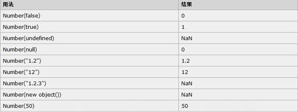
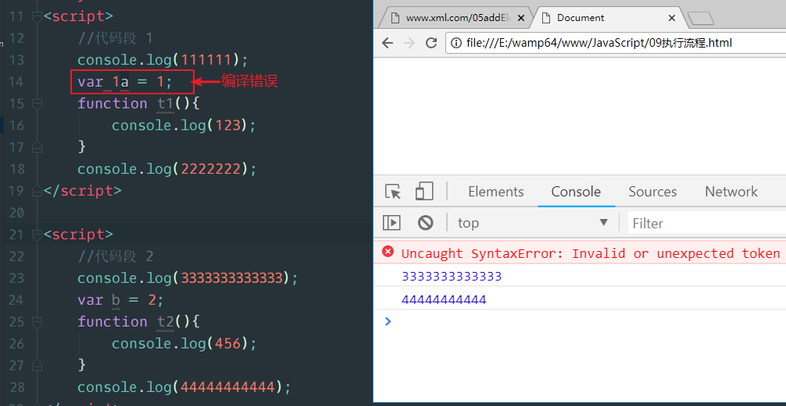
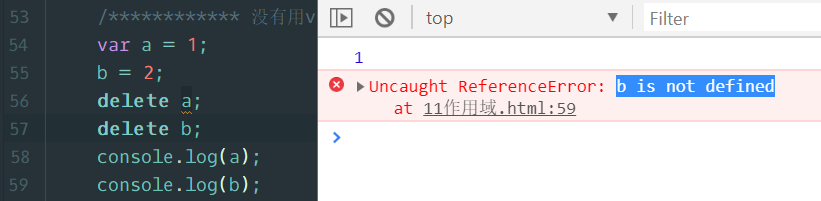

# JavaScript高级

## 一、介绍 (了解)

### 1.1  什么是JavaScript

 JavaScript 是一门解释型的、弱类型的、基于原型的编程语言。
编程语言可以分为两大种：

- 编译型的：先翻译好，再执行。
- 解释型的：翻译一句，执行一句。

弱类型：数据类型是由值来决定的。
原型：后面解释

JavaScript被认为是客户端“脚本”，它不常叫“语言”，言外之意是比较简单，但是深入了解之后，你会发现 简单的外表下，蕴藏着丰富的内涵。 

### 1.2  JavaScript 历史

 **JavaScript问世**：

上世纪90年代，NetScape(网景)公司研发的NetScape Navigator1.0(浏览器)成为当时最热门的浏览器。
          
 市场份额一举超过90%。
          Netscape公司很快发现，Navigator浏览器需要一种可以嵌入网页的脚本语言，用来控制浏览器行为。当时，网速很慢而且上网费很贵，有些操作不宜在服务器端完成。比如，如果用户忘记填写“用户名”，就点了“发送”按钮，到服务器再发现这一点就有点太晚了，最好能在用户发出数据之前，就告诉用户“请填写用户名”。这就需要在网页中嵌入小程序，让浏览器检查每一栏是否都填写了。

1995年，Netscape公司雇佣了程序员Brendan Eich（布兰登·艾奇）开发这种网页脚本语言，JavaScript1.0。
                       
 1996年3月，Navigator 2.0浏览器正式内置了JavaScript脚本语言。

 

**“邪恶”的后来者**

因为 JavaScript1.0 如此成功，所以微软·也决定进军浏览器，1996年8月，微软模仿JavaScript开发了一种相近的语言，取名为JScript（JavaScript是Netscape的注册商标，微软不能用），首先内置于IE 3.0。Netscape公司面临丧失浏览器脚本语言的主导权的局面。

**标准的重要**

在微软进入后，有 3 种不同的 JavaScript 版本同时存在：NetscapeNavigator 3.0 中的 JavaScript、IE 中的 JScript 以及 CEnvi 中的 ScriptEase。与 C 和其他编程语言不同的是， JavaScript 并没有一个标准来统一其语法或特性，而这 3 种不同的版本恰恰突出了这个问题。 随着业界担心的增加，这个语言标准化显然已经势在必行。

 

**JavaScript标准化**

1996年11月，Netscape公司决定将JavaScript提交给国际标准化组织**ECMA**（European Computer Manufacturers Association欧洲计算机制造商协会），希望JavaScript能够成为国际标准，以此抵抗微软。1997年7月，ECMA组织发布262号标准文件（ECMA-262）的第一版，规定了浏览器脚本语言的标准，并将这种语言称为ECMAScript。这个版本就是==ECMAScript== 1.0版。

 目前最新的**E**CMA**S**cript版本是**ES**6，我们学习的是ES5版本，因为ES6中好多新的内容在 IE11 中都不能使用。

### 1.3  JavaScript组成部分


 **ECMAScript**，核心语法
 **DOM** （Document Object Model）,==文档对象模型==。提供了操作网页内容的一系列工具（api）。
 **BOM** （Browser Object Model）,==浏览器对象模型==。提供了操作浏览器的一系列工具（api）。

### 1.4 JavaScript的应用

① 数据验证（表单验证）

② 网页特效（目前大多数的网页特效都是通过JS编写）

③ 编写网页小游戏

④  服务器端编程，**数据交互**（Ajax、Node.js）

 ## 二、语句和表达式（了解）

JavaScript程序的执行单位为行（line），也就是一行一行地执行。一般情况下，每一行就是一个语句。

语句（statement）是为了完成某种任务而进行的操作，比如下面就是一行赋值语句：

```javascript
var a = 1 + 3;
```

这条语句先用var命令，声明了变量a，然后将1 + 3的运算结果赋值给变量a。

1 + 3叫做表达式（expression），指一个为了得到返回值的计算式。

语句和表达式的区别在于，前者主要为了进行某种操作，一般情况下不需要返回值；后者则是为了得到返回值，一定会返回一个值。

凡是JavaScript语言中预期为值的地方，都可以使用表达式。比如，赋值语句的等号右边，预期是一个值，因此可以放置各种表达式。一条语句可以包含多个表达式。

> 小提示：可以认为含有等号（=）的是语句，没有等号（=）的是表达式。

语句以分号结尾，一个分号就表示一个语句结束。多个语句可以写在一行内。

```javascript
var a = 1 + 3 ; var b = 'abc';
```

分号前面可以没有任何内容，JavaScript引擎将其视为空语句。

```javascript
;;;
```

上面的代码就表示3个空语句。


## 三、==变量==（重点）

### 1、命名规则

- 变量必须以字母开头 

- 变量也能以 $ 和 _ 符号开头（不过我们不推荐这么做） 

- 变量名称对大小写敏感（y 和 Y 是不同的变量）

- 变量不能使用保留字和关键字（尤其不要使用==this==, ==name==这样的东西）

  ```javascript
  var $ = 1; //可以，但是不推荐这样用
  
  function $(){ //可以，但是不推荐这么用
      
  }
  
  //不推荐的原因是，jQuery中用$表示jQuery对象，已经把$占用了，如果我们自己声明的变量也叫做$，会和jQuery发生冲突。
  ```

  

### 2、一条语句，多个变量

在一行中，可以声明多个变量，==注意每个变量之间是逗号==（,）。

console.log(); 表示在浏览器的控制台进行输出，console.log()一次性可以输出多个变量，而且变量的数据类型也能够体现。后面的学习中，用console.log() 代替 document.write() 和 alert().

```javascript
var a = 1, b = 2, c = 'hello'; //在一行中，使用一个var声明三个变量
console.log(a, b, c); //输出 1 2 hello
```


### 3、只声明变量，没有赋初值

```javascript
var e;
console.log(e); // underfined
console.log(f); // 报错：ReferenceError: f is not defined
```


### 4、重新声明变量

重新声明变量，但是没有给值的话，还使用原来的变量。这点和PHP是一样的。

```javascript
var g = 1; //声明变量
var g;     //再次声明变量，但是没有给值
console.log(g); // 1
```


### 5、变量提升（注意）

变量提升（hoisting）

```javascript
console.log(h);
var h = 123;
//输出结果undefined
```

实际上JavaScript在解释上面的代码的时候，会有一个变量提升的过程。即将声明变量h的过程提升到代码的最前面，这种情况就叫做变量提升。

上面代码在实际执行时，等同下面的代码：

```javascript
var h;
console.log(h);
h = 123;
```

变量提升也会发生在函数中，如下代码：

```javascript
function test(){
    console.log(h);
    var h = 123;
}
test(); //输出结果 undefined
```


## 四、常量

JavaScript中也有常量，使用关键字const进行定义。常量也具有和PHP中常量一样的特点。

```javascript
const ABC = 'hello';
console.log(ABC); //输出hello
```


## 五、==运算符==（重点）

### 5.1、算数运算符

算数运算符无非就是**加减乘除、取模（余）、递增、递减。**

```javascript
var a = 2, b = 5;
console.log(a%b);

var c = 3, d = 4;
console.log(c++); // 3
console.log(++d); // 5
console.log(c, d); // 4,5

var e = 3, f = 4;
var g = e++; // var g = e; e = e + 1;
var h = ++f; // f = f + 1; var h = f;
console.log(g, h); //3, 5
console.log(e, f); //4, 5

```

在累加和加法运算同时存在的时候，要用空格或小括号区分每个+的意思：

```javascript
console.log((a++)+(++b)); //用括号区分
//或者
console.log(a++ + ++b); //用空格区分

var a = 2, b = 5;
console.log((a++)+(++b)); // 2 + 6 = 8;
```


### 5.2、用于字符串的 “+”

JavaScript中用“+”连接字符串，类似于php中的“点”。

- 如果 “+” 前后都是数值型，那么 “+” 表示加法运算。
- 如果 “+” 两边有一个为非数值型，那么 “+” 表示字符串连接

```javascript
console.log(1 + 2); // 数值型的 3
console.log(1 + '2'); // 字符串型的 12
console.log('abc' + 2); // 字符串型 abc2
```


### 5.3、赋值运算符

赋值运算符是 “=”，意思是将 = 后面的值赋值给等号前面的变量。

在进行判断的时候，一定要注意 “=”、“= =”、“= = =” 的区别。

```javascript
var a = 1, b = 2;
if (a = b) { //一个=表示赋值，意思是将b的值赋值给a，然后判断a是true还是false
    console.log('相等');
} else {
    console.log('不等');
}
```


### 5.4、比较运算符

比较运算符包括：**==、= ==、>=、<=、>、<、!=**

需要注意的是：

​	== 表示比较两边的值是否相等，而不考虑数据类型；

​	== =表示比较两边的值是否相等，同时还要考虑数据类型是否相等。

```javascript
console.log(1 == '1'); // true
console.log(1 === '1'); // false
```


### 5.5、三元运算符

==三元运算符==也叫做**三目运算符**或**条件运算符**。

**元** 表示参与运算的表达式的个数。

```javascript
var a = 1, b = 2;
var c = a < b ? 3 : 4;
console.log(c); // 3

var d = false == 'false' ? 5 : 6;
console.log(d); // 6
```


### 5.6、逻辑运算符

逻辑运算符的常规用法，我们就不需要讲解了。下面看一下非常有用的其他使用方法：

```javascript
var a = 0, b = 1, c = 2, d = false;

var e = a&&b; //意思是给e赋值，值肯定是a或者b中的一个。  结果为0，因为a自己就能够决定a&&b的结果为false了。
    /*if(a && b) {
        //要判断if的最终结果，先观察a，如果a能够决定最终的结果，则不用看b是什么，则将a赋值给e
    }*/
var f = b&&c; // 2
var g = c&&a; // 0
// && ： 先看左边，左边为true，最终结果是右边的值；左边为false，最终结果直接等于左边的值

var h = a||b; // 1
var j = b||c; // 1
var k = a||d; // false
// || : 先看左边，左边为true，最终结果等于左边的值，左边为false，最终结果直接等于右边
console.log(e, f, g, h, j, k);
```


## 六、流程控制

流程控制有三种结构，顺序结构、分支结构和循环结构，关于这三种结构这里就不再多说了。

下面看一个变异的for循环：

```javascript
    var i=1;
    for(;;){
        if(i > 5){
            break; //跳出循环
        }
        console.log(i);
        i++;
    }
```

循环的时候，可以使用break跳出循环，可以使用continue跳过当次循环。

```javascript
    //a: 表示给循环起一个名字，用于break或者continue。
    a:for(var i=1; i<=3; i++){
        b:for(var j=1; j<=3; j++){
            if(j == 2){
                break a;
            }
            console.log(i + '-' + j);
        }
    }
    /*
    1-1
     */
```


## 七、==数据类型==（重点）

### 7.1、数据类型介绍

JavaScript 语言的每一个值，都属于某一种数据类型。JavaScript 的数据类型，共有六种。（ES6 又新增了第七种 Symbol 符号类型的值）

- **number**：数值型，包括整型和浮点型
- **string**：字符串型
- **bool**：布尔型
- **null**：null
- **undefined**：未定义
- **object**：对象

通常，我们将数值、字符串、布尔值称为**原始类型**（primitive type）的值，即它们是最基本的数据类型，不能再细分了。而将对象称为合成类型（complex type）的值或**引用类型**，因为一个对象往往是多个原始类型的值的合成，可以看作是一个存放各种值的容器。至于undefined和null，一般将它们看成两个**特殊**值。

对象又可以分成三个子类型，即狭义的对象（object）、数组（array）、函数（function），其实，更加广义的讲，原始类型的值（数值、字符串、布尔）也可以看做对象。**一句话，JavaScript中一切皆对象**。

画图说明原始类型和引用类型的区别：


### 7.2、创建数组

要想得到一个数组，有三种创建方式，分别是：

```javascript
//方式一（推荐）：
var arr1 = []; //空数组
var arr2 = [1, 2, 3, 'hello', true]; //创建数组，并为数组添加一些单元

//方式二（推荐）：
var arr3 = new Array(); //空数组
var arr4 = new Array(1, 2, 3, 'hello', true); //创建数组，并为数组添加一些单元
//方式三（不推荐）：
var arr5 = new Array(3); //表示数组中有3个单元

```


### 7.3、创建对象

创建一个JavaScript对象有很多种方式，今天先学习一种方式：

```javascript
var obj1 = {}; //空对象

var obj2 = {name:'张三', age:23, sex:'男'}; //创建对象，并添加3个成员属性

//obj3和obj2是一样的，只不过加了换行，使结构更加清晰
var obj3 = {
    name:'张三',
    age:23,
    sex:'男'
}；

//带有成员方法的对象
var obj4 = {
    //添加成员属性
    name:'张三',
    age:23,
    sex:'男',
    //添加成员方法
    fn1:function(){
        console.log(123);
    },
    fn2:function(){
        console.log(this.name); //输出当前对象的name属性
        this.fn1(); //调用当前对象的其他方法
    }
};
obj4.fn2(); //调用对象的成员方法
```


### 7.4、判断数据类型

JavaScript中有一个 `typeof`，用它可以判断一个变量的数据类型，但是它不能区分null、array、object，因为对null、array和object使用 typeof 之后得到的结果都是object。要想区分null、array、object必须借助另一个关键字`instanceof`。


发现，c（null）、e（数组）、f（对象）得到的结果都是object。


## 八、==数据类型转换==（重点）

### 8.1、转换成字符串

- 使用字符串方法`toString([进制])`转换，但是null和undefined无法转换。
- 使用顶层函数`String()`可以将任何数据类型转换成字符串，包括null和undefined。
- 在其他数据类型和字符串类型进行连接操作时，会自动对其他数据类型使用`String()`强制转换成字符串

```javascript
    var a = 1, b = 3.14, c = null, d, e = ['apple', 'banana'], f = {name:'zhaowei', age:20};

	/***************** 使用toString转换 ********************/
    console.log(a.toString()); // 1
    console.log(b.toString()); // 3.14
    //console.log(c.toString()); //null不能被toString方法转换
    //console.log(d.toString()); //undefined不能被toString方法转换
    console.log(e.toString()); //apple,banana
    console.log(f.toString()); //[object Object]

	/***************** 使用String()转换 ********************/
	console.log(String(a)); // 1
    console.log(String(b)); // 3.14
    console.log(String(c)); // null
    console.log(String(d)); // undefined
    console.log(String(e)); //apple,banana
    console.log(String(f)); //[object Object]

	/***************** 其他数据类型和字符串相连 ********************/
	console.log(f + 'hello'); // [object Object]hello
    console.log(a + 'hello'); // 1hello
```

### 8.2、转换成数值型

- **parseInt() -- 转换成整型**

  parseInt() 方法首先查看位置 0 处的字符，判断它是否是个有效数字；如果不是，该方法将返回 NaN，不再继续执行其他操作。但如果该字符是有效数字，该方法将查看位置 1 处的字符，进行同样的测试。这一过程将持续到发现非有效数字的字符为止，此时 parseInt() 将把该字符之前的字符串转换成数字。

  例如，如果要把字符串 "12345red" 转换成整数，那么 parseInt() 将返回 12345，因为当它检查到字符 r 时，就会停止检测过程。

  字符串中包含的数字字面量会被正确转换为数字，比如 "0xA" 会被正确转换为数字10。不过，字符串 "22.5" 将被转换成22，因为对于整数来说，小数点是无效字符。

  ```javascript
  	var a = 1, b = 3.14, c = '123', d = '12.3.4', e = '123hello456',f = 'hello123';
      console.log(parseInt(b)); // 3
      console.log(parseInt(c)); // 123
      console.log(parseInt(d)); // 12
      console.log(parseInt(e)); // 123
      console.log(parseInt(f)); // not a number = NaN
  ```

  

- **parseFloat() -- 转换成浮点型**

  道理和转换成整型道理一样，只不过浮点型允许有一个小数点出现。

  ```javascript
  	var a = 1, b = 3.14, c = '123', d = '12.3.4', e = '123hello456',f = 'hello123';
    
      console.log(parseFloat(a)); // 1
      console.log(parseFloat(b)); // 3.14
      console.log(parseFloat(c)); // 123
      console.log(parseFloat(d)); // 12.3
      console.log(parseFloat(e)); // 123
      console.log(parseFloat(f)); // not a number = NaN
  ```

  

- **Number() -- 强制转换**

  Number() 函数的强制类型转换与 parseInt() 和 parseFloat() 方法的处理方式相似，**只是它转换的是整个值，而不是部分值**。

  用 Number() 进行强制类型转换，"1.2.3" 将返回 NaN，因为整个字符串值不能转换成数字。如果字符串值能被完整地转换，Number() 将判断是调用 parseInt() 方法还是 parseFloat() 方法。

  

## 九、==函数==（重点）

### 9.1、function命令定义

```javascript
function  functionName(参数列表){
    //函数体
    //return
}

```


### 9.2、函数表达式

除了用function命令声明函数，还可以采用**变量赋值**的写法。

```javascript
	var t = function(x, y){
        console.log(x+y);
    };

    t(1,2);
```


采用函数表达式声明函数时，function命令后面不带有函数名。如果加上函数名，该函数名只在函数体内部有效，在函数体外部无效。

两种方式声明的函数，优先使用哪个？

不管同名函数的顺序是如何的，==总是优先调用函数表达式(var )的形式定义的函数。==

```javascript
    function t(x, y){
        console.log(x - y);
    }

    var t = function (x, y){
        console.log(x + y);
    };

    t(3,1); // 4
```


### 9.3、函数预加载

函数也有和“变量提升”类似的效果，叫做函数预加载，也就是说在实际执行时，函数会预先加载。

==一个script代码段中==，函数可以先调用，后声明（**这里的声明指的是传统的function命令声明方式，用表达式的方式不会有预加载**）。

```javascript
/*************** 函数预加载 ******************/
    t();
    function t(){
        console.log(123);
    }
```


### 9.5、函数参数默认值

定义函数时规定的参数叫做**形参**（形式参数），调用函数时传递给函数的参数叫做**实参**（实际参数）。

ES5中，函数的形参不能有默认值。ES6中的函数才允许形参有默认值。目前IE11不支持函数形参有默认值，但是火狐、谷歌、UC支持。

```javascript
/*********************** 函数参数默认值 *****************************/
    function t(x, y) {
        //如果调用函数时，没有传递y的值，则y的值为undefined
        if(y == undefined){
            y = 3;
        }
        console.log(x + y);
    }
    t(2); // 5
    t(2, 9); // 11
```


### 9.6、函数参数不固定

使用**arguments**对象可以获取到函数的所有参数。

arguments.length表示参数的个数；

arguments[0]表示第一个参数

arguments[1]表示第二个参数

…….


```javascript
/*********************** 函数参数个数不固定 *****************************/
    function t(){
        //功能是将传递进来的所有参数相加
        //console.log(arguments);
        var sum = 0;
        for (var i=0; i<arguments.length; i++){
            sum += arguments[i];
        }
        console.log(sum);
    }

    //t(1);
    //t(1,2,3);
    t(1,2,3,4); // 10
    //t(1,2,3,4,5......);
```


### 9.7、参数传值方式

函数参数如果是**原始类型**的值（数值、字符串、布尔值），传递方式是**按值传递**（passes by value）。这意味着，在函数体内修改参数值，不会影响到函数外部。

函数参数是**复合类型**的值（**数组、对象**），传递方式是**引用传递**（pass by reference）。也就是说，传入函数的原始值的地址，因此在函数内部修改参数，将会影响到原始值。

```javascript
    /*********************** 传值方式 *****************************/
    var a = 1;
    var b = ['apple', 'pear'];

    function t(x, y) {
        x = 2;
        y.push('banana'); //意思是想y数组中，添加一个单元banana
    }

    t(a, b);

    console.log(a); // 1
    console.log(b); // ['apple', 'pear', 'banana']
```


### 9.8、自调用模式的函数（立即调用）

```javascript
    /***************** 函数自调用 *******************/

//    var t = function (x) {
//        console.log(x);
//    };
//    t(2);

    (function (x){
        console.log(x);
    })(245);

    !function (x){
        console.log(x);
    }(245);

	~function (x){
        console.log(x);
    }(245);

	+function (x){
        console.log(x);
    }(245);
```

这种方式定义的函数，内部的变量或形参不会污染外部的环境。

### 9.9、递归函数

在函数内部调用函数本身的函数就是递归函数。递归层数不要超过200层

```javascript
/******************** 递归函数 **************************/
    function t(x){
        //加入终止条件
        if (x > 10){
            return;
        }
        console.log(x++);
        t(x);
    }
    t(1);
```


波非那切数列：1  1  2  3  5  8  13  21 ....

**结果为前2个数相加**

要求，定义递归函数，参数是数的位置，要求返回该位置的数字是多少？

```javascript
	//波非那切数列：1  1  2  3  5  8  13  21 ....
    function t(position) {
        //终止条件
        if(position==1 || position==2){
            return 1;
        }
        return t(position-1) + t(position-2);
    }
    console.log(t(4)); // 3
    console.log(t(6)); // 8
    console.log(t(41)); // 165580141
```


### 9.10、回调函数

在定义函数时，是可以在括号中定义形参的。

如果一个函数在定义时，设定了一个形参，并希望使用这个函数时传递进来的实参是函数类型的值，那么传递进来的实参函数就叫做==回调函数==。简言之，就是一个函数的参数是另一个函数。


## 十、执行流程（了解）

### 10.1、全局环境

js在运行时，首先会创建一个全局执行环境，这个全局环境就是定义一个全局对象，页面中所有的内容（不同的script中的内容） 都是这个全局对象的成员，这个全局对象是**window**。

检查的办法是定义一个变量，定义一个函数，然后用window对象来调用它们，看是否能成功，如果成功调用，说明定义的变量和函数确实是window对象的成员。


### 10.2、执行流程

js在执行的时候，会按照script标签来一个一个的执行，也就是先执行第一个script标签中的内容，然后在执行第二个script标签的内容。

一个script标签中，首先会先

**编译代码**（检查语法、词法是否错误，没有错误就加载到内存中）

**执行代码**（运行或输出结果）。

执行完毕，继续按照相同的方式执行下一个script标签的内容。


### 10.3、错误类型

这里所说的错误类型指的是**编译错误和执行错误**。

**编译错误特点**：

​	语法、词法错误，叫做编译错误。

​	如果一个script代码段中发生编译错误，则==整个script标签中的内容全部终止执行==，但是==不会影响下一个script代码段==。



**执行错误特点**：

比如调用未定义的函数。

​	如果一个script代码段中发生执行错误，==错误之前的代码还能够执行==，错误之后的代码终止执行，但不会影响下一个script代码段。


### 10.4、错误处理

类似于PHP中的异常处理，但语法稍有不同，使用的也是 **try…catch(e){}**

自然抛出：


手动抛出：


try…catch(e){…}后面可以跟一个**finally**语句，表示无论前面的 try…catch 的执行情况是怎样的，finally都会执行。

```javascript
    //finally
    try{
        //console.log(111);
        throw new Error('sss');
    }catch (e){
        console.log(e.message);
    } finally {
        console.log('我总是执行的');
    }
```


## 十一、作用域（链）

### 11.1、作用域分类

全局作用域：范围是整个运行环境

函数作用域：只适用于函数内部，也叫做局部作用域

```javascript
	var a = 1; //全局作用域里的变量
    
    function t(){
        var a = 1; //局部作用域中的变量
    }
```


### 11.2、作用域及作用域链

**案例一**：函数内部可以使用函数外部的变量

```javascript
	var a = 1; //全局作用域里的变量
    function t(){
        console.log(a); // 函数内部可以使用函数外部的变量
    }
    t(); // 1
```


**案例二**：函数内部使用变量的优先级，优先使用函数内部的变量

```javascript
	var a = 1; //全局作用域里的变量

     function t(){
         var a = 2;
         console.log(a);
     }
     t(); // 2
```

要注意的是，同一个作用域中会发生变量提升。

```javascript
	var a = 1; //全局作用域里的变量

    function t() {
        //var a = 2;
        console.log(a); //因为函数内部也有a，在输出的时候，会发生变量提升，所以输出undefined
        var a = 3;
    }
    t(); // undefined
```


**案例三**：函数内部没有用var声明的变量也是全局变量，会影响到函数外部的全局变量的值

```javascript
	var a = 1; //全局作用域里的变量

    function t() {
        //var a = 2; //局部变量
        a = 2; //全局变量
    }
    t();
    console.log(a); // 2
```


**案例四**：函数内部使用的形参，相当于该函数内部的局部变量

```javascript
	var a = 1; //全局作用域里的变量

    function t(x) {
        x = 2; //x相当于局部变量
    }
    t(a);
    console.log(a); // 1
```


用var和不用var声明变量有什么区别？

①、在函数内部，用var声明的变量是局部变量；没有用var声明的变量是全局变量。

②、没有用var声明的变量可以用delete删除掉，用var声明的变量不能被删除。



### 11.3、作用域链

```javascript
	var a = 3;
    function t1() {
        //var a = 2;
        function t2() {
            //var a = 1;
            console.log(a);
        }
        t2();
    }
    t1();
```

作用域链就是一个概念，或者说是一个查询规则。

比如上面的代码，在输出 变量 a的时候，优先使用函数自身中的变量 a，如果没有，则向上一层查找，如果上一层也没有定义 a，则继续向上一层查找，**这样一层一层的查找的方式**，叫做**作用域链**。

 


