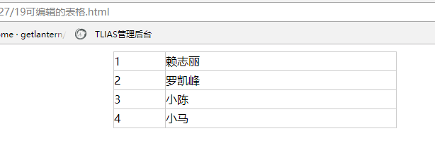
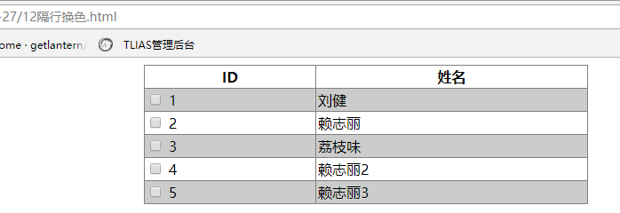
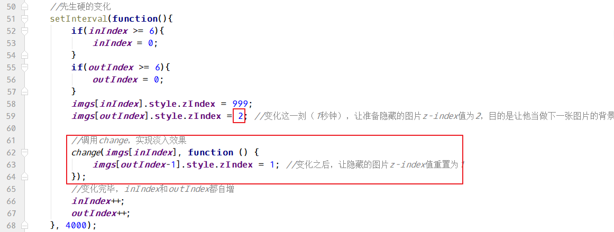

# 六、案例--可编辑的表格

文件名： ``可编辑的表格.html``


页面效果：




## 6.1、设置html和css样式

html代码：

```html
<table>
    <tr>
        <td>1</td>
        <td>赖志丽</td>
    </tr>
    <tr>
        <td>2</td>
        <td>罗凯峰</td>
    </tr>
    <tr>
        <td>3</td>
        <td>小陈</td>
    </tr>
    <tr>
        <td>4</td>
        <td>小马</td>
    </tr>
</table>
```

css样式：

```css
	   *{
            margin:0;
            padding:0;
            border:0 none;
        }
        table,td{
            border:solid 1px #ccc;
            border-collapse: collapse; /*合并边框*/
        }
        table{
            width:400px;
            margin:10px auto;
        }
        td{
            line-height: 26px;
        }
```


## 6.2、JS做隔行换色
```html
<script>
    // 隔行换色
    // 主要为操纵行（tr）的背景颜色
    // 隔行，可用偶数奇数来判断
    //
    // 设置css样式
    // elementNode.style.css样式 = 值
    
    //获取到所有的tr
    var trs = document.querySelectorAll('tr');
    for(var i=0; i<trs.length; i++) {
        if(i%2 == 1){
            trs[i].style.backgroundColor = '#ccc';
        }
    }
</script>
```

## 6.3、找到包含姓名的td

因为 id列通常为不可编辑，所以只需要姓名列的对象。


##  6.4、循环绑定单击事件

```javascript
    //遍历tds，给每个姓名td绑定单击事件
    for (var i = 0; i < tds.length; i++) {

        //绑定单击事件
        tds[i].onclick = function () {

            //注： 不能使用tds[i] ，应使用this表示 tds[i].onclick

            //后面的this亦可用变量表示
            var td = this; // this表示单击的td

            //创建input
            var input = document.createElement('input');

            //获取td中的值
            var tdValue = this.innerText;  //应使用innerText，获取文本内容

            //设置input的value=td中的值
            input.value = tdValue;

            //清空td，appendChild 是追加
            this.innerHTML = '';

            //把input放到td 中
            //this.innerHTML = "<input value='"+text+"' />";
            this.appendChild(input);
        };
    }
```


到这一步，点击td之后，会生成一个input，并放到td中。

## 6.5、处理input和td的样式，处理点击逻辑问题

前提需要之前获取css样式的兼容方法getStyle。需要复制过来。

```javascript
    //遍历tds，给每个姓名td绑定单击事件
    for (var i = 0; i < tds.length; i++) {

        //--------------------样式储值-------------------------//
        //获取td初始值
        //宽 高
        var td_width = getStyle(tds[i], 'width');
        var td_height = getStyle(tds[i], 'height');
        //字体大小  背景色
        var td_fontSize = getStyle(tds[i], 'fontSize');
        var td_backgroundColor = getStyle(tds[i], 'backgroundColor');
        //--------------------样式储值-------------------------//

        //绑定单击事件
        tds[i].onclick = function () {

            //注： 不能使用tds[i] ，应使用this表示 tds[i].onclick

            //后面的this亦可用变量表示
            var td = this; // this表示单击的td

            //--------------------点击处理-------------------------//
            // 首次点击后，td会被清空，再次点击，则获取的td内容为空
            // 所以，需要处理点击的逻辑
            //
            //判断td 中的子节点长度（有一个input了，就不要在向下执行了）
            if (td.children.length >= 1) {
                return;
            }
            //--------------------点击处理-------------------------//

            //创建input
            var input = document.createElement('input');

            //获取td中的值
            var tdValue = this.innerText;  //应使用innerText，获取文本内容

            //设置input的value=td中的值
            input.value = tdValue;

            //清空td，appendChild 是追加
            this.innerHTML = '';

            //把input放到td 中
            this.appendChild(input);

            //--------------------样式处理-------------------------//
            //点击后，input的样式要和td的一样
		   //使用前面获取的td的初始值
            
            //宽 高
            input.style.width = td_width;
            input.style.height = td_height;
            //字体大小  背景色
            input.style.fontSize = td_fontSize;
            input.style.backgroundColor = td_backgroundColor;
            //边框为0 风格为none
            input.style.border = '0 none';

            //td 在点击后宽度会拉长，所以要用获取的初始宽高重新设置td
            //宽 高
            td.style.width = td_width;
            td.style.height = td_height;
            //--------------------样式处理-------------------------//
            
            
        };
    }
```

## 6.6、设置input的失去焦点事件和键盘事件

```javascript
		   td.style.width = td_width;
            td.style.height = td_height;
            //--------------------样式处理-------------------------//
/***************************  下面的代码接上面两行  ********************/
            //--------------------事件处理-------------------------//

            //首先input需要在点击同时，获取焦点
            // input.select(); //[可选] 直接获取焦点并选中内容
            input.focus();

            //input在失去焦点事件（不保存修改，返回td的初始值）
            input.onblur = function () {
                // td.innerHTML = tdValue;
            }

            //input按键（回车键）事件（保存修改到td中）
            // 形参evt 在事件触发时自动传值
            input.onkeyup = function (evt) {
                var e = window.event || evt; //兼容的事件对象
                var keyCode=e.keyCode;

                // console.log(this);
                // console.log(this.value); //只能获取此值，innerHTML和innerText等都为空

                if (keyCode==13){ //已按回车键
                    td.innerHTML='';  //解决谷歌浏览器bug。谷歌认为按回车的时候，同时触发了失去焦点事件
                    td.innerHTML=this.value;  //this 是input
                    // TODO（可关联name属性，以便提交表单后获取）
                }

            }
            //--------------------事件处理-------------------------//

```

----


# 七、案例

### 7.1、案例---隔行换色

12隔行换色.html 

```html
<table border="1" cellpadding="2" cellspacing="0" rules="all" align="center" width="500">
    <tr>
        <th>ID</th>
        <th>姓名</th>
    </tr>

    <tr>
        <td>
            <input type="checkbox" name="id[]" value="1">
            1
        </td>
        <td>刘健</td>
    </tr>
    <tr>
        <td>
            <input type="checkbox" name="id[]" value="2">
            2
        </td>
        <td>赖志丽</td>
    </tr>
    <tr>
        <td>
            <input type="checkbox" name="id[]" value="3">
            3
        </td>
        <td>荔枝味</td>
    </tr>
    <tr>
        <td>
            <input type="checkbox" name="id[]" value="4">
            4
        </td>
        <td>赖志丽2</td>
    </tr>
    <tr>
        <td>
            <input type="checkbox" name="id[]" value="5">
            5
        </td>
        <td>赖志丽3</td>
    </tr>
</table>

<script>
    // 隔行换色
    // 主要为操纵行（tr）的背景颜色
    // 隔行，可用偶数奇数来判断
    //
    // 设置css样式
    // elementNode.style.css样式 = 值
    
    //获取到所有的tr
    var trs = document.querySelectorAll('tr');
    for(var i=0; i<trs.length; i++) {
        if(i%2 == 1){
            trs[i].style.backgroundColor = '#ccc';
        }
    }
</script>
```

效果：



----

### 7.2、案例---全选，反选，取消

11全选反选取消.html:

```html
<table border="1" cellpadding="2" cellspacing="0" rules="all" align="center" width="500">
    <tr>
        <th>ID</th>
        <th>姓名</th>
    </tr>

    <tr>
        <td>
            <input type="checkbox" name="id[]" value="1">
            1
        </td>
        <td>刘健</td>
    </tr>
    <tr>
        <td>
            <input type="checkbox" name="id[]" value="2">
            2
        </td>
        <td>赖志丽</td>
    </tr>
    <tr>
        <td>
            <input type="checkbox" name="id[]" value="3">
            3
        </td>
        <td>荔枝味</td>
    </tr>
    <tr>
        <td>
            <input type="checkbox" name="id[]" value="4">
            4
        </td>
        <td>赖志丽2</td>
    </tr>
    <tr>
        <td>
            <input type="checkbox" name="id[]" value="5">
            5
        </td>
        <td>赖志丽3</td>
    </tr>
</table>

<p align="center">
    <input type="button" value="全选" onclick="t(1);" />
    <input type="button" value="反选" onclick="t(2);" />
    <input type="button" value="取消" onclick="t(3);" />
</p>
```

js代码：

```javascript
//函数，设置input标签选择或取消
    function t(x){
        //首先获取所有的input
        var inputs = document.querySelectorAll('input[type="checkbox"]'); //数组
        if(x == 1){
            //全选
            for(var i=0; i<inputs.length; i++){
                inputs[i].checked = true;
            }
        }else if(x == 2){
            for(var i=0; i<inputs.length; i++){
                inputs[i].checked = !inputs[i].checked;
            }
        }else if(x == 3){
            for(var i=0; i<inputs.length; i++){
                inputs[i].checked = false;
            }
        }
    }
```


### 7.3、案例---仿淘宝评分

09仿淘宝评分.html  代码：

注意：需要复制图片。

```html
 <!-- 左半星星 -->
 <!-- 右半星星 -->


<script>
    //获取所有的img
    var imgs = document.getElementsByTagName('img');
    //循环，为每个图片绑定鼠标移入事件
    for(var i=0; i<imgs.length; i++){
        imgs[i].index = i; //分别为每个图片对象添加index属性，值就是图片的下标
        
        imgs[i].onmouseover = function () {
            //console.log(this.index);
            
            /*
            通过对资源路径的替换，达到显示不同的图片
            */
            
            //把鼠标移入的图片以及左侧的图片，变为黄色
            for(var j=0; j<=this.index; j++){
                imgs[j].src = imgs[j].src.replace('rank_3', 'rank_1'); //左半星星
                imgs[j].src = imgs[j].src.replace('rank_4', 'rank_2'); //右半星星
            } 
            
            //把鼠标移入的图片右侧的图片，变为灰色
            //this.index+1 ： 因为当前的(this.index)是亮的，所以右边暗的要+1
            for(var k=this.index+1; k<imgs.length; k++){
                imgs[k].src = imgs[k].src.replace('rank_1', 'rank_3'); //左半星星
                imgs[k].src = imgs[k].src.replace('rank_2', 'rank_4'); //右半星星
            }            
        };
        
    }
</script>
```


----


# 十、案例--图片淡入淡出

## 10.1、编写html+css

```html
	<style>
        *{
            margin:0;
            padding:0;
            border:0 none;
        }
        div{
            width:600px;
            height:400px;
            margin:10px auto;
            position:relative; /*相对定位*/
        }
        img{
            position: absolute;
            left:0;
            top:0;
            z-index: 1;
        }
        /*让第一张图片显示在最上面*/
        img:first-child {
            z-index: 999;
        }
    </style>

<body>

<div>
    
    
    
    
    
    
</div>

</body>
```

## 10.2、实现切换效果，生硬的变化

```javascript
var imgs = document.getElementsByTagName('img'); //获取了所有图片
var inIndex = 1; //表示即将要显示的图片的下标
var outIndex = 0; //表示马上要隐藏的图片的下标
//先生硬的变化
setInterval(function(){
    if(inIndex >= 6){
        inIndex = 0;
    }
    if(outIndex >= 6){
        outIndex = 0;
    }
    imgs[inIndex].style.zIndex = 999;
    imgs[outIndex].style.zIndex = 1;
    //变化完毕，inIndex和outIndex都自增
    inIndex++;
    outIndex++;
}, 2000);
```

## 10.3、设置改变透明度的函数

```javascript
//定义函数，设置元素的透明度
function setOpacity(ele, val) {
    if(ele.filters){
        ele.style.filter = "alpha(opacity="+val+")";
    }else{
        ele.style.opacity = val/100;
    }
}
```

## 10.4、完成change函数，让图片慢慢的变化

```javascript
//定义一个函数，设置元素透明度的慢慢变化效果
//参数ele，表示要进行慢慢变化的图片
//参数fn是函数，表示变化完成之后，要执行的函数
function change(ele, fn) {
    //要求透明度从0~100.所以先设置元素的透明度为0
    setOpacity(ele, 0);
    //设想，1秒针，让图片的透明度从0 变化到100
    //不能一次性变化到100,1秒是1000毫秒
    // 50毫秒，透明度从0~5
    //100毫秒，5~10
    //...
    //1000毫秒， 95~100
    for(var i=1; i<=20; i++){
        (function (x) {
            setTimeout(function(){
                //每过50毫秒，透明度变化+5
                setOpacity(ele, 5*x);
                if(x==20){
                    fn&&fn(); //fn存在就执行，不存在就不执行
                }
            }, 50*x);
        })(i);
    }
}
```

函数设置完毕，要配合z-index，一起使用：



