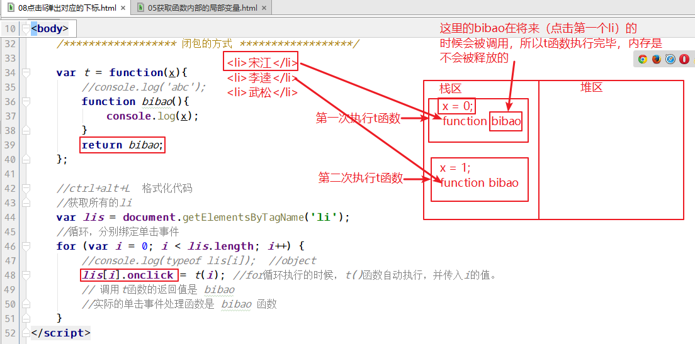

# 五、闭包（理解）

## 5.1、闭包的定义

官方解释是：**闭包**，指的是词法表示包括不被计算的变量的函数，也就是说，函数可以使用函数之外定义的变量。

我的理解是：闭包函数是对作用域的一个应用，应用的就是函数可以使用函数之外的变量，并且闭包函数所在的作用域会一直保存在内存中。


**所以闭包函数的特点是：**

- 闭包函数可以使用函数之外的变量；
- 闭包函数会一直保存在内存中，不会被释放。


## 5.2、使用到闭包函数的例子

### 5.2.1、获取函数内部的局部变量

05获取函数内部的局部变量.html  代码：

```javascript
function t1(){
    var a = 1;
    //定义一个函数，用于返回变量 a
    function getA(){
        console.log(a); //函数getA，可以使用它以外的变量a
    }
    return getA; //这里返回的getA是函数的引用，不能加小括号
}
var myGetA = t1(); //返回值是getA函数
myGetA(); //相当于调用getA
```

**闭包函数所在的作用域不会被释放，一直存在内存中**，下面的例子中，如果闭包函数getA被释放了，则每次调用myGetA都会输出1，而输出结果是1/2/3，说明闭包函数所在的作用域不会被释放。

```html
<script>

    function t1(){
        var a = 1;
        //定义一个函数，用于返回变量 a
        function getA(){
            console.log(a++);
        }
        return getA;
    }

    var myGetA = t1(); //返回值是getA函数
    
    myGetA(); //相当于调用getA  输出1
    myGetA(); //输出 2
    myGetA(); //输出 3
</script>
```


### 5.2.2、每隔一秒，输出一个数

07每隔一秒输出一个数.html

```html

<script>

    //setInterval(js代码或函数, 间隔毫秒); //间隔多少毫秒重复执行前面的js代码或函数
    //setTimeout(js代码或函数, 间隔毫秒); //间隔多少毫秒后，只执行一次js代码或函数

    //setTimeout('alert(1)', 2000);

    /*setTimeout(function(){
        alert(2);
    }, 2000);*/

    //每隔一秒输出一个数，要求依次输出1 2 3 4 5
    /*var i = 1;
    var timer = null;
    timer = setInterval(function () {
        console.log(i++);
        if(i>=6) {
            clearInterval(timer);
        }
    }, 1000);*/

    //使用闭包的方式
    for(var i=1; i<=5; i++){
        /*
        1、 for循环执行的时间可以忽略不计，认为是瞬间执行了5 次循环
        2、 执行一次循环，就会创建一个函数，并调用它。调用函数的时候，传递i的值
        3、 每个函数接收到的 i 都是不同的，分别是12345
         */
        (function (x){
            setTimeout(function(){
                console.log(x);
            }, 1000*x);
        })(i);
    }

</script>
```


### 5.2.3、点击li 标签，弹出 li 对应的下标

08点击li弹出对应的下标.html   代码

```html
<script>
    /************* 简单的方式 *************/
    //获取所有的li
    /*var lis = document.getElementsByTagName('li');
     //循环，分别绑定单击事件
     for (var i=0; i<lis.length; i++) {
     //console.log(typeof lis[i]);  //object
     lis[i].aaa = i; //循环的时候，为每个li对象，添加一个成员属性，值就是他对应的下标
     lis[i].onclick = function () {
     //在事件处理函数中，this 表示绑定事件的对象，即 lis[i]
     console.log(this.aaa);
     }
     }*/

    /****************** 闭包的方式 ******************/

    //先定义一个函数
    var t = function(x){
        //console.log('abc');
        function bibao(){
            console.log(x);
        }
        return bibao;
    };

    //获取所有的li
    var lis = document.getElementsByTagName('li');
    //循环，分别绑定单击事件
    for (var i = 0; i < lis.length; i++) {
        //console.log(typeof lis[i]);  //object
        
        // 调用t函数的返回值是 bibao
        //实际的单击事件处理函数是 bibao 函数
        lis[i].onclick = t(i); //for循环执行的时候，t()函数自动执行，并传入i的值。
        
    }
</script>
```



总之，很多高级的应用程序都会使用到闭包，但是滥用闭包会造成内存的消耗。

后面我们会有一个综合的 “淡入淡出图片” 案例，那里面就会用到闭包。


