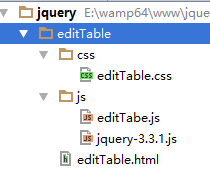

# 三、jQuery概述

## 1、什么是jQuery

==**jQuery是一个 js 框架。封装了很多实用的方法，解决了浏览器的兼容问题。**==


## 2、特点

**write less, do more.** 写的更少，做的更多。


1．语法简练、语义易懂、学习快速、丰富文档。

2．jQuery 是一个轻量级的脚本，其代码非常小巧。

3．jQuery 支持 CSS1~CSS3 定义的属性和选择器 //document.querySelector('');

4．jQuery 是跨浏览器的，它支持的浏览器包括 IE 6.0+、FF 1.5+、Safari 2.0+和 Opera 9.0+。 

5．能将 JavaScript (行为)脚本与 HTML (结构)源代码完全分离，便于后期编辑和维护。 

6．插件丰富，除了 jQuery 自身带有的一些特效外，可以通过插件实现更多功能


小结：写的更少，做的更多，强大的选择器，插件丰富。

## 3、网站

官方地址为：http://jquery.com/

下载地址：http://www.jq22.com/jquery-info122   该网站内有很多插件的链接

最新版在线手册手册：http://jquery.cuishifeng.cn/

中文社区：http://jquery.org.cn/

## 4、发展史及版本介绍

jQuery 是继 Prototype 之后又一个优秀的 JavaScript 框架，由 John Resig 于 2006 年初创建，目前最新版本为 3.3.1。 

jquery版本：

1.0.0  1.0.1  1.0.2  1.1.0  1.1.1  1.1.2  1.2.x  1.2.6  1.3.x  1.4.x  1.5.x  1.6.x  1.7.x

1.8.x  1.9.x  1.10.x  1.11.x  2.x  3.x

**==2.0版本以后，对IE6/7/8支持不好==**。但是市面上这些浏览器基本被淘汰了，所以无差别。

每个jQuery版本都有开发版和产品版，开发版就是带空白和注释的，便于学习；产品版是去掉空白和注释的版本，体积更小，适用于线上。

jQuery有一个非常大的**缺点**，就是==不向下兼容==。

## 5、其他类似框架

**Prototype**：与面向对象的原型继承关键字prototype一致，该框架的特点是功能扩展比较容易。

**YUI**：该框架可以实现各种页面布局效果。

**Extjs** : 是目前js框架包里边最为时尚、前沿的。通过该框架包可以实现许多非常绚丽的效果。

该框架可以实现效果之一：页面不同区域进行拖拽效果。由于实现的效果非常“绚丽”、导致其“实用”价值相对略低。

**Mootools**框架，一款短小精悍的框架，完全采用面向对象的思想进行封装，采用很多流行的技术，核心代码只有8kb，是一款非常好用的JS框架。

jQuery：使用前期，jquery侧重快速找到页面上各种节点。

后期jquery丰富了事件操作、ajax操作、动画效果、DOM操作等等。jQuery官方也提供了很多比较有效或有针对性的插件比如有jQueryUI、jQuery Mobile插件等。

# 四、快速入门

页面加载完毕，设置页面中的li标签的样式，要求字体颜色为red，背景颜色为#ccffcc。

**jQuery使用的大致流程：**

* 准备工作（html页面和css样式，目录结构）
* 加载文件（引入css文件、jquery文件，js文件）
* 功能实现（使用jquery实现所需的js功能）


**准备工作：**



```html
<body>
<ul>
    <li>赵伟</li>
    <li>赖志丽</li>
    <li>荔枝味</li>
    <li>陈贤栋</li>
</ul>

<script>
    //页面加载完毕，设置页面中的li标签的样式，要求字体颜色为red，背景颜色为#ccffcc。
    
</script>
</body>
```


**加载jquery.js或使用min版的jquery：**

==注：jquery必须在使用它之前加载它，所以通常在首个位置加载js文件==

```html
<!--在head区引入css和js文件-->
<link rel="stylesheet" type="text/css" href="css/editTable.css" />
<script src="js/jquery-3.3.1.js"></script>
<script src="js/editTabe.js"></script>
```


**jQuery中$()方法：**

```javascript
// $(); 是jquery中封装的一个方法，参数可以是document、可以是dom对象、可以是css选择器；返回值是jQuery对象
 $(document);  //表示查找整个文档
 $('li');    //表示查找页面中的所有li标签
```

**jQuery中事件绑定语法：**

```javascript
//$(document).事件(事件处理函数);
$(document).ready(function(){
    //这里表示页面加载完毕，要执行什么。
});
```


**找到li，并设置样式：**

```javascript
	$(document).ready(function(){
        //先找到所有的li
        //var lis = $('li');
        //console.log(lis); // 得到一个包括4个li的jQuery对象
        //lis.css('color', 'red'); //lis虽然表示4个li，但是是一个对象。jQuery有隐式的循环
        //lis.css('background-color', '#ccffcc'); //jQuery在设置样式的时候，css样式名称原样写即可
        $('li').css('color', 'red').css('background-color', '#ccffcc');
    });
```

----


# 三、其它

## 1、释放$

释放$，意思是不在使用$符合了。$('li')这种写法就不能用了。

**jQuery为什么要释放$**

有时候，一个页面使用了多个js框架，很多框架都使用$符合当做框架对象的表示。另一个原因，比如自己写了一个名为$的函数，这样的话也会和jQuery中的$冲突，所以要释放$，也就是释放使用$的权利。

**jQuery如何释放$?**

方法一：使用jQuery代替$符号

```javascript
jQuery(document).ready(function(){
    jQuery('body').css('background-color', 'pink');
});
```

方法二：使用jQuery中的noConflict()方法来释放$

```javascript
var $2 = jQuery.noConflict();
//下面就可以使用$2代替原来的$了
$2(document).ready(function(){
    console.log(123456);
});
```

方法三：使用自调用函数

```javascript
(function($){
    //在函数内部，使用的$是形参
    $(document).ready(function(){
        $('body').css('background-color', 'blue');
    });
})(jQuery);
```

 

## 2、ready和onload的区别

ready是jQuery中的方法，规定了页面加载后要执行的函数。

onload是dom中的事件，表示页面加载后要执行的内容。

**区别1**：

ready只需要页面中的dom节点加载完毕就可以执行，html标签完全加载完毕就会执行，无关图片是否已经下载。

onload需要整个页面的资源加载完毕才能执行，html标签完全加载完毕，并且图片等页面中的资源也必须加载完毕也能够执行。

**区别2**：

​       一个页面只能执行一个onload事件

​       一个页面可以执行多个ready事件

```javascript
//下面两个onload事件，后面的会覆盖前面的
window.onload = function () {
    alert(1);
};
window.onload = function () {
    alert(2);
};
```

```javascript
//下面两个ready方法，都可以执行
$(document).ready(function () {
    alert(1);
});
$(document).ready(function () {
    alert(2);
});
```

## 3、ready方法的简写形式

```javascript
//下面是ready方法的简写形式
/*$().ready(function(){
    alert(123);
});*/

$(function(){
    alert(123456);
});
```

 

## 4、dom对象和jQuery对象的区别

### 1、什么是dom对象，什么是jquery对象？

dom对象就是原生js中使用document.getElement….By….()，得到的对象就是dom对象。

jQuery对象指的是使用jQuery方法得到的对象，一般来说就是通过jQuery选择器得到的对象。

```javascript
//DOM对象
var ul = document.getElementsByTagName('ul')[0]; //得到的就是dom对象

//jQuery对象
$('ul'); //这就是jQuery对象
```

### 2、dom对象和jQuery对象的区别

dom对象可以使用dom方法，而不能使用jquery方法；

jQuery对象可以使用jQuery方法，而不能使用dom中的方法或属性。

```javascript
//DOM对象
var ul = document.getElementsByTagName('ul')[0]; //得到的就是dom对象
//ul.addClass('a'); //报错，说明dom对象不能调用jQuery方法


//jQuery对象
var ul2 = $('ul');//这就是jQuery对象
var li = document.createElement('li');
ul2.appendChild(li); //报错，说明jQuery对象也不能调用dom方法
```

### 3、jQuery对象和dom对象互换

①、将jQuery对象转化为dom对象：

方法是给jQuery加==下标==，或用jQuery对象调用==get==方法。

```javascript
//jQuery对象
var ul2 = $('ul');//这就是jQuery对象
var li = document.createElement('li');
//ul2.appendChild(li); //报错，说明jQuery对象也不能调用dom方法
/************* 下面两种方式都可以将jQuery对象转换为dom对象 ***************/
//ul2[0].appendChild(li); //加入下标，表示将jQuery对象转换成了DOM对象
ul2.get(0).appendChild(li); //调用get方法，get参数为下标，表示将jQuery对象转换成了DOM对象
```

②、将dom对象转化为jQuery对象

jQuery对象 等于 ==$(==dom对象==)==;

```javascript
//DOM对象
var ul = document.getElementsByTagName('ul')[0]; //得到的就是dom对象
//ul.addClass('a'); //报错，说明dom对象不能调用jQuery方法
/*************** 下面用$()处理dom对象，将其转换为jQuery对象 ********************/
$(ul).addClass('a');
```

# 四、==jQuery中的事件==（重点）

## 1、普通的事件绑定

普通事件，比如有click、mouseover、change、blur、….

语法：`click([[data],fn]);` 

案例一：事件方法没有参数，可用于传递事件

```html
<form action="">
    <input type="file" id="myfile" style="display: none;">
    <input type="button" id="btn" value="选择文件" />
</form>

<script>
    $(function(){
        $('#btn').click(function(){
            //点击button的时候，触发点击file事件
            $('#myfile').click();
        });
    });
</script>
```

案例二：给事件处理函数传入参数，可以通过事件对象的data属性获取到。


## 2、on具体用法

### 1、可以给未来的元素绑定事件（重点）

低于1.7版本，用live事件可以完成给未来的元素绑定事件。

未来的元素指的是页面加载完毕后没有的元素，后来经过dom操作或ajax异步请求临时加到页面上的元素。

下面案例中，点击页面中的p，点击之后能够在页面中再加入一个p。使用click事件，只能点击页面中开始时已经存在的p；使用on就可以点击页面中所有p。

```html
<body>
<script>
    $(function(){
        //获取页面中的p元素，点击之后能够在页面中再加入一个p
        /*$('p').click(function(){
            var p = $('<p>我是后来的</p>');
            $('body').append(p);
        });*/
        $(document).on('click', 'p', function(){
            var p = $('<p>我是后来的</p>');
            $('body').append(p);
        });
    });

</script>

<p>我开始就存在</p>

</body>
```

### 2、可以完成事件委托

下面的例子是将div的单击事件委托给了a。事件委托只能委托个它的子元素。

```html
<div>
    <a href="#">点我试试</a>
</div>

<script>
    $(function(){
        //把div的单击事件，委托给a元素。注意的是，只能委托给它的子元素
        $('div').on('click', 'a', function(){
            alert(123);
        });
    });
</script>
```

### 3、可以给一个元素绑定多个事件

```html
<p>hello world</p>

<script>
    $(function(){
        $(document).on('click', 'p', function(){
            console.log(111);
        });
        $(document).on('mouseover', 'p', function(){
            console.log(222);
        });
    });
</script>
```

原来不用on的时候，也可以为一个元素绑定多个事件

```javascript
$('p').click(function () {
    console.log(222);
});
$('p').mouseover(function(){
    console.log(111);
});
```

给on传递对象，也可以，对象的每个元素都是一个事件：

```javascript
$('p').on({
    click:function(){
        console.log(123);
    },
    mouseover:function(){
        console.log(456);
    }
});
```

### 4、可以给一个元素绑定多个相同类型的事件

绑定多个相同事件的时候，可以给事件指定一个人名，表示这个事件是由谁来写的。

```javascript
		$(document).on('click.zhangsan', 'p', function(){
            console.log(111);
        });
        $(document).on('click.lisi', 'p', function(){
            console.log(222);
        });
```


## 3、off事件

off在低版本的jQuery中，用unbind来代替。

**off**和on是对应的，它用于取消事件的绑定。

实际开发中，这个东西很有用，有些时候是需要先取消掉一个元素的所有事件，然后在绑定你要绑定的事件，可以解决一些bug。

```html
<p>123</p>

<script>
    $(function(){
        $('p').click(function(){
            alert(789);
        });
        //在绑定新的事件的时候，先取消掉原来的事件
        $('p').off('click').on({
            click:function(){
                console.log('JQK')
            }
        });
    });
</script>
```

## 4、one事件

给元素绑定的事件，只执行一次。

```html
<p>lalsdfa</p>

<script>
    $(function(){
        //写法一：
        /*$('p').one('click', function(){
            alert(123);
        });*/
        
        //写法二：
        /*$(document).one('click', 'p', function () {
            alert(333);
        });*/
        
        //写法三：
        $('p').one({
            click:function(){
                console.log(123);
            },
            mouseover:function(){
                console.log(456);
            }
        });
    })

</script>
```


# 五、==jQuery中的效果==

#### 基本

* show([s,[e\],[fn]])
* hide([s,[e\],[fn]])
* toggle([s\],[e],[fn])


#### 滑动

* slideDown([s\],[e],[fn])
* slideUp([s,[e\],[fn]])
* slideToggle([s\],[e],[fn])


#### 淡入淡出

* fadeIn([s\],[e],[fn])
* fadeOut([s\],[e],[fn])
* fadeTo([[s\],o,[e],[fn]])
* fadeToggle([s,[e\],[fn]])

```html
<body>

<div style="width:200px; height:200px; background-color: #000000;"></div>
<input type="button" value="淡出">
<input type="button" value="淡入">
<input type="button" value="半透明">

<script>
    $('input').eq(0).click(function(){
        $('div').fadeOut(1000);
    });
    $('input').eq(1).click(function(){
        $('div').fadeIn(1000);
    });
    $('input').eq(2).click(function(){
        $('div').fadeTo(1000, 0.5);
    });
</script>

</body>
```


#### 自定义

* animate(p,[s\],[e],[fn])
* stop([c\],[j])
* delay(d,q\]) -- 延迟执行下一个动画
* finish(queue\])

```html
<body>
<input type="button" value="变身" id="btn">
<div style="width:200px; height:100px; background-color: #000; position: absolute;"></div>

<script>
    $(function(){
        $('#btn').click(function(){
            /*下面让div通过2秒发生变化，变化完毕提示“变身成功”*/
            /*$('div').animate({
                left:'300px',
                top:'200px',
                width:'100px',
                height:'300px'
            }, 2000, 'swing', function(){alert('变身成功');});*/

            /*下面让div通过2秒变化宽度和高度，然后停顿1秒，然后通过1秒变透明*/
            $('div').animate({
                width:'100px',
                height:'300px',
            },2000).delay(1000).fadeTo(1000, 0.3);
        });
    });
</script>

</body>
```


# 六、==jQuery中的Ajax==（重点）

## 1、$.get方法

专门用于发送get请求的Ajax方法。

语法：

```javascript
/*
url ： 请求的地址
data : 发送给服务器的数据（字符串或对象）
function : 用于处理服务器返回的数据
dataType: 表示服务器返回数据的类型（text、json、xml、html）
*/
$.get(url, data, function(e){
    //形参e表示服务器返回的数据
}, dataType);
```

13get.html:

```html
<body>

<input type="button" value="发送" id="btn" />

<script>
    $(function(){
        $('#btn').click(function(){
            //单击按钮，发送ajax请求
            $.get('13get.php', {username:'张三', age:20}, function(data){
                console.log(data);
            //}, 'text');
        	},'json');
        });
    });
</script>

</body>
```

13get.php:

```php
file_put_contents('post.txt', print_r($_GET, true));

//echo '发送过来了'; //返回文本类型的数据
echo json_encode('发送过来了'); //返回json类型的数据
```


**注意：对于服务器返回的json类型的数据，无需使用JSON.parse()处理，jQuery已经处理好了**。

## 2、$.post方法

$.post用于发送post请求，使用方式和$.get一模一样。

语法：

```javascript
/*
url ： 请求的地址
data : 发送给服务器的数据（字符串或对象）
function : 用于处理服务器返回的数据
dataType: 表示服务器返回数据的类型（text、json、xml、html）
*/
$.post(url, data, function(e){
    //形参e表示服务器返回的数据
}, dataType);
```


## 3、$.ajax方法

$.ajax()这个方法是综合$.get和$.post的一个方法，另外这个方法可以完整的体现ajax的各种情况。

 $.ajax(); 参数要求是一个对象（{}），把请求的各项参数都写到大括号里面。

语法：

```javascript
$.ajax({
    type:'get', //可选post
    url:'xxx.php', //请求的地址
    data:{name:'zhangsan', age:20}, //表示发送给服务器的数据
    dataType:'json',//表示服务器返回的数据类型
    success:function(e){ //用于处理服务器返回的数据，形参就是服务器返回的数据
        //这里处理服务器返回的数据
    },
    async:true //表示异步请求，默认就是true
});
```


## 4、收集表单内容

jQuery中封装了一个方法`serialize()` 和 `serializeArray()`，和FormData获取的数据一致，但是不包含文件域的内容。

14serialize.html：

```html
<body>

<form>
    用户名：<input type="text" name="username" /><br>
    密码：<input type="password" name="pwd" /><br>
    性别：<input type="radio" name="sex" checked value="男">男
    <input type="radio" name="sex" value="女">女<br>
    爱好：<input type="checkbox" name="hobby[]" value="吃饭">吃饭
    <input type="checkbox" name="hobby[]" value="睡觉">睡觉
    <input type="checkbox" name="hobby[]" value="打豆豆">打豆豆<br>
    <input type="button" value="提交" id="btn">
</form>

<script>
    $(function(){
        $('#btn').click(function(){
            //首先找到表单，然后通过表单调用serialize
            //var data = $('form').serialize();
            var data = $('form').serializeArray();
            console.log(data);
            $.post('14serialize.php', data, function(){

            },'text');
        });
    });
</script>
</body>
```

14serialize.php

```php
file_put_contents('post.txt', print_r($_POST, true));
```


## 5、Ajax提示

数据加载中...

ajax请求开始和结束分别使用ajaxStart和ajaxStop事件监听。

在14serialize.html中，加入loading.gif图：

```html

```


在14serialize.html中，修改js代码：

```javascript
	$(function(){
        $('#btn').click(function(){
            //首先找到表单，然后通过表单调用serialize
            //var data = $('form').serialize();
            var data = $('form').serializeArray();
            console.log(data);
            $.post('14serialize.php', data, function(){

            },'text');
        });

        //ajax请求开始，让图片显示
        $(document).ajaxStart(function(){
            $('img').show();
        });
        //ajax请求结束，让图片隐藏
        $(document).ajaxStop(function(){
            $('img').hide();
        });
    });
```

14serialize.php可以sleep(2)。

```php
file_put_contents('post.txt', print_r($_POST, true));
sleep(2);
```


----


# 三、==jQuery文档处理==(重要)

## 3.1、添加节点

1、append：`父节点.append(子节点);` 给父节点追加一个子节点

2、appendTo：`子节点.appendTo(父节点);` 把一个子节点追加到一个父节点中

3、prepend：`父节点.prepend(子节点);` 在一个父节点里开始的位置添加一个子节点

4、after：`兄弟节点.before(兄弟节点);` 在元素后，添加一个兄弟

5、before：`兄弟节点.before(兄弟节点);` 在元素前，添加一个兄弟

01添加节点.html

```html
<body>

<ul>
    <li>刘备</li>
    <li>刘邦</li>
    <li>刘赢</li>
</ul>

<script>

    $(function(){
        //将一个 <li>刘彻</li>  追加到ul里面
        //$('ul').append('<li>刘彻</li>');
        $('ul').append($('<li>刘彻</li>'));
        $('<li>刘德华</li>').appendTo($('ul'));

        //将一个 <li>刘能</li>  追加到ul里面的最前面
        $('ul').prepend($('<li>刘能</li>'));

        //在ul后面添加一个兄弟 '<p>上面是几个姓刘的哥们</p>'
        $('ul').after($('<p>上面是几个姓刘的哥们</p>'));

        $('ul').before($('<h1>刘姓贵族</h1>'));
    });
</script>

</body>
```


## 3.2、修改节点

replaceWith：`旧节点.replaceWith(新节点);` 用新的节点替换旧的节点（全部替换）

稍微复杂一点的替换：`旧节点.replaceWith(function(){ 返回替换后的结果; })` 用函数处理复杂的替换

02替换节点.html

```html
<body>

<ul>
    <li>德玛西亚</li>
    <li>艾欧尼亚</li>
    <li>诺克萨斯</li>
</ul>

<script>
    $(function(){
        //将第一个li替换成 '<li>弗雷尔卓德</li>'
        $('li').eq(0).replaceWith($('<li>弗雷尔卓德</li>'));

        // 使用函数来替换
        /*$('li').eq(1).replaceWith(function(){
            return $(this).text('恕瑞玛'); // $(this) 就是查找到的 <li>艾欧尼亚</li>
        });*/

        //把上面的ul>li, 替换成ol>li
        $('ul').replaceWith(function(){
            // $(this) 仍然表示 查找到的节点，即ul
            return $('<ol></ol>').append($(this).children()); //$(this).children()表示原来ul里面的所有li
        });
    });
</script>

</body>
```


## 3.3、包裹节点

wrap：`里面的节点.wrap(包裹的节点);` 将每个查找到的节点**分别**用包裹的节点包裹


wrapAll：`里面的节点.wrapAll(包裹的节点);` 将查找到的节点用一个包裹的节点包裹，如果查找的节点不在一起，则强制放到一起，**统一包裹**。


## 3.4、删除节点

remove()：`待删除的节点.remove();` 将选择的节点删除

empty()：`待清空的节点.empty();` 将选择的节点里面的内容清空

```html
<ul>
    <li>宋江</li>
    <li>金莲</li>
    <li>武大</li>
</ul>

<script>
    $(function(){
        //将ul里面的内容清空
        $('ul').empty();

        //将ul删除
        $('ul').remove();
    });
</script>
```


## 3.5、克隆节点

clone()：`选择的节点.clone();` 将选择的节点（包括里面的内容）克隆

clone(true)：`选择的节点.clone(true);` 将选择的节点克隆，并克隆该节点的事件。

```html
<button>click</button>

<script>
    $(function(){
        //$('button').clone().appendTo($('body'));
        $('button').click(function () {
            $(this).clone(true).appendTo($('body'));
        });
    });
</script>
```


## 3.6、属性中的prop方法

回顾，DOM中设置元素属性的两种方法。

* input.getAttribute('value');  //使用于input已经存在的属性
* input.value;  //使用于获取input不存在的属性

```html
<input type="text" />

<script>
    //DOM方式
    var input = document.getElementsByTagName('input')[0];
    //console.log(input.getAttribute('type'));
    //console.log(input.type);
    console.log(input.getAttribute('checked')); //null
    console.log(input.checked); // false
</script>
```


jQuery中的attr和getAttribute()比较像，prop和input.value这种语法比较像。

```html
<input type="text" />

<script>
    //DOM方式
    /*var input = document.getElementsByTagName('input')[0];
    //console.log(input.getAttribute('type'));
    //console.log(input.type);
    console.log(input.getAttribute('checked')); //null
    console.log(input.checked); // false*/

    $(function () {
        console.log($('input').attr('checked')); //undefined
        console.log($('input').prop('checked')); // false
    });
</script>
```

07反选.html代码：

```html
<button>反选</button>
<table border="1">
    <tr>
        <td>
            <input type="checkbox" />
        </td>
        <td>姓名。。。</td>
    </tr>
    <tr>
        <td>
            <input type="checkbox" />
        </td>
        <td>姓名。。。</td>
    </tr>
    <tr>
        <td>
            <input type="checkbox" />
        </td>
        <td>姓名。。。</td>
    </tr>
    <tr>
        <td>
            <input type="checkbox" />
        </td>
        <td>姓名。。。</td>
    </tr>
    <tr>
        <td>
            <input type="checkbox" />
        </td>
        <td>姓名。。。</td>
    </tr>
    <tr>
        <td>
            <input type="checkbox" />
        </td>
        <td>姓名。。。</td>
    </tr>
    <tr>
        <td>
            <input type="checkbox" />
        </td>
        <td>姓名。。。</td>
    </tr>
</table>
```

```javascript
		$(function(){
            $('button').click(function(){
                //$('input[type="checkbox"]').prop('checked', true);
                $('input[type="checkbox"]').prop('checked', function(i, val){
                    //console.log(i, val); // i 是每个input的下标，val是checked的值
                    return !val;
                });
            });
        });
```


# 四、jQuery插件编写

jquery中可以使用下面两种方式来编写插件。

## 4.1、$.fn.extend();

这种语法，可以一次性写多个插件，需要给extend传递一个对象，对象的每个成员都是一个插件。

```javascript
$.fn.extend({
    插件名:function(){
        //处理函数
    },
    插件名:function(){
        //处理函数
    }
});
```


08自定义插件.html

```html
<p>
    hello world
</p>
```

```javascript
//自定义插件
$.fn.extend({
    a:function(){
        //$(this) 在插件中表示调用插件的元素
        $(this).css('color', 'red');
        return $(this);
    },
    b:function(style){
        //$(this) 在插件中表示调用插件的元素
        $(this).css(style);
        return $(this);
    }
});

//使用自定义的插件
$(function(){
    $('p').b({'background-color':'pink', 'font-size':'30px'}).a().hide(15000);
});
```

## 4.2、$.fn.插件名 = function(){}

这种语法，只是定义一个插件。

09自定义插件.html

```html
<p>
    hello world
</p>
```

```javascript
		//自定义一个插件
        /*$.fn.hello = function (style) {
         $(this).css('color', 'red').css(style);
         return $(this);
         };*/

        //自定义一个插件
        /*jQuery.fn.hello = function (style) {
         $(this).css('color', 'red').css(style);
         return $(this);
         };*/

        //自定义一个插件
        (function($){
            $.fn.hello = function (style) {
                $(this).css('color', 'green').css(style);
                return $(this);
            };
        })(jQuery);

		//调用插件
		$(function () {
   		 	$('p').hello({'background-color': 'pink'});
		})
```

