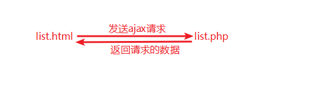

# 五、案例：可编辑的表格

## 5.1、先设置html和css


```html
<!--在head区引入css和js文件-->
<link rel="stylesheet" type="text/css" href="css/editTable.css" />
<script src="js/jquery-3.3.1.js"></script>
<script src="js/editTabe.js"></script>
```

```html
<table>
    <thead>
    <tr>
        <th>ID</th>
        <th>姓名</th>
    </tr>
    </thead>
    <tbody>
    <tr>
        <td>1</td>
        <td>陈贤栋</td>
    </tr>
    <tr>
        <td>2</td>
        <td>赖志丽</td>
    </tr>
    <tr>
        <td>3</td>
        <td>荔枝味</td>
    </tr>
    <tr>
        <td>4</td>
        <td>赵伟</td>
    </tr>
    <tr>
        <td>5</td>
        <td>谢伟杰</td>
    </tr>
    <tr>
        <td>6</td>
        <td>曾伟宏</td>
    </tr>
    </tbody>
</table>
```

css编写：

```css
*{
    margin:0;
    padding:0;
    border:0 none;
}
table,td,th{
    border-collapse: collapse; /*合并边框*/
    border:solid 1px #051c29;
}
table{
    width:400px;
    margin:10px auto; /*左右居中对齐*/
}
th,td{
    width:50%;
    height:26px;
    line-height: 26px;
}
```

效果：


## 5.2、完成隔行换色

```javascript
/*页面载入事件*/
$(document).ready(function(){
    //隔行换色
    $('tbody tr:even').css('background-color', '#d4d4d4');
});
```

## 5.3、找到包含人名的td，绑定单击事件

```javascript
/*页面载入事件*/
$(document).ready(function(){
    //-----------隔行换色----------//
    $('tbody tr:even').css('background-color', '#d4d4d4');
    //-----------隔行换色----------//
    
    //----------------------查找姓名列的所有td并绑定单击事件---------------------------//
    /*
    // 找到人名的td的第一种方式
    $('td:odd').click(function(){
        alert(11);
    });
    */
    // 找到人名的td的第二种方式
    /*$('tr td:last-child').click(function(){
        alert(22);
    });*/
    // 找到人名的td的第三种方式
    // '父  子:nth-child(N)'
    //匹配其父元素下的第N个子或奇偶元素
    $('tr td:nth-child(2)').click(function(){
        alert(22);
    });
});
```

## 5.4、创建input并放到td中

```javascript
/*页面载入事件*/
$(document).ready(function(){
    //-----------隔行换色----------//
    $('tbody tr:even').css('background-color', '#d4d4d4');
    //-----------隔行换色----------//
    
	//----------------------查找姓名列的所有td并绑定单击事件---------------------------//
	//省略内容参考上面代码
    
    // 找到人名的td的第三种方式
    // '父  子:nth-child(N)'
    //匹配其父元素下的第N个子或奇偶元素
    $('tr td:nth-child(2)').click(function(){
        //把点击的td保存成一个变量
        var td = $(this);  //$(this) 表示点击的那个td，即绑定事件的元素
        
        //--------------------细节处理-------------------------//
        // bug: 再次点击时，td变成空的
        // 首次点击后，td会被清空，再次点击，则获取的td内容为空
        // 所以，需要处理点击的逻辑
        
        //判断td中是否有一个input了，如果有，就return。
        /* 
        //方法一
        if(td.has('input').length > 0){
            return false;
        }
        */
        /* 
        //方法二
        if(td.children('input').length > 0){
            return false;
        }
        */
        //方法三 
        if(td.find('input').length > 0){
            return false;
        }
        //-----------------------细节处理-----------------------------//
        
        //创建input
        var input = $('<input type="text" />');
        
        //获取td中的文本        
        //text() 用于获取/设置元素里面的文本
        //类似text()的方法有html()，用于设置或获取元素里面的html内容
        //类似text()的方法有val()，用于设置或获取表单项的value值
        var text = td.text();

        //清除td里面的内容
        td.html("");
        
        //设置input的value为td的内容
        input.val(text);
        
        //把input放到td中
        //td.append(input);
        input.appendTo(td);
        
        //--------------------样式处理-------------------------//
        //设置input的样式
        //css()方法，如果只填一个参数，表示获取元素的css
        //css()方法，如果填两个参数，表示设置元素的css
        /*
        var width = td.css('width');
        input.css('width', width);
        */
        input.css('width', td.css('width'));
        input.css('height', td.css('height'));
        input.css('background-color', td.css('background-color'));
        input.css('font', td.css('font'));
        input.css('outline', '0 none');
        //--------------------样式处理-------------------------//
        
        //--------------------事件处理-------------------------//
        //让input获取焦点
        input.focus();
        //input.select(); //选中内容
       
    });
});
```

## 5.5、为input绑定事件

```javascript
		/////////////     在input.focus();这行代码之后 ///////////////////

		//给input绑定失去焦点事件
        input.blur(function(){
            //表示取消修改，把text 放到 td 中
            td.html(text);
        });

        //给input绑定keyup事件
        input.keyup(function(e){
            //获取keyCode
            //console.log(e.keyCode);
            //console.log(e.which);
            if(e.which == 13){
                //[可选]解决谷歌浏览器bug。谷歌认为按回车的时候，同时触发了失去焦点事件
                //td.html(""); //清空td里面的input
                
                //表示按了回车，表示确定，把input的value值放到td中
                td.html($(this).val());
            }
       //--------------------事件处理-------------------------// 
    });
	//----------------------查找姓名列的所有td并绑定单击事件---------------------------//
});
```

## 5.6、案例总结

1. 事件绑定：  `$('td:odd').click(function(e){});`
2. **text()**、**html()**、**val()**三个方法，不填参数表示获取元素的内容或value值。填参数表示设置元素的内容或值。
3. **css()**方法，填一个参数表示获取元素的样式；填两个参数表示设置元素的样式。
4. **append()**、**appendTo()**表示追加元素到另一个元素内部。


# 六、案例：纵向导航菜单

## 6.1、HTML布局和css样式


head区引入css和js文件：

```html
	<link rel="stylesheet" href="css/menu.css">
    <script src="js/jquery-3.3.1.js"></script>
    <script src="js/menu.js"></script>
```

html代码：

```html
<ul>
    <li>
        <a href="#">顶级菜单一</a>
        <ul>
            <li>子菜单11</li>
            <li>子菜单12</li>
            <li>子菜单13</li>
        </ul>
    </li>
    <li>
        <a href="#">顶级菜单二</a>
        <ul>
            <li>子菜单21</li>
            <li>子菜单22</li>
            <li>子菜单23</li>
        </ul>
    </li>
    <li>
        <a href="#">顶级菜单三</a>
        <ul>
            <li>子菜单31</li>
            <li>子菜单32</li>
            <li>子菜单33</li>
        </ul>
    </li>
</ul>
```

css样式：

```css
*{
    margin:0;
    padding:0;
    border:0 none;
}
ul,li{
    list-style: none; /*去掉li前面的圆点*/
}

/*顶级菜单*/
a{
    display: block;
    width:100px;
    height:30px;
    line-height: 30px;
    text-decoration: none;
    background-color: #232323;
    color:white;
}

/*子菜单*/
ul ul li{
    width:100px;
    height:30px;
    line-height: 30px;
    text-decoration: none;
    background-color: #ffccff;
    color:white;
}

/*默认子菜单隐藏*/
ul ul{
    display: none;
}
```

## 6.2、js代码

jQuery效果：

- 单纯的显示隐藏：
  - show()
  - hide()
  - toggle()
- 上下滑动式的显示隐藏
  - slideDown()
  - slideUp()
  - slideToggle()
- 淡入淡出的显示隐藏
  - fadeIn()
  - fadeOut()
  - fadeToggle()
  - fadeTo(透明度)  -- 将透明度切换到指定的值

```javascript
//页面加载完毕，执行
$(document).ready(function(){
    
    //找到顶级菜单中的a，然后绑定单击事件
    $('a').click(function(){
        
        //让a的下一个兄弟显示
        // $(this) 表示你点击的a
        /*
       //常规方法
        if($(this).next('ul').css('display') == 'none'){
            $(this).next('ul').show(1000);
        }else{
            $(this).next('ul').hide(1000);
        }
        */
        
       //当前对象的下一个元素（ul），显示或隐藏
        $(this).next('ul').toggle(500); //对角上下滑动
        // $(this).next('ul').slideToggle(500); //上下滑动
        // $(this).next('ul').fadeToggle(500); //淡入淡出
    });
});
```


## 6.3 案例总结

点击菜单(a链接)，让其对应的子菜单区域显示或隐藏


# 七、案例：横向导航菜单（下拉菜单）


## 7.1、HTML+css效果

head区引入css和js文件：

```html
	<link rel="stylesheet" href="css/menu2.css">
    <script src="js/jquery-3.3.1.js"></script>
    <script src="js/menu2.js"></script>
```

```html
<ul id="menu2">
    <li>
        <a href="#">顶级菜单一</a>
        <ul>
            <li>子菜单11</li>
            <li>子菜单12</li>
            <li>子菜单13</li>
        </ul>
    </li>
    <li>
        <a href="#">顶级菜单二</a>
        <ul>
            <li>子菜单21</li>
            <li>子菜单22</li>
            <li>子菜单23</li>
        </ul>
    </li>
    <li>
        <a href="#">顶级菜单三</a>
        <ul>
            <li>子菜单31</li>
            <li>子菜单32</li>
            <li>子菜单33</li>
        </ul>
    </li>
</ul>
```

css代码：

```css
*{
    margin:0;
    padding:0;
    border:0 none;
}
ul,li{
    list-style: none;
}
/*顶级菜单*/
a{
    display: block;
    width:100px;
    height:30px;
    line-height: 30px;
    background-color: #232323;
    color:#fff;
    text-decoration: none;
}
#menu2 > li{
    float:left;
}

/*子菜单*/
#menu2 ul li{
    width:100px;
    height:30px;
    line-height: 30px;
    background-color: #999;
    color:#fff;
    text-decoration: none;
}
/*默认子菜单隐藏*/
#menu2 ul{
    display: none;
}
```

## 7.2、实现下拉效果方法一

```javascript
//页面载入事件
$(document).ready(function () {

    //在下拉菜单显示后，光标移到子菜单中也不能脱离焦点
    //所以，事件对象应该是包含顶级菜单的子li，不包括后代li

    //mouseover和mouseout ,在事件对象的子元素中会反复触发事件
    //解决方案：使用只触发一次的 mouseenter和mouseleave
    
    /*
    //mouseover和mouseout
    //光标移入事件
    $('#menuH >li').mouseover(function () {

        $(this).children('ul').slideDown(500);
    });
    //光标移出事件
    $('#menuH >li').mouseout(function () {

        $(this).children('ul').slideUp(500);
    });
    */

    //mouseenter和mouseleave
    //光标移入事件
    $('#menuH >li').mouseenter(function () {

        $(this).children('ul').slideDown(500);
    });
    //光标移出事件
    $('#menuH >li').mouseleave(function () {

        $(this).children('ul').slideUp(500);
    });
    

});
```

### 7.2.1、mouseover和mouseenter事件对比

这两个事件都是鼠标移入事件，对应的离开事件分别是**mouseout**和**mouseleave**。

**mouseover**事件，鼠标放上去，执行一次事件，当鼠标移入元素的子元素上==会==再次触发该事件。

**mouseenter**事件，鼠标放上去，执行一次事件，当鼠标移入元素的子元素上==不会==再次触发该事件。

```html
<head>
    <script src="js/jquery-3.3.1.js"></script>
    <script>
        $(document).ready(function(){
            $('#over').mouseover(function(){
                var zhi = $(this).children('h1').text();
                zhi = parseInt(zhi)+1;
                $(this).children('h1').text(zhi);
            });

            $('#enter').mouseenter(function(){
                var zhi = $(this).children('h1').text();
                zhi = parseInt(zhi)+1;
                $(this).children('h1').text(zhi);
            });
        });
    </script>
</head>
<body>

<div id="over" style="background-color: #ccc;">
    over
    <h1 style="background-color: blue;">0</h1>
</div>

<div id="enter" style="background-color: #ffccff">
    enter
    <h1 style="background-color: red;">0</h1>
</div>

</body>
```

## 7.3、使用hover事件并加入定时器


**解决**：光标快速经过对象时，也会无误的触发对象的事件


```javascript
//页面载入事件
$(document).ready(function () {

    //在下拉菜单显示后，光标移到子菜单中也不能脱离焦点
    //所以，事件对象应该是包含顶级菜单的子li，不包括后代li

    //mouseover和mouseout ,在事件对象的子元素中会反复触发事件
    //解决方案：使用只触发一次的 mouseenter和mouseleave
    /*
    // mouseover和mouseout
    //光标移入事件
    $('#menuH >li').mouseover(function () {

        $(this).children('ul').slideDown(500);
    });
    //光标移出事件
    $('#menuH >li').mouseout(function () {

        $(this).children('ul').slideUp(500);
    });
    */

    /*
    // mouseenter和mouseleave
    //光标移入事件
    $('#menuH >li').mouseenter(function () {

        $(this).children('ul').slideDown(500);
    });
    //光标移出事件
    $('#menuH >li').mouseleave(function () {

        $(this).children('ul').slideUp(500);
    });
    */

    /*
     * hover([over,]out) 事件
     * 一个模仿悬停事件（鼠标移动到一个对象上面及移出这个对象）的方法。
     * over:鼠标移到元素上要触发的函数
     * out:鼠标移出元素要触发的函数
     */
    var st; //定时器
    $('#menuH >li').hover(
        function () { //光标移入事件

            //光标快速经过对象时，也会无误的触发对象的事件，
            //出于实际和安全考虑，需要让光标在对象上停留一定时间才触发事件
            //所以，设置一个一次性定时器来实现
            var li=$(this);
            st=setTimeout(function () {
                //此位置$(this)不是指向外面的对象，不能直接使用$(this)
                li.children('ul').slideDown(500);
            },300);

        },
        function () { //光标移出事件
            //清除相应的定时器
            //如果上面定时器的时间内，触发光标移出事件，就清除。
            //即上面的定时器里的代码就没执行
            clearTimeout(st);

            $(this).children('ul').slideUp(500);
        });
    
});
```


## 7.4 案例总结

横向菜单，通常不需要点击，而是光标经过。

所以，需要处理，光标移入和光标移出事件。

个别细节需要处理：

* 如事件对象中的子元素会再次触发事件；
* 光标快速经过时，也会触发事件


# 八、案例：标签页(选项卡)效果


## 8.1、html+css布局

head区引入css和js文件：

```html
	<link rel="stylesheet" href="css/tab.css">
    <script src="js/jquery-3.3.1.js"></script>
    <script src="js/tab.js"></script>
```

HTML代码：

```html
<ul>
    <li class="tab">军事</li>
    <li>娱乐</li>
    <li>体育</li>
</ul>
<div class="show">这是军事版块</div>
<div>这是娱乐版块</div>
<div>这是体育版块</div>
```

css代码：

```css
*{
    margin:0;
    padding:0;
    border:0 none;
}
ul,li{
    list-style: none;
}

li{
    float:left;
    width:50px;
    height:30px;
    background-color: #999;
    color:#fff;
    line-height: 30px;
    border:solid 1px #fff;
}
div{
    clear: both; /*清除浮动造成的影响*/
    width:200px;
    height:120px;
    background-color: #051c29;
    color:#fff;
    display: none;/*隐藏所有的div*/
}
/*下面单独设置第一个div和第一个li的样式*/
div.show{
    display: block;
}
li.tab{
    background-color: #051c29;
    border: solid 1px #051c29;
}
```

## 8.2、js代码

```javascript
$(document).ready(function(){
    //找到3个li，绑定单击事件
    /*$('li').click(function(){
        //让对应的版块显示(设置当前li的class、设置对应div的class)
        $('li').removeClass('tab');
        $(this).addClass('tab');
    });*/
    
    //jQuery核心方法 $.each(); 用于遍历数组或对象的
    //each() 用法一
    /*$('li').each(function(i, val){
        console.log(i, val);
    });*/
    
    //each() 用法二 （用的比较多）
    /*$.each($('li'), function(i, val){
        console.log(i, val);
    });*/
    /***************************************************************/      
    //事件对象为选项卡的每个标签li
    //目的：让对应的版块显示(设置当前li的class、设置对应div的class)

    //遍历标签li
    // jQuery核心方法 $.each(); --用于遍历数组或对象
    // i 表示每个li的下标
    // val 表示每个li，是一个dom对象
    $.each($('li'), function(i, val){
        
        //val是一个dom对象，用$()转换成jQuery对象
        //每个li单击事件
        $(val).click(function(){
            //alert(i); //这里的i仍然表示每个li的下标
            
            // eq(n) :表示第n个
            //$('li').eq(i) 表示点击的li
            //siblings([expr]) : 同辈元素
            $('li').eq(i).addClass('tab').siblings().removeClass('tab');
            $('div').eq(i).addClass('show').siblings().removeClass('show');
        });
        
    });
    
});
```

### 8.2.1、each用法

```javascript
//用法一：
$('li').each(function(i, val){
    // i 表示每个li的下标
    // val 表示每个li，是一个dom对象
});

//用法二：常用
$.each($('li'), function(i, val){
    // i 表示每个li的下标
    // val 表示每个li，是一个dom对象
});
```

## 8.3 案例总结

**标签页(选项卡)**：为选项卡的每个标签绑定事件，触发事件时，设置标签样式和对应的内容区样式(显示)，其它未触发的标签和内容区样式不同。


----


# 七、案例：无刷新分页+可编辑表格

## 1、分页原理

获取province表所有的数据：select * from province;

假设每页显示4条，用 `$pageSize = 4;`表示

用变量 `$p = $_GET['p'] ?? 1;` 表示当前的页码

获取第1页数据的SQL：select * from province limit 0,4;

获取第2页数据的SQL：select * from province limit 4,4;

获取第3页数据的SQL：select * from province limit 8,4;

获取第$p页数据的SQL：select * from province limit ($p-1)*$pageSize , $pageSize;

## 2、先开发一个列表页，带分页

创建list.php:

```html
<body>
<h1 align="center">所有的省</h1>
<table>
    <thead>
    <tr>
        <th width="30%">PID</th>
        <th width="30%">Pcode</th>
        <th width="40%">Pname</th>
    </tr>
    </thead>
    <tbody>
    <tr>
        <td></td>
        <td></td>
        <td></td>
    </tr>
    </tbody>
</table>
<p align="center"></p>
</body>
```

css样式：

```css
		*{
            margin:0;
            padding:0;
            border:0 none;
        }
        table,th,td{
            border:solid 1px #051c29;
            border-collapse: collapse;
        }
        table{
            margin:10px auto;
            width:600px;
        }
```

效果：


在list.php开头的位置，写php代码，获取带分页的数据：

```php
$pdo = new PDO('mysql:host=localhost;dbname=test;charset=utf8', 'root', '123');

$pageSize = 4; //表示每页显示多少条数据
$p = $_GET['p'] ?? 1; //表示当前的页码

$sql = "select * from province limit " . ($p-1)*$pageSize . "," . $pageSize;
$stmt = $pdo->prepare($sql); //预处理，得到PDOStatement对象
$stmt->execute();
$data = $stmt->fetchAll(PDO::FETCH_ASSOC);
//echo '<pre>';
//print_r($data);
```

下面html中，循环tr，显示数据：

```php+html
<table>
    <thead>
    <tr>
        <th width="30%">PID</th>
        <th width="30%">Pcode</th>
        <th width="40%">Pname</th>
    </tr>
    </thead>
    <tbody>
    <?php
    foreach($data as $value):
    ?>
    <tr>
        <td><?php echo $value['PID'];?></td>
        <td><?php echo $value['Pcode'];?></td>
        <td><?php echo $value['Pname'];?></td>
    </tr>
    <?php
    endforeach;
    ?>
    </tbody>
</table>
<p align="center"></p>
```

到此位置，刷新页面，能够看到第一页的数据了：


下面继续在list.php中，写php，完成页码制作：

```php
/*************** 下面制作分页样式 **************/
$page = '';
//上一页
if($p <= 1){
    $page .= "<a href='javascript:void(0);'>上一页</a>";
}else{
    $page .= "<a href='?p=".($p-1)."'>上一页</a>";
}


//下一页
$sql = "select count(*) from province";
$stmt = $pdo->prepare($sql);
$stmt->execute();
$count = $stmt->fetchColumn();
$maxPage = ceil($count/$pageSize); //maxPage 表示总页数
if($p >= $maxPage){
    $page .= "<a href='javascript:void(0);'>下一页</a>";
}else{
    $page .= "<a href='?p=".($p+1)."'>下一页</a>";
}
```

然后在html中，把分页放到p标签中：

```php+html
<p align="center">
    <?php echo $page;?>
</p>
</body>
```

## 3、无刷新的分页，获取第1页数据

页面访问html页面即可，php页面用于返回数据，返回给ajax的请求。



把原list.php中的html代码剪切到list.html中，形成两个文件。

两个页面工作原理是，浏览器访问list.html，list.html中需要的数据通过ajax请求到list.php中去获取。

下一步，在list.html中，当页面加载完毕，向list.php发送ajax请求，请求第1页的数据。


list.php，返回浏览器请求的数据：


当访问list.html的时候，能够通过浏览器工具，查看到返回的内容：


接下来只需要处理返回的data到页面即可。

```javascript
//页码加载完毕，请求第1 页的数据
        $(function(){
            $.get('list.php',{}, function(data){
                //console.log(data);
                //把数据放到tbody中
                //console.log(data[0]);
                var trs = '';
                $.each(data[0], function(i, val){
                    trs += '<tr><td>'+val.PID+'</td><td>'+val.Pcode+'</td><td>'+val.Pname+'</td></tr>';
                });
                $('tbody').html(trs);
                //把分页样式放到p里面
                $('p').html(data[1]);
            }, 'json');
        });
```

## 4、获取其他页数据

目前点击下一页，会刷新页面，和目标无刷新的分页不相符。所有把所有超链接的href属性全部写`javascript:void(0);` ，原来的href的值写到page属性上。

修改list.php

```php
/*************** 下面制作分页样式 **************/
$page = '';
//上一页
if($p <= 1){
    ///////////////////////////////////////////////////////
    $page .= "<a href='javascript:void(0);' page='p=1'>上一页</a>";
}else{
    ///////////////////////////////////////////////////////
    $page .= "<a href='javascript:void(0);' page='p=".($p-1)."'>上一页</a>";
}


//下一页
$sql = "select count(*) from province";
$stmt = $pdo->prepare($sql);
$stmt->execute();
$count = $stmt->fetchColumn(); //查询一行中的一列
$maxPage = ceil($count/$pageSize); //maxPage 表示总页数
if($p >= $maxPage){
    ///////////////////////////////////////////////////////
    $page .= "<a href='javascript:void(0);' page='p=".$maxPage."'>下一页</a>";
}else{
    ///////////////////////////////////////////////////////
    $page .= "<a href='javascript:void(0);' page='p=".($p+1)."'>下一页</a>";
}

//返回给浏览器的内容有4条数据，和分页样式
echo json_encode([$data, $page]);
```


再次发送ajax请求，查看浏览器工具：


现在，点击页面中的“上一页”和“下一页”确实不会刷新页面，但是不会有新的数据，所以下一步，点击“上一页”和“下一页”的时候，要继续发送ajax请求，请求对应的数据。

```javascript
//因为a是后来加载到页面中的，所以必须用on来绑定事件
//给上一页，下一页分别绑定单击事件
$(document).on('click', 'a', function(){
    //继续发送ajax请求
    var param = $(this).attr('page');
    //console.log(param);
    $.get('list.php', param, function(data){
        //console.log(data);
        //把数据放到tbody中
        //console.log(data[0]);
        var trs = '';
        $.each(data[0], function(i, val){
            trs += '<tr><td>'+val.PID+'</td><td>'+val.Pcode+'</td><td>'+val.Pname+'</td></tr>';
        });
        $('tbody').html(trs);
        //把分页样式放到p里面
        $('p').html(data[1]);
    }, 'json');
});
```

## 5、可编辑的表格

可编辑的表格，想要获取tbody中的元素，不可以，因为tbody中的tr和td都是后来加载到页面上的，所以得在ajax处理函数中，才能获取到tbody中的tr或td。

为了方便，封装处理数据的方法：

```javascript
/************ 封装一个处理ajax返回数据的函数 ***************/
        function chuli(data){
            //console.log(data);
            //把数据放到tbody中
            //console.log(data[0]);
            var trs = '';
            $.each(data[0], function(i, val){
                trs += '<tr><td>'+val.PID+'</td><td>'+val.Pcode+'</td><td>'+val.Pname+'</td></tr>';
            });
            $('tbody').html(trs);
            //把分页样式放到p里面
            $('p').html(data[1]);
        }

        $(function(){
            /************** 页码加载完毕，请求第1 页的数据 *****************/
            $.get('list.php',{}, function(data){
                chuli(data); /////////////////////////////////////修改的位置
            }, 'json');


            /***************** 给上一页，下一页分别绑定单击事件 *******************/
            $(document).on('click', 'a', function(){
                //继续发送ajax请求
                var param = $(this).attr('page');
                //console.log(param);
                $.get('list.php', param, function(data){
                    chuli(data); /////////////////////////////////////修改的位置
                }, 'json');
            });

        });
```

下一步，在chuli函数中，做可编辑的表格：

下面是完整的处理方法

```javascript
/************ 封装一个处理ajax返回数据的函数 ***************/
        function chuli(data){
            //console.log(data);
            //把数据放到tbody中
            //console.log(data[0]);
            var trs = '';
            $.each(data[0], function(i, val){
                trs += '<tr><td>'+val.PID+'</td><td>'+val.Pcode+'</td><td>'+val.Pname+'</td></tr>';
            });
            $('tbody').html(trs);
            //把分页样式放到p里面
            $('p').html(data[1]);


            //开发可编辑的表格
            //找到包含Pname的td，绑定单击事件
            $('tbody tr td:last-child').click(function(){
                var td = $(this);
                if(td.children('input').length > 0){
                    return false;
                }
                var text = td.text();
                td.html("");
                var input = $('<input type="text" />');
                input.val(text)
                        .css('width', td.css('width'))
                        .css('height', td.css('height'))
                        .css('background-color', td.css('background-color'))
                        .css('font', td.css('font'))
                        .css('outline', '0 none')
                        .appendTo(td)
                        .focus();

                input.blur(function(){
                    td.html(text);
                }).keyup(function(e){
                    if(e.which == 13){
                        td.html("");
                        var newVal = $(this).val();
                        td.html(newVal);
                        //发送ajax到edit.php，修改数据
                        var pid = td.prev().prev().text();
                        //var pid = td.parent().children().first().text();
                        //update province set pname=??? where PID=???
                        $.get('edit.php', {PID:pid, Pname:newVal}, function(data){

                        }, 'text');
                    }
                });
            });
        }
```

edit.php

```php
$pdo = new PDO('mysql:host=localhost;dbname=test;charset=utf8', 'root', '123');

$pid = $_GET['PID'];
$pname = $_GET['Pname'];

$sql = "update province set Pname='$pname' where PID=$pid";
$pdo->exec($sql);
```

修改成功，加入提示：

edit.php返回执行的结果：

```php
$pdo = new PDO('mysql:host=localhost;dbname=test;charset=utf8', 'root', '123');

$pid = $_GET['PID'];
$pname = $_GET['Pname'];

$sql = "update province set Pname='$pname' where PID=$pid";
if($pdo->exec($sql)){
    echo 1;
}else{
    echo 0;
}
```

js代码，按回车后，给出提示：

引入layer.js


判断，并提示：


----


# 五、案例：自定义弹出窗口插件

## 5.1、创建demo.html，并写好css

```html
<body>

<div id="left">
    <div class="title">左边的标题 <span>×</span></div>
    <div class="content">
        这是左边的内容
    </div>
</div>

<div id="center">
    <div class="title">中间的标题 <span>×</span></div>
    <div class="content">
        这是中间的内容
    </div>
</div>

<div id="right">
    <div class="title">右边的标题 <span>×</span></div>
    <div class="content">
        这是右边的内容
    </div>
</div>

</body>
```

```css
*{
    margin:0;
    padding:0;
    border:0 none;
}
#left, #center, #right {
    width:200px;
    height:120px;
    border:solid 1px #051c29;
    position:absolute; /*绝对定位*/
    display: none;
}
.title{
    height:20px;
    line-height: 20px;
    background-color: #92B8B1;
    border-bottom: solid 1px #051c29;
}
.title span{
    float: right;
    cursor: pointer; /*鼠标放上去显示手型*/
}
.title, .content{
    padding:5px;
}
```

## 5.2、创建插件box.js


demo.html引入两个js，注意顺序，一定要先引入jquery，然后在引入自己的插件。


## 5.3、编写插件

弹出窗口的位置一个有9个，分别是：


首先使用立即调用模式，编写插件：

```javascript
//函数立即调用，不会占用$符号
(function($){
    //自定义插件，名字为box
    /**
     * 插件功能：能够设置元素的left和top值
     * 插件功能：能够设置元素的显示效果（直接显示、显示后淡出、滑动显示）
     */
    /**
     *
     * @param position 是一个对象 {zuo:xxx, shang:xxx}
     * @param xiaoguo 是一个字符串，可选的值有：show, fadeOut, slide， 默认是show
     */
    $.fn.box = function(position, xiaoguo){
        
    };
})(jQuery);
//这种方式的好处是，插件内部可以无限制的使用$，而不会和其他插件冲突。
```

demo.html中，调用插件，进行测试：

```html
<script>
    //这里写代码，调用插件
    $(function(){
        $('#left').box({zuo:'right', shang:'bottom'});
    });
</script>
```

编写插件代码，计算浏览器的宽度、高度、要显示的窗口的宽度、高度、滚动条滚动的距离，获取之后，计算真实的left值和top值，然后设置box的css样式：

```javascript
//函数立即调用，不会占用$符号
(function($){
    //自定义插件，名字为box
    /**
     * 插件功能：能够设置元素的left和top值
     * 插件功能：能够设置元素的显示效果（直接显示、显示后淡出、滑动显示）
     */
    /**
     *
     * @param position 是一个对象 {zuo:xxx, shang:xxx}
     * @param xiaoguo 是一个字符串，可选的值有：show, fadeOut, slide， 默认是show
     */
    $.fn.box = function(position, xiaoguo){
        var win = $(window); //用变量表示浏览器窗口
        var box = $(this); //用box表示当的窗口
        var left = position.zuo; //用户传递的left
        var top = position.shang; //用户传递的top
        var browserWidth = win.width(); //浏览器的宽度
        var browserHeight = win.height(); //浏览器的高度
        var boxWidth = box.outerWidth(); //窗口的宽度
        var boxHeight = box.outerHeight(); //窗口的高度
        var scrollLeft = win.scrollLeft(); //下边滚动条滚动的距离
        var scrollTop = win.scrollTop(); //右侧滚动条滚动的距离
        if(xiaoguo == undefined){
            //说明用户没有指定xiaoguo
            xiaoguo = 'show';
        }
        //计算真实的left的值和真实的top的值
        var trueLeft;
        var trueTop;

        //判断传递进来的left和top，并计算真实的trueLeft和真实的trueTop
        if(left == 'left'){
            //trueLeft = 下边滚动条滚动距离;
            trueLeft = scrollLeft;
        }else if(left == 'center'){
            //trueLeft = (浏览器宽度-box宽度)/2 + 下边滚动条滚动距离;
            trueLeft = (browserWidth - boxWidth)/2 + scrollLeft;
        }else if(left == 'right'){
            //trueLeft = 浏览器宽度-box宽度 + 下边滚动条滚动距离;
            trueLeft = browserWidth - boxWidth + scrollLeft;
        }
        if(top == 'top'){
            //trueTop = 右侧滚动条滚动距离;
            trueTop = scrollTop;
        }else if(top == 'center'){
            //trueTop = (浏览器高度-box高度)/2 + 右侧滚动条滚动距离;
            trueTop = (browserHeight - boxHeight)/2 + scrollTop;
        }else if(top == 'bottom'){
            //trueTop = 浏览器高度-box高度 + 右侧滚动条滚动距离;
            trueTop = browserHeight - boxHeight + scrollTop;
        }

        //console.log(trueTop);
        //设置要显示的窗口的left和top值
        box.css('left', trueLeft+'px').css('top', trueTop+'px').show();
        return box;
    };
})(jQuery);
```

## 5.4、加入窗口改变大小事件和滚动事件

当浏览器窗口改变大小和滚动条滚动的时候，重新获取浏览器的宽度，高度，重新获取滚动条滚动的距离，重新计算trueLeft和trueTop的值，最后设置box的css。

整理代码：==下面代码全部在$.fn.box = function(){}函数内部==

第一部分：声明变量

```javascript
var win = $(window); //用变量表示浏览器窗口
var box = $(this); //用box表示当的窗口
var left = position.zuo; //用户传递的left
var top = position.shang; //用户传递的top
var boxWidth = box.outerWidth(); //窗口的宽度
var boxHeight = box.outerHeight(); //窗口的高度
var browserWidth; //浏览器的宽度
var browserHeight; //浏览器的高度
var scrollLeft; //下边滚动条滚动的距离
var scrollTop; //右侧滚动条滚动的距离
//计算真实的left的值和真实的top的值
var trueLeft;
var trueTop;
```

第二部分：定义函数

```javascript
/**
 * 计算浏览器的宽度、高度、计算滚动条的滚动距离
 */
function getInfo(){
    browserWidth = win.width(); //浏览器的宽度
    browserHeight = win.height(); //浏览器的高度
    scrollLeft = win.scrollLeft(); //下边滚动条滚动的距离
    scrollTop = win.scrollTop(); //右侧滚动条滚动的距离
}

//判断传递进来的left和top，并计算真实的trueLeft和真实的trueTop
/**
 * 计算真实的用于css设置的 left值和top值
 */
function getTrue(){
    if(left == 'left'){
        //trueLeft = 下边滚动条滚动距离;
        trueLeft = scrollLeft;
    }else if(left == 'center'){
        //trueLeft = (浏览器宽度-box宽度)/2 + 下边滚动条滚动距离;
        trueLeft = (browserWidth - boxWidth)/2 + scrollLeft;
    }else if(left == 'right'){
        //trueLeft = 浏览器宽度-box宽度 + 下边滚动条滚动距离;
        trueLeft = browserWidth - boxWidth + scrollLeft;
    }
    if(top == 'top'){
        //trueTop = 右侧滚动条滚动距离;
        trueTop = scrollTop;
    }else if(top == 'center'){
        //trueTop = (浏览器高度-box高度)/2 + 右侧滚动条滚动距离;
        trueTop = (browserHeight - boxHeight)/2 + scrollTop;
    }else if(top == 'bottom'){
        //trueTop = 浏览器高度-box高度 + 右侧滚动条滚动距离;
        trueTop = browserHeight - boxHeight + scrollTop;
    }
}

//console.log(trueTop);
/**
 * 显示窗口
 */
function xianshi(){
    box.css('left', trueLeft+'px').css('top', trueTop+'px').show();
}
```

第三部分：调用函数

```javascript
getInfo(); //一定要调用一次
getTrue(); //调用一次
xianshi();
```

第四部分：浏览器窗口改变大小事件和滚动条滚动事件

```javascript
//设置浏览器窗口改变大小事件
win.resize(function(){
    getInfo(); //一定要调用一次
    getTrue(); //调用一次
    xianshi();
});

//设置滚动条滚动事件
win.scroll(function(){
    getInfo(); //一定要调用一次
    getTrue(); //调用一次
    xianshi();
});

return box;
```

## 5.5、加入效果

修改demo.html，让其他的窗口也显示


box.js，显示的时候，判断效果：

```javascript
/**
 * 显示窗口
 */
function xianshi(){
    if(xiaoguo == undefined || xiaoguo == 'show'){
        box.css('left', trueLeft+'px').css('top', trueTop+'px').show();
    }else if(xiaoguo == 'fadeOut'){
        box.css('left', trueLeft+'px').css('top', trueTop+'px').show().delay(1000).fadeOut(1000);
    }else if(xiaoguo == 'slide'){
        box.css('top', browserHeight)
            .css('left', trueLeft)
            .height(0)
            .show()
            .animate({
                height:boxHeight-2,
                top:browserHeight-boxHeight
            },2000)
            .delay(1000)
            .fadeOut(1000);
    }
}
```

解决一个bug，已经淡出的窗口，当滚动条滚动的时候，又会显示：

```javascript
//设置浏览器窗口改变大小事件
win.resize(function(){
    //判断，当浏览器改变大小的时候，让可见的元素显示
    if(box.is(':hidden')){
        return false;
    }
    getInfo(); //一定要调用一次
    getTrue(); //调用一次
    xianshi();
});

//设置滚动条滚动事件
win.scroll(function(){
    //判断，当滚动条滚动的时候，让可见的元素显示即可
    if(box.is(':hidden')){
        return false;
    }
    getInfo(); //一定要调用一次
    getTrue(); //调用一次
    xianshi();
});
```

给关闭按钮添加单击事件：

```javascript
//添加函数，点击关闭按钮，可以关闭box
box.find('span').click(function(){
    box.hide();
});
```

# 六、干货分享

## 6.1、cdn方式加载jQuery


做项目的时候，直接引入baidu的jquery。


## 6.2、下载特效

作为PHP程序员，学习JavaScript、ajax、jQuery，==最重要的是ajax，以及简单的事件绑定和dom操作==。

特效类型的东西，可以去网上下载。

## 6.3、扒静态页面工具

TODO

